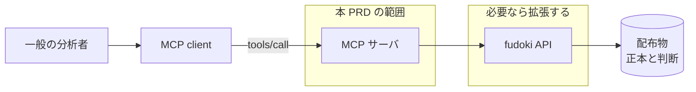

# 予算データの MCP サーバ

fudoki が収録した自治体予算を、AI アシスタント経由で分析できるようにする。

> ⚠️ **この文書は復元版である。** 原本は `.agent/` が gitignore されていた時期に worktree の入れ替えで失われた。
> 内容は作成時の会話・PR #27 の本文・commit ログから起こしたもので、原本と字句までは一致しない。
> 以後 `.agent/` は git 管理する（`.gitignore` の該当箇所を参照）。

## Problem

fudoki は東京都の一部の団体の予算を Fiscal Data Package として配布し、HTTP API でも出している。
それでも「読める形にする」という目的は、一般の分析者に対しては達成できていない。

API を使うには、AIP-160 の部分集合である filter の文法、明細識別子の構造、団体ごとに違う予算段階を先に理解する必要がある。
構造を知る者にしか読めないという状態は、PDF と自治体ごとに違う CSV が作っていた状態と、程度が違うだけで同じ型である。

AI アシスタントは自然言語の問いを受け取れるが、fudoki のデータに接続する手段を持たない。
接続しても、現 API は明細行しか返さないので、三鷹市の歳出を問えば 5,613 行が返る。
AI アシスタントはその量を読み込むところで止まり、集計に到達しない。

接続した先では、集計に到達したときの誤読が残る。
予算段階が違う数値を足しても、比較できる数値にはならない。
三鷹市が収録しているのは令和6年度の当初予算で、狛江市の「予算額」は補正まで反映した後の額である。
この2つを足した数は、どの自治体も公表していない額になる。

同一団体の中でも同じことが起きる。
狛江市は会計間の繰出と繰入を消去していないので、全会計を合計すると会計間の移転を二重に含む（一般会計の繰出金は6年度で 191 億円ある）。
年度をまたぐ比較も安全ではない。
狛江市の公共下水道特別会計は 2020 年度から原典に現れず、2018〜2019年度だけ会計の範囲が広い。

配布物にはこれらを警告する Caveats があるが、現 API の応答には含まれない。
AI アシスタントは聞かれれば答えるので、比較できない数値や二重計上を含む数値を、根拠のある数値と同じ口調で提示する。

いま作る理由は、配布物と HTTP API が既に公開されており、次に要るのが構造を知らない利用者のための入口だからである。
入口を用意しないまま利用が広がると、誤読は fudoki の外側で起きる。

## Overview

fudoki の予算を問い合わせる MCP サーバを、既存 API と同じ Cloudflare Workers 上に remote サーバとして出す。
利用者は MCP client に URL を登録するだけで、自然言語で予算を問える。

サーバは既存 API を束ねる層として作り、集計のように既存 API が持たない機能は API 側を拡張して用意する。
tool の名前と入出力の形は本 PRD で確定させず、API の設計と合わせて別途合意する。

答えられない問いに数値を返さないことを、この機能の中心に置く。
条件が定まらない集計と、収録範囲の外にある問いには、数値を含む応答を返さず、理由と代替の問い方を返す。
MCP 仕様は tool 実行エラーを言語モデルが自己修正するための応答と位置づけており、拒否は AI が問いを組み立て直す材料になる。

保証できる範囲はサーバの応答までである。
MCP client の言語モデルが拒否を無視して自分の推測で答えることは、サーバ側では止められない。

収録範囲は専用の tool で問い合わせる形にする。
ただし MCP は stateless で、先にその tool を呼んだという状態をサーバが次の呼び出しで信頼することはできない。
そこで数値を返す応答には、その数値がどの条件で計算されたかを必ず同梱し、範囲の確認を利用者と AI の記憶に依存させない。

### Goals

- 収録済みの予算を、集計した数値として取得できる。対応する操作は次の4つとする
  - COFOG 別に合計する
  - 科目階層（款から目まで）を指定して合計する
  - 同一団体の複数年度の金額を並べる
  - 事業名の語で検索する
- 数値を返す応答から、その数値を計算した条件（団体、年度、歳出歳入の別、予算段階、会計範囲）が分かる
- 条件が定まらない問いと、収録範囲の外にある問いには、数値を含む応答を返さず、理由と代替の問い方を返す
- COFOG 別の合計から、分類不能と対象外の規模が分かる。細かい粒度を求めたときは、その粒度に降りていない金額の規模も分かる
- 応答から、自治体が公表した事実、fudoki の判断、fudoki が行った集計を区別できる
- 応答から、その数値に使った原典と、表示すべき帰属が得られる
- MCP client に URL を登録するだけで、鍵の設定なしに使える

### Non-Goals

- MCP client の言語モデルが応答を正しく解釈することの保証。本 PRD が保証するのはサーバが返す内容までである
- tool の名前と入出力の形の確定。API の設計と合わせて別途合意する
- 調達（OCDS）と会議録（Popolo）のデータ。本 PRD は予算だけを扱う
- 書き込み系の tool。参照専用とする
- 手元の配布物を直接読む local stdio 版のサーバ
- MCP Apps によるインライン UI とグラフ描画。数値を返すところまでとし、描画は client 側に委ねる
- MCP 層で独自に設ける認証。アクセス制御は既存 API の仕組みをそのまま使う
- 現行版より前の MCP 仕様との互換
- 配布物の置き換え。正本はリポジトリにあり、MCP サーバはそこからの派生物である

## Glossary

- **MCP**：AI アプリケーションと外部のデータ源を繋ぐ規格
- **MCP client**：MCP サーバに接続して tool を呼ぶ AI アプリケーション
- **tool**：MCP サーバが公開する関数。言語モデルが自分で選んで呼ぶ
- **団体**：区市町村などの地方公共団体。全国地方公共団体コード（6桁）で識別する
- **COFOG**：国連の政府機能別分類。階層になっており（division 04 → group 04.5 → class 04.5.1）、fudoki の割当がどこまで降りているかは行によって違う。歳入には適用しない
- **予算段階**：当初予算、予算現額、執行済額など、同じ明細が持ちうる金額の種類。収録される段階は団体と資料によって違う
- **会計範囲**：合計に含めた会計の集合。団体によって、また同じ団体でも年度によって違う
- **正本**：原典を取り込み、検証したデータ。fudoki の判断を含まない
- **判断**：COFOG の割当や事業名の対応づけなど、自治体が公表した原典には無く、fudoki が付与したデータ

## Acceptance Criteria

### 使い始める

- [ ] MCP client に URL を登録すると tool の一覧が見え、鍵の設定なしに問いへ答えられる
- [ ] 収録範囲を問う tool が、団体、年度、歳出歳入の別、予算段階を返す
- [ ] 鍵を設定しない状態で、一連の問い（範囲の確認から集計まで）を最後まで完了できる

### 数値を取得する

- [ ] 団体と年度を指定して COFOG 別の合計を取得できる
- [ ] 科目階層を款から目まで指定して合計を取得できる
- [ ] 同一団体の複数年度の金額を並べて取得できる
- [ ] 事業名の語で該当する事業を検索できる（「いじめ」で三鷹市と狛江市の該当が引ける）
- [ ] 返る数値が、同じ条件で配布物を集計した値と一致する

### 数値の意味が分かる

- [ ] 数値の応答に、団体、年度、歳出歳入の別、予算段階、会計範囲が含まれる
- [ ] COFOG 別の合計に、分類不能と対象外の金額が併記され、歳出全体との差が分かる
- [ ] COFOG の group や class 別の合計に、その粒度に降りていない金額が併記される
- [ ] 応答から、その値が正本由来か、fudoki の判断を含むか、fudoki の集計かを区別できる
- [ ] 応答から、使った原典と、表示すべき帰属が得られる（狛江市の事業名は再配布の可否が未確定な PDF に由来するため、正本の帰属だけでは足りない）
- [ ] 会計間の繰出を消去していない団体の全会計合計には、二重計上を含む旨が同じ応答に含まれる
- [ ] 会計の範囲が年度で変わる期間の推移には、範囲が変わる年度が同じ応答に含まれる
- [ ] 事業名が一部の年度と会計にしか付かない団体の検索結果に、名称が付く範囲が含まれる

### 答えられない問いを断る

いずれも、数値を含まない応答が返り、理由と代替の問い方が示されること。

- [ ] 歳出歳入の別が定まらない集計の要求
- [ ] 予算段階が定まらない集計の要求（同じ明細が複数段階の金額を持つ団体で、段階を指定しない合計）
- [ ] 予算段階の揃わない団体をまたいだ合算
- [ ] 歳入に対する COFOG 別の集計
- [ ] 名称がまったく得られない範囲の科目名（狛江市の 2018〜2019年度の款、項、目。2020年度以降は決算資料 PDF から名称が付くので、判断由来として返る）
- [ ] 未収録団体の予算
