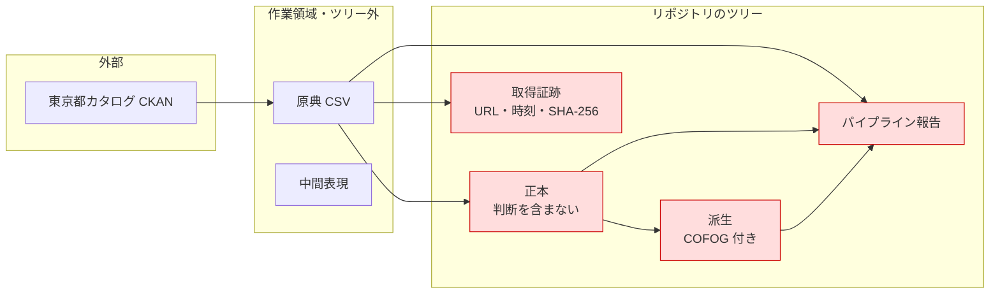

# 三鷹市の予算データを Fiscal Data Package として配布する

## Objectives

- **Goal**: 三鷹市の令和6年度予算（歳出と歳入）を Fiscal Data Package 1.0.0 として配布する。
  そのために、東京都オープンデータカタログから原典を取得する処理、原典と1行ずつ対応する中間表現、FDP への変換、COFOG の割り当て、三鷹市の公表値との突合を作る。
- **Not goal**: 執行額は扱わない。
  三鷹市の当該データが予算のみを持つため。
  執行額は Spending Standard Taxonomy の対象で、執行額を持つ団体を追加する段階で扱う。
- **Not goal**: 令和5年度以前は収録しない。
  列構成、予算段階、会計範囲を調査し、収録可否は後続の Design Doc で判断する。
- **Not goal**: 2団体目への展開は行わない。
  再利用できる部分の記録までを行う。
- **Not goal**: 閲覧画面、API、MCP サーバは作らない。
  配布形式はファイルにとどめる。

要件の詳細は [PRD](prd/budget-fdp-pilot/prd.md) を参照。

### 用語

- **原典**：三鷹市が公開する変換前の CSV。
- **正本**：原典を正規化しただけのデータ。
  Load 段の出力にあたる。
  **fudoki の判断を含まず**、原文と突き合わせて検証できる。
- **派生**：正本に解釈を加えたデータ。
  Transform 段の出力にあたり、COFOG の割り当てがこれに該当する。
- **予算段階**：当初予算、補正後予算などの別。
  FDP では `phase:id` と `phase:label` で表す。
- **パイプライン報告**：各段の入力と出力、その差分、実例、検査結果を並べた出力物。
  変換が正しく動いたかを人が判定するために出す。

## Background

### 正本がなく、標準への変換をまだ実証できていない

自治体の予算は公開されているが機械では読めず、市をまたぐ比較も年をまたぐ比較も事実上できない。
これを読める形に揃えることが fudoki の存在価値であり、そのための正本をまだ1件も持っていない。
権利条件の判定と取得可能性の確認までは終えたが、変換は動いていない。
標準への割り当てが成立するかは実データでしか確かめられない。

### 原典の列構造と年度の欠落が変換を制約する

原典は東京都オープンデータカタログ経由で CC BY の CSV として取得でき、年度ごとに歳出と歳入が対で公開されている。
設計に影響する性質が4つある。

- **列は8つで、コードと名称が同じセルに入る**。
  歳出は `01会計 / 02款 / 03項 / 04目 / 05事項 / 06節 / 07細々節 / 08予算額` で、値は `04目` に対して `01一般介護予防事業費` の形を取る。
  歳入は `05事項` の代わりに `05節 / 06細節` を持ち、階層の意味が歳出と異なる。
- **年度の列がない**。
  年度はカタログ上のリソース名（`令和６年度予算データ（歳出）`）にしか現れない。
- **会計の範囲が年度で変わる**。
  令和2年度以降のリソースには「下水道事業会計除く」の注記があり、平成28年度から令和元年度にはない。
- **金額の単位は千円**。
  令和6年度一般会計の合計 83,187,972 が、三鷹市「令和6年度 施政方針・予算概要」の記載と一致することで確認した。

### 参照する仕様は FDP 1.0.0 に限る

FDP は版が3箇所に散らばっており、参照先を誤ると設計が壊れる。
現行は [fiscal.datapackage.org](https://fiscal.datapackage.org/) の 1.0.0 で、`openspending/fiscal-data-package` の 0.3.0 と `specs.frictionlessdata.io` の 1.0-rc.1 は旧版である。
0.3.0 にしか存在しない `measures` / `dimensions` / `granularity` という語彙を使わない。

設計で使う要素は次の5つ。

- **ColumnType**：列の意味を与えるコロン区切りの識別子。仕様上、全要素が任意
- **`date:fiscal-year`**：会計年度。`integer` 型が必須で、`unique: true` すなわち FDP 上の複合主キーに含める
- **`budget-line-id`**：予算行の識別子として Budget Standard Taxonomy が定義する ColumnType
- **`labelOf`**：ある列が別の列（コード）の表示名であることを宣言するプロパティ
- **COFOG の列型**：`functional-classification:cofog:division:code` などの形を取る

FDP は 2024-03 を最後に更新が止まっている。
仕様側の追加や修正を待てないため、採用した範囲は自分たちで保守する前提で設計する。

### リポジトリのツリーには生成物だけを置く

原典と中間表現をツリーに commit しない。
これは配布物を軽く保つための制約であり、後述の再現性の定義に影響する。

## System Overview

パイプラインは3段で構成する。
新規に作るのはパイプライン全体、正本、派生、パイプライン報告、および検証である。

**段の切れ目は「fudoki の判断が入るかどうか」で引く。**
Load までは原典に忠実な写しであり、出力（正本）は原文と突き合わせて検証できる。
Transform で初めて解釈が入り、COFOG の割り当てのように**三鷹市が言っていないことを付け加える**。
両者を同じデータに混ぜると、市が公表した事実と fudoki の判断を利用者が区別できなくなる。
FDP は全要素が任意なので、**COFOG 列を持たない正本も適合した FDP になる**。

再利用の境界は、Extract の取得先設定と Load の列対応を自治体固有、Transform と検証を共通とする方向で設計する。
ただし今回は三鷹市だけを対象とするため、この境界が妥当かは検証しない。

各段の責務は次のとおり。

- **Extract**：CKAN からリソースを解決し、原典 CSV を無加工で取得する。取得 URL、HTTP status、SHA-256、取得時刻を証跡として記録する
- **Load**：原典1行を1レコードにしたまま**標準（FDP）の形へ**移す。コードと名称の分離、年度の付与、金額の円への正規化、文字コードの正規化、識別子の付与、ColumnType の割り当てを行う。階層は潰さず列として保持する。**ここまでは原典に無い情報を足さない**（AGENTS.md のパイプライン節と同じ切り方。ELT の一般的な意味では標準への整形は Transform だが、この PJ の境界は整形の有無ではなく判断の有無で引く）
- **Transform**：正本へ COFOG を割り当てて派生を作る。**ここで初めて fudoki の判断が入る**

## Detailed Design

以下では、識別子、列の対応、金額の単位、COFOG の割り当て、原典の扱い、検証、異常時の扱いの順に説明する。

### 行の識別子は完全修飾パスから導き、重複は救済しない

原典には行の識別子がなく、出現順の連番を採るとパーサを直すたびに全行の対応が崩れる。
別 PJ の実測では、パーサ修正をまたいで同じ対象を指し続けた識別子の割合は、連番で 6.6 パーセント、中身由来キーで約95パーセントだった。

そこで性質の異なる2つを分けて持つ。

- **`budget-line-id`**：団体コード、年度、direction、会計、予算段階、および階層の完全修飾パスから導く意味的な識別子。外部が参照するのはこちら
- **原典行の位置**：原典の SHA-256 とリソース識別子と物理行番号。特定のスナップショット内でのみ意味を持つ証跡

階層の完全修飾パスは、歳出が `会計 / 款 / 項 / 目 / 事項 / 節 / 細々節`、歳入が `会計 / 款 / 項 / 目 / 節 / 細節` である。
コードは親が違えば再利用されるため、`01` のような裸のコードではなく `款01/項03/目01` の形で連結する。

**同一の `budget-line-id` が複数行に現れた場合、正本の生成を失敗させる。**
連番で救済すると、行の追加や並べ替えで採番が変わり、避けたはずの出現順の問題が重複グループの中で再発する。
一方、重複行を残したまま識別子を空にすることもできない。
`budget-line-id` は `unique: true` であり、FDP 上の複合主キーが重複するためである。
1行へ集約する案も採らない。
原典1行と変換後1行が対応するという前提が崩れ、多重集合としての一致を検証できなくなる。

したがって衝突は「説明すれば通す」ものではなく、生成を止める条件として扱う。
衝突した行は全件を検証レポートに出し、原典の性質か写像の設計かを判断したうえで、階層の取り方を直す。

### 日本の科目階層と ColumnType の対応

款から目までは目的による区分、節と細々節は経済的な性質による区分、事項は事業の候補であり、同一の階層として扱えない。
出力スキーマそのものなので、実装前に対応を固定する。

| 原典の列 | ColumnType | 補足 |
|---|---|---|
| 会計 | 独自 ColumnType（`fund:code` / `fund:label`） | 一般会計と各特別会計。**行政分類には置かない** — `administrative-classification` は資金管理の責任を負う組織単位（部局など）を指すもので、会計は資金の区分であり別概念。標準に該当する列型がないため独自に定義し、その旨を一覧化する |
| 款、項、目 | `functional-classification:generic:level1〜3:code` / `:label` | 目的による区分 |
| 事項 | `activity:generic:program:code` / `:label` | 事業の候補（Caveats 1） |
| 節、細々節 | `economic-classification:generic:level1〜2:code` / `:label` | 経済的性質による区分 |
| 年度 | `date:fiscal-year` | `integer`、複合主キーに含める |
| 予算額 | `value` | 円へ正規化する（後述） |
| — | `functional-classification:cofog:division:code` | 割り当て結果 |
| — | `value-currency:code` | `JPY` |
| — | `phase:id` / `phase:label` | 予算段階 |
| — | `direction` | 支出と収入の別。リソースごとの定数として持つ |

label 列には `labelOf` を付け、対応する code 列を指す。
分離しただけでは原典のセルを復元できないため、先頭のゼロや全角数字といった表記を保つ原文列も残し、`code + label` を連結して原文に一致することを検証に使う。

### 金額は円へ正規化し、原典の値も残す

Budget Standard Taxonomy には `value` と `value-currency:code` はあるが、倍率を表す ColumnType がない。
千円のまま `value` に入れて `JPY` を付けると、利用者は 83,187,972 円と読む。

そこで `value` には円へ正規化した値を入れ、原典の値と単位は別の列に残す。
令和6年度一般会計であれば `value` は 83,187,972,000 になる。

### 年度は Load 段で付与し、由来を証跡に残す

原典に年度の列がないため、年度はカタログのリソース名から解決するしかない。
この解決を Load 段で行い、どのリソース名からどの年度を導いたかを取得証跡に記録する。

Transform 段で行うと、中間表現が年度を持たないまま複数年度を扱うことになり、取り違えても検出できない。

### 歳出と歳入は同じパッケージの別リソースにする

階層の意味が異なるため、1つの表に混在させると互いに空の列が生じる。
`datapackage.json` を1つとし、その中に歳出リソースと歳入リソースを並べる。

パッケージは令和6年度単独とする。
令和5年度以前は列構成と予算段階が未調査であり、収録の可否が決まっていない。
複数年度を1パッケージにまとめるかは、その調査の後に別途判断する。

### COFOG は適格な母集団だけを分類し、対象外と分類不能を区別する

COFOG は一般政府の支出を機能で分類するもので、対象は経費と非金融資産への純投資である。
自治体予算の全行が同じ母集団になるとは限らない。
公債の元金償還のような金融取引や、会計間の繰入といった内部移転を「分類不能」に入れると、**分類できなかったもの**と**そもそも分類の対象でないもの**が混ざる。
三鷹市の一般会計にも公債費と会計間繰出金が実在する。

状態は2つの軸に分ける。
分類の軸と連結の軸は問いが違い、1つの排他的な状態に畳むと誤る。
会計間の移転は自動的に COFOG の対象外にはならない。
COFOG には政府の階層間の移転を扱う区分があり、連結の範囲外へ出る移転や特定の機能に紐づく移転は分類の対象になるためである。

**分類の軸**

- **割当済み**：根拠を持つ1つのディビジョンへ計上した
- **分類不能**：COFOG の対象だが、割り当ての根拠が足りない
- **対象外**：金融取引など、COFOG の集計対象ではない

**連結の軸**

- **保持**：合算時に残す
- **消去**：同一主体内の移転として合算時に相殺する。消去する行には、連結の範囲と相手側の行の識別子を必須とする

使用する版は **COFOG 1999** に固定し、ディビジョンの値域は `01` から `10` とする。
コード表と説明文の取得元、および版そのものを、派生とパイプライン報告の両方に記録する。
分類不能と対象外の行では COFOG のコードを空にする。

検算は2つに分ける。

1. **原典の保存**：全状態の合計が原典の合計と一致する
2. **適格母集団の保存**：割当済みと分類不能の合計が、適格母集団の合計と一致する

いずれも年度、会計、予算段階、direction ごとに行う。
全体の合計だけで見ると、会計間の過不足が相殺されて誤りが消える。

**分類不能の割合の低さは合否に使わない。**
成立範囲を正直に調べることが目的であり、割合を目標にすると分類不能を減らす方向に判断が歪む。

割り当ての規則は変換コードに持ち、款ごとの割り当て先、状態、根拠をパイプライン報告の Transform 節へ出す。
款は一般会計で12件であり、入力と出力を並べれば人が妥当性を判定できる規模である。
なお Budget Standard Taxonomy が提供するのは COFOG を格納する語彙であり、日本の予算科目から COFOG への対応そのものは fudoki 固有の判断である。
団体数が増えて報告が人手で追えなくなった時点で、規則を宣言的なデータへ外出しするかを再検討する（Caveats 2）。

### 原典は保全せず、成果物の版で再現性を担保する

原典をツリーにもリリースにも置かず、取得元の URL、取得日時、SHA-256 だけを証跡として残す。

先行事例も、原典と取得処理と配布物を同じツリーへ一律に置いてはいない。
ただし原典の保管先と保持期間は事例ごとに異なる（比較は Alternatives Considered を見ること）。

GitHub Releases も採らない。
リリースのアセットは Git オブジェクトではないため clone にも fork にも含まれず、保全先として期待した性質を持たない。

この判断により、**再現性の意味が「原典から再生成できること」から「成果物の版が残ること」へ変わる**。
自治体が原典を差し替えた後は、同じ入力からの再生成はできない。
代わりに、各版の正本に取得時点の URL とハッシュが紐づき、git の履歴として「いつ時点の原典から作られたか」が追える状態を保証する。
原典が取得できなくなった時点の正本を、その時点の正としてそのまま残す。

### パイプライン報告は各段の入力と出力を並べる

正しく動いたかを人が判定できるようにするため、各段について**何が入って何が出たか、1行がどう変わったか、何を検査して結果はどうか**の3つを出す。
差分が0でない段があれば、そこが疑うべき場所になる。

**Extract**

- 入力: CKAN のリソース URL（歳出と歳入の2件）
- 出力: バイト数、SHA-256、取得時刻
- 検査: HTTP status、HTML が返っていないか、文字コードの判定結果

**Load**

- 入力: 原典の行数（歳出と歳入それぞれ）
- 出力: 正本の行数
- 差分: 0 でなければ原因を示す
- 実例: 1行が入力から出力へどう変わったか。`01議会費` が `code` と `label` と原文の3列へ分かれること、原典に無い年度が付くこととその由来、`186240` が円へ正規化されること
- 検査: 多重集合としての一致、識別子の衝突件数、`code` と `label` を連結して原文に戻ること

**Transform**

- 入力: 正本の行数
- 出力: 派生の行数と、款ごとの割り当て先、状態、根拠
- 検査: 全状態の合計が原典の合計と一致すること、1行あたりの COFOG が1件以下であること

### 検証は合計だけに頼らない

合計の突合だけでは、1行の欠落と同額の行の重複が相殺して素通りする。
再生成の一致は、同じ誤りが決定的に再現されることしか示さない。
性質の異なる検証を並べる。

- **行の対応**：原典の行と変換後の行が1対1で対応し、多重集合として一致する
- **識別子の衝突**：`budget-line-id` の衝突が0件である。0件でない場合は全件を説明する
- **従属関係**：code から label が一意に定まり、子から親が一意に定まる
- **数値の変換**：整数として厳密に変換でき、桁があふれない
- **スキーマ適合**：Data Package、Table Schema、FDP の taxonomy に適合する
- **外部の公表値との突合**：会計別の総額と一般会計の主要集計は「令和6年度 施政方針・予算概要」と、全会計の款別と項別は三鷹市の予算書と比較する。概要資料だけでは特別会計の款別まで届かないため、突合元を2つに分ける。前年度比からの逆算値、検索結果の要約、原典を再集計した値は独立した検証にならないため使わない
- **歳出と歳入の交差検算**：後述の条件を満たす範囲で、両者の合計が一致する
- **COFOG の検算**：上述の2つの保存が成り立ち、1行に割り当てられたディビジョンが1件以下である
- **取得の健全性**：HTTP 200 で HTML が返る、文字コードを誤判定する、途中で切断される、ヘッダが変わる、のいずれも検出する

### 歳出と歳入の一致は三鷹市に固有の不変条件として扱う

令和6年度は歳出と歳入の一般会計合計がいずれも 83,187,972 千円で一致した。
これは外部資料を要さずに行の欠落と重複を検出できる強い検算である。

ただし一般の不変条件ではない。
決算、企業会計、補正の差分だけを収録したファイル、会計範囲の異なる抽出では成立しない。
そこで「同一の会計、年度、予算段階、収録範囲について確認済み」という条件付きの検算として定義し、適用の可否を取得元ごとの設定に持たせる。
検算は会計ごとに行う。
全会計の合計だけを見ると、会計間の過不足が相殺される。

### 異常時の扱い

- **原典が取得できない**：Extract を失敗として扱い、正本を更新しない。
  部分的に取得できた状態で Transform へ進むと、欠落したまま合計が下がった正本を出してしまう。
- **原典のハッシュが前回と異なる**：自治体側の差し替えとして扱い、変更として記録したうえで再生成する。
  無言で上書きしない。
- **公表値と一致しない**：原因を3つに区別する。
  変換による欠落または重複であれば不合格とする。
  会計の範囲や予算段階の違いであれば、差額と対象行を再計算できる形で示したうえで許容する。
  原典自体の矛盾であれば、正本に警告を付ける。
- **予算段階を確認できない**：その年度を収録しない。
  当初予算と補正後予算を同列に並べると、経年比較が壊れる。

## Alternatives Considered

### 原典の保全は行わない

| 観点 | 保全しない（採用） | Releases に退避 | ツリーに commit |
|---|---|---|---|
| clone と fork に含まれるか | 対象外 | **含まれない** | 含まれる |
| 自治体がファイルを消した場合 | その時点の正本を正として残す | 上流のリリースに依存 | 再生成できる |
| 収集物の保持コスト | かからない | かかる | 団体を増やすと膨らむ |
| 先行事例 | Kingfisher、Open States と同型 | 該当なし | ParlParse の一部と同型 |

Releases はアセットが Git オブジェクトでないため、保全先として期待した性質を持たない。
ツリーへの commit は再生成の保証としては最も強いが、収集物を持ち続けるコストに見合わない。
原典が消えた場合はその時点の正本を正として残す方針を採り、再現性の定義を成果物の版に置く。

## Caveats

1. 事項を事業として扱う妥当性が未検証である。
   名称を持つことは、その区分が1つの事業に対応することの証明にならない。
   複数の活動をまとめた事項や管理的な費目が含まれうる。
   自治体横断の概念として確定するのは2団体目以降とする。
2. COFOG の割り当てが款の単位で成立するかは未知である。
   成立しない場合に項、目、事項へ単位を下げる余地はあるが、どこで決着するかは実データを通すまで分からない。
   パイプライン報告を人手で追える規模も、団体数が増えれば失われる。
