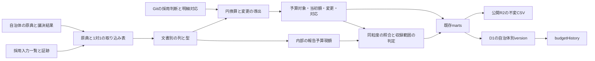

# 補正・繰越の実資料を予算履歴へ取り込む

## Objectives

- **Goal**: 狛江市（132195）2023年度一般会計の当初予算と補正各号を取り込み、目単位の予算対象と既収録の決算明細を対応づける。原典の報告予算現額との照合と、未確認の変更を残す検査を既存の `pipeline/` に組み込む。
- **Not goal**: 全事業・全年度の履歴完成、日付の推測、粗い総額の事業への配賦、Cloudflare の有効化や本番反映。事故繰越計算書の抽出を実測済みとして実装すること。

本書は実装前の設計である。[PRD](prd/fiscal-budget-history/prd.md) の why/what に対し、入力の採用・変換・照合・検査の how を定める。基準は [PR39の固定commit](https://github.com/wwwyo/fudoki/tree/60d73cd3a2b1eee5671a5955e822fae67de83f13) と [財政明細の設計](design-doc-fiscal-records.md)。このworktreeのmain側の旧 `ingestion/`・`dbt/` を実装対象にしない。以下のコードパスはすべてPR39のrepo rootからの相対パスであり、「新規案」と記すものはまだ存在しない。

## Background

PR39には当初予算、符号付き変更、予算対象と決算のM:N対応、自治体別versionの保存・配布契約がある。一方、実資料から生成する変更・対応は空で、`api_fiscal_*_budget_changes.sql` と `api_fiscal_*_settlement_links.sql` は `where false`、datasetの履歴は `unconfirmed` である。既存5団体・28datasetの実績・当初予算があることは、補正履歴の完成を意味しない。

狛江市を選ぶ理由は、2023年度決算CSVが既収録で、当初と第1〜7号の正式予算書をすべて取得でき、決算書に目単位の予算内訳があるためである。三鷹市の既収録年度や多摩市の当初予算だけを起点にすると、最初に決算側を追加する必要がある。狛江市では既存決算CSVの原典hashを維持して対応と変更を追加できる。ただし、繰越計算書と充流用の実施日は未確認なので、年度全体のcompleteを初回の達成条件にしない。

一次資料のURL・hash・年度・ページ・観測値・取得方法は [原典の実測](research-fiscal-budget-history-origins.md) に集約した。設計の例は「実測」「採用規約」「架空の検査例」を区別する。原典の調査取得だけを行い、入力lockへの採用・R2転送・D1投入は行っていない。

## System Overview

取得・変換・配布・検証は `pipeline/` の責務を保つ。Gitはコード・宣言・判断・`pipeline/ingestion/fiscal/sources.lock.json`・採用証跡、非公開R2は原典と取り込みParquet、公開R2は `<団体コード>/p-<配布SHA256>/` の不変ファイル、D1は派生検索表である。`.cache/` は再生成キャッシュ、`pipeline/.build/` は生成物。原典の報告予算現額は内部に保存し、決算の公開 `amount` は実績一つを維持する。

公開中の全体release、active切替、非公開候補の一括反映を追加しない。自治体別versionの途中の明細公開と失敗後の行維持は既存契約に従い、未変更自治体を再利用する。本設計の照合失敗は金額を確定しない条件であり、新しい公開状態やguardではない。

## Detailed Design

入力の採用と文書別の取り込みを定めた後、増減・時点・対象対応を決め、繰越・充流用・内部照合・coverageを既存の提供契約へ接続する。

### 最初の範囲を二つの目に限定する

最初の実装は `jurisdiction=132195 / fiscalYear=2023 / direction=expenditure / fundCode="1"` の13-1-1予備費と7-1-2商工業振興費を対象とする。目より細かい当初額は配賦しない。目の当初額を1行として採用し、決算側は既存の葉明細をそのまま参照する。予備費1明細、商工業振興費9明細との1:N対応を作る。決算CSVの `source_row` はそれぞれ83、1222〜1230であり、番号はヘッダを1として数える。

当初予算書のPDF 211・320頁、第1〜7号すべての表と議決結果を採用候補とする。補正の公開変更は、対象の目に載る第1号+1,980,000円、第3号+148,300,000円、第6号-115,000,000円の3行から始める。その他の号で対象の目が変わらないことは、全ページの該当科目と第1表・説明書の検査記録で示す。PDFを取得しただけで「変更なし」の確認済みにしない。

決算書の充用先・流用額・繰越内訳は内部照合入力として収録する。日付と取引単位を確認できていないので、初回は公開changesへ追加しない。変更として未採用でも、原典・収録範囲・不足理由からその存在を辿れるようにする。未収録範囲は他の目、歳入の変更、特別会計、狛江市の繰越計算書本体、確認済みの新設・分割・統合・訂正実例である。富士見市は計算書の列構造を確認する補助例だけで、入力lockへ加える自治体ではない。

### 同一号・再公表・訂正を一つの採用入力にする

`sources.toml` の既存キー `"132195:2023"` は決算の宣言である。これを補正用に上書きしない。新しい宣言キーは、たとえば `"132195:2023:general:supplementary:3"` とし、団体・年度・会計・文書種別・号数で区別する。キーは人間用の識別子であり、取得コードがキーのコロン数から属性を推定しない。

`sources.py` の `Source` / `Resource` と宣言の出力へ、次の属性を追加する（新規案）。

- `document_kind`、`amendment_number`、`fund_code`、`resource_id`（原典内の表の識別子）、`record_layout`、`scope_grain`、`source_amount_kind`。
- `decided_at`、`effective_at`、`effective_at_basis` と根拠資料の参照。`published_at` は自治体が明示する場合だけ持ち、取得時刻 `fetched_at` と区別する。
- 文書内の表・PDFページ・方向・原典の単位、収録対象の目。直URLの場合は既存の `url_basis` と、表紙・本文による年度・会計・号数の確認を必須にする。

補正PDFは三つの額を同じ行に持つ。datasetの `sourceAmountKind="delta"` はchanges導出に使う主列を表し、before/after列は取り込み表にも内部検査にも残す。PDFの権利条件が未確認なら既存決算CSVのlicenseIdを引き継がず、権利情報と確認状態を文書ごとに記録する。単位の規約はdbtの宣言で解決し、PDFの列見出し「千円」と照合する。別宣言との一致だけで単位を確認したことにしない。当初予算書の「前年度予算額」「比較増△減」は前年との比較であり、補正のbefore/deltaではない。当初は「本年度予算額」だけをinitialに採り、この列構造の違いをlayoutで検査する。

採用判断はGitの新規 `pipeline/ingestion/fiscal/budget-history/adoptions.json` に置く。論理文書キー（団体・対象年度・方向・会計・種別・号数・表）ごとに採用するorigin hashを一つ指定する。再公表が同じバイト列なら同じ入力を再利用する。別hashでも「同じ号の訂正」なら `supersedes`、自治体の訂正根拠URL、訂正範囲、採用理由を記録し、以前の版は証跡に保持する。根拠のない二つの異版は自動で最新版を採らず、採用を未確定にする。

`source_row` の位置が変わる訂正では、旧行から新行への対応を採用判断に残す。`change_id` は採用origin hash・表・原典行・変更の側・予算対象から導く内容IDとする。同一自治体versionへは一つの採用版の行しか入れない。訂正を受けた新自治体versionに旧額の取消行と新額を同時に足すことはしない。法的に別の変更として可決された追加号と、同一号の誤記訂正は別である。

固定入力lockの既存形式schemaVersion 2は、原典hash、取り込みParquetのhash・object、Git証跡のhash・path、論理パスの整合を維持する。`inputs.py/read_lock` の許可リストは現状 `budget/supplementary/settlement` だけなので、繰越・充用・流用を入れる段階で既存公開契約の文書種別を許可する。lockには採用版だけを列挙し、採用対象から外した旧版は過去lock・証跡から追えるようにする。

現在の論理パスは `jurisdiction=<code>/year=<year>/document_kind=<kind>/edition=<origin hash>/direction=<direction>/data.parquet`。一つのPDFに同じ種別・方向の異なる表がある場合は、`resource=<resource_id>/` を追加したパスを新入力にだけ使う。既存パスの読取を維持し、`inputs.py` の検査・`paths.py`・dbtのsource列挙を同時に対応させる。dataset IDにも新入力だけ表の識別子を加え、同一PDFの表を衝突させない。二方向で同じPDFを使う場合、原典objectは一つを共有しParquetと証跡は分ける。

### 異なる文書の列構造を取得とstagingで振り分ける

既存 `fetch.py` はCSVの全セルを文字列で保持して復元検査を行う。その経路を維持する。PDF用には新規 `extract_budget_history.py` と狛江市2023年度のlayout宣言を置き、原典の目の行・合計行・節行・説明行を `row_role` で区別した抽出表を生成する。各抽出レコードへ表・物理ページ・bbox・印刷科目・元金額文字列・単位を付ける。本文で反復する同じ数字を別の変更にしない。

取り込みは「抽出した原典の論理行」と1対1、stagingもその行と1対1にする。目・節・説明・合計の全行を金額の加算対象にはしない。目の増減を最初の追跡粒度に採る判断と、複数の取り込み行の合算はintermediateで行う。PDFの復元一致は主張せず、before+delta=after、節合計=目の補正額、目合計=款項合計の印字値を突き合わせる。負号 `△`、括弧での内数、ページをまたぐ行をlayoutの検査例に含める。最初の狛江市決算PDFは画像なので、自動文字抽出を前提にしない。対象ページを人手確認した構造化転記を暫定取り込みに使う場合も、行・bbox・原典hash・確認者・手順版を証跡に残す。

`models/staging/fiscal/_sources.yml` の現行 `raw_132195` は `document_kind=*` のglobで同じ列構造を読む。PDF由来の別列を同じglobに加えると既存CSVの列参照が壊れる。決算CSV用sourceを `document_kind=settlement` の採用入力に限定し、新規 `raw_132195_history` へPDF由来表を分ける。新規 `stg_132195__budget_history.sql` はtyped列を持つ。初回の経路は会計・款・項・目までで、科目コードは印字値を保持する。history datasetの `structure_json` は入力ごとの経路・粒度から生成し、既存CSV用の `fiscal_levels`（事業・節を含む）を団体全体で目粒度へ上書きしない。異種表をNULL列で結合して既存の金額マクロへ流さない。

`int_fiscal_datasets.sql` は現状、staging行からdatasetを作り、宣言を `(jurisdiction_code,fiscal_year,direction,document_kind)` でJOINする。複数号ではこのキーが重複するため、採用入力の一意なdataset IDまたはorigin hashと表IDでJOINする。文書の一覧・coverageは採用宣言から作り、公開変更が0行の資料も一覧に残す。`line_count` はそのdatasetの採用取り込みからstagingへ保持した論理行数（非加算の説明・合計行も含む）として固定し、元PDFの全行数や出力changes数と混同しない。議決結果など根拠だけの資料は独立した予算datasetにせずsourceの補助参照に含める。

証跡の参照もsourceの分離に合わせる。現行 `pipeline/verify/report/common.ts` の `provenanceForSource` は団体とdirectionでcanonical証跡を選ぶため、historyの表名がexpenditureなら決算CSVの証跡も混ざり、別名なら参照を解決できない。新しいsourceノードごとの採用入力参照一覧を宣言から生成し、団体・対象年度・方向・文書種別・origin hash・resource IDでlockのentryと証跡を特定する。原典内の表が違えば同じhashでも別の取り込み表として解決する。既存CSVのsourceノードも同じ一覧へ登録し、決算だけの採用entry集合を渡す。

共有resolverはその一覧を受け取るよう変更し、`pipeline/verify/report/lineage.ts` と `pipeline/verify/view/vite-plugins/local-data.ts` の呼び出しを合わせる。系統はdbt manifestのsourceノードを起点に生成し、手書きの図用対応は作らない。参照一覧の採用hashがlockに無い、sourceの採用entryが0件、表と証跡が違う場合は参照の生成を検査失敗にする。抽出表の行詳細ではdataset/resource/source_rowを指定して原典ページ・bboxを引き、他の号や決算CSVへフォールバックしない。

新しいhistory stagingを `int_fiscal_amounts` の旧phase展開へ無条件にUNIONしない。既存の決算実績・当初葉データは従来モデルに残し、新規history intermediateから予算対象・当初額・変更・対応へ直接接続する。内部のbefore/after/報告現額にphase相当の列があっても、公開phase/ruleId/分類規則を復活させない。

### 増減額・補正前額・補正後額から同じ変更を導く

原典の同粒度・同会計・同単位の行に対し、公開する `amount_delta` は一つだけ求める。

| 原典で確認できる額 | 導出 | 必要な検査 |
|---|---|---|
| delta、before、after | deltaを採用 | before + delta = after |
| beforeとafter | after - before | 両行の対象と粒度が一致 |
| deltaのみ | deltaを採用 | 符号・単位・対象・適用日 |
| afterのみ | 確認済み直前額との差 | 直前額の全変更と対応が確定 |
| beforeのみ | 変更を導出しない | after/delta不足を未確認にする |

同じ目のbeforeが直前の当初+補正と一致しなくても、差額を新しい補正に自動変換しない。beforeが充流用を含むか、繰越分を含むか、資料の対象範囲が変わったかを確認する。差額の説明がつくまで当該after-only導出は未採用にする。deltaが原典に明示される場合はその変更を保持し、差異を別途未確認として残せる。

実測の商工業振興費では当初34,553千円、第3号+148,300千円、第6号-115,000千円なので、補正分までの額は67,853,000円。182,853千円と67,853千円を累積加算しない。第3号の目・節・説明欄を全部足すと同じ額を反復計上するため、初回の提供対象は目の一行とする。

複数号は年度内の号数で識別するが、適用日は別に保持する。`effective_at` は日付、同日内の `sequence` は原典の適用順（不明なら安定した処理順を記録し、実時刻と主張しない）。APIの `asOf` は日本の暦日の終わりまでの変更を含む。号数の大小だけで効力の順序を決めず、適用日の逆転・重複号・同一号の未採用異版を検査する。当初予算は年度開始前のasOfでは返さない。現行queryは当初額の日付を絞らないので、API契約で当該年度の4月1日以後にasOfを制限する最小変更が必要である。年度終了後の照合日は許可する。

提出日、議決日、適用日、公開日、取得日を分ける。別の適用日指定が無ければ、原案可決を確認した議決日を本設計の適用規約として採用し、datasetの出典にその根拠を残す。第5号の提出日は12月14日、議決日は12月22日であり、前者を使うと12月14〜21日の履歴が誤る。専決処分の効力の日は後日の承認日とは区別し、専決の原典を確認する。実施日がない充用・流用や報告日しかない繰越を3月31日・4月1日に代入しない。

日付不明の額は初回では内部の `observed_period_end` と元の金額として保存する。既存changesの `effective_at NOT NULL` を満たすための架空日付は作らず、公開changesには未採用、coverageには不足を明示する。日付区間での検索を提供する拡張は別タスクとし、本書では必要性を記録するだけとする。

### 実測の一行を提供レコードと対応へ変換する

第3号PDF20頁の目行は、原典hash `e322f20a…`、表「歳出・7款1項」、目2、before=`34,553`、delta=`148,300`、after=`182,853`、単位=`千円` という取り込みレコードになる。PDF物理ページは `source_row` そのものではない。抽出表のヘッダを1として固定した整数行番号をsource_rowへ使い、ページ・表・bboxとの対応を証跡で解決する。

このレコードから、一つの歳出changeへ `budget_item_id=商工業振興費の当初目から導いたID`、採用dataset、`amount_delta=148300000`、`change_kind=supplementary`、`effective_at=2023-08-31`、`sequence=3`、原典行を持たせる。datasetは `amendmentNumber=3 / sourceAmountKind=delta`。日付は確認済み議決日を適用規約で採ったものであり、議決根拠と規約をsourceに残す。sequenceの3は同日内の安定順にも使える号数で、法的な時刻ではない。counterpartとcarryover年度はnullにする。第6号では同じ予算対象へ-115000000円を一度だけ生成する。

同じ目の当初はPDF211頁の本年度34,553千円から一つのinitial=34553000円を生成する。既収録決算CSVのsource_row1222〜1230の各 `fiscal_line_id` は変更せず、同じbudget itemから9リンクを一グループに生成する。対応根拠は会計1・款7項1目2と決算PDF87〜88頁の一致、決算CSVの大事業・節の内訳集合であり、名称だけでは確定しない。原典hashやdataset/rowから実際のIDを解決し、文書中の表示名をIDとして保存しない。初回のリンクはverified、グループの予算復元は日付不足のためunconfirmedとする。

### 予算対象の追加・改称・分割・統合を対応判断として残す

予算対象は団体・年度・方向・会計・追跡粒度の中で識別する。新規 `budget-history/item-correspondences.csv`（案）は、採用当初行または新設を示す最初の採用行、各変更行、決算明細の参照、対応グループ、根拠を持つ。根拠には原典ページと科目・所属・予算区分の確認を記す。名称一致や金額一致だけでverifiedにしない。

同一対象の改称はIDを維持し、原典ごとの名称をsourceへ残す。別対象へのコードの再利用は同一IDにしない。新設は、原典の新設表記と前の網羅的な対象一覧によって当初ゼロを確認できた場合だけ `verified-zero`、資料不足は `unknown`。当初資料が無いことはゼロの根拠にならない。

分割・統合は対象ごとの増減を原典が示す場合だけそれぞれのchangesにする。原典が合計しか示さない場合は、確認できる集約対象で追跡し、架空の配賦をしない。旧対象と新対象の金額を同時に加算することがないよう、追跡対象の集合は重ならない区画にする。どうしても目とその内訳の両方を保持する資料では、内訳は非加算の原典レコードに留め、公開budget_itemsは目だけとする。

初回の `budget_item_id` は採用当初の目行を起点に導出し、macro `fiscal_budget_items` の葉ごとのIDと混ぜない。既存の当初予算がある団体では従来IDを維持し、同じscopeに目と葉を重複投入しない。狛江市2023年度は既収録の当初行が無いため、この目粒度を追加できる。訂正による起点行の変更は内容版の変更として新versionに記録し、旧versionのIDは書き換えない。

`settlement_links` は `match_group_id` ごとに両側の集合を確定する。予算対象と決算明細の一つのメンバーはverifiedグループ一つにだけ所属する。額はリンク行へ複製しない。グループ内で予算対象IDの集合と決算明細IDの集合をそれぞれ重複排除して集計する。未確認リンクは別保存し、verifiedの比較へ混ぜない。

架空のM:N検査例: 予算対象A=60,000円、B=40,000円、決算x=30,000円、y=70,000円が一グループで対応し、4リンクを持つ。予算100,000円・実績100,000円であり、JOIN行を足した200,000円ではない。訂正でB=35,000円を採用した新versionなら95,000円で、旧B=40,000円を足さない。所属・会計の違うxを同名だけで同グループに入れる検査は失敗させる。この例は実資料の対応を確認したという意味ではない。

### 繰越元の額と繰越先の加算を別に扱う

繰越は「翌年度へ使用できる限度」「確定した実繰越」「前年度から受け入れた額」「翌年度繰越の財源内訳」を別の観測として保持する。新規 `int_fiscal_carryover_observations`（案）は繰越種別、繰越元/先の年度と会計、原典事業、限度額、実繰越額、財源別額、対象対応、適用日の状態を持つ。限度額はchangesへ変換しない。

実繰越の公開changesを作るのは、繰越先年度・方向・会計・予算対象・実額・適用日を確認した場合だけである。`budget_item_id` とdatasetの `fiscal_year` は加算される繰越先年度、`carryover_from_year/to_year` は元/先を表す。原典の年度（通常は元年度）はsourceに別保存する。同じPDFを元年度の報告datasetとしても加算用datasetとしても二重に足さない。歳入では計算書の未収入特定財源・繰越財源の対応を確認し、歳出の事業額を一律に歳入の繰越金へ加算しない。

元年度は、当初＋補正＋当年度に受け入れた繰越＋充流用による「予算現額」を保つ。翌年度へ繰り越す額や不用額をマイナスchangesにすると決算書の予算現額と意味が変わるため、元年度の履歴から控除しない。元年度の執行権の終了と、翌年度への加算は別である。本APIは残存執行可能額や失効額を計算しない。

実測の道路新設改良費は236,329,000 + 16,483,745 = 252,812,745円で、翌年度繰越10,000,000円をもう一度足さない。狛江市の計算書・日付が未確認なので、16,483,745円は内部の報告値として保持し、現時点で公開changeとはしない。

富士見市の実例では、スポーツ施設の限度18,509,000円と実繰越18,508,300円は違う。継続費の公園事業は総額11,105,000円、2024年度の計5,862,400円、2025年度への実繰越1,537,200円を区別する。継続費の年割額や過年度逓次繰越を再び加算しない。事故繰越は事故繰越計算書の支出負担行為・事故理由・実繰越額を確認してから同じ観測契約に接続する。計算書が欠けた種別は未確認とする。

現行schemaには年度はあるが、繰越元/先の会計を独立して持つ列がない。初回は同一会計のみに限定し、元/先会計をsourceに明記する。将来、異なる会計を原典が明示する場合に限り、changes/契約/CSVへ `carryover_from_fund_code` と `carryover_to_fund_code` を追加する最小案とする。未確認を空文字に変換しない（空文字は有効な会計コード）。

### 予備費の残額と実充用、流用の両側を確認する

予備費当初額はinitial、補正はsupplementary、実充用はreserve-allocationである。確認済みの実充用一件は原資の予備費に負額、充用先に正額を持たせ、相手budget itemを相互に参照する。`counterpart_budget_item_id` は同じ方向の同一会計内でだけ使い、当年度予備費と翌年度予算を結びつけない。

一件の流用も原資負額・相手正額の二行にする。新規の内部 `movement_id`（案）でその両側をまとめ、同一scope・同一適用日・符号逆・絶対額一致・合計0を検査する。これは処理上の対応判断であり公開ruleIdではない。親の目に加えて節にも同じ動きを公開すると二重計上になるため、公開の追跡粒度一つに合わせる。同じ目内の流用は目粒度では正味0で、目の予算changesへ加算しない。節粒度の原典観測と検査は残す。

決算PDFにある流用の反対符号は年度累計の可能性があり、相手や実施日を証明しない。CSVの充流用等増減額は両種別を混ぜた累計なので、充用先のPDFからも同じ額を採ったうえでCSVをchangesに足さない。日付未確認の動きは内部観測に留める。原資や相手の粒度が足りない場合は粗い動きを細かい事業へ割り振らず、資料の範囲と不足理由を残す。

歳出の変更のCOFOGは各対象の原典経路から既存判断で分類し、予備費は機能未確定として扱う。充用先と原資のCOFOGを機械的に同一にしない。歳入へCOFOGや歳出の充流用をコピーしない。

### 報告予算現額との一致と履歴の完全性を別々に検査する

新規 `int_fiscal_budget_reconciliation`（案）は、自治体版・年度・方向・会計・比較グループ・比較粒度・原典行集合・単位・比較日をキーに、当初額、採用変更小計、日付不明観測、内部の報告予算現額、差額、差異理由、各根拠を保持する。名称だけで比較対象を結びつけない。決算実績は別の比較列であり、予算現額の復元式に入れない。

照合は同じ対象集合について円に換算して行う。決算CSVは `予算計(円)`、PDFは「予算現額・計」を報告値にする。`予算額(円)` は補正後額であり、当初ではない。節の予算計と目の現額が別途一致することも検査する。千円単位で丸められた説明書と円のCSVには、原典の丸め規則・粒度の違いを記録し、単なる1000円の許容差で吸収しない。初回の二目は円の決算書とCSVで厳密一致を求める。

実測の年度末照合は次のとおりである。

| 対象 | 当初＋採用補正（円） | 日付未確認の報告増減（円） | 報告現額（円） | 未確認額まで含む照合差 |
|---|---:|---:|---:|---:|
| 商工業振興費 | 34,553,000 + 148,300,000 - 115,000,000 = 67,853,000 | +961,000 | 68,814,000 | 0 |
| 予備費 | 30,000,000 + 1,980,000 = 31,980,000 | -8,218,338 | 23,761,662 | 0 |

この差額0は内訳の算術検査であり、日付の確認や履歴の完全性を証明しない。初回APIは、商工業振興費について `asOf=2023-08-30` の採用変更小計0、`2023-08-31` は148,300,000、`2024-02-01` は33,300,000円を返す。基準額を含む採用済み計算小計はそれぞれ34,553,000、182,853,000、67,853,000円だが、充流用の日時が不足するため `budgetAmount=null / status=unconfirmed` のままとする。実績66,261,365円は9決算行の集合を一度ずつ合算し、asOf時点の実績と表示しない。

一般会計全体の補助照合は31,620,000,000 + 4,329,300,000 + 1,053,740,895 = 37,003,040,895円。翌年度繰越419,746,877円、実績34,489,739,816円、不用2,093,554,202円は別の検算（実績＋翌年度繰越＋不用＝現額）に使う。全体合計が一致しても、別の目への誤配分が相殺されるため二目の対応確認を省かない。

`complete` を付けるのは次の全条件を満たすscopeと基準日だけである。

1. 当初額がrecordedまたは根拠つきverified-zero。追跡対象集合と原典の収録範囲が確定している。
2. 必要資料の一覧（全補正号、当年度受入繰越の各種、充用・流用、訂正）について、基準日までの有無と採用版を確認した。「必要な資料が0件」も確認済み根拠を持つ。
3. 対象・粒度・符号・単位・適用日・相手・M:N集合の対応が確定し、未採用の変更や日付不明の観測がその時点に影響しない。
4. 比較可能な原典の報告値と同粒度で一致する。中間時点では直後資料のbefore等の照合根拠を持つ。年度末の差額0だけから以前の全時点をcompleteにしない。
5. 二重計上・整数範囲・D1/API/配布物の検査が対象行を実際に検査している。

欠号、資料未取得、unknown当初、適用日不足、粗い総額しか無い、対応未確定、理由不明の差異は `unconfirmed`。抽出や計算の誤りは検査失敗として直す。原典の丸めや比較範囲の違いを説明できても、完全な同粒度額が求まらなければunconfirmedを維持する。

現行 `budgetHistory` は非決算datasetすべての `coverage.budgetHistory` と `verifiedThrough` を確認するが、欠けたdatasetの存在をSQLからは発見できない。新規 `budget-history/coverage.json`（案）の必要資料一覧からscope全体の結果を生成し、非決算datasetのcoverageへ同じ保守的な判定を設定する。原典が欠けた項目も一覧に残すが、架空のorigin hashや空の取得済みdatasetは作らない。二目だけ収録した初回は一般会計全体をcompleteにしない。

将来、同じdatasetに完全な会計と未確認の会計が混在する場合は、`coverage_json` に方向・会計・粒度・対象集合・確認期間のscopesを加え、queryが要求scopeの全体を覆うか確認する最小変更とする。空会計コード `""` は一つの会計、`fundCode=undefined` は全会計で、前者をtruthy判定で落とさない。初回は既存queryの保守的なunconfirmedを使えるので、この拡張を先行必須にしない。

内部報告値は非公開R2の採用取り込みParquetに保持する。build時に `pipeline/.build/builds/<内部構築ID>/internal/fiscal/132195/` へ、報告値・照合表・不足一覧をJSON/CSVで生成し、既存ローカル検証画面の行参照から原典hash・表・source_rowへ辿れるようにする。公開datasetのsourceには自治体の原典URLとページ、coverageには不足理由・確認粒度を載せる。非公開R2キーや内部の自由なpathを一般利用者へダウンロードURLとして返さない。内部報告値を公開決算のamountや通常のchangesに代用しない。

### 出典を型付きAPIから辿れるようにする

現行 `apps/api/src/contract/index.ts` の `datasetSchema.source` はdocumentLabel・landingPage・licenseId・attribution・rawFormだけを受け取る。`source_json` に任意のキーを足すだけでは型付きAPIから原典ページや適用日根拠を参照できない。初回必須の最小拡張としてsourceへ次の任意項目を加え、既存datasetでは欠省できる契約にする。

- `references`: 文書参照の配列。各要素はrole（origin / decision）、HTTPSのurl、documentLabel、原典内のtable名、1始まりのPDF物理pagesの配列を持つ。CSVではpagesを省略し、公開明細のsourceRowで参照する。番号を原典の印刷頁と混ぜない。
- `documentFiscalYear`: 原典に印字された年度。datasetのfiscalYearと異なる繰越原典を区別する。初回は2023。
- `effectiveAtBasis`: kind（explicit-date / decision-date-policy / fiscal-year-start）、根拠を示すreferences配列のindex、議決日がある場合のdecidedAt。references内の該当ページと照合する。当初の4月1日はfiscal-year-startの規約であり、提出日・議決日への置換ではない。
- `publishedAt`: 原典が公表日を明示する場合だけ日付を持つ。未確認は省略し、URL中の日時やfetchedAtから埋めない。

第3号ではorigin参照が補正PDF20頁の目の表、decision参照が議案28の結果PDF1頁、effectiveAtBasisはdecision-date-policy・decidedAt=2023-08-31となる。一つのdatasetに複数の対象ページがあればreferencesに全対象を列挙し、sourceRowから個別のpage/bboxを解く情報は内部証跡に保持する。

宣言出力、`source_json`生成、APIのZod型、queryの出力、公開CSVのdataset記述とFDP sources、HTTP応答のparseと読返し検査を同時に対応させる。D1は既存source_jsonで保存でき、列追加は不要。非公開objectキー・ローカルpath・内部判断の自由記述は公開参照へ出さない。

### 実装で変更するファイルとモデルを接続する

以下は変更予定であり、本セッションでコードを変更した一覧ではない。

- **宣言・固定入力**: `pipeline/ingestion/fiscal/sources.toml`、`sources.py`、`fetch.py`、`pipeline/ingestion/inputs.py`、`paths.py`。新規の `extract_budget_history.py`、`budget-history/adoptions.json`・`item-correspondences.csv`・`coverage.json`、採用した `provenance/` と `sources.lock.json`。`pipeline/ingestion/fiscal/metadata.ts` と `pipeline/ingestion/fiscal/jurisdictions/132195.md` に実収録範囲を反映する。
- **原典別の整形**: `pipeline/dbt/models/staging/fiscal/_sources.yml`・`_models.yml`、新規 `stg_132195__budget_history.sql`。既存 `stg_132195__expenditure.sql` / `__revenue.sql` は決算CSVに限定し、既存CSVのsource_rowとIDを維持する。
- **中間処理**: `pipeline/dbt/models/intermediate/fiscal/api/int_fiscal_datasets.sql` の一意な入力JOINとメタデータ生成。新規 `int_fiscal_budget_items`、`int_fiscal_initial_budget`、`int_fiscal_budget_changes`、`int_fiscal_settlement_correspondences`、`int_fiscal_budget_reconciliation`、`int_fiscal_carryover_observations`。`pipeline/dbt/dbt_project.yml` に入力layout・金額意味・単位の宣言を加える。
- **提供用データ**: `pipeline/dbt/macros/api.sql` の当初葉のみのitems生成を、新規history対象と重複しない生成へ変更。`models/marts/api/api_fiscal_{expenditure,revenue}_budget_items.sql`、`api_fiscal_initial_{expenditure,revenue}_budget_lines.sql`、changes/settlement_linksの4つの空モデル、`api_fiscal_datasets.sql` を接続する。初回歳入changes/linksは空を維持し、歳出用の変更を入れない。
- **証跡と行参照**: `pipeline/verify/report/common.ts`、`pipeline/verify/report/lineage.ts`、`pipeline/verify/view/vite-plugins/local-data.ts`。sourceノードの採用入力参照一覧でCSV/PDFの証跡を分離する。
- **配布・検証**: `pipeline/dbt/models/marts/distribution/distribution_132195_initial_expenditure_budget.sql`、`distribution_132195_expenditure_budget_{items,changes}.sql` と `distribution_132195_expenditure_settlement_links.sql`、`pipeline/fdp/build.py`・`manifest.ts`・`validate_d1.py`、`pipeline/build.ts`、`pipeline/verify/api.ts`・`pipeline/verify/budget-changes.ts`・`pipeline/verify/report/fiscal/build.ts`・`pipeline/verify/report/fiscal/schema.ts`。dataset・出典・coverage・CSV資源の行数とhashを更新し、照合結果をinternalに生成する。
- **契約の最小修正候補**: `packages/data-contracts/index.ts`・`schema.sql` と `apps/api/src/contract/index.ts`・`data/queries.ts`。初回に必要なのは年度開始前asOfの拒否、必要資料由来のcoverage、上記sourceの型付き出典拡張。日付不明changesを許容するschema変更や会計別coverage・繰越元/先会計列は後続の提案であり、今回コードは変更しない。

## Tasks

実装はPR39の契約上に、以下の順で進める。R2アカウントの403/10042解消は原典調査・ローカル抽出・変換設計の前提にしない。

1. 採用候補の原典hash・正式文書・議決結果・ページ範囲・再配布条件を確認し、当初の二目と全7号の必要資料一覧をGitで宣言する。原典は非公開領域に保持し、再配布する抽出表の権利条件を確認する。
2. 二目の当初・3変更行・内部決算観測を取り込み、source分離とstagingの1対1検査を通す。固定入力の正式採用・転送は別の実装セッションで既存手順に従う。
3. 二目のitems・initial・changes・10決算明細へのリンクを生成し、年度末内部照合とasOf別小計を確認する。日付不明の観測はunconfirmedの理由として保持する。
4. 既存distribution/FDPとAPI用JSONLを生成し、ローカルSQLite/D1 fixture・通常HTTPのbudgetHistory・ローカルR2のCSV読返しを比較する。取得・本番反映を混ぜず、遠隔確認は別の実装作業として報告する。
5. 繰越計算書・充流用実施日を追加確認し、原典が足りるscopeから公開changesを増やす。足りないscopeはunconfirmedのまま完了可能とする。全7号の取得だけを履歴全体の完了としない。

## Acceptance / 検査の接続

ここに列挙する検査は実装時の受入条件であり、この文書作成で実行済みではない。実測値を使う検査と架空fixtureの検査は別に報告する。

- **原典と取り込み**: CSVの復号・復元検査、PDFの反復印字額の一致、staging1対1。目・節・合計の重複、△負号、千円から円への1000倍、丸め、改行・見開き行の観測を確認する。`staging_is_one_to_one.sql`・`amount_units_match_source.sql`・`source_year_matches_partition.sql`・`declarations_cover_raw.sql` を文書/layout/resource別の採用入力一覧へ接続する。現行の全種別glob・団体単位集計だけを維持すると、CSVとhistoryで行数や列が混ざるため、同じ対応で両側を列挙する。PDF年度は表紙・本文の抽出値と対象年度の宣言を照合し、繰越の原典年度と受入対象年度が異なる場合は元/先の宣言で確認する。各検査の対象がゼロで通らないことも検査する。
- **証跡と公開出典**: 一般会計決算CSV、当初PDF、第1/3/6号PDF、同hashの別resourceについて、それぞれのsourceノードと行参照が指定した採用証跡だけへ解決する。別号・CSVの混入、未採用hash、0件解決を検査失敗にする。通常HTTPのdatasetSchemaでreferences・documentFiscalYear・effectiveAtBasisが保持されること、FDP/CSV側の参照・ページ・日付根拠と一致することを確認する。
- **採用と訂正**: 同一号の同hash再取得は同じ3変更行。別hashの訂正版は旧版を除外し、一つの基準額・一つのイベントだけを採用する。架空fixtureで+100を+80へ訂正した結果は+80で、+180でも-20を別号として追加した結果でもない。adoptionsとlockが違うhashを指す場合は失敗する。
- **時点と符号**: 実測の第3号と第6号の前日/当日、第5号の提出日/議決日、同日sequence、asOfの年度開始前、無効日付を確認する。商工業振興費の採用変更小計は0→148,300,000→33,300,000円。日付不明の充用はこの小計に混ぜず、unconfirmedとする。
- **対象と対応**: 新設verified-zeroとunknown、改称、コード再利用、分割・統合、M:N、同一メンバーの複数verifiedグループ、方向/年度/会計を越えるリンクをfixtureで検査する。二目の実測リンクは1:Nであり、M:N実例を収録済みとは報告しない。`api_relations.sql` とD1の既存scope triggerへ接続する。
- **繰越・充流用**: 実測の限度と実繰越の異額、元/先年度、会計、財源内訳、継続費総額と当年度額の区別を検査する。限度だけからchangeを作らない。原資/相手の二行は合計0で、同一目の流用は目の変更額0。日付・相手の未確認は未採用として残す。事故繰越の形だけをfixtureで扱う場合、実資料検査とは区別する。
- **欠落と完全性**: 必要資料一覧から一号だけ外す、当初だけある、充用日不明、繰越額だけ会計総額、理由不明の差額を与える。どれもbudgetAmountはnull、statusはunconfirmed。全変更・対応・適用日・同粒度報告値が揃う架空fixtureでは、当初100,000、2023-06-01に+20,000、2023-09-01に-5,000、報告115,000円に対し各日100,000/120,000/115,000円をcompleteで返す。未来の確認値だけで過去時点をcompleteにしない。
- **空会計コード**: `fundCode=""` の要求は空コードの会計だけ、undefinedは全会計。別会計の変更やcoverageが混ざらない。全会計の額と各会計の集合が一致する。
- **金額と公開契約**: 決算amountは実績、initialは当初、changesはdelta。before/afterや内部報告額を公開実績に混ぜない。歳出だけCOFOGとmaster FKを検査し、公開phase/ruleIdを追加しない。`fiscal_distribution_matches_api.sql`・`api_matches_fiscal.sql`・`api_classification_matches_packages.sql` に新しい非空changes/linksを含める。
- **読返し**: `verify/budget-changes.ts` は現状、変更があるscopeの最後のasOfだけを検査する。変更0行・欠落・複数asOfも明示した必要scope一覧で検査し、items、initial、changes、links、comparisons、dataset coverageを比較する。固定versionを指定し、CSV→円の計算結果、同じmartsのJSONL、ローカルD1、通常HTTPのAPI、ローカルR2のhash/bytesが一致する。遠隔反映後の既存公開読返しでは同じ検査を行うが、途中公開・部分失敗時は一時的不一致を検査結果として報告し、行を削除しない。
- **回帰と独立版**: `bun run pipeline:build --rebuild` の固定入力・内容再現、既存5団体の決算実績の不変、狛江市以外の未変更version/packageの再利用を確認する。入力復元が不可能な環境で成功扱い・当日URLへの代替取得をしない。

## Alternatives Considered

| 観点 | 二目から履歴を追加（採用） | 全科目を先に取り込む | 報告値・年度累計で補完 |
|---|---|---|---|
| 最初に検証する量 | 当初2行・補正3行・リンク10行 | 全科目と異粒度の対応 | 少ないが変更根拠が欠ける |
| 指定日時点の正確さ | 不明日付はunconfirmed | 日付が不足すればunconfirmed | 架空日付や隠れた欠落が残る |
| 原典への参照 | 採用行・報告値・不足を分ける | 同じ区別が必要 | 報告値と復元の意味が混ざる |
| 代償 | 全体のcompleteは後続 | 画像・対応確認の範囲が広い | 途中時点の正確さを保証できない |

二目で増減・予備費・実績・1:Nの変換と検査を通してから広げる。必要資料一覧には全7号を含め、狭い範囲を一般会計全体のcompleteと表示しない。決算報告現額は内部照合に使い、欠けた変更の補完には使わない。日付不明の年度累計を3月31日のイベントにすると実施日を偽るため、内部観測に留める。

## Caveats

残る調査は狛江市の繰越計算書本体、充用・流用の実施日と取引単位、訂正・新設・分割・統合の実例、原典の公開日・再配布条件である。補助例の富士見市計算書は提出日と元年度を確認したが、受入の効力の日や狛江市の対応を証明しない。これらは後続のcomplete条件を制限するが、初回の3変更行・内部照合・unconfirmedの実装を妨げない。

本セッションでは原典の調査取得・画像/CSVの読取り、20取得物のhash/bytes、二目と一般会計の算術照合、文書リンクとPR39固定commitの既存37コード/モデル/検査パス、差分を点検した。文章面と技術面の独立レビューを行い、公開出典の型と証跡resolverの不足を補った。実装、固定入力の本番採用、R2/D1/APIの本番一致検査は未実施である。
