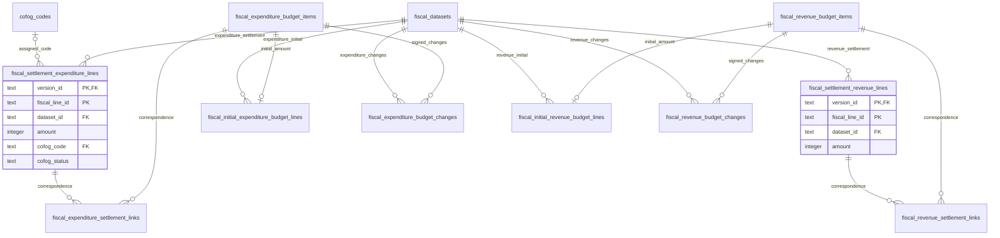

# 予算の変更と決算の実績を別々に保存・提供する

## Objectives

- **Goal**: 歳出と歳入、予算と決算の表を分け、決算明細に実績の `amount` 一つを持たせる。当初予算・各変更・決算の対応を検査し、指定時点の予算と実績を比較できるようにする。
- **Not goal**: 資料が欠けた変更のゼロ補完、根拠のない配賦、予算からの実績推定、公営企業会計の収録。

これは [予算変更履歴の PRD](prd/fiscal-budget-history/prd.md) を適用した移行後の設計である。現行 DB/API/dbt と配布物の変更は未実装。PRD の資料収録・対応・照合条件を満たした範囲から移行する。

## Background

現行の共有明細と金額段階の表では、決算の支出済額と原典に載る予算現額を同じ明細の別金額として提供する。予算の増減を辿る情報は別資料にあり、実績を取得するために金額段階を選ばせる構造を維持する理由はない。原典の照合に必要な値を保存しつつ、利用者が取得する予算と実績を分ける。

## System Overview

図を二つに分ける。版・公開の ER 図は [自治体データ版の設計](design-doc-jurisdiction-versions.md)、財政データの ER 図は以下を正本とする。すべての提供用レコードは自治体データ版に属し、公開一覧に複製しない。

この図は財政上の主要な表を示す。決算明細に属する経路・追加区分・検索用名称は後述の専用子表に展開する。原典の報告値と処理規則は提供用 D1 の表に含めない。

## Detailed Design

### 決算明細に実績の金額を直接持たせる

`fiscal_settlement_expenditure_lines` と `fiscal_settlement_revenue_lines` は `(version_id, fiscal_line_id)` を主キー、`(version_id, dataset_id)` を外部キーとする。`amount` は円換算した整数で、歳出は支出済額、歳入は収入済額を表す。`source_row`、会計コード・名称、連結判断・相手会計を持つ。金額だけの表と公開用 `phase` は作らない。

歳出表には `cofog_code`、`cofog_status`、分類根拠を持たせる。分類結果は概念上は明細の一部であり、独立した1対1表にしない。`assigned` のときだけ `cofog_codes` を外部キー参照し、それ以外はコードを NULL とする。歳入表に COFOG 列は作らない。

dataset の歳入歳出・文書種別と、保存先の表の意味を取込検査と公開前の検査で照合する。単に dataset の複合外部キーが成立するだけでは、歳入資料の行を歳出表へ入れられないことを保証したとは扱わない。予算対象・変更・対応にも団体・年度・会計の検査を適用する。

金額の単位・原典の複数金額列は取り込み表に残す。決算原典の予算現額は照合用の報告値として R2 の取り込み表・ローカル検証記録から参照し、公開する決算の `amount` と混在させない。元の値を計算値で上書きしない。

### 予算の対象と、資料に載る額を分ける

`fiscal_expenditure_budget_items` と `fiscal_revenue_budget_items` は、その年度に予算を追跡する科目・事業の対象を表す。共通科目マスタではなく、資料間の対応を確かめて作る団体・年度内の対象である。主キーは `(version_id, budget_item_id)`、`(version_id, jurisdiction_code)` は自治体データ版への外部キーとする。団体コード・年度・会計・科目経路・追加区分と、当初額の確認状態 `recorded / verified-zero / unknown` を持つ。

当初予算は `fiscal_initial_expenditure_budget_lines` と `fiscal_initial_revenue_budget_lines` に保存する。各行は一つの `amount` と、原典の `dataset_id / fiscal_line_id / source_row`、対応する `budget_item_id` を持つ。主キーは `(version_id, fiscal_line_id)`、`(version_id, budget_item_id)` は UNIQUE とし、確認した対象ごとに当初額を一つだけ採用する。資料が訂正された場合も複数版を重ねて計上しない。

補正等で新設された対象も予算対象表に持てるため、当初予算の明細が存在しない場合がある。新設の証拠があり当初額ゼロと確認できたときだけ `verified-zero` とする。入力が欠けた `unknown` をゼロとして計算しない。原典の一行が複数対象にまたがり分解できない場合は、原典で確認できる粒度の対象として保持し、細かい事業へ配賦しない。

### 補正・繰越・その他の変更を増減額として持つ

`fiscal_expenditure_budget_changes` と `fiscal_revenue_budget_changes` は `(version_id, change_id)` を主キーとし、原典の dataset と予算対象を同じ `version_id` 内の複合外部キーで参照する。各行は `amount_delta`、変更種別、適用日・適用順序、原典の行を持つ。減額は負の値。補正の号数と原典の金額の意味は dataset の説明に置く。

支出・収入で必要な変更種別を区別し、歳出の予備費充用・流用を歳入へ一律に適用しない。繰越は繰越元年度・繰越先年度と会計を明示する。予備費充用・流用では、対象と原資の対応が必要な場合は相手予算対象を記録する。議決上の限度額を実際の変更額として採用しない。

指定時点の予算額は、確認した当初額と、その時点までに適用された変更の増減額を足す。原典が補正前額・補正後総額しか持たない場合は、それを増減額とみなさず、対応する値の差を検証してから変更として採用する。同じ原典の再公表や訂正を追加の補正として足さない。

当初額と変更の収録範囲・確認状態を予算対象と dataset の説明から応答する。取得した変更だけの小計を返す場合も、完全な予算額として表示しない。

### 予算と決算の対応を、金額の複製にしない

`fiscal_expenditure_settlement_links` と `fiscal_revenue_settlement_links` は `(version_id, budget_item_id, settlement_line_id)` を主キーとする。予算対象と決算明細を同じ版内の複合外部キーで参照し、対応状態・根拠・対応グループを持つ。歳出と歳入の対応表は分ける。

一対一だけでなく科目の分割・統合を表せるようにする。多対多のリンクで金額を単純に JOIN して合算しない。確認済みの対応グループについて予算と決算をそれぞれ一度ずつ集計して比較する。対応が不明な明細も保存し、リンクのない行をデータ欠落や金額ゼロと扱わない。団体・年度・会計・歳入歳出の一致と、グループをまたいだ二重計上がないことを build で検査する。

### 歳出・歳入の経路と検索用名称を混ぜない

決算明細の子表を以下に分ける。それぞれ親の `(version_id, fiscal_line_id)` を外部キー参照する。

- `fiscal_settlement_expenditure_line_hierarchy` / `fiscal_settlement_revenue_line_hierarchy`: 主キーに `ordinal` を加え、会計・款・項・目・事業・節等の経路を一段ずつ保持する。
- `fiscal_settlement_expenditure_line_dimensions` / `fiscal_settlement_revenue_line_dimensions`: 主キーに `dimension` を加え、原典にある所属・予算区分等を保持する。
- `fiscal_settlement_expenditure_line_names` / `fiscal_settlement_revenue_line_names`: 主キーに `name_kind / level` を加え、検索用名称とその出所を保持する。

予算対象にも科目経路・追加区分を保持する。検索対象として展開する際も、決算の子表へ混在させず予算対象専用にする。必要な索引と展開の粒度は実資料と問い合わせで検証する。

節等の原典科目と共通科目への対応は区別する。歳入と歳出の共通科目定義は別で、原典のコードだけを全団体・全年度共通の外部キーにしない。経路の名称は原典の値と出所を保持し、年度の適用範囲を確かめたマスタから解決した名称と区別する。

### 分類の処理定義を公開データから外す

分類コードのマスタ `cofog_codes` は共有する。規則は Git の `cofog_rules.csv` で適用し、提供用 D1・API・配布物には規則表・規則ファイル・規則 ID を含めない。使った規則はコード版・固定入力とパイプラインの検証記録から追跡する。当初歳出予算と歳出の変更にも、各原典明細に対して求めた COFOG コード・状態・根拠を持たせる。歳入の表へは持たせない。

R2 と D1 は同じ dbt の提供モデルから生成する。対応する明細の金額・分類・連結判断が一致することを検査し、両者を独立編集する正本にしない。

## Release

新しい提供契約・schema・dbt marts・FDP descriptor を同時に切り替える。現在の共有明細・独立金額表と `phase`、規則 ID は提供契約から除去する。原典・取り込み表の金額列は削除しない。PRD の資料収録・照合が未完了の範囲では既存データを破棄せず、移行完了とも扱わない。

## Tasks

- [ ] 移行対象の団体・年度・会計と資料の収録範囲を固定する。
- [ ] 当初額、変更額、文書間の対応、原典の報告値との照合を実資料で確認する。
- [ ] 型・dbt・D1・API・FDP を新しい明細と予算履歴の契約に揃える。
- [ ] 新 schema の同一版参照・歳入歳出の混入拒否・多対多の比較・資料欠落・訂正・円換算・R2/D1 一致を検証する。
- [ ] 版・公開・切り戻しは自治体データ版の設計に従って検証する。
