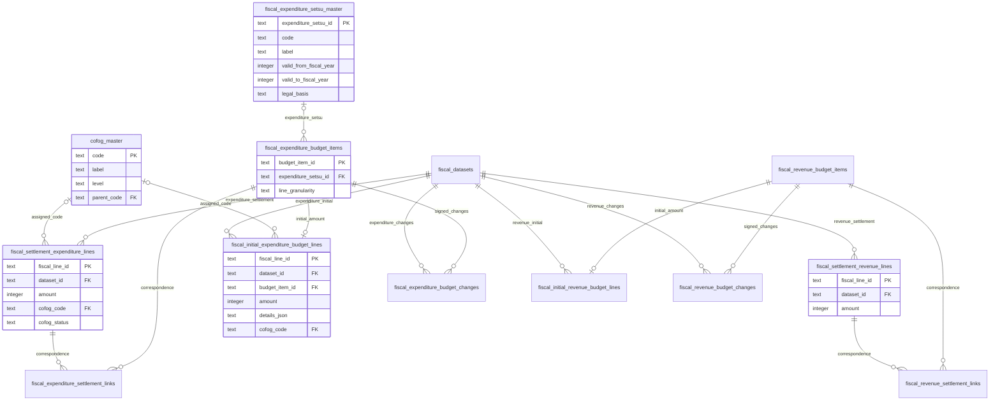

# 予算の変更と決算の実績を別々に保存・提供する

## Objectives

- **Goal**: 歳出と歳入、予算と決算の表を分け、決算明細に実績の `amount` 一つを持たせる。歳出の予算対象は事業×歳出の節とし、下位内訳を JSON に保持する。当初予算・各変更・決算の対応を検査し、指定時点の予算と実績を比較できるようにする。
- **Not goal**: 資料が欠けた変更のゼロ補完、根拠のない配賦、予算からの実績推定、公営企業会計の収録。

これは [予算変更履歴の PRD](prd/fiscal-budget-history/prd.md) を適用した設計である。予算と決算の分離・実績一金額の DB/API/dbt と配布物の契約は実装済み。歳出の節マスタ、事業×節への予算明細の集約、下位内訳の JSON 化は今回採用した未実装の変更である。変更履歴と確認済み対応の実資料は未収録で、API はその範囲を未確認として提供する。

## Background

移行前の共有明細と金額段階の表では、決算の支出済額と原典に載る予算現額を同じ明細の別金額として提供していた。予算の増減を辿る情報は別資料にあり、原典の照合に必要な値を保存しつつ、利用者が取得する予算と実績を分けた。

現行の予算明細は原典行の粒度であり、団体によって節・細節・細々節等の深さが異なる。公開する歳出予算の粒度を事業×歳出の節に揃え、自治体独自の下位内訳は JSON に保持する。事業や節の対応を確認できない行は、原典の粒度を残す。

## System Overview

図を二つに分ける。団体別の版の ER 図は [自治体データ版の設計](design-doc-jurisdiction-versions.md)、財政データの ER 図は以下を正本とする。D1 は団体ごとの最新版だけを保持し、明細に内容版のキーを持たせない。全収録年度と予算変更はそのまま保持する。

この図は採用した設計の主要な表を示す。複数列の `PK` は、それぞれが単独の主キーという意味ではなく、組合せで一行を特定する複合主キーを表す。決算歳出明細の主キーは `fiscal_line_id` 一つである。歳出の節マスタは自治体データ版から独立し、金額を持たない。決算明細に属する経路・追加区分・検索用名称は後述の専用子表に展開する。原典の報告値と処理規則は提供用 D1 の表に含めない。

## Detailed Design

### 共通の定義をマスタとして区別する

団体マスタ・COFOG分類マスタ・歳出の節マスタは、金額明細が参照する共通の定義である。表名を `jurisdiction_master`、`cofog_master`、`fiscal_expenditure_setsu_master` とし、`_master` を付けて役割を明示する。主キーはそれぞれ `jurisdiction_code`、`code`、`expenditure_setsu_id` とし、自治体の提供データ版を表す `version_id` は持たせない。節の適用年度は定義の有効期間であり、提供版とは区別する。予算対象・明細・変更・資料間の対応は年度や資料に属する記録なので、マスタとは扱わない。

この命名は設計に採用したもので、現行 SQL の団体表 `jurisdictions` と分類表 `cofog_codes` の改名、および歳出の節マスタの追加は未実装である。参照列や公開 manifest の `jurisdictions` フィールド、`packages/jurisdictions/` の名前は、この表名変更で改名しない。

### 歳出予算を事業と経済的な性質の組合せで提供する

歳出の節マスタを `fiscal_expenditure_setsu_master`、参照列を `expenditure_setsu_id` と命名する。`setsu` は法定の「節」を指す。`section` を公式英訳として採用せず、既存の原典経路の `kan / kou / moku / setsu` と揃える。歳出の節は支払いの経済的な性質、COFOG は支出の目的を表す別の分類軸である。歳入の節は財源の内訳なので、このマスタを参照しない。GFSM は提供しない。

マスタの一行は、適用期間を持つ歳出の節の定義である。`expenditure_setsu_id` を主キーとし、法定の `code`、`label`、適用開始・終了年度、法令の根拠を持つ。同じ法定コードの定義の適用期間は重複させず、コードだけを全年度共通の ID として使わない。適用終了年度が未定なら NULL とする。Git の定義から D1 の共通マスタを生成し、`version_id` や金額を持たせない。原典の年度・名称・科目体系を照合して対応付け、参照する対象の年度がマスタの適用期間内であることを検査する。歳出と確認できない区分や公営企業会計の別体系を取り込まない。[法定の歳出の節区分](https://laws.e-gov.go.jp/data/MinisterialOrdinance/322M40000008029/616836_1/pict/2FH00000022813.pdf)

公開済みの `expenditure_setsu_id` のコード・名称・意味・根拠は固定する。法改正で定義が変わる場合は新しい ID を追加する。旧定義の終了年度の確定は既存の参照年度を無効にしない範囲に限り、誤った既存定義の訂正は影響する自治体データ版と配布物の再生成を伴う契約移行として扱う。共有マスタの更新だけで、固定した配布物と API の説明が変わる状態を作らない。

`fiscal_expenditure_budget_items` の確認済み対象は事業×歳出の節とする。同じ団体・年度・会計でも、款・項・目・事業経路、所属・予算区分等の原典の追加区分、歳出の節が違えば別対象となる。「学校修繕事業×委託料」と「学校修繕事業×工事請負費」は別であり、別事業の委託料も混ぜない。事業が原典で分解されていなければ、確認できる科目経路を使い、事業を捏造しない。

当初予算の集約は同じ dataset 内で行い、別年度・別資料・訂正版の金額を足し合わせない。対応する予算明細は一つの `amount` を直接持ち、歳出の節ごとの独立した金額表を追加しない。原典の一行がそのまま提供行になるとは限らないため、集約後の `fiscal_line_id` は dataset・科目／事業経路・追加区分・歳出の節から生成する。元の行 ID は下位内訳から辿れるようにする。予算対象 ID は資料間の確認済み対応で解決し、原典版をまたいで自動的に同じ対象とみなさない。

細節・細々節等は `details_json` に保持する。各要素は節より下の順序付き経路（段の名前・コード・名称）、その明細の金額（円）、原典の `fiscal_line_id` と `source_row` を持つ。当初予算では基準額、変更ではその変更の符号付き増減額を格納する。節直下の原典行では下位経路を空にし、原典行への対応は残す。親の `amount` または `amount_delta` は採用した末端明細の金額の合計と一致させ、同じ数字を印字した小計・合計行を内訳へ重ねて入れない。原典の値・単位・複数金額列は取り込み・内部検証に保持する。

集約候補の COFOG と連結判断が異なる場合は、一つの分類や消去判断を全内訳へ押し付けない。対応を確認するまでは原典行の粒度を保持し、`line_granularity = origin_line` とする。事業×歳出の節で提供できる対象は `line_granularity = expenditure_setsu` とする。原典の節が不明な場合は `expenditure_setsu_id = NULL` とし、NULL の節をまとめて集約しない。千代田区の事業内訳と節の対応は未確認であり、この例外に含める。節が不明なことを金額ゼロやデータ欠落とは扱わない。

この集約は歳出の予算対象・当初予算・変更に適用する。決算明細は引き続き原典で確認できる粒度の実績を持ち、予算との粒度差は対応表で扱う。歳入の節や明細へ歳出の集約規則を適用しない。

### 決算明細に実績の金額を直接持たせる

`fiscal_settlement_expenditure_lines` と `fiscal_settlement_revenue_lines` は `fiscal_line_id` を主キー、`dataset_id` を外部キーとする。`amount` は円換算した整数で、歳出は支出済額、歳入は収入済額を表す。`source_row`、会計コード・名称、連結判断・相手会計を持つ。金額だけの表と公開用 `phase` は作らない。

歳出表には `cofog_code`、`cofog_status`、分類根拠を持たせる。分類結果は概念上は明細の一部であり、独立した1対1表にしない。`assigned` のときだけ `cofog_master` を外部キー参照し、それ以外はコードを NULL とする。歳入表に COFOG 列は作らない。

dataset の歳入歳出・文書種別と、保存先の表の意味を取込検査と公開前の検査で照合する。単に dataset の複合外部キーが成立するだけでは、歳入資料の行を歳出表へ入れられないことを保証したとは扱わない。予算対象・変更・対応にも団体・年度・会計の検査を適用する。

金額の単位・原典の複数金額列は取り込み表に残す。決算原典の予算現額は照合用の報告値として R2 の取り込み表・ローカル検証記録から参照し、公開する決算の `amount` と混在させない。元の値を計算値で上書きしない。

### 予算の対象と、資料に載る額を分ける

`fiscal_expenditure_budget_items` と `fiscal_revenue_budget_items` は、その年度に予算を追跡する科目・事業の対象を表す。共通科目マスタではなく、資料間の対応を確かめて作る団体・年度内の対象である。主キーは `budget_item_id`、`jurisdiction_code` は団体ごとの現在の収録情報への外部キーとする。団体コード・年度・会計・科目経路・追加区分・検索用名称と、当初額の確認状態 `recorded / verified-zero / unknown` を持つ。

予算明細は予定する支出・収入の金額、決算明細は実際の支出・収入を表す。`expenditure` は歳出という方向を表し、予算・決算の区別は `initial_budget` と `settlement` で明示する。例えば同じ学校修繕事業×委託料に、当初予算100万円、補正＋20万円、支出済額110万円がある場合、予算対象を介して当初予算明細・予算変更・決算明細を対応付ける。`budget_item` はこの追跡対象を指し、節マスタの定義や法定の「目」の英訳ではない。

当初予算は `fiscal_initial_expenditure_budget_lines` と `fiscal_initial_revenue_budget_lines` に保存する。各行は一つの `amount`、`dataset_id / fiscal_line_id`、対応する `budget_item_id` を持つ。歳出の原典行への対応と下位内訳は `details_json` に置き、歳入の原典行は `source_row` で参照する。主キーは `fiscal_line_id`、`budget_item_id` は UNIQUE とし、確認した対象ごとに当初額を一つだけ採用する。資料が訂正された場合も複数版を重ねて計上しない。

補正等で新設された対象も予算対象表に持てるため、当初予算の明細が存在しない場合がある。新設の証拠があり当初額ゼロと確認できたときだけ `verified-zero` とする。入力が欠けた `unknown` をゼロとして計算しない。原典の一行が複数対象にまたがり分解できない場合は、原典で確認できる粒度の対象として保持し、細かい事業へ配賦しない。

### 補正・繰越・その他の変更を増減額として持つ

`fiscal_expenditure_budget_changes` と `fiscal_revenue_budget_changes` は `change_id` を主キーとし、原典の dataset と予算対象をそれぞれの ID で外部キー参照する。各行は `amount_delta`、変更種別、適用日・適用順序、原典の行への対応を持つ。歳出では同一の変更種別・適用時点・順序・原資等の条件が一致する場合に限り対象単位へ集約し、内訳と原典行は `details_json` に保持する。減額は負の値。補正の号数と原典の金額の意味は dataset の説明に置く。

支出・収入で必要な変更種別を区別し、歳出の予備費充用・流用を歳入へ一律に適用しない。繰越は繰越元年度・繰越先年度と会計を明示する。予備費充用・流用では、対象と原資の対応が必要な場合は相手予算対象を記録する。議決上の限度額を実際の変更額として採用しない。

指定時点の予算額は、確認した当初額と、その時点までに適用された変更の増減額を足す。原典が補正前額・補正後総額しか持たない場合は、それを増減額とみなさず、対応する値の差を検証してから変更として採用する。同じ原典の再公表や訂正を追加の補正として足さない。

当初額と変更の収録範囲・確認状態を予算対象と dataset の説明から応答する。取得した変更だけの小計を返す場合も、完全な予算額として表示しない。

### 予算と決算の対応を、金額の複製にしない

`fiscal_expenditure_settlement_links` と `fiscal_revenue_settlement_links` は `(budget_item_id, settlement_line_id)` を主キーとする。予算対象と決算明細をそれぞれの ID で外部キー参照し、対応状態・根拠・対応グループを持つ。歳出と歳入の対応表は分ける。

一対一だけでなく科目の分割・統合を表せるようにする。多対多のリンクで金額を単純に JOIN して合算しない。確認済みの対応グループについて予算と決算をそれぞれ一度ずつ集計して比較する。対応が不明な明細も保存し、リンクのない行をデータ欠落や金額ゼロと扱わない。団体・年度・会計・歳入歳出の一致と、グループをまたいだ二重計上がないことを build で検査する。

### 歳出・歳入の経路と検索用名称を混ぜない

決算明細の子表を以下に分ける。それぞれ親の `fiscal_line_id` を外部キー参照する。

- `fiscal_settlement_expenditure_line_hierarchy` / `fiscal_settlement_revenue_line_hierarchy`: 主キーに `ordinal` を加え、会計・款・項・目・事業・節等の経路を一段ずつ保持する。
- `fiscal_settlement_expenditure_line_dimensions` / `fiscal_settlement_revenue_line_dimensions`: 主キーに `dimension` を加え、原典にある所属・予算区分等を保持する。
- `fiscal_settlement_expenditure_line_names` / `fiscal_settlement_revenue_line_names`: 主キーに `name_kind / level` を加え、検索用名称とその出所を保持する。

予算対象にも科目・事業経路と追加区分を保持する。事業×歳出の節へ集約した予算対象では、経路を事業までとし、歳出の節を `expenditure_setsu_id` で独立して参照する。節より下の内訳は金額明細の `details_json` に置く。未確認の原典行を保持する対象では原典経路を残す。検索対象として展開する際も、決算の子表へ混在させず予算対象専用にする。必要な索引と展開の粒度は実資料と問い合わせで検証する。

節等の原典科目と共通科目への対応は区別する。歳入と歳出の共通科目定義は別で、原典のコードだけを全団体・全年度共通の外部キーにしない。経路の名称は原典の値と出所を保持し、年度の適用範囲を確かめたマスタから解決した名称と区別する。

### 分類の処理定義を公開データから外す

分類コードのマスタ `cofog_master` は共有する。規則は Git の `cofog_rules.csv` で適用し、提供用 D1・API・配布物には規則表・規則ファイル・規則 ID を含めない。使った規則はコード版・固定入力とパイプラインの検証記録から追跡する。当初歳出予算と歳出の変更にも、各原典明細に対して求めた COFOG コード・状態・根拠を持たせる。歳入の表へは持たせない。

R2 と D1 は同じ dbt の提供モデルから生成する。対応する明細の金額・分類・連結判断が一致することを検査し、両者を独立編集する正本にしない。

予算履歴 API は団体・年度・歳入歳出・基準日を指定し、`fundCode` で会計を絞れる。build と公開後の検査は、変更行を通常の履歴 API から読み返し、ID・日付・符号付き額・原典行・分類を提供モデルと照合する。

## Release

新しい提供契約・schema・dbt marts・FDP descriptor を同時に切り替える。現在の共有明細・独立金額表と `phase`、規則 ID は提供契約から除去する。原典・取り込み表の金額列は削除しない。PRD の資料収録・照合が未完了の範囲では既存データを破棄せず、移行完了とも扱わない。

## Tasks

- [ ] 団体・COFOG の共通マスタの表名を `jurisdiction_master`・`cofog_master` に揃える。

- [ ] `fiscal_expenditure_setsu_master` と年度に応じた原典の節の対応を実装する。
- [ ] 歳出の予算対象・当初予算・変更を事業×歳出の節へ集約し、下位内訳と原典行の対応を `details_json` に保持する。
- [ ] 内訳の金額一致・小計の重複排除・事業／追加区分の分離・節不明の保持・COFOG／連結判断の衝突・マスタの適用期間と R2/D1 の一致を検査する。
- [ ] 移行対象の団体・年度・会計と資料の収録範囲を固定する。
- [ ] 当初額、変更額、文書間の対応、原典の報告値との照合を実資料で確認する。
- [x] 型・dbt・D1・API・FDP を予算と決算の分離・実績一金額の契約に揃える。
- [ ] 新 schema の同一版参照・歳入歳出の混入拒否・多対多の比較・資料欠落・訂正・円換算・R2/D1 一致を検証する。
- [x] 団体別の取り込み・再実行は自治体データ版の設計に従って検証する。

予算と決算を分ける契約は適用済み。Bun fixture では同一版・歳入歳出の分離・多対多の重複排除・資料欠落・負の変更額と指定時点を検査した。現在の実資料は 5 団体・28 dataset で、決算実績と当初予算を生成する。事業×歳出の節への集約と JSON 内訳は未実装で、現行の予算明細は原典行の粒度である。補正・繰越等の取得と照合は PRD の未完了条件として残り、空の変更表から完全な予算額を返さない。
