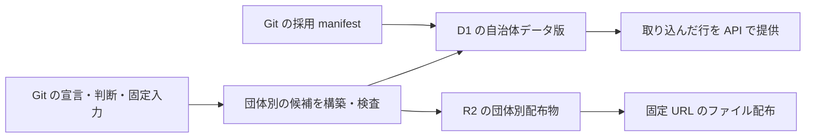
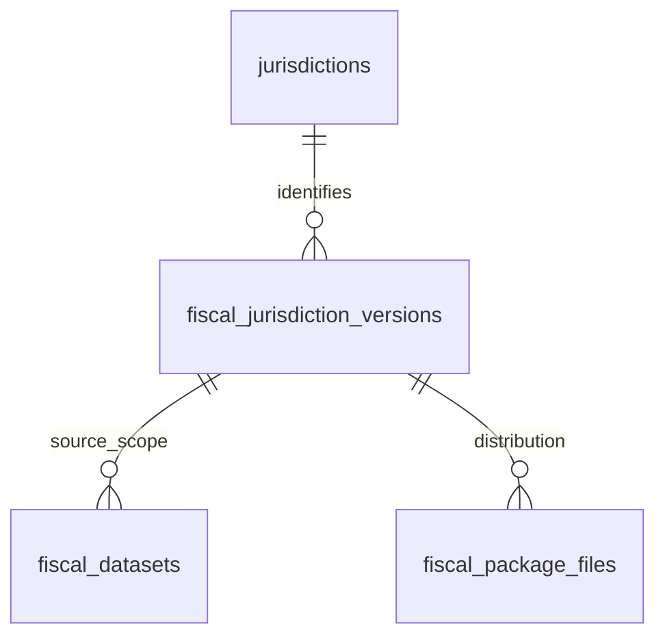

# 自治体ごとにデータを取り込み、そのまま提供する

歳出・歳入、予算・決算の保存モデルは [財政データの設計と ER 図](design-doc-fiscal-records.md) に従う。決算明細は実績の `amount` 一つを持ち、当初予算・変更履歴・決算との対応を別表に置く。分類規則と規則 ID は提供用 DB/API・配布物に含めない。

## Objectives

- **Goal**: D1 の明細・金額・階層・名称を自治体別の内容版に持たせ、未変更の自治体を再取り込みせずに公開する。R2 の配布物も再利用し、取り込んだ行を順次 API から提供する。
- **Not goal**: 年度ごとの細分化、団体別 DB への分割、全団体の公開時点の固定、取り込み途中の非公開化、自動削除。財政レコードの保存境界は [財政データの設計](design-doc-fiscal-records.md) に集約する。

この文書は採用する再設計を示す。現行コードの `release_id` による全体複製はまだ置き換えていない。既存のローカル検証結果は旧構造の結果であり、この設計の実装完了や容量・性能の検証とは扱わない。

## Background

現在は R2 の配布物に団体別の `packageId` がある一方、D1 の提供用データは全体の構築 ID に紐づく。狛江市だけ更新した場合も、三鷹市など未変更の自治体の明細を次の構築版へ複製する。コードの変更でも構築 ID が変わるため、内容が同じデータに版が増え得る。

取り込み途中の明細が API に見えることを許容する。全団体の更新時点や、複数回の問い合わせが読むデータの完成状態を揃える要件は設けない。公開一覧と公開切替を導入せず、団体ごとの内容版へ直接取り込む。

## System Overview

版の意味を二つに分ける。

| 識別子 | 内容が変わる条件 | 保存対象 |
| --- | --- | --- |
| `packageId` | その団体の配布ファイルが変わる | R2 の CSV・FDP |
| `versionId` | その団体の提供用データ・説明・配布参照・契約が変わる | D1 の団体別データ |

構築実行の ID はローカルの候補・検証記録だけで使う。構築したコード commit や実行時刻だけでは、これらの内容版を増やさない。取り込みを再実行しても、未変更の団体の明細を複製しない。

## Detailed Design

### 団体別の版と財政明細の表を分ける

団体別の版の ER 図は以下とする。財政明細の ER 図と列・外部キーは [財政データの設計](design-doc-fiscal-records.md) を正本とする。

- `fiscal_datasets`: 財政資料の収録単位。団体・年度・歳入歳出・文書種別・採用原典版と出典・利用条件・範囲を持つ。提供用の金額段階は持たない。
- `fiscal_settlement_expenditure_lines` / `fiscal_settlement_revenue_lines`: 決算の歳出／歳入明細。各行に実績の `amount` を直接持つ。科目経路・追加区分・検索用名称もそれぞれの専用子表に分ける。
- `fiscal_expenditure_budget_items` / `fiscal_revenue_budget_items`: 団体・年度内の予算対象。対応を確かめた当初額・変更と決算を結ぶ対象であり、共通マスタではない。
- `fiscal_initial_expenditure_budget_lines` / `fiscal_initial_revenue_budget_lines`: 当初予算の基準額。
- `fiscal_expenditure_budget_changes` / `fiscal_revenue_budget_changes`: 各補正・その他変更の増減額と時点・出典。
- `fiscal_expenditure_settlement_links` / `fiscal_revenue_settlement_links`: 予算対象と決算明細の対応。金額を複製せず、分割・統合や未確認を扱う。
- `fiscal_jurisdiction_versions` / `fiscal_package_files`: 一団体の財政データ版と、R2 の配布参照。

共通団体マスタ `jurisdictions`、分類マスタ `cofog_codes`、DB の識別子 `database_identity` は版から独立させる。財政の表と dbt モデルには `fiscal_` を付け、例えば `api_fiscal_settlement_expenditure_lines` と生成先の表名へ揃える。現行 SQL・dbt の置き換えは未完了である。

会議録等を追加するときはその領域のモデル・配布参照・版を別に定義し、財政明細へ `domain` 列を追加して混在させない。領域間では団体コードを共有する。

### 団体の内容が変わったときだけデータ版を作る

`fiscal_jurisdiction_versions` は一団体の全収録年度・文書・会計をまとめた不変のデータ版である。`version_id`、団体コード、契約版、`package_id`、その版で採用した名称・OCD ID・注意点、最初の登録時刻 `registered_at`、採用した Git manifest の commit 固定 URL と SHA-256 を持つ。団体コードは `jurisdictions` を参照する。提供用の団体情報もこの版から読むため、共通マスタの更新で過去の説明を変えない。

版の内容には、団体の説明、dataset の出典・利用条件・収録範囲、財政データの提供用表、配布ファイル一覧を含める。`versionId` は団体コード・契約版と、これらを正規化した内容の SHA-256 から生成する。行順・JSON のキー順・NULL と空文字の扱い・文字列としてのコード・整数単位を契約で固定する。版 ID 自身、登録時刻、manifest の参照、構築実行の ID、コード commit、実行時刻はハッシュの対象にしない。

API 用の内容だけが変われば `versionId` は変わり、配布ファイルが同じなら `packageId` は再利用する。逆に、配布 descriptor や利用条件の変更も利用者に見える内容なので版に含める。COFOG の共通マスタは既存コードの意味・名称を公開後に書き換えず、新しい分類体系が必要な場合は契約を移行する。

同じ内容を別のコード・入力から再構築した記録は、構築ごとの検証記録に残す。既存の不変版を上書きせず、元の採用 manifest と固定入力・Git 履歴から当初の生成経路も辿れるようにする。

財政データが未収録の団体も、名称・注意点を持つデータ版として登録できる。その場合は dataset と配布ファイルがなく、`package_id` は NULL とする。未収録と金額ゼロを区別する。

### 各明細を同じ団体のデータ版に所属させる

財政の提供用表はすべて自治体データ版の `version_id` に属する。dataset は `(version_id, jurisdiction_code)` で自治体データ版を参照し、別団体の版に混入することを禁止する。決算明細・当初予算・変更は `(version_id, dataset_id)` で同じ版の原典範囲を参照する。予算対象との対応や子表にも同じ版の複合外部キーを使い、別版・別団体・歳入歳出の混入を拒否する。dataset の種類と行の保存先は build で照合する。

`fiscal_package_files` は `(version_id, path)` を主キーとする。`jurisdiction_code` を持ち、`(version_id, jurisdiction_code)` で同じ団体のデータ版を参照する。その団体の R2 キー・SHA-256・サイズ・content type を持ち、ファイル本体は持たない。Git manifest から生成する検索用の参照であり、独立して編集しない。`object_key` はその団体と `package_id` の `fiscal/<団体コード>/<packageId>/` に属することを取り込み時に検査する。複合外部キーだけでは R2 キーの内容を拘束したと扱わない。API 用の内容だけが変わる場合にファイル参照が数行重複することは許容し、同じ R2 オブジェクトを参照する。配布物専用の追加テーブルは作らない。

団体と COFOG の共通マスタは版の外に置く。現行 `release_jurisdictions` の名称・注意点は自治体データ版へ統合し、`releases`、`active_release`、`release_history`、`release_jurisdictions`、`publish_control`、`publish_guard` は廃止する。

### 取り込んだ行をそのまま API から提供する

publish はローカルで検査した団体別データを R2/D1 へ反映する処理とする。R2 ファイルを転送した後、D1 の団体別データ版・dataset・配布参照・明細を依存順に登録する。取り込み単位ごとに反映済みの行を API から取得できる。完了まで旧版を返す条件、候補だけを非公開にする状態、公開参照の切替は設けない。

通常の API は団体ごとに `registered_at` が最も新しい版を選ぶ。同時刻の場合は `version_id` の順で決める。登録時刻は初回登録時に一度だけ設定し、再試行で変更しない。新しい版を登録した時点から、その版の明細が空または一部だけでも API の対象になる。過去の版を指定した問い合わせも許可し、登録済みの全版を同時に合算しない。団体マスタに現在版の外部キーを追加しない。

応答は対象の `jurisdictionCode / versionId / datasetId` を返す。ページトークンには検索条件・対象版・安定した並び順の続き位置・契約版・有効期限を持たせ、HMAC で認証する。全団体を固定する公開 ID は持たない。対象版を指定しても取り込み中の行は増えるため、ページ取得や別の呼び出しの間で件数・集計が変わることを許容する。対象版が存在しない場合やトークンが期限切れの場合はエラーを返す。

### 失敗した取り込みを同じ版へ再実行する

全団体・一団体全体を一括でロールバックしない。失敗した場合も反映済みの行は残し、同じ `version_id` と各表の主キーで再実行する。同じキー・同じ値は再利用し、同じ内容 ID に異なる値を上書きすることは拒否する。団体・版・歳入歳出の外部キーや金額の検査は維持する。取り込み途中を公開する方針は、異なる版や資料の値を混ぜる許可ではない。

一つの版への書き込みは publish の実行者が直列に行う。DB に lease・fence・guard の補助表を設けず、別団体の取り込みは独立させる。取り込み後の全行・API 応答・配布 URL の照合は結果をローカルへ記録する検査であり、API の可視性を切り替える条件にはしない。

R2 の固定キーは維持する。未変更のファイルは再利用し、新しい内容は別の `packageId` に置く。各ファイルが配置された時点から取得でき、配布ファイル一式が同時に現れる保証は設けない。原典・取り込み表は非公開入力 bucket に保存する。

### 登録した版と配布物を保持する

当面は D1 の過去版と R2 配布物を保持し、自動削除を実装しない。全体の切り戻し、公開状態の履歴、lease による削除調停も設けない。古い版は版 ID を明示して参照できる。将来整理する場合は保持対象と削除条件を別途定義する。今回の変更で元の入力や配布物を削除しない。

## Release

外部利用者がいないため、旧 API の互換性維持を要件にしない。新しい D1 schema と API 契約を一緒に移行する。ローカル実装から全体 release・非公開候補・guard を除去した。遠隔適用と実測は移行記録で別に確認する。

1. 団体別の内容版と R2 配布参照を確定する。
2. D1 の表・dbt 出力・API を団体別の版に揃える。
3. 全体公開一覧・公開切替・排他制御・非公開候補の経路を除去する。
4. ローカル Cloudflare で部分取り込みの取得、再実行、通常検索と版指定を確認する。遠隔反映の実施状況は移行記録へ残す。

## Tasks

- [x] 型・manifest・D1 schema・API 契約から全体公開 ID と公開制御を除去する。
- [x] dbt の API 出力を団体別に分け、内容ハッシュと再構築時の一致を検査する。
- [x] 一団体の更新で他団体の版と明細件数が変わらないことを確認する。
- [x] 取り込み中の新しい版が API に見えることを確認する。
- [x] 部分失敗から同じ版へ再実行して、重複や別版への混入が起こらないことを確認する。
- [x] ページ取得中の追加行と集計の変化を許容し、対象版・検索条件の一致を確認する。
- [ ] 現行全量で DB・索引容量と横断検索の性能を再測定する。

## Alternatives Considered

| 観点 | 全体の公開一覧を固定する | 団体ごとに直接取り込む（採用） |
| --- | --- | --- |
| API の反映 | 全体の参照切替後 | 行を取り込むたびに反映 |
| 取り込み途中 | 非公開 | 取得可能 |
| 複数回の問い合わせ | 版の組合せと完成状態を固定 | 件数・集計が変わり得る |
| 管理対象 | 公開一覧・所属・制御・guard | 団体別の版と提供データ |

取り込み途中と団体ごとの反映時点の差を許容するため、直接取り込む案を採用する。団体別の内容版は未変更データの再利用と不変の配布 URL のために残す。
