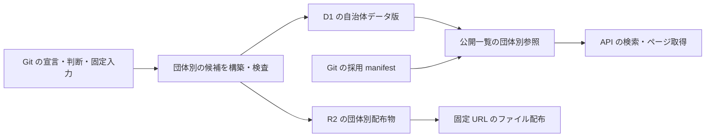

# 自治体ごとにデータを更新し、横断検索の参照を固定する

歳出・歳入の明細モデルを分ける方針は [ドメインモデルとクラス図](fiscal-domain-model.md) を正本とする。以下に残る共有の明細・関連表の記述は、分離前の設計である。版・公開の方針は維持し、DB/API/dbt の境界は新しいモデルに合わせて改訂する。

## Objectives

- **Goal**: D1 の明細・金額・階層・名称を自治体別の内容版に持たせ、未変更の自治体を再取り込みせずに公開する。R2 の配布物も再利用し、横断検索・ページ取得・切り戻しでは自治体別の版の組合せを固定する。
- **Not goal**: 年度ごとの細分化、団体別 DB への分割、R2 配布物の自動削除、決算の金額段階の変更。後者は [予算変更履歴の PRD](prd/fiscal-budget-history/prd.md) で扱う。

この文書は採用する再設計を示す。現行コードの `release_id` による全体複製はまだ置き換えていない。既存のローカル検証結果は旧構造の結果であり、この設計の実装完了や容量・性能の検証とは扱わない。

## Background

現在は R2 の配布物に団体別の `packageId` がある一方、D1 の提供用データは全体の構築 ID に紐づく。狛江市だけ更新した場合も、三鷹市など未変更の自治体の明細を次の構築版へ複製する。コードの変更でも構築 ID が変わるため、内容が同じデータに版が増え得る。

全体の複製をなくしても、検索の一貫性は必要である。ページごとに各自治体の最新を読めば、取得途中の更新によって行の重複・欠落や集計の不一致が起こり得る。明細の保存単位と、問い合わせが参照する版の組合せを分ける。

## System Overview

版の意味を三つに分ける。

| 識別子 | 内容が変わる条件 | 保存対象 |
| --- | --- | --- |
| `packageId` | その団体の配布ファイルが変わる | R2 の CSV・FDP |
| `versionId` | その団体の提供用データ・説明・配布参照・契約が変わる | D1 の団体別データ |
| `publicationId` | 公開する団体の集合・各 `versionId`・提供契約が変わる | 小さな参照一覧 |

構築実行の ID はローカルの候補・検証記録だけで使う。構築したコード commit や実行時刻だけでは、これらの内容版を増やさない。公開一覧は明細の親ではなく参照の集合であり、公開ごとに明細を複製しない。

## Detailed Design

### 財政以外のデータと混同しない名前を付ける

この設計の版・公開一覧・明細・配布参照は財政データ専用であり、テーブル名には `fiscal_` を付ける。dbt のモデル名も `api_fiscal_line_amounts` のように生成先の表名へ揃える。処理層の接頭辞だけでは対象を説明できないため、`api_names` や `api_line_dimensions` のような名前は採用しない。以下は再設計後の名前であり、現行 SQL・dbt はまだ改名していない。

- `fiscal_datasets` と `fiscal_lines`: 財政資料の収録単位と、その原典由来の明細。
- `fiscal_line_amounts`: 財政明細ごとの金額段階・金額・原典の単位。
- `fiscal_line_hierarchy`: 財政明細が属する、会計・款・項・目・事業等の階層経路。1行が一明細の経路の一段を表し、`ordinal` で順序を保持する。独立した科目マスタや COFOG の階層ではない。
- `fiscal_line_dimensions`: 階層経路に加えて財政明細を識別する原典の区分。狛江市の `org`（所属）と `fiscal_class`（予算区分：現年度・繰越明許・事故繰越）が該当する。団体別に宣言した区分だけを持ち、任意の属性を入れる汎用表にはしない。
- `fiscal_line_names`: 財政明細に関連する科目・事業・追加区分の検索用名称と、その名称の出典・判断根拠。
- `fiscal_jurisdiction_versions` と `fiscal_package_files`: 一団体の財政データ版と、その版が参照する Fiscal Data Package の配布ファイル。
- `fiscal_publications` と `fiscal_publication_members`: 財政 API が読む団体別の版の組合せと、その所属参照。
- `fiscal_publish_control` と `fiscal_publish_guard`: 財政データの公開参照・排他実行・切替検査。

`jurisdictions` は団体そのものの共通マスタであり、財政以外からも参照できる。`cofog_codes` は COFOG 分類という対象が名前に含まれており、汎用の分類表に拡張しない。`database_identity` は DB 自体の検証用識別である。

会議録等を追加するときは、その領域のモデル・配布参照・版の管理を別に定義する。財政の公開一覧へ会議録の版を入れたり、`fiscal_lines` に `domain` 列を追加して異なる種類の明細を詰めたりしない。領域間では団体コードを共有し、公開切替の仕組みの共通化は複数の実装で必要性が確認できてから判断する。名前が長くなる代わりに、D1 の表名や dbt の系統図だけでも対象と粒度を読めるようにする。

### 団体の内容が変わったときだけデータ版を作る

`fiscal_jurisdiction_versions` は一団体の全収録年度・文書・会計をまとめた不変のデータ版である。`version_id`、団体コード、契約版、`package_id`、その版で採用した名称・OCD ID・注意点、取込状態を持つ。団体コードは `jurisdictions` を参照する。提供用の団体情報もこの版から読むため、共通マスタの更新で過去の説明を変えない。

版の内容には、団体の説明、dataset の出典・利用条件・収録範囲、6つの提供用表、配布ファイル一覧を含める。`versionId` は団体コード・契約版と、これらを正規化した内容の SHA-256 から生成する。行順・JSON のキー順・NULL と空文字の扱い・文字列としてのコード・整数単位を契約で固定する。版 ID 自身、取込状態、構築実行の ID、コード commit、実行時刻はハッシュの対象にしない。

API 用の内容だけが変われば `versionId` は変わり、配布ファイルが同じなら `packageId` は再利用する。逆に、配布 descriptor や利用条件の変更も利用者に見える内容なので版に含める。COFOG の共通マスタは既存コードの意味・名称を公開後に書き換えず、新しい分類体系が必要な場合は契約を移行する。

同じ内容を別のコード・入力から再構築した記録は、構築ごとの検証記録に残す。既存の不変版を上書きせず、元の採用 manifest と固定入力・Git 履歴から当初の生成経路も辿れるようにする。

財政データが未収録の団体も、名称・注意点を持つデータ版として公開一覧に含められる。その場合は dataset と配布ファイルがなく、`package_id` は NULL とする。未収録と金額ゼロを区別する。

### 明細を公開一覧に複製しない

提供用の6表は `fiscal_datasets`、`fiscal_lines`、`fiscal_line_amounts`、`fiscal_line_hierarchy`、`fiscal_line_dimensions`、`fiscal_line_names` とする。各表の現行 `release_id` を `version_id` に置き換え、主キー・外部キーも自治体データ版に揃える。dataset は `(version_id, jurisdiction_code)` で自治体データ版を参照し、別団体の版に混入することを禁止する。明細 ID と dataset ID の財政上の意味は維持する。

`fiscal_package_files` は `(version_id, path)` を主キーとする。その団体の R2 キー・SHA-256・サイズ・content type を持ち、ファイル本体は持たない。Git manifest から生成する検索用の参照であり、独立して編集しない。API 用の内容だけが変わる場合にファイル参照が数行重複することは許容し、同じ R2 オブジェクトを参照する。配布物専用の追加テーブルは作らない。

団体と COFOG の共通マスタは版の外に置く。現行 `release_jurisdictions` の名称・注意点は自治体データ版へ統合し、`releases`、`active_release`、`release_history`、`release_jurisdictions` は廃止する。

### 問い合わせが読む団体別の版を固定する

`fiscal_publications` は `publication_id`、契約版、状態、採用した Git manifest の不変 URL と SHA-256、最後に公開参照となった時刻、active から外れた時刻、参照受付終了時刻、明示保持のフラグを持つ。状態は `candidate / published / retired` とする。`fiscal_publication_members` は `(publication_id, jurisdiction_code)` を主キーに、対応する `version_id` を一つだけ持つ。団体コードと版の複合外部キーで取り違えを禁止する。

`publicationId` は契約版と、団体コード順に並べた `団体コード → versionId` の対応から生成する。例えば `{狛江:A1, 三鷹:B1}` を `{狛江:A2, 三鷹:B1}` に更新すると、追加する財政データは狛江 A2 だけである。公開一覧の団体数分の参照は増えるが、三鷹 B1 の明細は同じ行を使う。

公開一覧は構築実行の記録を持たず、再公開でも同じ内容なら同じ ID を使う。一度公開した対応を編集しない。採用 manifest は全団体の収録範囲・各版・配布先をまとめた最新の一つを Git に置き、過去は Git 履歴から取得する。構築 ID・コード commit・全入力 fingerprint はローカルの構築記録へ移し、公開一覧の内容 ID を変える理由にしない。同じ公開一覧を採用し直す場合、D1 は最初に記録した有効な manifest URL を維持できる。

`fiscal_publish_control` の singleton 行に現在の `active_publication_id` と切替世代を保持する。別の `active_publication` テーブルは作らない。この行は排他実行の owner・fence・有効期限、開始時の公開参照・世代、処理中の候補公開一覧も持つ。過去の構築 ID に全データをぶら下げる代わりに、一行の公開参照を切り替える。

### 公開前の候補を API から見せない

自治体データ版の状態は `loading / verified` とし、同じ ID の異なる内容を拒否する。検査済みでも公開一覧に採用していない版は公開 API から直接指定できない。公開 API は `published` の公開一覧の所属版だけを読む。

publish は現在の公開一覧を基準に、指定した団体だけを候補の版へ置き換える。除外は更新とは別の明示操作とし、構築対象に含まれない団体を暗黙に削除しない。Git の採用 manifest と、置換後の公開一覧の全対応を照合する。別の publish が先に成功して基準が変わった場合は、自動で古い他団体の版へ戻さず、最新の一覧から候補 manifest を作り直して再検査する。

公開候補と所属版の取込状態を記録してから、変更した団体の R2 転送・D1 取込・全行照合を行う。未変更の版は再取り込みせず、所属版の検査済み状態と内容 ID、R2 参照が残っていることを確認する。API の契約・query fingerprint・横断検索は候補の公開一覧で検査する。コード変更時もこの検査を省略しない。

採用 manifest の Git commit にある生成コード・宣言・固定入力が候補の構築記録と一致することも確認する。公開一覧のハッシュへ構築 commit を混ぜなくても、実行者が別のコードや入力の候補を採用したことにはしない。新しい提供契約は契約版2として schema・manifest・API を揃える。

最後に一つの guarded な D1 batch で、所属版がすべて検査済み・契約が一致・対応件数と内容が採用 manifest と一致・排他実行と開始時の公開参照が有効であることを確認する。その後、候補を `published` にし、`active_publication_id` を更新し、世代を進める。途中失敗なら旧公開参照を維持する。R2 と D1 を一つのトランザクションとせず、固定した R2 の配布物は転送時点から直接取得可能とする。

### ページ取得と関連する API 呼出しで参照を固定する

初回に現在の `publicationId` を一度解決し、同じリクエスト内の dataset 選択・名称取得・集計をすべてその所属版に固定する。公開一覧から自治体データ版、dataset、明細へ SQL で結合し、API が団体別ファイルを読み集める構造には戻さない。

応答は `publicationId` と、対象 dataset の `jurisdictionCode / versionId` を返す。利用側は団体一覧・dataset 一覧・明細など別の呼出しにも同じ `publicationId` を指定できる。`releaseId` は廃止し、互換 alias は設けない。

ページトークンは `publicationId`、正規化した問い合わせの fingerprint、安定した並び順の続き位置、契約版、有効期限を持ち、全体を HMAC で認証する。全団体の版をトークンに埋め込まず、D1 の小さな公開一覧を参照する。続きでも同じ公開一覧を使い、最新へ暗黙に切り替えない。候補・retired・削除済みの公開一覧や、有効期限を過ぎたトークンは期限切れとして返す。

Cloudflare の read replica を使う場合、初回の公開参照解決は primary で行い、同じ D1 session を続く読み取りに使う。bookmark を別リクエストへ渡す場合も、公開一覧を固定する代わりにはしない。更新直後の参照だけ見えて所属版が見えない状態を避ける。互換契約がない旧版の参照は拒否する。[D1 Sessions API](https://developers.cloudflare.com/d1/worker-api/d1-database/#withsession)、[read replication の整合性](https://developers.cloudflare.com/d1/best-practices/read-replication/#use-sessions-api)。

### 自治体一つの切り戻しと全体の切り戻しを区別する

自治体一つの切り戻しでは、現在の公開一覧からその団体の `versionId` だけを保持中の旧版へ差し替え、新しい公開一覧を採用する。他団体の更新を巻き戻さない。全体の切り戻しは、指定した保持中の公開一覧へ公開参照を戻す明示操作とする。

どちらも版の内容・配布先・API の契約を再検査し、開始時の公開参照と世代が変わっていれば拒否する。同じ公開一覧へ戻す場合も世代を進め、古い処理が有効だと誤認しない。構築コードの復元は Git、データの即時切り戻しは保持中の自治体データ版が担う。

### 参照がなくなったデータ版だけを削除する

初期の保持条件は、公開参照から外れてから7日間の切り戻し猶予、ページトークンの有効期間1時間、参照受付終了後10分の削除猶予とする。一つの API リクエストは120秒を上限に打ち切り、期限後に成功応答を返さない。値を変更するときは、参照・ページ取得・削除の条件を一緒に変更する。

再採用した公開一覧は最後に active から外れた時点で7日間の猶予を数え直す。active、実行中の候補、明示的に切り戻し用として保持した一覧は削除しない。削除可能な一覧をまず `retired` にして新しい参照を止め、10分の猶予後に所属参照を削除する。

その後、保持中の全公開一覧・実行中の候補から参照されていない自治体データ版だけを、子表から順に guarded な単位で削除する。削除の直前にも参照と fence を確認する。D1 からの削除で R2 の配布物や固定入力を連動して消さない。

R2 配布物は当面自動削除せず保持する。D1 の lease と R2 の削除は一つのトランザクションではなく、期限切れの削除処理が新しい公開の再利用後にファイルを消す競合を、D1 の fence だけでは防げないためである。手動で整理する場合は公開・切り戻し操作を停止し、処理中の操作の終了を確認したうえで、保持中の自治体データ版・候補・明示保持・Git manifest に参照されていない配布物だけを対象にする。変更した配布物の保管量は増えるが、未変更の団体の複製は作らない。原典・取り込み済みの表は別の保持方針に従う。

削除は publish・切り戻しと同じ排他実行の入口を通し、候補登録と削除の競合を防ぐ。fence を失った処理は D1 を変更できない。廃止する `release_history` の代わりに、保持判断は公開一覧の時刻と実在する参照に基づける。

排他実行は10分の有効期限を更新しながら継続する。正常終了時は owner・候補・開始時の公開参照をクリアする。中断後の期限切れでは、次の処理が fence を進めて古い処理を無効化し、未公開の放棄候補を `retired` にして10分後に整理する。公開済み・active・明示保持の一覧を放棄候補として削除しない。削除済みの候補を再試行する場合は、登録・取込・検査からやり直す。

## Release

外部利用者がいないため、旧 API の互換性維持を要件にしない。移行用の新しい D1 schema と API の契約版を同時に準備し、旧全体版を読める API のまま DB の列だけを置き換えない。

1. 既存候補を団体別に分け、内容ハッシュ・説明・配布参照を確定する。既存の R2 `packageId` とファイル本体は再利用する。
2. 新しい候補 DB に自治体データ版を一度ずつ取り込み、全明細・金額・分類・出典を旧候補と照合する。未収録団体の説明も含める。
3. 新しい公開一覧・Git manifest・API の契約・ページトークン・公開処理・検証 Worker を一緒に移行する。
4. ローカル Cloudflare と遠隔候補で公開・団体別更新・切り戻し・期限切れ・削除を検証してから、API の binding と採用参照を切り替える。遠隔検証が未実施なら公開切替を完了扱いしない。

## Tasks

- [ ] 型・manifest・D1 schema・API 契約を自治体データ版と公開一覧に揃える。
- [ ] dbt の API 出力を団体別に分け、内容ハッシュの正規化と再構築時の一致を検査する。
- [ ] 一団体の更新で他団体の `versionId` と D1 の明細件数が変わらないことを確認する。
- [ ] 内容不変の再構築、API のみの変更、説明のみの変更、共通分類規則による複数団体の変更を検証する。
- [ ] 部分失敗・再試行・二つの更新の競合・候補の非公開・団体別と全体の切り戻しを検証する。
- [ ] 公開切替をまたぐページ取得、別呼出しの参照固定、期限切れと削除競合をローカル Cloudflare で確認する。
- [ ] 現行全量で DB と索引の容量、団体別更新の追加行数、横断検索の所要時間と読取行数を再測定する。
- [ ] 遠隔候補で同じ検査を行い、実測値と切替結果を移行記録へ残す。

## Alternatives Considered

| 観点 | 現行の全体複製 | 各団体の最新だけを読む | 自治体データ版と公開一覧を分ける |
| --- | --- | --- | --- |
| 一団体の更新 | 全団体の明細を複製 | その団体だけ更新 | その団体の新版だけ追加 |
| 横断・ページ取得の一貫性 | 全体版に固定 | 更新で変わり得る | 小さな参照一覧に固定 |
| 切り戻し | 全体単位 | 過去の組合せを復元できない | 団体別・全体を選べる |
| 保持の追加量 | 全量データ | 過去版なし | 変更団体の版と参照一覧 |

自治体データ版と公開一覧を分ける案を採用する。全体を指す小さな参照一覧は残るが、公開回数に応じて全明細が増える構造をなくす。年度ごとに分ければ一年度の更新量をさらに減らせる一方、団体別 FDP の版と D1 の版の組合せが増えるため、今回の単位は団体全体とする。
