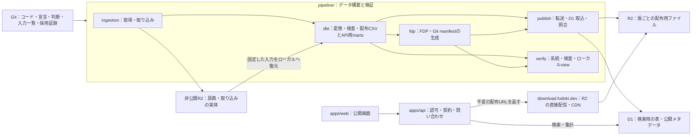

# データ構築をまとめ、配布物を R2、API の参照データを D1 に置く

2026-09-30 時点の実装を確認して合意した設計。実装・移行の検証状況は [移行記録](monorepo-migration.md)、現行コマンドは [pipeline/README.md](../pipeline/README.md) を参照。

2026-10-01 に、D1 の全体構築版による明細複製を廃止する [自治体別の直接取り込みへの再設計](design-doc-jurisdiction-versions.md) を採用した。団体別の取り込みはローカル実装済み。2026-10-02 に D1 を全収録年度を含む最新版だけの検索表へ変更し、契約版3へ揃えた。遠隔適用は移行記録で区別する。

財政データの保存境界と ER 図は [予算と決算を別に保存・提供する設計](design-doc-fiscal-records.md) を正本とする。決算明細は実績の `amount` 一つを持ち、予算の基準額・変更履歴を別管理する。分類規則と規則 ID は提供用 DB/API・配布物に含めない。版・公開の条件は [自治体データ版の設計](design-doc-jurisdiction-versions.md) に従う。

## Objectives

- **Goal**: 取得・変換・書き出し・公開・ローカル検証を `pipeline/` にまとめる。原典の CSV・PDF、取り込み済みの表、大きな配布物、API の参照データを Git 管理の対象にせず、R2 と D1 に保管・公開する。採用した入力の証跡は Git でレビューする。API がファイルの分割方式を知らずに検索・集計できるようにする。
- **Not goal**: dbt/DuckDB を D1 に置き換えること、原典由来の金額や分類判断の内容を変えること、既存 Git 履歴の書き換え。

## Background

現在も Bun workspaces に `apps/*` と `report` が登録されている。monorepo を新しく導入するより、データ構築の責務を配置と依存関係に表すことが必要である。

構築のコードは `ingestion/`、`dbt/`、`fdp/`、`report/` に分かれ、ローカル検証画面は公開 web の `apps/web/` にある。`report/` には検証用の系統・プレビュー・型と、公開 web/API が使う集計・名称が同居する。公開の分析画面も `pipeline.json` から団体・年度を読む。

API の `build.ts` は、配布物から多数の JSON chunk・検索索引・集計アセットを生成する。実行時は `ASSETS.fetch()` で読み、Worker が行を走査し、chunk・offset・問い合わせ別のパスを管理する。API の build は `sources.toml`、報告用の注意点、`field_types.json`、dbt の階層・追加キー宣言も直接読む。

配布物の CSV・descriptor は現在 Git 管理され、ローカルの配布物ディレクトリは約 21 MiB ある。API の `dist/assets` は既に Git 管理外だが、データ更新が API の build と deploy に結び付いている。Cloudflare にファイルを移すだけでは、実行時の chunk 管理や事前生成する問い合わせの組合せは減らない。

ユーザーの方針は、原典の CSV・PDF、取り込み済みの表、配布物と API の参照データを Cloudflare に置き、Git 管理しないこと。採用した入力の証跡は [ADR 0012](adr/0012-git-input-provenance.md) により Git に置く。R2 と D1 の役割を分ける設計まで含める。既存の [dbt の層の決定](adr/0009-dbt-model-layers.md) と [ローカル検証画面の要件](prd/pipeline-verification-view/prd.md) は維持する。

現在は外部の利用者がいないため、既存の API 名・列名・URL・コマンドとの互換性を要件にしない。web・API/MCP・pipeline・配布物を新しい契約にまとめて更新する。数値の正確さ、原典との対応、予算と決算の区別、FDP の仕様への適合は検証する。

## System Overview



実行の境界は **build と publish** とする。build は固定したローカル入力から dbt と説明ファイルの生成を実行するスクリプトで、結果を `pipeline/.build/` に置く。publish はその結果を R2/D1 に反映し、取り込んだ行を順次提供する。build だけでは公開中のデータは変わらない。

表の変換・検査と、配布 CSV・D1 用の表の生成は dbt の marts までに完了する。現行の marts は既に CSV を書き出しており、その CSV をそのまま配布する。FDP の descriptor・公開メタデータの JSON・配布ファイル一覧とハッシュを記録する manifest の生成は `fdp/`、報告とローカル画面は `verify/` に置く。build は dbt と `fdp/` の処理を呼び出す。報告生成と view の起動は別のコマンドで行う。

```text
.
├── apps/
│   ├── api/                         # 公開 API・MCP、D1 の参照
│   ├── web/                         # 公開画面
│   └── docs/
├── pipeline/
│   ├── README.md
│   ├── package.json / pyproject.toml
│   ├── build.ts                     # dbt と説明ファイル生成を実行する入口
│   ├── ingestion/                   # 予算・会議録の取得と取り込み
│   │   ├── fiscal/                  # 予算・決算の歳入歳出
│   │   │   ├── sources.toml         # 取得元の宣言
│   │   │   ├── sources.lock.json    # 原典・表の R2 キー、証跡の Git パスと個別ハッシュ
│   │   │   └── provenance/          # 採用した入力の証跡（Git 管理）
│   │   └── transcripts/
│   ├── dbt/                         # models / macros / seeds / tests
│   │   └── models/marts/
│   │       ├── fiscal/              # 予算・決算の配布 CSV のモデル
│   │       └── api/                 # D1 用の表・公開メタデータのモデル
│   ├── fdp/                         # descriptor・Git manifest
│   ├── publish/                     # R2 転送・D1 取込・照合
│   ├── verify/
│   │   ├── report/                  # manifest・検査結果から報告を作る
│   │   └── view/                    # ローカル専用の検証画面とデータ口
│   ├── .cache/                      # 復元済みの入力・OCR結果・PDF閲覧レイヤ
│   └── .build/                       # warehouse・dbt出力・配布候補・報告
├── packages/
│   ├── fiscal/                      # 予算・決算の純粋な集計・型・名称
│   ├── data-contracts/              # pipeline と API が共有する保存形式の契約
│   └── jurisdictions/               # 団体マスタ JSON と TypeScript の読込・検査関数
├── docs/
├── slides/                         # 発表資料
├── package.json / bun.lock          # Bun workspace
├── pyproject.toml / uv.lock         # uv workspace
└── mise.toml                       # ツールの版
```

これは責務の配置であり、全ディレクトリを独立したパッケージにする意味ではない。build は実行スクリプト、`pipeline/.build/` は生成結果のディレクトリである。収録範囲・出典・注意点と配布物の参照は一つの manifest にまとめ、catalog を別ファイルにしない。

## Detailed Design

### 一つの構築結果から配布用と API 用の形を作る

dbt の marts に配布用と API 用のモデルを置き、同じ中間処理・判断から双方を生成する。現行の dbt marts は `materialized = 'external'` で配布 CSV を直接生成し、`fdp/build.py` は `datapackage.json` を追加している。この役割を保ち、配布 CSV は dbt が書き出したものをそのまま使う。

- **配布用**: marts が書き出した団体別の CSV と、それに対応する FDP descriptor。R2 に置き、外部の利用者が一括ダウンロードできる。
- **API 用**: `models/marts/api/` が生成する、D1 の検索用の行・金額・分類・階層・公開メタデータ。publish が取り込み、Worker が問い合わせる。

金額・列・識別子・分類は dbt で確定する。dbt の検査で配布用と API 用の行・金額・識別子・分類を照合する。API 用の表は同じ中間モデルから生成し、API の build が配布 CSV を再解釈する処理を除去する。

build は dbt による表の生成・検査に加え、`fdp/` による descriptor・Git manifest の生成と形式検査を実行する。これは CSV に列の意味・単位・出典を付け、配布ファイルの一覧とハッシュを記録する処理である。dbt と publish の間に独立した `export/` や「公開準備」という工程を置かない。表の変換・整合性検査を dbt で完了させることと、JSON の形式検査や Cloudflare への取込後の照合を行うことは別の責務である。

Git の `pipeline/publish/manifest.json` は、収録する団体・年度・文書種別・原典版・予算変更の適用範囲、出典、利用条件、注意点、会計間の合算範囲、団体×歳入歳出の階層順序・追加キー、語彙、配布物の版と R2 キー・個別ハッシュを持つ。現在の `sources.toml` と団体ごとの記述を正本とし、公開する項目を列挙する。宣言は build の入力として dbt が読める形に揃え、公開メタデータを API 用の marts で生成する。注意点の全量に対する必須カテゴリ検査、API の enum と配布語彙の一致検査、次元の一致検査を保つ。

公開メタデータの marts を D1 に取り込み、`fdp/` は同じ内容を配布物の参照と合わせて Git の manifest に書き出す。独自項目を FDP の標準 descriptor に追加しない。PDF・頁画像・OCR 文字・行対応・内部 SQL を公開用データに含めない。

API 用の保存形式の schema・テーブル定義・契約版は `packages/data-contracts/` に置く。dbt のモデル出力、publish の取込と API の読取をこの契約と照合する。公開 RPC/REST/MCP の契約は `apps/api/` に置き、保存形式の型と公開 API の型を区別する。

### 予算と決算を財政領域に置き、実績と変更を別管理する

領域名は予算・決算を含む `fiscal` とし、取り込みは `pipeline/ingestion/fiscal/`、配布用モデルは `pipeline/dbt/models/marts/fiscal/`、共有コードは `packages/fiscal/` に置く。

`documentKind` は原典と dataset の文書種別を表す。当初予算・各補正・決算を別 dataset にし、補正の号数・金額の意味・適用時点を原典の宣言で特定する。原典の内容ハッシュから文書の意味を推測しない。

提供用の決算歳出／歳入明細は実績の `amount` 一つを持つ。当初予算の基準額と各変更の増減額は別に管理する。金額を選ぶ公開用 `phase` と独立金額表は廃止する。決算原典にある予算現額と原典の単位は取り込み・照合用に保持し、変更履歴の復元値で上書きしない。

`fiscal_line_id` は資料の識別を含め、同じ科目経路でも別資料の行を同一視しない。予算対象と決算明細の対応は専用の対応表で検査する。API は決算実績・当初予算・変更履歴・指定時点の予算を区別して取得・集計し、異なる意味の額を足し合わせない。旧 API 名・列の互換 alias は設けない。

### API がファイルの組合せを管理せずに問い合わせる

配布物は R2、API の検索用データは D1 に置く。R2 は Worker binding からオブジェクトを取得でき、D1 は prepared statement に値を bind して問い合わせられる。[R2 Workers API](https://developers.cloudflare.com/r2/api/workers/workers-api-usage/)、[D1 prepared statements](https://developers.cloudflare.com/d1/worker-api/prepared-statements/)。

現在の `agg/<団体>/<年度>/<歳入歳出>/<段階>/<会計>/...json` というパスを問い合わせ条件として使う構造を廃止する。Worker の procedure は入力検査・認可・出典の選択・応答検査を持ち、問い合わせの実行を `apps/api/src/data/` に集める。

財政専用の表・dbt モデルは `fiscal_` を名前に含める。団体マスタは領域共通とし、会議録等の追加時には財政とは別のモデル・版を定義する。命名と領域の境界は [再設計書](design-doc-jurisdiction-versions.md) に従う。

表の境界は以下とする。共通マスタは版から独立させ、D1 の提供用の派生データは団体ごとの最新版だけを保持する。明細に `version_id` を持たせず、更新した団体の古い行を置き換える。全体の公開一覧を作らず、取り込み途中も取得可能にする。

- `fiscal_jurisdiction_data`: 団体コードを主キーとする現在の収録情報。内容ハッシュ・契約版・配布物の版・名称・OCD ID・注意点を持つ。
- `jurisdiction_master`: 団体コードを主キーとする共通マスタ。名称・OCD ID を持ち、版 ID は持たない。Git の `packages/jurisdictions/jurisdictions.json` から生成する。
- `fiscal_datasets`: 原典の収録単位。団体・年度・歳入歳出・文書種別・原典版・利用条件・範囲を持つ。
- `fiscal_settlement_expenditure_lines` / `fiscal_settlement_revenue_lines`: 決算明細。実績の `amount` 一つを直接持ち、科目経路・追加区分・名称は各明細専用の子表に分ける。
- `fiscal_expenditure_budget_items` / `fiscal_revenue_budget_items`: 年度内の予算対象。
- `fiscal_initial_expenditure_budget_lines` / `fiscal_initial_revenue_budget_lines`: 当初予算の基準額。
- `fiscal_expenditure_budget_changes` / `fiscal_revenue_budget_changes`: 補正・その他変更の増減額。
- `fiscal_expenditure_settlement_links` / `fiscal_revenue_settlement_links`: 予算対象と決算明細の対応。
- `cofog_master`: 公開版に依存しない分類コード・名称・親子関係の共通マスタ。歳出の割当先はコード一つを外部キー参照する。
- `fiscal_expenditure_setsu_master`: 歳出の節のコード・名称・適用期間を持つ共通マスタ。自治体データ版や金額は持たず、歳入からは参照しない。参照列は `expenditure_setsu_id` とする。
- `fiscal_package_files`: 財政データ版が参照する R2 配布ファイルのキー・サイズ・SHA-256・content type。

新しい ER 図、各表の列・主キー・外部キーと比較時の制約は [財政データの設計](design-doc-fiscal-records.md) に集約する。
団体マスタは共通の表とし、API の説明は対象の自治体データ版から読む。取り込み途中も新しい版の説明と反映済み明細を取得できる。現行 `release_jurisdictions` は自治体データ版へ統合する。[ADR 0017](adr/0017-jurisdiction-data-versions.md)。

**COFOG の割当結果は歳出明細へ統合する。** 分類結果のための独立した1対1表を作らず、割り当てた粒度のコード一つと状態・根拠を保持する。上位分類はマスタの親子関係から取得する。歳入明細に COFOG 列は作らない。分類規則は Git に置き、提供用 D1・API・配布物から規則 ID を外す。

**歳出の予算対象は事業×歳出の節で揃える。** 同じ団体・年度・資料・会計・科目／事業経路・追加区分の範囲で、節より下の内訳をまとめ、当初予算と変更の金額明細に `details_json` として保持する。歳出の節は経済的な性質の分類として `fiscal_expenditure_setsu_master` を参照し、COFOG とは独立して扱う。節が不明な原典や分類・連結判断が一致しない明細は、原典行の粒度と未確認状態を保持する。この変更は設計採用済み・未実装であり、決算と歳入の明細は集約対象にしない。キーと検査条件は [財政データの設計](design-doc-fiscal-records.md) に従う。

**R2 と D1 は同じ提供モデルから生成し、二つの正本にしない。** 同じ固定入力・宣言・判断から金額・分類・連結判断を一度だけ求め、対応する明細の値が一致することを検査する。R2 は配布、D1 は条件検索・集計を担当し、いずれも直接編集しない。

**決算の実績一金額と予算履歴を、新しい提供契約に反映する。** 当初予算・補正・繰越計算書・予備費充用・流用等の収録と文書間の対応、原典の報告値との照合は [PRD](prd/fiscal-budget-history/prd.md) の移行条件に従う。現行実装の金額段階を除去するのは、その条件を満たす範囲に限る。設計の採用と資料取得・コード移行の完了を区別する。

索引は dataset・会計・明細識別子と、予算の適用時点・対応対象に合わせる。行数と問い合わせを計測して確定し、すべての組合せに索引を作らない。フィルタ・groupBy は契約の語彙から許可した SQL へ変換する。

明細の取得・条件検索・ページ分割は SQL で行う。団体ごとの最新内容だけを読む。内容ハッシュの指定は現在との一致確認に使い、古い値なら再取得を求める。全団体の版を同時に固定する公開 ID は持たない。ページトークンには対象版・契約版・有効期限・問い合わせの指紋・安定した並び順の続き位置を持たせ、HMAC で認証する。取り込み中の行の追加による件数・集計の変化を許容する。詳細は [団体別の取り込み設計](design-doc-jurisdiction-versions.md) に従う。

**検索・集計は金額の意味と収録範囲を明示する。** 決算実績か予算額か、対象時点、会計間の繰出入、分類不能・対象外・目標の深さに達していない分類、団体横断時の未収録・復元範囲の不一致を扱う。団体間の金額は合算せずに比較する。同じ団体・年度・direction で複数の原典版や文書種別がある場合、対象の dataset を明示するか、宣言した選択規則で一つに固定する。選択した dataset と対象外の理由を応答に含め、同じ支出を複数の文書から足し合わせない。

集計は索引付き SQL を基本案とするが、現行の分類率・残余・連結の検算を移す。実測で重い問い合わせに限り、同じ表から生成した集計表を D1 に持つ。問い合わせごとの JSON ファイルを R2 に戻すことで対応しない。集計規則は現在の純粋関数と同じ例で比較し、取得時と書き出し時に異なる規則を持たせない。

名称検索は、大小文字を区別する文字通りの部分一致とする。初期案は `instr(value, ?) > 0` とし、入力の `%`・`_` を wildcard と扱わない。名称と検索語に Unicode 正規化や全角半角の統一は行わず、結合文字・合成済み文字、全角・半角、異体字は異なる文字列として扱う。D1 の LIKE/GLOB パターンには 50 bytes の上限があるため、日本語の検索語をその制限で切らない方法を選ぶ。[D1 の制限](https://developers.cloudflare.com/d1/platform/limits/)。大小文字、wildcard に使われる文字、50 bytes を超える日本語、Unicode の表現差を検査する。検索文字列の正規化や FTS を導入する場合は、その一致条件を公開契約に明記する。

### dbt と D1 の役割を分けて容量・性能を確かめる

D1 は API が参照する派生データであり、dbt の実行先にはしない。原典の取得・取り込みは ingestion、団体固有の整形・分類・表の検査は dbt/DuckDB で行う。ローカル view も DuckDB・取り込み・証跡・配布候補を読む。

D1 の採用は容量・性能を確認して実装へ進める。現行の配布物約 21 MiB だけでは、索引・階層・全収録年度を含む最新版の DB 容量は分からない。D1 の DB 上限は Paid が 10 GB、Free が 500 MB、単一 DB は問い合わせを直列処理する。[D1 の制限](https://developers.cloudflare.com/d1/platform/limits/)。

移行の初期に、現行の全収録データをローカル SQLite/D1 に取り込み、DB と索引のサイズ、対象件数、最大結果サイズ、明細・名称検索・階層集計・年度横断・団体横断の所要時間と読取行数を測る。Cloudflare 上の候補 DB でも同じ問い合わせを測り、ローカル SQLite の速度を本番の保証にしない。

将来の容量見積りには、追加する年度・団体と索引の増加分を含める。上限を超える見込み、検索の全走査、横断集計が問題になる場合は、集計表やデータ保持量を調整して再測定する。団体別 DB の分割は Worker の横断問い合わせを再び複雑にするため、測定なしに採用しない。

### データの公開をアプリの deploy から切り離す

build はローカルで検査済みの公開候補を作り、publish が R2 と D1 に反映する。publish は候補を作り直さず、dbt が生成した API 用の表を D1 に取り込む。転送時の型の対応・SQL の生成・団体ごとの現在内容の更新は取込処理の責務とし、金額・分類・行の意味を変更しない。データの更新に API コードの再ビルドを必要とさせない。API の deploy はコード・bindings・対応する契約版を更新する作業とする。

団体別の配布物に独立した内容版を付け、実体を `fiscal/<団体コード>/<packageId>/` に置く。`packageId` は団体の全配布ファイルの名前・SHA-256・サイズ・content type から決まり、コードの更新だけで配布内容が変わらなければ同じ値を使う。publish は既存オブジェクトの内容を照合して再利用し、公開済みのキーを異なる内容で上書きしない。[ADR 0013](adr/0013-jurisdiction-package-versions.md) を参照。

収録一覧は Git の `pipeline/publish/manifest.json` 一つにまとめる。`packages` に団体コード・`packageId`・dataset ID、`datasets` に年度・文書・予算変更の時点・出典等、`files` にローカル候補の `path` と R2 の `objectKey`・ハッシュ・サイズを記録する。R2 の `releases/`、日付別ディレクトリ、catalog、公開版一覧は廃止し、過去の採用一覧は Git 履歴から取得する。[ADR 0014](adr/0014-git-distribution-manifest.md) を参照。

構築 ID はローカル候補と構築・検証記録に用い、D1 の明細・ページトークンのキーにはしない。Git manifest は団体別の `versionId / packageId` を持つ。コード commit・入力 fingerprint・D1 の chunk hash・件数・合計・query fingerprint はローカルの構築・検証記録へ分ける。構築し直しただけで内容版を増やさない。

配布物と D1 の保存単位は団体全体とし、複数年度・当初予算・決算等は dataset ID で区別する。一年度の変更でもその団体の新版になる一方、他団体の R2 ファイルと D1 明細は再利用する。D1 に取り込んだ行は途中でも公開 API から取得できる。

#### 団体別配布物のファイルと使い方

`fiscal/<団体コード>/p-<配布内容の SHA-256>/` の直下には次のファイルを置く。全団体が同じファイルを持つとは限らず、実際の resource 一覧は各 `datapackage.json` に記録する。

| ファイル | 内容と用途 |
| --- | --- |
| `datapackage.json` | この配布物の CSV 一覧、列・型・キー、出典、ライセンス、注意点を説明する FDP descriptor。規格そのものの定義ではない。 |
| `settlement_expenditure.csv` / `settlement_revenue.csv` | 決算の歳出／歳入明細。実績の `amount` 一つと原典への対応を持つ。 |
| `expenditure_budget_items.csv` / `revenue_budget_items.csv` | 年度内の予算対象と当初額の確認状態。 |
| `initial_expenditure_budget.csv` / `initial_revenue_budget.csv` | 当初予算の基準額。 |
| `expenditure_budget_changes.csv` / `revenue_budget_changes.csv` | 各補正・その他変更の増減額・適用時点・原典への対応。 |
| `expenditure_settlement_links.csv` / `revenue_settlement_links.csv` | 予算対象と決算明細の対応。金額は複製しない。 |
| `funds.csv` | 会計名の共通名への対応、一般会計・特別会計等の区分、比較・集計上の区分と判断理由。団体ごとに異なる会計の呼び名を揃える。 |
| `account_names.csv` | 款・項・目の科目名と共通マスタへの対応、名称の出所。自治体ごとの科目コードをそのまま横断比較しないために使う。 |
| `interfund_transfers.csv` | 会計間の繰出入の相手方と判断理由。全会計の合算で二重計上する金額を見分ける。 |
| `project_names.csv` | 原典 CSV にない事業名を別資料から補った対応表。金額による対応方法や候補数も残す。現行は狛江市に存在する。 |

金額の取得は決算・当初予算・変更を区別した CSV、会計・科目での団体間比較は名称対応表を使う。COFOG のコード・状態・根拠は対応する歳出明細・変更の CSV に含め、分類だけを取得するための結合を不要にする。列の説明で原典の数字と風土記の判断を区別し、分類マスタ・規則ファイル・規則 ID は配布しない。

機能分類の `cofog_code` は FDP 標準の `functional-classification:cofog:code` として宣言する。GFSM は提供しない。採用した次の提供契約では、歳出予算を事業×歳出の節に集約し、経済分類として `expenditure_setsu_id` と `expenditure_setsu_label`、下位内訳として `details_json` を同じ予算明細 CSV に含める。歳出の節には `economic-classification:generic:code` / `label` を使い、GFSM の列型は指定しない。名称と ID は共通マスタから生成し、団体別の配布物にマスタ全体を複製しない。適用期間は年度とマスタ ID から判別できるようにする。

この契約変更は未実装である。現行の歳出明細 CSV は原典行の粒度で、節・その内訳の列を除去している。移行時は歳出予算の節の参照を復元し、予算対象の `account_path_json` は事業まで、下位内訳は金額明細の `details_json` に整理する。原典の節・内訳は取り込み・内部検証に保持する。歳入の節は財源の内訳であり、この変更の対象ではない。

複数年度は `fiscal_year` と `dataset_id` で区別する。提供用の決算明細は実績の `amount` 一つを持ち、当初予算と各号の補正・その他の変更は別に管理する。決算原典の予算額は照合用の報告値として保存する。現行コードの `phase_id` による複数金額段階の提供は、移行前の形式である。

分類規則は Git の `pipeline/dbt/seeds/fiscal/cofog_rules.csv` に置く。移行後の配布物に規則ファイルや規則 ID を含めず、適用経路の追跡はコード版・入力・パイプラインの検証記録で扱う。新しい提供契約では規則ファイルと規則 ID を除去済みで、原典の照合用の内部モデルには保持する。

補正予算の実資料は未収録である。収録時には号数、差額か補正後総額か、対象時点を宣言して別 dataset とする。現行の `account_names.csv` 等は年度・科目単位の対応であり、補正による科目の追加・改称を資料ごとに区別するにはキーと対応宣言の拡張が必要となる。文書種別の enum と原典ハッシュがあるだけで、補正予算の意味や対応が完成しているとは扱わない。

publish は次の順序とする。

1. ローカルの変換・書き出し・検査を終え、団体別の内容版と Git manifest を生成する。コード・固定入力と同じ構築の CSV・D1 用の表・metadata を照合する。
2. 採用 manifest を Git に commit する。manifest の参照や commit は内容版のハッシュから除き、同じ内容の再構築で版を増やさない。
3. 団体別配布物を R2 へ転送する。同じ固定キー・SHA-256 のファイルは再利用し、配置されたファイルから取得できる。
4. 内容が変わる場合は選んだ団体の古い dataset・予算対象・配布参照を除去し、現在の収録情報を更新する。その後、新しい明細を依存順に取り込む。取り込んだ行は直ちに通常の API から取得できる。
5. 全行・API 応答・配布 URL を照合し、結果をローカルへ記録する。検査完了後の公開操作は設けない。

全量の取り込みを単一の処理に詰め込まず、同じ主キーで再実行できる単位に分ける。失敗時も反映済みの行を残す。新しい版の登録直後に明細が空・部分的であること、別団体の更新時点が異なること、複数回の問い合わせで件数や集計が変わることを許容する。公開状態を表す一覧・排他制御・guard・非公開候補の検証経路は廃止する。

同じ団体への書き込みは実行者が直列に行い、主キー・外部キー・scope の検査で団体や資料の混入を拒否する。D1 の古い行は更新時に除去し、過去の R2 配布物は保持する。全体の切り戻しと R2 の自動削除は今回の要件に含めない。[団体別の取り込み・再実行条件](design-doc-jurisdiction-versions.md) に従う。

初回は新しい契約で DB と API を一緒に移行する。取り込み先の schema と契約版を照合するが、その検査を公開可視性の切替には使わない。将来 schema を変更するときも再構築・復元の手順を同じ変更で検査する。

ファイル配信は公開 R2 bucket を `download.fudoki.dev` に接続して直接提供する。API は D1 の `fiscal_package_files` を読み、解決した自治体データ版の不変のダウンロード URL とファイル属性を返す。manifest の URL は D1 の `fiscal_jurisdiction_data.manifest_url` に記録した Git commit 固定の URL を返す。API Worker に配布用の R2 binding や body の転送処理は持たせない。配布経路の更新は [ADR 0011](adr/0011-public-r2-distribution.md) に記録した。本番用 download Worker のコードを除去し、Cloudflare ローカル検証用の R2 adapter のみ `pipeline/verify/r2/` に保持する。遠隔の旧 Worker は直接配信の適用後に削除する。

公開 bucket には団体別の配布ファイルだけを置く。原典・取り込みは非公開入力 bucket、採用証跡と最新の manifest は Git、候補・検証結果はローカルの `.build/` に置く。収録範囲を辿る経路は Git とし、ダウンロードは R2 の固定キーで行う。公開 API と Git の状態が異なる場合、実際の反映状態は D1 の行と R2 のファイルで判断する。

キャッシュ・WAF を使うため、R2 と同じアカウントで管理する既存の `fudoki.dev` のサブドメインを用いる。新しい登録ドメインの購入は不要で、`r2.dev` の入口は無効にする。CSV・JSON を Cache Rules で明示的に対象にし、団体別の不変ファイルは長くキャッシュする。現在の Free zone のレート制限では hostname 条件を使えないため、配布専用の `/fiscal/` パスを対象にする。初期値は IP ごとに 10 秒 300 件とし、現行全 82 ファイルの一括取得を許容して遠隔で調整する。適用手順と設定 JSON は `pipeline/publish/cloudflare/` に置く。[R2 の公開 bucket](https://developers.cloudflare.com/r2/buckets/public-buckets/)、[レート制限のプラン別機能](https://developers.cloudflare.com/waf/rate-limiting-rules/)。

不変のダウンロード URL は新しい版の取り込み後も旧配布物を取得できる。D1 の取り込みが中断しても、配置済みの R2 ファイルは取得できる。配布一式と API の明細の同時完成を保証せず、反映済みの内容をそのまま提供する。SHA-256 との照合は publish の検査で行い、原典・取り込み表と過去の配布物は当面保持する。

### Git に残すものと Cloudflare に置くものを分ける

Git に残すのはコード、取得元・利用条件の宣言、dbt モデル・検査・判断、団体マスタ、設計文書、入力一覧と個別ハッシュ、採用した入力の証跡である。原典の CSV・PDF と取り込み済みの表は非公開の R2 入力 bucket、配布物は別の R2 配布 bucket、API の参照表は D1 に置く。ローカル候補・入力キャッシュ・warehouse・報告・PDF 閲覧レイヤは Git に入れない。

採用した収録一覧・出典・配布ファイルの参照の正本は Git の `pipeline/publish/manifest.json` とする。Git には最新の一つを置き、過去の一覧は Git 履歴で辿る。D1 の公開 metadata と `fiscal_package_files` は同じ構築から生成し、公開候補の検査で一致を確認する。D1 は反映中の最新内容と配布参照を持ち、Git の採用だけを取り込み完了と扱わない。公開状態・公開参照切替の表は設けない。

配布 CSV の Git diff によるレビューの代わりに、変更前後の団体・年度・歳入歳出・決算実績・当初予算・変更別の行数・金額・識別子の増減、分類の変更件数と金額、注意点と出典の変更を CI に提示する。ハッシュ一致だけで内容の正しさを検査したことにはしない。

現行の「生成し直して `git diff -- data/budget/` が空か」という CI は、固定した入力 snapshot からの二回の deterministic な生成結果の比較と、自治体データ版の fingerprint・公開済みデータとの検算へ置き換える。PR の CI は本番へ publish しない。R2 からの入力復元、ネットワークなしの build 検査、Cloudflare 上の候補への反映・公開前検査を分ける。

### 取得元の宣言・固定した入力・公開版を区別する

`sources.toml` は「何をどこから、どの条件で取り込むか」という取得元の宣言で、Git に残す。これだけでは自治体が差し替えた資料の旧版を取得できず、過去の構築に使った実際の内容を固定できない。

ingestion は取得した原典の CSV・PDF のバイト列をそのまま非公開 R2 に保管する。原典と取り込み済みの表は別の object とし、それぞれの SHA-256 を使う不変のキーで保存する。同じ内容は再利用し、既存オブジェクトを別の内容で上書きしない。取得日時・取得 URL・原典の SHA-256・抽出器の版・検査結果などの採用証跡は `ingestion/fiscal/provenance/<論理入力パス>/provenance.json` に置き、Git diff で確認する。過去の採用版は Git 履歴で保持し、全取得履歴を保存する場合は R2 に分ける。原典の保存を公開再配布とは扱わず、配布 bucket にコピーしない。

例えば、原典は自治体が公開した予算 CSV または PDF、取り込み済みの表は CSV の行を読み込んだり PDF の表を抽出したりして保存する `data.parquet`、証跡は取得 URL・日時・原典のハッシュ・文字コード・行数・検査結果等を保存する `provenance.json` である。表は dbt の処理入力であり、分類や共通単位への変換を終えた提供用データとは区別する。

取得元の変更検知は、再取得した原典の SHA-256 を前回保存した同じ取得元の原典の SHA-256 と比較して行う。違う場合は新しい原典として保存し、前の版を残す。ハッシュを記録するだけでは自治体サイトの変更を自動検知できない。また、原典のバイト列の変更と、取り込んだ金額・行の変更は区別して報告する。

予算・決算の input manifest は schema 2 の `pipeline/ingestion/fiscal/sources.lock.json` として Git に置き、一回の構築で使う原典・表の R2 object key、証跡の Git ファイルへの相対パス、それぞれの SHA-256・サイズ・団体・年度・歳入歳出・文書種別・原典の版等の対応を列挙する。証跡のパスは lock のディレクトリを基準にする。金額段階の対応は取り込み済みの列と dbt の宣言から確定する。`sources.toml` と名前を揃え、取得元の宣言に対して実際に採用した入力を固定する関係を表す。このファイル自体が入力の固定一覧であり、別の R2 入力一覧への参照だけを置く構造にはしない。原典や表の中身、証跡の全文、毎回の取得履歴は含めず、証跡の全文は隣の Git ファイルで保持する。安定した順序で出力し、どの入力のハッシュが変わったかを Git diff で確認できるようにする。転送とハッシュ検査が完了した object だけを採用する。

入力一覧は ingestion が生成・更新する取得元の固定情報なので、予算・決算では取得元の宣言と同じ `pipeline/ingestion/fiscal/` に置く。他の取り込み領域も、その領域の宣言と固定一覧を同じ場所で管理し、pipeline の入口が構築対象の一覧を選ぶ。root の `data/` にまとめる案はコードとデータの記録を分けられるが、今回 Git に残すのはファイル本体ではなく取り込みの設定である。管理する処理との近さを優先し、dbt や publish はこの一覧を共通の入口から読む。

入力一覧の Git 版と内容ハッシュで snapshot を特定し、過去の一覧は Git 履歴から取得する。公開 release は commit 済みの一覧を参照する。入力一覧の件数が増えてレビューや更新が難しくなった場合は団体別等に分割するが、全件の固定情報は Git に残す。ファイル本体を Git に置く案に比べて容量を抑えられる一方、入力の追加・更新に応じて一覧とその Git 履歴は増える。

`pipeline:inputs` は Git の証跡と R2 の object を入力一覧に従って `pipeline/.cache/inputs/<snapshot_id>/` に復元し、全対象のハッシュを検査してから build に渡す。キャッシュがあれば一致した object を再取得しない。必要な object や Git の証跡が欠ける・ハッシュが合わない場合は停止し、自治体の最新資料や R2 の最新一覧で補わない。dbt とローカル view はこのローカル入力を読み、クエリごとの R2 アクセスは行わない。

ローカルキャッシュは R2 から復元した原典・取り込み済みの表のコピーであり、消しても固定した入力一覧から復元できる。原典の保存先とは区別し、毎回のダウンロードを省くために使う。PDF の OCR 結果・頁画像・閲覧レイヤなどの派生データも、毎回の抽出や描画を省くためにローカルで再利用できる。これらの生成キャッシュは原典のハッシュ・生成処理の版・設定で区切り、処理を変更したときに古い結果を使わない。抽出行との対応を持つ閲覧レイヤには、参照する取り込み済み表のハッシュも含める。R2 に固定保存した取り込み済みの表を変える場合は、別途生成・検査して Git の入力一覧を更新する。

再利用のためのコピーと生成キャッシュは `pipeline/.cache/`、一回の build が作る warehouse・dbt の出力・配布候補・報告は `pipeline/.build/` に分け、両方とも Git 管理外にする。キャッシュの整理で公開前の候補や検査結果を削除しない。build の出力も再生成できるが、実行中の build や publish が参照するものは保持する。

CI はこの入力復元を先に実行し、その後の dbt と説明ファイル生成の検査をネットワークなしで実行する。非公開 R2 の読取権限が必要なので、権限のある CI では固定した全量入力で検査し、権限のない fork PR では Git に置いた小さな公開可能な fixture による検査と区別する。fixture の成功を全量検証済みと表示しない。原典の再取得は CI の build に含めない。

Git manifest は「どの団体・年度・文書・自治体データ版を採用し、どの配布物を参照するか」を結ぶ。全団体の `versionId` は `jurisdictions` に置き、未収録団体も明示する。構築コード・入力・判断の fingerprint はローカルの構築記録へ分け、採用した Git commit のコード・固定入力と照合する。build が検査済み候補の manifest を `pipeline/publish/manifest.json` に反映し、採用 commit 後に publish する。

```json
{
  "contractVersion": 3,
  "jurisdictions": [{
    "jurisdictionCode": "132241",
    "versionId": "v-<自治体データ内容のhash>"
  }],
  "packages": [{
    "jurisdictionCode": "132241",
    "packageId": "p-<配布内容のhash>",
    "datasetIds": ["132241:2025:expenditure:budget:<原典のhash>"]
  }],
  "datasets": [{
    "dataset_id": "132241:2025:expenditure:budget:<原典のhash>",
    "jurisdiction_code": "132241",
    "fiscal_year": 2025,
    "document_kind": "budget",
    "direction": "expenditure"
  }],
  "files": [{
    "path": "fiscal/132241/datapackage.json",
    "objectKey": "fiscal/132241/p-<配布内容のhash>/datapackage.json",
    "sha256": "<ファイルの SHA-256>",
    "bytes": 12345,
    "contentType": "application/json; charset=utf-8"
  }]
}
```

これは項目の関係を示す再設計後の抜粋で、実際のハッシュや完全な schema ではない。D1 の `fiscal_jurisdiction_data.manifest_url` は採用した Git commit のファイルを指し、その SHA-256 と団体別の内容版を照合する。Git の採用と遠隔反映の完了を同一視せず、D1 と R2 の実データおよびローカルの検査記録を照合する。

公開した自治体データ版が参照する入力 snapshot・原典・表・証跡は保管対象とし、配布物の整理に連動して削除しない。入力 bucket を公開配布の Worker に bind せず、bucket 全体に自動削除の lifecycle を設定しない。自治体サイトが消えても R2 の固定入力から再構築できること、R2 以外へのバックアップとその復元手順を用意する。

raw や配布物を tracking から外しても過去の Git 履歴のサイズは減らない。通常の移行では今後の増加を止める。既存履歴の削減は clone・branch・PR への影響を整理した別作業とし、この設計の実装で自動的に履歴を書き換えない。

### 検証の報告と画面を同じ場所に置く

`report/lineage.ts`・検査の説明・報告の型と生成処理を `pipeline/verify/report/` に置き、画面とローカル middleware を `pipeline/verify/view/` に置く。報告は `ReportData` 型を生成側と画面側で共有し、系統は dbt manifest から作る。

現行の `report/budget/cofog.ts` の純粋関数と共通名称・型は `packages/fiscal/` に抽出する。団体固有の注意点の宣言は取り込みの団体別情報の近く、ローカル検証だけの説明は verify に置く。両者が同じ注意点を参照するときも宣言をコピーしない。

公開分析画面の `loadPipeline` をなくし、団体・名称は `listJurisdictions`、年度と予算・決算の収録状況は `listFiscalDatasets` から読む。公開 web の build は報告を生成せず、検証の plugin とページを含まない。

web と view の UI は共有しない。部品・テーマ・色・金額や割合の表示形式は各アプリで管理し、view の分離時に必要な既存 UI は view 側へコピーする。利用者向けの公開画面と運営者向けの検証画面を、それぞれの用途に合わせて変更できるようにする。データの型・集計規則・分類名称は引き続き共有し、見せ方の違いで数字や分類の意味を変えない。

view は `/pipeline/` と `/pipeline/<code>/` を入口にし、公開 web と別のループバックポートで動かす。公開 web の dev は 5173 を使う。PDF 閲覧レイヤは `pipeline/.cache/`、報告は `pipeline/.build/` に置き、公開配信物へコピーしない。検証ページは sitemap を生成せず、公開 web が自分の公開 URL だけを生成する。

### ツール設定と実行順序を一箇所で管理する

Bun workspaces は `apps/*`、`packages/*`、`slides`、`pipeline`、`pipeline/verify/report`、`pipeline/verify/view` を登録する。発表資料は root 直下の `slides/` に置く。root の catalog と一つの `bun.lock` を使う。uv は root を仮想 workspace、pipeline を Python のメンバーとし、root の `uv.lock` を共有する。[Bun workspaces](https://bun.sh/docs/pm/workspaces)、[uv workspaces](https://docs.astral.sh/uv/concepts/projects/workspaces/)。

Python の配置は ingestion と FDP の `pipeline/` 配下への移動を反映した packaging にする。root のコマンドは新しい pipeline の入口を呼び、内部 import 名を利用者に要求しない。旧配置からの委譲は設けない。`pyproject.toml` は Python の版・依存・ビルド方法を定める設定で、`uv.lock` とともに Git に残す。

mise のツールの版、Python 3.13、exact ピン留めと更新時の 7 日 cooldown、mise + age の秘密管理を維持する。R2/D1 の操作には用途を限定した credentials と bindings を使い、秘密を manifest・設定ファイルへ書かない。依存の更新は配置の変更と分ける。

実行順序は pipeline の入口に一度だけ定義し、root と CI は委譲する。

- `pipeline`: 取得・抽出・非公開 R2 への保管と入力固定 → build → ローカル検証用の報告。R2/D1 への転送はしない。
- `pipeline:inputs`: Git の入力一覧が指定する R2 の固定入力をローカルへ復元し、ハッシュを検査。
- `pipeline:build`: `pipeline/build.ts` を実行し、検査済みのローカル入力 → dbt の変換・配布 CSV/API 用 marts の生成と検査 → descriptor・Git manifest の生成と形式検査を行う。ネットワーク不要。入力が未復元なら復元コマンドを案内して停止。
- `pipeline:publish`: build 済みの候補を指定して R2/D1 へ反映し、取込後の照合と API の検査を経て切り替える。dbt や build を暗黙に再実行しない。
- `report` / `dev`: 報告の再生成 / ローカル検証画面の起動。
- `pdf:layer`: 固定した原典 PDF をローカルキャッシュまたは R2 から復元し、閲覧レイヤを生成。自治体の最新 PDF で置き換えず、build・publish の前提にはしない。
- `dev:web` / `dev:api`: 公開アプリの開発。API は release fixture をローカル D1 に読み込んで動かす。直接配信のローカル検証も Cloudflare の R2 実行環境を使い、配布 fixture の HTTP 取得を検査する。`dev:download` は `pipeline/verify/r2/` をループバックで動かす。
- `build:api` / `deploy:api`: API のコードを構築・配信。配布物の全量生成を実行しない。

生成結果の配置は以下とする。`pipeline/build.ts` はコードであり、`pipeline/.build/` の中には置かない。

```text
pipeline/.build/
├── warehouse.duckdb                # dbt が使うローカル DB
├── dbt/                            # compiled SQL・manifest・検査結果
├── builds/<build_id>/          # 一回の build の公開候補
│   ├── fiscal/<code>/              # marts の CSV と datapackage.json
│   ├── api/                        # marts の D1 取込用の表
│   ├── manifest.json               # Git に採用する収録範囲・出典・配布先
│   └── verification.json           # 内部の構築・照合情報（ローカルのみ）
└── report/                         # report コマンドが作るローカル検証報告
```

publish は `builds/<build_id>/` の候補を指定して実行する。公開するファイルだけを manifest に列挙して R2 に送り、`api/` の表は D1 へ取り込む。候補ディレクトリ全体を公開 bucket にコピーしない。API 用の取込ファイル・warehouse・dbt の内部情報・ローカル報告は配布対象に含めない。build の途中結果から候補を公開しないよう、全検査の完了を候補の内容ハッシュとともに記録し、publish はその記録とファイルの一致を確認する。

pipeline の内部で repo root・入力キャッシュ・dbt project・生成先を一度解決し、TS/Python の共通の読み口を通す。dbt の input/output と compiled SQL の作業ディレクトリも揃える。移動だけで原典の再取得・PDF の全量再抽出が起きないよう、記録済みの証跡のパスと実行時のファイル解決を区別する。

## Alternatives Considered

| 案 | Git の生成データ増加 | API の chunk/パス管理 | 運用の負担 |
|---|---|---|---|
| 現行構造を移動だけする | 残る | 残る | 小さい |
| 配布物・現行 JSON を R2 に移す | 止められる | 残る | 中程度。移行途中には使える |
| **配布物 R2・検索用の表 D1** | 止められる | SQL とデータ参照へ置き換えられる | 中程度。容量・問い合わせ・取り込みの設計が必要 |
| 配布物をなくし D1 のみ使う | 止められる | SQL にできる | API が一括配布も担い、FDP の独立した配布を失う |

R2＋D1 はダウンロードと問い合わせを別の保存形式で支えられる。一方で二つの保存先の内容・版を揃える責任が増えるため、build での一致検査と publish での取込後の検査を行う。

## Tasks

1. **数値の検証基準と採用条件を確定する。** 原典・取り込み済みの表・分類判断に対する件数・金額・識別子の対応・系統を記録する。D1 候補 schema で容量・索引・主要問い合わせを測り、必要な集計表と運用上の容量余裕を決める。
2. **共有契約とコードを分ける。** 予算・決算の集計・名称を fiscal、保存用 schema/テーブル定義を data-contracts、団体マスタを jurisdictions に抽出する。取り込み・配布モデルの内部領域名も fiscal に揃える。web と view の UI は各アプリで管理する。
3. **pipeline の配置とローカルの build を揃える。** ingestion/dbt/fdp/publish/verify、build スクリプトと生成先、Python packaging、パス・workspace・CI を更新する。配布用・API 用の生成と表の検査を dbt の marts に集め、分析画面の報告依存を外す。
4. **API/MCP と web を新しい契約へまとめる。** fiscal の名称・明細 ID・ページング・URL を揃え、fixture を使って D1 の明細・名称検索・集計を実装する。配布物と応答の数値・分類・収録範囲を検査し、旧 chunk backend・旧契約・alias を除去する。
5. **R2/D1 の publish を実装する。** Git manifest、再開可能な団体別取込、通常 API による照合、契約版確認を Cloudflare ローカル環境で確認し、遠隔の R2/D1 へ適用する。途中反映を許容し、公開参照の切替は行わない。
6. **大きな入力と配布物を Git 管理から外す。** 保管済みの原典と取り込み済みの表を非公開 R2 に移し、input snapshot を固定する。採用した入力の証跡は ingestion 配下で Git 管理する。過去の原典が未保管なら欠落を明記し、再取得した別版を過去の原典と扱わない。新規の取得では原典を保存してから取り込みを行う。新しい checkout の Git 記録と R2 から入力を復元して同じ配布物を再生成できること、R2 の配布ファイルと D1 の内容、CI の変更レビューを検証してから旧配置の tracking を外す。既存履歴は維持する。
7. **旧経路を除去し文書を更新する。** ASSETS の API データ binding、chunk 管理、API の全量データ build、内部宣言への直接参照をなくす。AGENTS・README・design-principles・関連 skills の保存方針と参照を合わせる。

配置変更と保存先/問い合わせ方式の変更を検証できる単位に分ける。全体設計は一つにまとめ、実装は複数の変更で進める。合意して実装する境界・保存方針は ADR に残す。

## Backward Compatibility

既存 API/MCP・配布列・URL・コマンドとの後方互換性は要求しない。旧契約の adapter や alias を設けず、関連する生成処理・公開アプリ・docs を新しい fiscal の契約へまとめて更新する。

原典由来の金額、分類判断、利用条件と出典は検証対象とする。CSV・descriptor・API の wire format を旧版と一致させることは完了条件にしない。descriptor は新しい列・型・主キーと原典や証跡の所在を正しく説明し、FDP の仕様を満たす。

全量再構築は非公開 R2 の入力を取得する権限が必要で、権限のない利用者には公開可能な fixture で pipeline を試す手順を用意する。配布物は版を指定した download から取得する。アクセス条件を README と公開 docs に明記し、バックアップと版の保持・復元手順を用意する。

## 検証と完了条件

- 固定した input snapshot を R2 から復元し、原典の再取得なしで build・ローカル検証が成立する。キャッシュ済みならネットワークなしで build でき、同じ入力・コード・判断から同じ候補を生成できる。新しい列名・契約で原典の金額・識別子の対応・分類判断を照合し、descriptor は配布内容と FDP の仕様に一致する。
- build の表の生成・整合性検査が dbt で完了し、説明ファイルはその結果から生成される。build の成功だけでは R2/D1 の公開状態が変わらず、publish は指定した候補を再生成せず反映する。
- R2 入力の欠落・ハッシュ不一致・未完了 snapshot では build を止める。新規取得の原典 CSV・PDF がそのまま保存され、取り込みと原典の対応を辿れる。移行時に原典が欠けている過去の版は、その制約を明記する。入力 bucket と証跡が公開 download/API から取得できず、公開済み release の再構築に必要な入力を保持する。
- D1 の行・金額・分類と R2 の配布物が同じ自治体データ版に対応する。件数・合計だけでなく識別子と行内容も照合する。
- 決算書にある予算現額を照合用の報告値として保持し、執行済額を提供用の `amount` として区別し、文書種別と混同しない。複数の文書や原典版がある団体・年度の問い合わせで対象 dataset を固定し、二重計上せず選択根拠を示す。
- 明細・検索・集計・未収録・復元範囲の不一致・残余・連結・ページング・拒否条件を新しい契約で検査する。現在の内容ハッシュで次ページを取得でき、取り込み中の行の追加を許容する。更新前の内容ハッシュ・期限切れ・問い合わせ不一致を拒否する。
- D1 の容量・索引・読取行数・主要問い合わせ時間を候補環境で測り、全収録年度を含む最新版の容量を確認する。過去の D1 行は保持しない。
- R2/D1 の途中反映を通常の API と固定 URL から取得でき、部分失敗から同じ主キーで再実行して重複なく取り込める。全団体の同時完成や複数回の問い合わせの結果不変は保証しない。
- 候補・D1・Worker の契約版を照合し、対応していない版へ公開参照を切り替えない。初回構築は新しい契約で揃え、将来の schema 変更は再構築・復元と合わせて検査する。
- API の deploy がデータの全量生成を必要とせず、データ更新も API コードの deploy を必要としない。
- API と D1 を使えない状態でも、採用 manifest を Git の commit 固定 URL、配布ファイルを R2 の独自ドメインから取得できる。原典は非公開 R2、候補記録・内部検証結果・manifest は公開 R2 に存在せず、独自ドメインから取得できない。CSV・JSON のキャッシュとレート制限を実環境で検証する。
- 公開 web の build・dist に検証用報告・原典 PDF・頁画像・OCR 文字・行対応・ローカル middleware が含まれない。
- 公開アプリに pipeline 内部への import・ファイル読取がなく、`packages/` から `apps/`・`pipeline/` への依存もない。
- 変更後の dbt manifest から系統を生成し、追加・変更したモデルを含めて検査の帰属を確認する。CSV と PDF の団体の view で行対応・PDF・注意点を確認できる。
- Git 管理する原典・取り込み済みの表・配布 CSV・API 参照データがなく、CI が内容の変更をレビュー可能な形で提示する。小さな fixture・宣言・入力一覧と個別ハッシュ・採用した入力の証跡を Git に残し、入力一覧と証跡の diff から変更対象・抽出方法・検査結果を確認できる。登録済みの団体別の版は D1 から取得でき、採用 manifest の Git 版の入力一覧と証跡から再構築できる。取り込み途中の結果も公開される。
