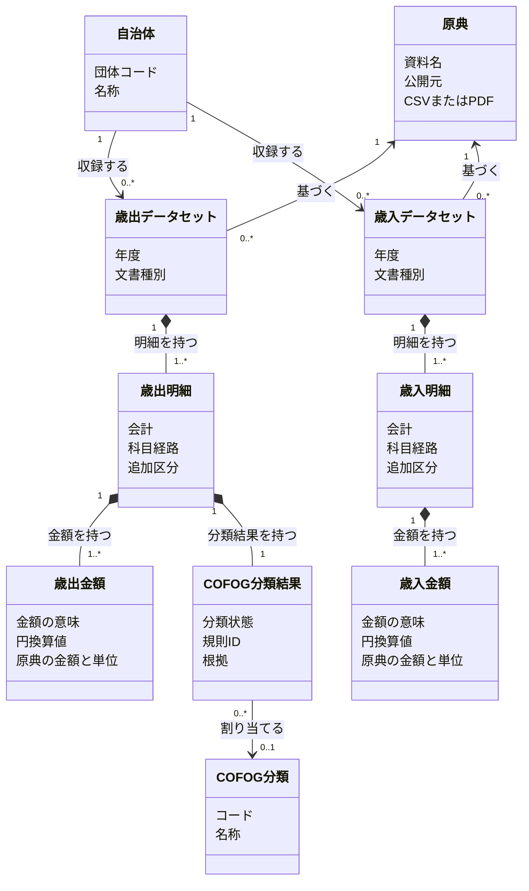

# 歳出と歳入を別の明細として理解する

この図は、歳出・歳入を分ける方針を反映したドメインモデルである。クラスは財政上の概念や値を表すため、クラス数とテーブル数は一致させる必要がない。現行コードはまだ共有の `fiscal_lines` を使っており、この境界への移行は未実装である。

## 自治体の資料から、歳出と歳入を別々に読む

- 自治体は、年度・文書種別ごとに歳出／歳入データセットを持つ。財政データが未収録の自治体は、どちらも0件になる。
- 一つのデータセットは一団体・一年度・一文書種別・一原典版を対象にする。原典の実体と、その原典から収録する範囲を区別する。同じ PDF に歳出と歳入が載る場合は両データセットが同じ原典を参照し、別の資料で公開された場合は別の原典を参照する。
- 当初予算と決算は別データセットにする。同じ科目経路でも、別資料の明細を同一の明細にまとめない。将来の補正予算も、号数・時点・金額の意味を別途定める。
- 歳出の金額と歳入の金額は別の型にする。歳出の実績は支出済額、歳入の実績は収入済額である。原典に複数の金額段階があれば保持し、異なる段階を合算しない。
- COFOG の分類結果は歳出明細だけが持つ。状態は `assigned / unclassifiable / out-of-scope` とし、`assigned` のときだけ分類コードを一つ参照する。歳入モデルには COFOG の属性も `not-applicable` の行も作らない。
- 規則 ID は分類を決めた風土記の規則を指す。規則なしの場合や会計間移転の個別宣言で判断した場合は、分類規則の参照を必須にせず根拠を残す。

黒い菱形は、その明細や金額が所属するデータセット／明細の一部であることを表す。普通の矢印は参照を表す。例えば同じ COFOG 分類を、複数の歳出明細の分類結果が参照できる。

## 明細に含まれる値の意味を分ける

科目経路と追加区分は、別々に検索・照合できる明細の値である。歳出／歳入の両方で同じ値の構造を使えても、科目の意味や同一性を両者で共有しない。

- **会計**: 団体内の会計コードと名称。例は `14 / 介護保険特別会計`。他団体の同じコードを同じ会計とみなさない。
- **科目経路**: 団体の科目体系に沿った順序付きのコード・名称。例は会計14 → 款3 → 項1 → 目3 → 大事業2 → 節12（委託料）。COFOG の階層とは別である。
- **追加区分**: 経路だけでは明細を区別できない原典の区分。例は `org = 400300 / 福祉保健部・高齢障がい課`、`fiscal_class = 0 / 現年度`。団体の宣言した区分だけを使い、汎用属性置き場にはしない。
- **名称と出所**: 科目や追加区分の名称を、原典由来か風土記の判断か区別する情報。検索用に名称を集めた表は、この情報から生成する検索用の派生表であり、独立した財政上の実体ではない。

階層経路を保存する `hierarchy` は、明細の経路にある各段を展開したものとして読む。`dimensions` は、その経路に追加する区分として読む。図では明細の属性にまとめ、検索用の保存形式とは分けて考える。

## 予算と決算の比較は、資料の違いを消さずに行う

予算書と決算書の明細の対応は、自動の同一視ではなく別途確かめる関係である。現在の収録では、決算書由来の明細にも予算現額などを保持する。決算の提供用明細を実績一金額にする変更や、補正・繰越等から予算を復元するモデルは [予算変更履歴の PRD](prd/fiscal-budget-history/prd.md) の対象であり、このクラス図で実装済みとして扱わない。

## 財政上の概念と公開の管理を分けて読む

原典は入力、データセットと明細はその資料から収録した財政データ、COFOG 分類結果は風土記の判断である。これらを固定する自治体データ版、配布物、公開一覧は [版・公開の設計](design-doc-jurisdiction-versions.md) で扱う。年度・科目の意味を、公開 ID やファイル配置から定義しない。

DB への投影でも歳出明細と歳入明細を分け、金額・科目経路・追加区分・検索用名称はそれぞれの明細に紐づける。団体マスタ・出典の記録・収録情報・自治体データ版・公開一覧は共通に保つ。共有の明細表に例外的な COFOG 属性を詰める設計を、この境界に合わせて改める。DB/API/dbt の具体的な改訂はまだ行っていない。
