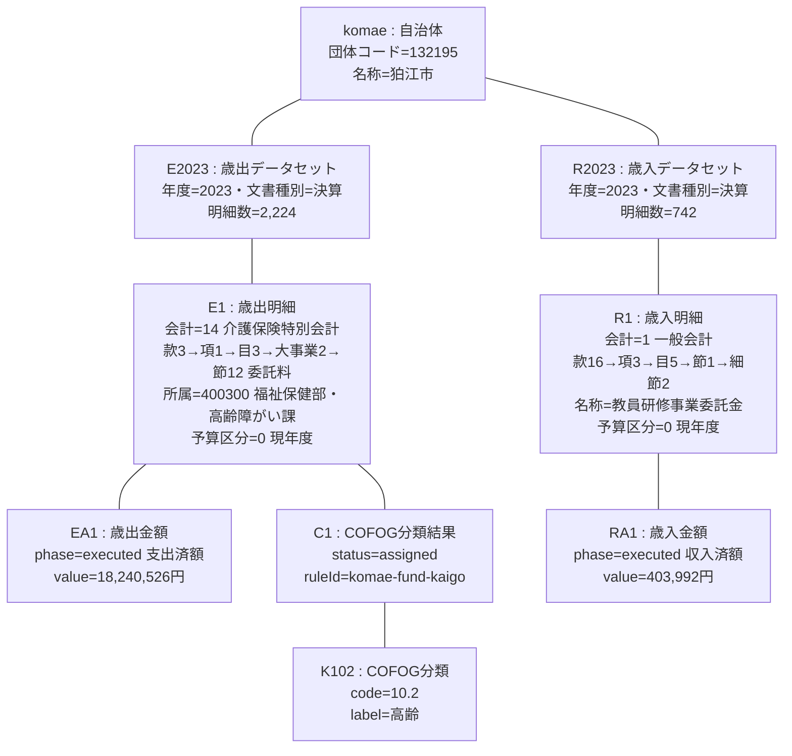

# 狛江市2023年度決算を実際の値で読む

[クラス図](fiscal-domain-model.md) の型に対し、具体的な値を持つオブジェクトを示す。値はローカル検証済み候補 `r-ef2876c018b98bd1818deebc7e9a96ea` の生成データから抜粋し、歳出・歳入を分けるモデルに対応づけた。現行 DB の明細モデルの分離は未実装である。

箱の見出しは `オブジェクト名 : 型`、下段はそのオブジェクトの値である。線はオブジェクト間の関連を表し、処理順ではない。明細は一件ずつ、金額は実績だけを抜粋する。

図は明細・金額・分類の関係を抜粋し、原典オブジェクトは省略する。原典版は本文末尾の SHA-256 で特定する。分類に使った規則 ID は分類結果の属性として示す。

- E1 は歳出原典の2181行目、R1は歳入原典の85行目に対応する。二明細は別の会計・科目であり、互いに対応する支出・収入としては扱わない。
- E1 は予算現額18,489,000円、R1 は予算現額509,000円も持つ。図は実績だけの抜粋であり、他の金額段階を削除したわけではない。R1 の原典の予算現額は509千円で、円換算した値と単位を区別する。
- E1 の中事業・小事業・細節・細々節、R1 の細々節は未使用を表すコード0のため図では省略する。保存時には団体の宣言に従って保持する。原典に名称のない階層を推測で埋めない。
- R1 の所属コードは110200で名称はない。款・項・目の名称には別の決算PDFから解決したものも含み、名称の出所を保持する。
- C1 が分類コードK102を参照し、分類に使った規則 ID `komae-fund-kaigo` を持つ。規則の定義は Git の `pipeline/dbt/seeds/fiscal/cofog_rules.csv` に置き、DB の規則マスタは作らない。R1にはCOFOG分類結果を付けない。
- 本例ではE1・R1の連結判断はともに `retained`（保持）である。会計間移転で `eliminated`（消去）となる歳出・歳入もあり、COFOGとは独立した判断として各明細に持つ。個別に根拠を確かめず、一方の消去判断を他方へ転用しない。

歳出原典の SHA-256 は `26c342106b395d8a459076e137129d98a97b8cb15b97adc29d35a3638143814d`、歳入原典は `14d5d00db95a9d81de10f72c4792c9dc06f3d7ad17209b13893edbcf5012533b`。例の明細 ID の末尾はそれぞれ `002c230c15ec60ce`、`00171d736394910c` である。図中の E1・R1 は読みやすくするための説明用の名前であり、実際の ID を置き換えるものではない。
