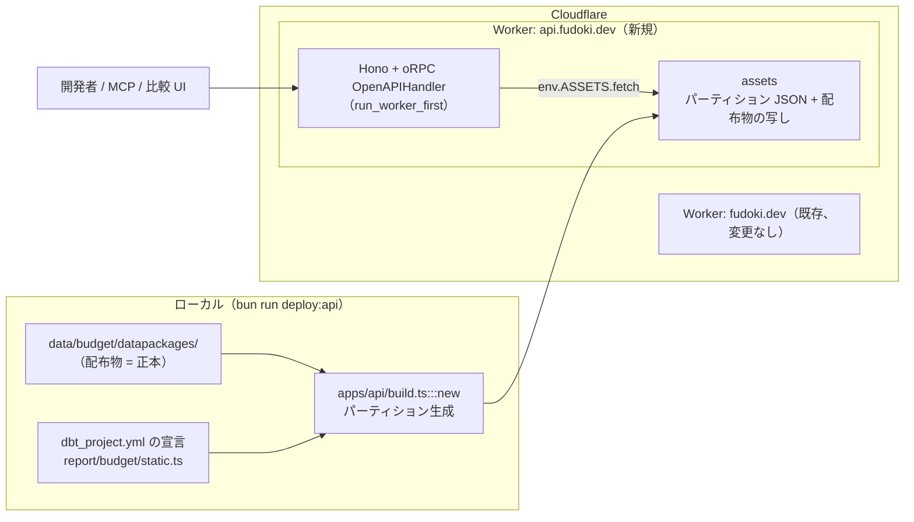

# budget-api: 配布物を Cloudflare Worker + oRPC で API として公開する

## Objectives

- **Goal**: 予算の配布物（現在2団体）をフィルタ付きで取得できる読み取り専用 API を `api.fudoki.dev` で公開する。
  そのために workspace `apps/api` を新設し、oRPC の contract-first で定義したルータを Hono に載せた Cloudflare Worker と、配布物から API 用のパーティション JSON を生成する build step を作る。
  API の形（リソース名、フィルタ、ページング）は Google の API 設計規約 AIP に倣う。
  OpenAPI ドキュメントは contract から生成して同じ Worker で配る。
- **Not goal**: 集計エンドポイント、認証、rate limit、比較 UI、MCP サーバは作らない（[PRD](./prd.md) の Non-Goals）。
  D1 等のデータベースは導入しない（理由は Alternatives Considered）。
  contract の `packages/` への切り出しはしない（consumer が現れた時点で行う。[decision.log の決定12](./decision.log)）。

## Background

前提は [PRD](./prd.md) と [decision.log](./decision.log)。

現在、利用者が団体、年度、分類（COFOG）で予算明細を絞り込むには、リポジトリから配布物をダウンロードして手元で処理するしかない。
この絞り込みをサーバ側で提供するのが本設計の対象である。
要件の詳細は PRD にあり、ここでは設計判断に効く制約だけを挙げる。

- **正本のデータはリポジトリ、API は派生物**（[AGENTS.md](../../../AGENTS.md) の設計方針3「運営者が消えても止まらない形にする」）。
  API が持つデータは配布物 `data/budget/datapackages/` の写しであり、独自の状態を持ってはならない。
- **ホスティング側でビルドできない**。
  配布物の生成に dbt が要るため、Git 連携ビルドは採れない。
  既存の fudoki.dev（`apps/web`）は「手元で組んでから `wrangler deploy` で投げる」運用をしている。
- **既存の fudoki.dev はアセットだけの Worker**。
  `main` を持たず、サーバ側で何もしない設計を `apps/web/wrangler.jsonc` で宣言している。
- **データ規模**: 配布物は現在 15MB、歳出明細は約4.6万行（2026-08-24 実測）。
  62団体 × 9年度への外挿は CSV 1.1GB（AGENTS.md）で、現設計はそこまでを守備範囲にしない。
- **階層だけでは行が一意にならない団体がある**。
  狛江市は所属と予算区分を含めて初めて一意になり（`dbt/dbt_project.yml` の `budget_extra_key_columns`）、階層の宣言（`budget_levels`）も dbt 側にある。
  配布物の CSV は予算段階を行に展開しており、1行が（budget_line_id, phase_id）で識別される。
- **配布物の cofog リソースが持つ分類コードは division（大分類）だけ**（2026-08-24 に datapackage.json で確認）。
  group 以下の下位分類は存在しない。
- **団体をまたいで正本を揃えない**。
  階層の構成が団体ごとに違い、揃えることが判断になる。
  PRD はこれを受けて、横断応答を「共通の最小軸」に限定した。
- **oRPC** は RPC と OpenAPI を両立するフレームワークで、**contract**（`@orpc/contract` で書く、API の入出力を定める型付きの契約）から OpenAPI 3.x の spec を生成できる。
  公式に Hono adapter があり（middleware から `handler.handle()` を呼ぶ形）、zod 4 から spec を生成するには `@orpc/zod/zod4` の `ZodToJsonSchemaConverter` を使う。
  参照 UI と spec は `OpenAPIReferencePlugin` が配り、既定パスは `/` と `/spec.json`（2026-08-24 に公式ドキュメントで確認）。
- **AIP**（[aip.dev](https://google.aip.dev/)）は Google の API 設計規約。
  本設計ではリソース名（AIP-122）、標準メソッド List / Get（AIP-131、AIP-132）、ページング（AIP-158）、コレクション横断の読み取り（AIP-159）、フィルタ（AIP-160）を参照する。

## System Overview

キーとなるアイディアは2つ。

1. **DB を置かず、build 時に「問い合わせの形」に合わせて分割した JSON を Worker の静的アセットに置く**。
   以後この分割済み JSON を**パーティション**と呼ぶ。
   Worker はリクエストごとに該当パーティションだけを assets binding から読んでフィルタする。
   deploy 1回で API とデータが同時に更新され、リポジトリとの同期ずれが構造的に起きない。
   deploy は `apps/web` と同じく手元から行う（Background の制約による）。
2. **oRPC の contract を唯一の API 定義にする**。
   実装（ルータ）も OpenAPI ドキュメントも contract から導出し、手書きの spec を持たない。
   将来の MCP サーバと比較 UI は、この contract を import して型付きクライアントを得る。
   内部アセットを直接公開しないため、Worker を asset より先に実行する（Detailed Design の「アセットの公開範囲」）。



新規、変更、維持の区別:

- **新規**: `apps/api`（Worker 本体、oRPC contract、パーティション生成の build step）、root の `deploy:api` スクリプト
- **変更**: root `package.json` の scripts と、`report/budget/static.ts` / `report/budget/schema.ts`（注意事項に `category` フィールドを足す。詳細は「応答スキーマ」）
- **維持**: `apps/web`（アセットだけの Worker のまま。注意事項の型変更は表示に影響しない）、配布物の生成パイプライン、`data/` の構造

エンドポイントは PRD の問いと1対1に対応させる。

| PRD の要求 | エンドポイント |
|---|---|
| 収録団体の一覧と発見経路 | `GET /v0/jurisdictions`（List） |
| 団体ごとの年度、注意事項、分類率 | `GET /v0/jurisdictions/{jurisdiction}`（Get） |
| 団体単位の明細（団体固有階層つき） | `GET /v0/jurisdictions/{jurisdiction}/budgetLines`（List）と `GET /v0/jurisdictions/{jurisdiction}/budgetLines/{budgetLine}`（Get） |
| 横断の歳出明細（共通の最小軸） | `GET /v0/jurisdictions/-/budgetLines`（AIP-159 のワイルドカード親） |
| 配布物のパススルー | `GET /v0/datapackages/{jurisdiction}/{file}`（カスタム。リソースモデルに載せない） |
| OpenAPI ドキュメント | `GET /openapi.json`（`OpenAPIReferencePlugin` の配信パスを既定から変更して充てる。参照 UI は自作しない） |

## Detailed Design

このセクションでは、判断が要る7点（AIP への倣い方、パーティションの切り方、応答スキーマ、ページング、revision の記録、アセットの公開範囲、build 時の検査）と、異常系の応答を説明する。
自明な実装詳細（Hono のルーティングの書き方など）は扱わない。

### AIP への倣い方と、意図的な逸脱

倣う点:

- **リソース名**（AIP-122）: コレクションは複数形の lowerCamelCase（`jurisdictions`、`budgetLines`）。
  各リソースは `name` フィールド（例: `jurisdictions/132195/budgetLines/132195:2018:expenditure:settlement:ad1c...`）を持つ。
  リソース id は配布物の識別子（団体コード、budget_line_id）をそのまま使い、API が独自の id を発行しない
- **標準メソッド**: List と Get のみ（読み取り専用のため）
- **横断**（AIP-159）: `jurisdictions/{jurisdiction}/budgetLines` の1本の route で、`{jurisdiction}` がワイルドカード `-` を受ける（`-` 専用の route を別に切らない。AIP-159 の明示要件）
- **ページング**（AIP-158）: `pageSize` / `pageToken` を受け、`nextPageToken` を返す。
  `pageSize` は未指定と 0 なら既定値（1,000）、上限（1,000）超は上限へ丸めてエラーにしない、負数は 400。
  継続取得の途中で `pageSize` だけを変えることは許す（このため pageToken のフィルタハッシュに pageSize を含めない）。
  最終ページは `nextPageToken` を省略する
- **フィルタ**（AIP-160）: List は `filter` パラメータで絞り込む。
  使えるフィールドは `fiscalYear`、`direction`、`phase`、`cofog.division` に限定し、OpenAPI の説明に文法とフィールドを列挙する。
  `phase` は `amounts[].phase` に対する仮想フィールド（いずれかの段階が一致したら真）であることも spec に書く

逸脱する点（いずれも理由つきで spec に明記する）:

- **filter の文法は AIP-160 の部分集合**。
  `=` の比較と `AND` だけを受け（例: `fiscalYear = 2023 AND cofog.division = "09"`）、`OR`、否定、大小比較は実装しない。
  v0 の期限に対してパーサとエラー系を最小にするため
- **ワイルドカード親の List では `filter` の `cofog.division` を必須にする**。
  AIP はフィルタを任意とし、AIP-132 は親以外の必須入力を増やさないことを推奨するが、パーティション設計（後述）が division 単位のため、無指定の全件走査を受けない。
  全件が欲しい利用者にはパススルーの CSV がある
- **ワイルドカード親の応答は共通の最小軸のみ**（後述の `CrossJurisdictionLine`）。
  AIP-159 は同一リソース型を想定するが、団体固有の階層を横断応答に含めない判断（PRD）を優先する
- **revision をまたいだ pageToken には 410 を返す**（AIP-158 は無効な token に 400 を推奨）。
  「deploy をまたいで結果が黙って欠ける」ことを、通常の入力誤り（400）と区別して利用者に見せるため。
  contract には専用のエラー（STALE_PAGE_TOKEN、status 410）を定義し、クライアントの自動リトライ対象にしない
- **リソース id が AIP-122 の推奨文字から外れる**。
  budget_line_id は `:` を含むが、配布済み識別子の同一性維持を優先してそのまま使う
- **Get の URI 変数が2つある**（AIP-131 は `name` 1つを原則とする）。
  oRPC contract の Get 入力は `{jurisdiction, budgetLine}` の2フィールドで、`name` 文字列を1引数で渡す形にはしない。
  HTTP 利用者は `GET /v0/{name}` の連結で同じ URL に到達できる
- **エラー本文の形式は oRPC の既定**を使い、google.rpc.Status（AIP-193）には合わせない。
  oRPC のクライアントとの整合を優先する

### パーティションの切り方: 問い合わせ1回 = 読むファイル1つ

Worker の CPU 時間には上限があるため（Caveats 1）、リクエストごとに配布物の CSV 全体（最大 9.3MB）を読む形を避け、1リクエストで読む量を問い合わせに必要な範囲だけに抑える。
build 時に次の3種類へ分割する。

- `meta/jurisdictions.json`: 団体一覧。各団体の収録年度、注意事項、分類率、datapackage への参照。
  注意事項と分類率の入力は既存の宣言（`report/budget/static.ts` の団体別宣言と配布物の cofog リソース）から読み、二重管理しない
- `lines/{団体}/{年度}-{direction}.json`: 団体単位の明細。最大は狛江市の1年度歳出で、CSV 1.5MB 相当
- `cofog/{division}/all/{chunk}.json` と `cofog/{division}/{年度}/{chunk}.json`: 横断応答の元。共通の最小軸のみ

横断は「問い合わせの型ごとに、ページ境界に合わせた chunk」を build 時に作る。
受ける問い合わせは division 指定（全年度）と division + 年度指定の2型なので、その2系列を両方生成する（データは重複するが、どちらも build 時の複製でありサイズは小さい）。
chunk は 1,000 行ごとに切り、系列内を `name` 昇順に整列してから分割する。
1リクエストで走査するのは最大1 chunk で、継続取得は次の chunk を1ファイル読むだけで済み、複数年度ファイルの読み直しやマージが要らない
（`pageSize` が 1,000 未満のときや実行時フィルタが効いたときは、1 chunk が複数ページに分かれたり、ページが `pageSize` に満たない疎なページになったりする）。
`hierarchy` の階層順は、配布物だけからは導けないので `dbt/dbt_project.yml` の `budget_levels` を build の入力にする（`report/budget/build.ts` が既に同じ読み方をしている）。

### 応答スキーマ: expenditure / revenue リソースの全 CSV 列を、構造を保ったまま返す

団体ごとに列が違う明細を `Record<string, string>` で運ぶと、型検査が効かず列の増減に気づけない（AGENTS.md が実際に踏んだ事故）。
かといって団体ごとに応答型を分けると、契約が団体の数だけ増える。

明細1行を次の形に固定する。
正本リソース（expenditure / revenue）の CSV 列を落とさない（落とすと「団体の形のままの明細」という PRD の AC と、build 時の多重集合一致の検査が成立しない）。
判断リソース（cofog / project_names）は List 応答に全列を載せることまでは要求されていないため、`judgments` には応答に要る列だけを載せる。

```ts
type BudgetLine = {
  name: string  // AIP-122 リソース名: jurisdictions/{団体}/budgetLines/{budget_line_id}
  budgetLineId: string
  fiscalYear: string
  direction: 'expenditure' | 'revenue'
  hierarchy: { level: string; code: string; label: string | null }[]   // 款→項→目→… 順
  dimensions: { name: string; code: string; label: string | null }[]   // 階層以外の同一性の軸（狛江市の所属、予算区分）。無い団体は空配列
  amounts: {
    phase: string          // phase_id
    phaseLabel: string
    amount: number         // 円に正規化した値（配布物の value）
    sourceAmount: number   // 原典の額面
    sourceAmountUnit: string
    sourceRow: number      // 原典 CSV の行番号
  }[]
  judgments: {  // fudoki の判断。正本由来の上記フィールドと構造で区別する
    cofog: { status: string; division: string | null; consolidation: string; decidedAtLevel: string | null; ruleId: string | null } | null
    projectName: string | null
  }
}
```

- `hierarchy` と `dimensions` を分けるのは、前者が親子関係を持ち後者が持たないため。
  団体差は「要素数と名前の違い」として値に現れ、型は全団体で同一になる
- `amounts` が配列なのは、配布物が予算段階を行に展開しており、同じ budget_line_id の段階群を1明細にまとめて返すため。
  原典の額面と単位、行番号まで持つことで、応答から配布物の行を復元できる
- `judgments` を別オブジェクトにするのは、PRD の「正本と判断の区別」を応答の構造で表すため

横断応答（ワイルドカード親）は共通の最小軸のみの別型にする。

```ts
type CrossJurisdictionLine = {
  name: string
  jurisdictionId: string
  budgetLineId: string
  fiscalYear: string
  amounts: { phase: string; amount: number }[]
  cofog: { status: string; division: string | null; consolidation: string }
}
```

`hierarchy` を含めない理由は PRD のとおり（揃えることが判断になる）。
元明細へは `name` をそのまま Get（`GET /v0/jurisdictions/{jurisdiction}/budgetLines/{budgetLine}`）に渡して1回で辿る。
ページを走査させない。

団体詳細（`GET /v0/jurisdictions/{jurisdiction}`）の分類率と注意事項も契約で型を固定する。

```ts
type ClassificationRate = {
  fiscalYear: string
  amountPhase: string  // 金額ベースの計算に使った予算段階
  statuses: Record<'assigned' | 'unclassifiable' | 'outOfScope', { lines: number; amount: number }>
}
type Caveat = {
  category: 'coverage' | 'phaseSemantics' | 'classification' | 'sourceAndLicense'  // PRD の必須4カテゴリ
  body: string
}
```

分類率の分母と分子は歳出（`direction = expenditure`）に限定する（PRD の定義。配布物の cofog リソースは歳入の行も持つので、そのまま数えると分母が膨らむ）。
`category` は `report/budget/static.ts` の注意事項に新設するフィールドで、build が自由文から推定することはしない（既存の `{topic, body}` に `category` を足し、`report/budget/schema.ts` の型も追随させる）。
build 時に、全団体が4カテゴリすべての注意事項を持つことを検査する（欠けたら build を失敗させる）。

### ページング: 条件に結び付いたトークンで「続きがあること」を必ず応答に出す

PRD は「結果が途中で切れたことに利用者が気づけない状態を作らない」を要求する。
List の応答を次の共通レスポンス形式に固定する。

```ts
type ListBudgetLinesResponse =
  | { scope: 'jurisdiction'; budgetLines: BudgetLine[]; nextPageToken?: string; revision: string }
  | { scope: 'crossJurisdiction'; budgetLines: CrossJurisdictionLine[]; nextPageToken?: string; revision: string }
```

- 通常親とワイルドカード親で返るリソース型が違うため、応答は `scope` を discriminator に持つ union として contract に明示する（OpenAPI には `oneOf` として出る）。
  型付きクライアントが `scope` で安全に narrow できる
- `nextPageToken` の省略が「最後まで返した」を意味する（AIP-158 の形）
- `pageToken` は不透明な文字列（base64url）。
  中身にはトークン形式の版、revision、パーティション系列と chunk 番号、正規化したフィルタのハッシュ、chunk 内オフセットを入れる。
  フィルタのハッシュを入れるのは、別条件のトークンを流用されたときに位置だけが再利用されて行が欠落・重複する事故を防ぐため
- 並び順は `name` の昇順で固定する（chunk の前提になる順序を契約にする。横断 chunk は build 時にこの順で整列済み）
- オフセットは「フィルタ適用前の chunk 内の行位置」を指す。
  実行時フィルタ（`phase` など）で該当が減っても、`nextPageToken` を省略するのは系列を最後まで走査したときだけとする。
  フィルタ後の応答が0件でも、未走査の範囲が残っていれば `nextPageToken` を返す（省略すると「最後まで取得できる」という PRD の要求が破れる）
- `phase` フィルタが一致した明細は、`amounts` を全段階のまま返す（一致した段階だけに削らない。明細の形を問い合わせ条件で変えない）
- 復号できないトークン、フィルタ不一致、範囲外オフセットは 400、revision 不一致は 410

### revision: build 時に git commit を記録し、応答とアセットの両方に出す

- build step が `git rev-parse HEAD` を `meta/build.json` に記録する。
  作業ツリーが dirty なら build を止める（どの commit の配布物か言えなくなるため）
- JSON のデータ応答とメタデータ応答は body の `revision` フィールドで返す
- パススルー（CSV / datapackage.json）は body を変えられない（バイト同一が要件）ので、ヘッダで返す。
  `X-Fudoki-Revision: <git sha>` と `ETag: "<sha256>"` を付け、OpenAPI にもヘッダとして定義する。
  HEAD メソッドを受け、巨大 CSV の同一性確認を本文なしでできるようにする
- パススルーの本文は配布物ファイルをバイト同一で assets へコピーしたもの。
  「リポジトリの該当 revision のファイルと一致」（[PRD の Acceptance Criteria](./prd.md)）が、変換ゼロであることによって成立する。
  一致の検査は build 時に SHA-256 の突合で行う

### アセットの公開範囲: Worker を先に実行し、内部パーティションを公開しない

Cloudflare の既定は asset 優先（URL がアセットと一致すれば Worker を実行せず返す）。
このままだと `lines/` 等の内部パーティションが契約外の URL として公開され、「contract が唯一の API 定義」が崩れる。

- `wrangler.jsonc` で `run_worker_first: true` を宣言し、すべてのリクエストを Worker が受ける
- 外部へ返すのは contract のルートとパススルーだけ。
  パススルーの `{file}` は datapackage が宣言する resource path の集合と `datapackage.json` に対する allowlist で解決し、リクエスト入力を `ASSETS.fetch` のパスへ直接連結しない（パストラバーサルと契約外公開の防止）

### build 時の検査: 生成物は commit せず、配布物との不整合があれば build を失敗させる

パーティション JSON は `apps/web` の `pipeline.json` と同じ扱い（ローカル生成物、gitignore）。
`deploy:api` は dbt から通し、古い生成物を黙って上げない（`deploy:web` と同じ理由）。

build 時に次を検査し、1つでも落ちたら deploy させない。

- パーティションの全行から（budget_line_id, phase_id）と全公開フィールドを復元すると、配布物の expenditure / revenue CSV と多重集合として一致する（行の取りこぼしと重複、列の欠落の検査）
- 横断 chunk の全系列で、行数と金額の合計が、配布物の cofog リソースと明細の該当行から計算した値に一致する
- 分類率は団体 × 年度ごとに、分母（`direction = expenditure` の一意な budget_line_id の件数）と3状態の内訳の合計が一致し、金額側も `amountPhase` に限定した歳出総額と3状態の合計が一致する
- 全団体の注意事項が必須4カテゴリを持つ
- パススルー対象ファイルの SHA-256 が配布物と一致する

### 異常系の応答

契約（OpenAPI）に次をすべて定義し、統合テストで実応答と突き合わせる。

| 状況 | 応答 |
|---|---|
| 該当0件 | 200。空配列。未走査の範囲が残っていなければ `nextPageToken` を省略 |
| filter の文法誤り、未対応フィールド、不正な列挙値 | 400 |
| 復号できない pageToken、条件不一致、範囲外オフセット | 400 |
| revision をまたいだ pageToken | 410 |
| 未収録の団体、存在しない budgetLine、契約外の file | 404 |
| build には存在するはずのアセットが読めない | 500 |

CORS は `Access-Control-Allow-Origin: *`、許可メソッドは GET / HEAD / OPTIONS、credentials なし。
`Access-Control-Expose-Headers: X-Fudoki-Revision, ETag` を付ける（無いとブラウザの JavaScript がパススルー応答の revision を読めない）。
公開データの読み取り専用 API なので、これ以上を制限する理由が無い。

## Tasks

1. `apps/api` の scaffold（wrangler.jsonc（`run_worker_first`、custom domain の routes 宣言）、Hono + oRPC の起動、`/openapi.json`）。
   依存（hono、@orpc/contract、@orpc/server、@orpc/openapi、@orpc/zod）は AGENTS.md の規約どおり exact ピン + cooldown 7day で入れる
2. oRPC contract の定義（List / Get の各エンドポイント、filter 文法、エラー応答、パススルーのヘッダ）
3. build step（パーティション生成、revision の記録、上記5検査。入力は配布物と `dbt_project.yml` の `budget_levels` と `report/budget/static.ts`）
4. ハンドラ実装（assets 読み込み、filter パーサ、ページング、異常系の応答表）
5. 統合テスト（wrangler の dev 環境で [PRD の Acceptance Criteria](./prd.md) 10項目と異常系の応答表を通す）
6. ステージング deploy で CPU 時間を計測（最大件数の division、最大年度、空結果。Workers Logs で見る）。超過なら Caveats 1 の手を打つ
7. `deploy:api` を root に追加し、api.fudoki.dev へ deploy して公開
8. OpenAPI 参照 UI の表示確認と、v0 実験版であることと識別子の安定性の明記（spec の description）

## Alternatives Considered

データの持たせ方:

| 観点 | パーティション JSON + assets（採用） | Cloudflare D1 | R2 |
|---|---|---|---|
| 運用する状態 | なし（deploy に含まれる） | DB という状態が増える | バケットという状態が増える |
| リポジトリとの同期 | 構造的にずれない | 投入ジョブ次第でずれる | 同期ジョブ次第でずれる |
| クエリの柔軟性 | パーティションに合う形のみ | SQL で自由 | なし（取得のみ） |
| 62団体への拡張 | 静的アセットの上限内なら持つ | 持つ | 持つ |

採用理由: v0 のクエリは「フィルタ付き明細取得」に限定されており（PRD）、SQL の柔軟性を使う要件が無い。
状態を持たないことは設計方針3（止まってもリポジトリが正本）と「手元で組んで投げる」運用に直接効く。
D1 は集計 API や自由な絞り込みが要件に入った時点（v1 以降）で再検討する。

API の公開 URL:

| 観点 | api.fudoki.dev（採用） | fudoki.dev/api |
|---|---|---|
| 既存 Worker への影響 | なし | 「アセットだけ」の宣言を崩し main の追加が要る |
| 障害の波及 | API が止まっても画面は無傷 | Worker 障害が画面と API の両方に及ぶ |
| 管理する Worker 数 | 2 | 1 |
| ドメイン設定 | api サブドメインの追加が要る | 不要 |

採用理由: 既存 Worker の設計宣言を守り、派生物同士を独立に壊せることを、Worker 数とドメイン設定の増加より優先した（[decision.log の決定11](./decision.log)）。
サブドメインは wrangler.jsonc の `routes`（`custom_domain: true`）で宣言でき、DNS と証明書は Cloudflare が管理する（[Custom Domains](https://developers.cloudflare.com/workers/configuration/routing/custom-domains/)。2026-08-24 参照）。

## Caveats

1. **Worker の CPU 時間上限（無料プランは 10ms/リクエストとされる）に、最悪ケースの処理が収まるかは未実測。**
   処理には asset の読み込み、JSON parse、フィルタ、oRPC の出力検証、serialize が含まれ、Cloudflare は大きな payload の parse だけで 10–20ms になり得ると述べている（[Workers Limits](https://developers.cloudflare.com/workers/platform/limits/)。2026-08-24 参照）。
   Tasks 6 のステージング計測で超過したら、次の順で対処する。
   chunk の上限を 1,000 行未満へ縮める、oRPC の出力検証を無効化して build 時検査と統合テストで代替する、有料プランに上げる。
   いずれも contract に影響しない（pageToken が不透明なため）
2. **分類率の金額ベースで使う予算段階が団体で違う**（三鷹市は当初予算のみ、狛江市は複数段階）。
   PRD の定義に従い、`amountPhase` フィールドで明示する。
   段階の選択（狛江市は「予算計」を使う等）は build step の宣言に置き、団体を足すときに必ず書かせる
3. **静的アセットの上限は Worker あたり 20,000 ファイル、1ファイル 25MiB とされる**（[Static Assets](https://developers.cloudflare.com/workers/static-assets/)。2026-08-24 参照、実装時に再確認）。
   chunk 単位（1,000 行）なので1ファイルサイズは当面問題にならないが、build 時に chunk サイズの上限検査を置く。
   62団体 × 9年度へ伸ばすときは、all と年度別の二重系列を含む総ファイル数を見積もり直す

## Observability / Monitoring

- Workers Logs で 5xx、CPU 超過（error 1102）、404 の率を見る。
  v0 は実験版なのでアラートは組まず、[PRD の Success Metrics](./prd.md) の判断材料として利用主体とエラー率を区別できる状態だけ作る
- パススルーには `Cache-Control: public, max-age=3600` を付ける（revision はヘッダで判別できるため、キャッシュされても由来は追える）

## Release

- `bun run deploy:api`（dbt → 配布物 → パーティション build → wrangler deploy）を手元から実行する
- 切り戻しの第一手は `wrangler rollback`。
  Cloudflare はコードとアセットを1つの version として deploy し、過去 version へ戻せる（[Rollbacks](https://developers.cloudflare.com/workers/versions-and-deployments/rollbacks/)。2026-08-24 参照）。
  第二手として、直前に配信した revision（応答の `revision` で特定できる）を checkout して `deploy:api` を再実行する
- 公開後、[PRD の Acceptance Criteria](./prd.md) 10項目を本番 URL で通し、結果を decision.log に記録する

## Costs

- Cloudflare Workers: 通常時は月額、年額とも $0（無料プラン。10万リクエスト/日まで。[Pricing](https://developers.cloudflare.com/workers/platform/pricing/)。2026-08-24 参照）。
  CPU 時間の計測の結果、有料プランへ上げる場合は月額 $5、年額 $60（従量分を除く）
- ドメイン: fudoki.dev の既存管理内（api サブドメインの追加のみ、追加費用なし）
