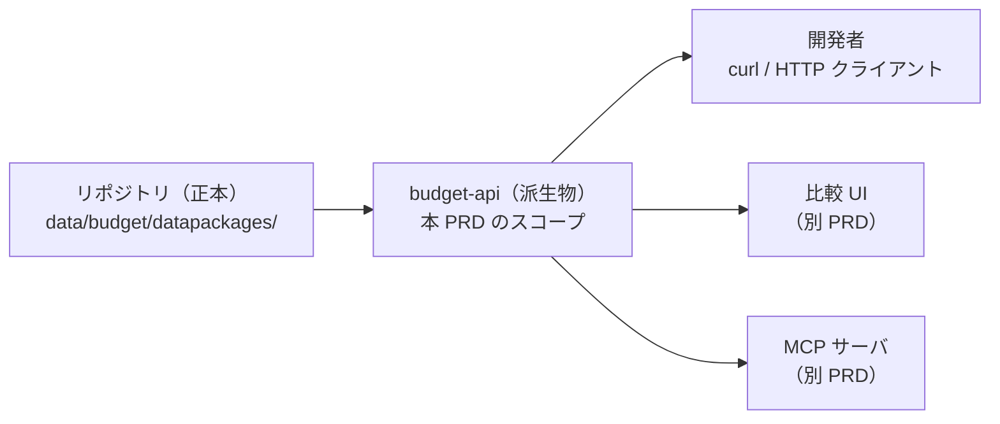

# PRD: budget-api

fudoki の**配布物**（パイプラインが生成する、団体ごとの Fiscal Data Package。① 予算）を HTTP API として公開する。

## Problem

配布物はリポジトリに CSV と datapackage.json で置かれている。
GitHub 上のファイルなので HTTPS で個別取得はできるが、次の利用は成立していない。

- 開発者が「COFOG 09（教育）に該当する明細を収録全団体から引く」のような団体横断の絞り込みを、サーバ側で行えない。
  ファイル全体をダウンロードして手元で DuckDB 等を回すしかなく、AGENTS.md が「横断の問い合わせは API 側の仕事」と位置づけた API がまだ無い
- 配布物の構造（どの団体があり、どのリソースにどの列があるか）を、機械可読な単一の契約として参照できない。
  利用者はリポジトリのディレクトリ構成と各 datapackage.json を自力で辿ることになる
- 比較 UI や AI エージェント向け MCP サーバが共通して参照できる API が無い

加えて、API には 2026-08-30 という公開期限がある。
Open Data Hackathon の提出フォームに「API と MCP サーバを提供」と現在形で書いており、First Stage 収録までに API が動いていることが提出時の約束になっている。

この段階では、API の URL と応答スキーマを固定しない。
2団体しか収録していない段階で固定すると、その2団体に過適合するためである。
固定するのは、配布物が既に持つ不変条件（既存識別子、正本と判断の分離、出典の追跡）を API が壊さないことであり、URL と応答スキーマは v0 の利用を通じて検証する。

## Overview

配布物を読み取り専用の HTTP API として公開する。
API は派生物であり、正本のデータはリポジトリのまま動かさない（設計方針3）。
API が停止しても、利用者はリポジトリから配布物を取得できる状態を維持する。

API が答える問いは2種類に分ける。

- **横断の問い**：団体をまたいで歳出明細を絞り込む。
  応答は団体に依存しない共通の最小軸だけを持ち、団体固有の階層（三鷹市の事項、狛江市の大事業など）は含めない。
  団体ごとに異なる科目体系を1つの応答形へ変換すると、API が配布物に無い判断を加えることになるためである。
  歳出に限るのは、比較軸である COFOG が歳出の分類だからである。
  ただし、横断結果の各明細からは、後述の団体単位の問いを使って団体固有の元明細へ API 経由で辿れる。
  横断結果だけでは「何への支出か」が読めず、下流の UI や MCP サーバが成立しないためである
- **団体単位の問い**：1団体の明細（歳出と歳入）を、その団体の形のまま引く。
  団体固有の階層はここで返す。
  応答には**正本**（市が公表した事実と1対1のリソース）と**判断**（fudoki が加えた解釈。COFOG と事業名）の両方を含め、どちら由来かをリソースの別で判別できるようにする

どちらの応答でも、配布物が持つ次の性質を落とさない。

- **識別子の同一性**：明細は配布物の既存識別子（budget_line_id と**予算段階**（同じ予算行の金額が持つ段階。当初予算、執行額など））を無変換で持ち、元リソースの行へ一意に戻れる。
  API が独自の id を発行したり、予算段階を削除して1行に統合したりしない
- **正本と判断の区別**：金額は正本由来、COFOG と事業名は fudoki の判断であることが応答から判別できる
- **出典の帰属**：応答から団体ごとの出典、ライセンス、改変表示へ辿れる。
  団体をまたぐ応答が、団体ごとに異なるそれらを1つに統合しない（配布物で団体をまたぐ結合ファイルを作らないのと同じ理由）
- **分類状態と連結状態の明示**：COFOG の割当は部分的で、明細ごとに割当済み、分類不能、対象外の状態を持つ。
  COFOG で絞った結果に含まれない明細が「該当なし」なのか「未分類」なのかを利用者が区別できるよう、分類の状態と割合を API が返す。
  また会計間の繰出と繰入による二重計上を利用者が避けられるよう、分類状態とは独立の連結状態（配布物の cofog_consolidation）も応答に含める
- **途中終了の明示**：1つの問い合わせ条件に対して、結果集合を最後まで取得できる。
  応答が複数回に分かれる場合は、未取得の結果が残っていることとその取得方法を応答に示し、結果が途中で切れたことに利用者が気づけない状態を作らない

### Goals

- 開発者が clone せずに、フィルタ付きで予算明細を取得できる。
  団体単位の問いのフィルタ軸は団体、年度、歳出または歳入の別、予算段階。
  横断の問いはこれに COFOG を加える
- 団体横断の問い合わせに、共通の最小軸だけを持つ歳出明細で答え、各明細から団体固有の元明細へ API 経由で辿れるようにする
- 配布物（datapackage.json と各リソース）を HTTP でそのまま取得できる
- データとメタデータの応答が、どの時点の配布物（リポジトリの revision）に由来するかを利用者が特定できる
- 収録範囲（どの団体のどの年度があるか）、団体ごとの注意事項、COFOG の分類率を API が返す
- API 定義を OpenAPI ドキュメントとして公開し、利用者とツールが機械可読に参照できる
- API は実験版（v0）と明示して出す。
  URL と応答スキーマは破壊的変更があり得ると公開ドキュメントに書く。
  ただしデータの識別子（budget_line_id 等）は配布物側の契約であり、API の版とは独立に安定させる
- 認証なしの無料公開とする

COFOG の分類率は次のとおり定義する。
分母は歳出明細とし、割当済み、分類不能、対象外の内訳を、団体と年度の組ごとに行数ベースと金額ベースで返す。
行数ベースは一意な budget_line_id の件数で数える（COFOG の割当が budget_line_id 単位のため、予算段階で展開した後の行では数えない）。
金額がどの予算段階のものかは応答に明示する。

団体ごとの注意事項は、少なくとも次のカテゴリを持つ。
収録範囲と欠損（無い年度、無い会計）、予算段階の意味（狛江市の「予算額」は当初予算ではない、など）、分類不能と対象外の扱い、出典と再配布上の制約。

### Non-Goals

- 集計 API は提供しない。
  款別合計や COFOG 別合計のような集計値は返さず、集計は利用者側で行う
- SQL に相当する自由クエリは提供しない
- UI は本 PRD の対象に含めない。
  既存の fudoki.dev ダッシュボードの API 移行も、新しい比較 UI も別 PRD で扱う
- MCP サーバは本 PRD の対象に含めない。
  この API の上に別途作る
- ② 調達と ③ 会議録のデータは対象に含めない。
  本 PRD は ① 予算のみを対象とし、②③ との統合互換性は保証しない
- 認証、API key、有料プランは設けない
- 可用性の保証（SLA）は置かない。
  過負荷対策（rate limit 等）は本 PRD の要件にしないが、将来入れることを妨げない
- 書き込み操作は提供しない
- API を唯一の配布経路にしない。
  配布の正はリポジトリであり続ける

## Glossary

- **配布物**：dbt の package 段と `fdp/build.py` が生成する、団体ごとの Fiscal Data Package。正本と判断の両方を含む
- **正本**：市が公表した事実と1対1のリソース（expenditure / revenue）。原典と突き合わせて検証できる
- **判断**：fudoki が加えた解釈のリソース（cofog / project_names）。正本と別リソースで配る
- **COFOG**：国連の政府機能分類。団体をまたぐ歳出比較の共通軸として fudoki が割り当てる。割当は部分的で、明細ごとに割当済み、分類不能、対象外の状態を持つ
- **連結状態**：会計間の繰出と繰入を集計に含めるかを示す、分類状態とは独立の軸（配布物の cofog_consolidation）
- **共通の最小軸**：団体に依存しない列の集合。団体コード、年度、予算段階、金額、budget_line_id、COFOG の状態とコード、連結状態など。横断応答はこれだけで構成する
- **予算段階（phase）**：同じ予算行の金額が持つ段階（当初予算、執行額など）。狛江市の決算は1行が複数段階を持ち、明細の主キーは（budget_line_id, 予算段階）である

## Acceptance Criteria

- [ ] COFOG の division を指定した問い合わせで、収録全団体の該当する歳出明細が共通の最小軸で返り、結果集合を最後まで取得できる。応答が複数回に分かれる場合は、続きがあることとその取得方法が応答からわかる
- [ ] 横断応答の各行が budget_line_id と親予算への参照を持ち、その予算の明細（団体固有の階層を含む形）から同じ行を特定でき、budget_line_id で配布物の元リソースの行へ一意に戻れる
- [ ] 横断応答から、金額が正本由来で COFOG が fudoki の判断であること、明細ごとの連結状態、および団体ごとの出典、ライセンス、改変表示を辿れる
- [ ] 団体、年度、歳出または歳入の別を指定した問い合わせで、その団体の明細が団体固有の階層を含んだ形で、取りこぼしも重複もなく返り、正本と判断が区別されている
- [ ] 団体を指定して datapackage.json と各リソース（CSV）を取得でき、内容が応答に明示された revision のリポジトリのファイルと一致する
- [ ] データとメタデータの応答から、由来する配布物の revision を特定できる
- [ ] 収録団体の一覧、団体ごとの収録年度と注意事項（前述の必須カテゴリを持つ）、COFOG の分類率（前述の定義による）が API から取得でき、一覧から各団体の datapackage.json（リソース名と schema を含む）へ機械可読に辿れる
- [ ] OpenAPI ドキュメントが公開 URL から参照でき、実際の API の振る舞い（正常な応答、空の結果、不正な入力、未収録団体への応答）がその記載と一致する
- [ ] API が実験版であり URL と応答スキーマに破壊的変更があり得ることと、データ識別子は API の版と独立に安定であることが、公開ドキュメントに明示されている
- [ ] 認証なしで利用できる

## Success Metrics

v0 は「この API の形で下流が成立するか」を検証する版である。
次を確認できたら v1 の設計に進む。

- COFOG division を指定した全団体の歳出明細取得を、公開 API への1つの問い合わせ（継続取得を含む）だけで再現できる
- MCP サーバまたは比較 UI が、リポジトリのファイルを直接参照せず、この API だけから必要な予算明細とメタデータを取得できる
- 既存2団体と構造が異なる団体（階層、予算段階、欠損のパターンが違う団体）を少なくとも1件収録し、共通の最小軸の契約を変更せずに API で扱える
- 2026-08-30 の First Stage 収録時点で、上記の横断の問いに公開 URL で答えられる
