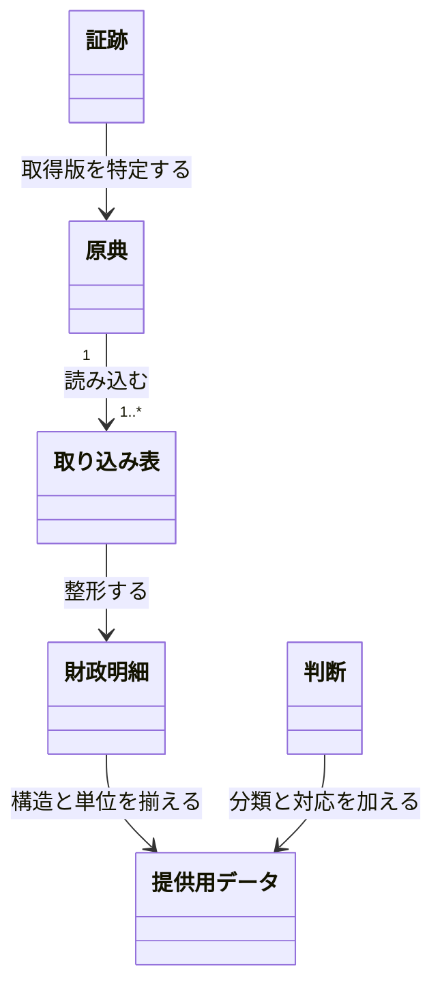

# 原典から比較できる財政データを作る

関連 PRD: [会計構造](../budget-account-structure/prd.md)・[補正予算の収録](../fiscal-budget-history/prd.md)・[ローカル検証画面](../pipeline-verification-view/prd.md)

## Problem

自治体ごとに列・科目・金額単位が異なる原典を、そのまま団体間や年度間で比較できない。細かい金額を構造化するだけでなく、原典由来の値と風土記の分類・対応判断を区別し、原典まで辿れるデータが必要である。

## 導出

Storyの「支出を事業の単位で見る」「団体や年をまたいで比べる」「原典と合っているか確かめる」を、原典から提供用データまでのパイプラインで支える。

## Overview

収録対象のCSV・PDFを取り込み、原典別の整形・中間処理を経て、団体別の提供用CSVを作る。三鷹市・狛江市・昭島市・千代田区・多摩市の採用入力を検査する。固定入力一覧と採用した証跡をGitに置き、原典と取り込み表は非公開R2に保管する。

### Goals

- 原典の行・値・単位・科目経路・収録範囲を保ち、共通の構造と円単位へ揃える。
- 歳出・歳入、当初予算・補正・決算実績を分け、COFOGの分類と会計間移転の判断を説明できる。
- 固定した入力と判断から、同じ提供用CSVを再構築できる。

### Non-Goals

- 公開配布・API・MCP・検索、配布版の公開・反映方式。
- GFSM経済分類、全国一括収録、根拠のない細分化や配賦。
- FDPを唯一の保存契約にすること。FDP整形は任意のローカル処理である。

## Domain Model

CSVの取り込みは原文の復元で検査し、PDF抽出は内部の反復印字や小計・合計の一致で検査する。後者から抽出全体の正しさを保証しない。歳出予算は対応を確認できる範囲で事業×歳出の節へ集約し、不明な節は原典行の粒度を残す。決算は実績額一つを持ち、予算の復元式には入れない。

## Acceptance Criteria

- [x] 運営者が収録対象の固定入力を構築すると、原典の行・金額・単位・階層・出典を辿れる提供用CSVを得られる。
- [x] 利用者が歳出・歳入、予算・決算を別々に読み、分類不能・対象外・会計間移転・収録範囲の制限を区別できる。
- [x] 運営者が同じ固定入力と判断で再構築すると、全提供用CSVのハッシュが一致する。
- [x] 運営者が空のキャッシュへ非公開R2から原典・取り込み表を復元し、採用一覧の全ハッシュを照合して構築できる。

## Success Metrics

- コアアクション: 団体・年度を選び、原典に対応する提供用データを構築・確認する。
- 期待頻度: 月次、収録や判断の変更時。
- 数える対象: 採用した全入力・全団体の構築と再構築。
- 主指標: 原典対応・金額保持・分類検査の失敗0件、再構築したCSVのハッシュ不一致0件。

実行結果は [検証記録](../../monorepo-migration.md) に残す。
