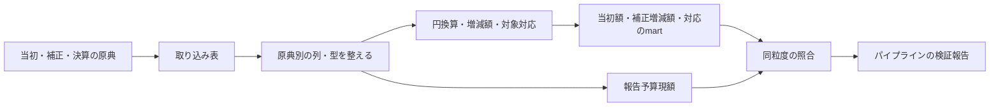

# 補正予算の原典からmartを作る

## Objectives

- **Goal**: 狛江市2023年度一般会計・歳出の原典を取り込み、当初額・補正増減額・決算との対応のmartを作る。決算実績の既存martと合わせ、決算がまだの年度の予算額を当初額＋基準日までの補正増減額で求められるようにする。
- **Not goal**: 繰越・予備費充用・流用の取り込みとmart化。利用者向け機能、配布・保存先、公開運用の設計。全国への一括展開や、資料不足を推定で埋めること。

[PRD](prd.md) に対し、原典の採用からmart生成までの処理を定める。これは実装前の設計である。

## Background

既存の当初予算・決算のモデルを再利用し、空になっている増減額と対応のモデルへ補正予算の実資料を接続する。最初に狛江市を選ぶのは、2023年度決算CSVが既収録で、正式な当初・第1〜7号の補正予算書と、目単位の報告予算現額を確認できたためである。

初回は13-1-1予備費と7-1-2商工業振興費の二目に限る。当初2行、補正3行、既存の決算10明細との集合対応を作る。事業×歳出の節の対応は未確認であり、当初額＋補正額を予算全体の復元額とは扱わない。[原典参照](#確認した原典) に調査済みの値と未確認事項を記す。

## System Overview

取り込みとstagingは原典の論理行との1対1を保つ。円換算、採用行の選択、増減額の導出、当初・補正・決算の明細の対応づけはintermediateで行う。martsで最終的な列と粒度を確定する。

## Detailed Design

### 1. 取得する資料と採用版を宣言する

`sources.toml` の既存の決算宣言 `132195:2023` は維持する。当初と各号は別宣言にし、団体・年度・歳入歳出・会計・文書種別・号数・表・原典の単位を持たせる。PDFは表紙・本文から年度と会計を確認する。必要資料一覧には当初・全7号・照合用の決算を含める。補正予算書に併記された繰越限度等の表は今回の抽出対象に含めない。

同じ号・表の採用原典は一版だけにする。同じhashの再取得は同じ入力として扱う。訂正は訂正根拠、旧版との関係、採用理由を記録して置換し、旧額を追加の補正として足さない。根拠のない異版は採用未確定とする。採用入力のhashと証跡を `sources.lock.json` に固定する。未取得資料は必要資料一覧に残し、取得済みdatasetを捏造しない。

議決日・適用日・公開日・取得日を別に持つ。別の適用日指定がなければ、原案可決を確認した議決日を本設計の適用規約として採り、根拠を記録する。第5号の12月14日提出を12月22日可決と混同しない。専決処分は専決の効力の日を原典で確認する。補正の適用日を確認できなければ、年度末の日付で補完しない。

### 2. 原典の列を保持して取り込む

CSVは既存の文字列取り込みと復元検査を維持する。PDFは文書別のlayoutで、目・節・末端内訳・合計・説明行を区別して抽出する。元の金額文字列・単位・表・物理ページ・bbox・原典hashを保持する。画像の決算PDFを暫定的に転記する場合も、原典行と確認手順を証跡に残す。

PDFの `source_row` は抽出表の固定した行番号であり、PDFページ番号ではない。stagingは原典行と1対1で列名・型を整え、目総額と節内訳をここで合算しない。当初書の「前年度予算額」「比較増△減」は前年との比較なので、当初額には「本年度予算額」だけを採る。

既存 `raw_132195` の全文書globへ別列構造のPDFを混ぜない。決算CSV用sourceを決算入力に限定し、当初・補正は新規 `raw_132195_history` と `stg_132195__budget_history.sql` に分ける。採用datasetはorigin hashと表IDを含めて一意にし、同一号・別表・別版の行を混ぜない。同じPDFの別表を区別するため、必要な新入力に `resource=<表ID>/` を追加する。

`int_fiscal_datasets.sql` の宣言とのJOINは、現状の団体・年度・歳入歳出・文書種別だけでは複数号が衝突するため、採用dataset IDで行う。対象への補正が0行の号も採用資料の一覧に残す。構造・粒度は資料別に保持し、決算CSVの事業・節の経路を目粒度へ上書きしない。

### 3. 金額を円と符号付き増減額へ揃える

千円は1000倍して整数の円に換算する。補正のbefore・delta・afterをすべて保持し、補正増減額に採る額は一つだけにする。

| 原典の列 | 採る増減額 | 確認条件 |
|---|---|---|
| before・delta・after | delta | before + delta = after |
| before・after | after - before | 対象・粒度・単位が同じ |
| deltaのみ | delta | 符号・単位・対象を確認 |
| afterのみ | 確認済み直前額との差 | 直前額に影響する増減がすべて確認済み |
| beforeのみ | 採用しない | 増減を未確認にする |

減額の `△` は負の値とする。beforeと直前の計算値が違っても、差額を新しい補正にしない。補正以外の増減や比較範囲の違いがあり得るため、当初額＋補正額だけでafter-onlyの直前額を確定できるとは限らない。説明できない導出は保留する。原典にdeltaが明示される場合はその額を保持し、照合差を別に残す。

**実測の変換例**：第3号PDF20頁の商工業振興費はbefore=34,553、delta=148,300、after=182,853千円。この一行から `amount_delta=148300000 / effective_at=2023-08-31 / change_kind=supplementary` を作り、採用datasetと予算対象、原典行を参照する。第6号は同じ対象へ-115,000,000円となる。補正後総額182,853,000円と67,853,000円を累積加算しない。

適用日と同日内の順序を保持し、指定日の終わりまでの補正を集計する。号数だけで適用順を決めない。日付不明の補正は原典行と不足理由を残し、時点別の補正小計へ混ぜない。年度開始前には当初額を計上しない。

### 4. 予算対象と決算明細の集合を対応づける

予算対象は団体・年度・歳入歳出・会計・科目／事業経路・追加区分で区別する。確認済みの歳出対象は事業×歳出の節とする。初回の二目は当初の原典行を起点に `line_granularity=origin_line / expenditure_setsu_id=NULL` として保持する。NULL節の複数行をまとめず、目総額を事業や節へ配賦しない。

事業×節に対応できる場合は、当初額と補正の末端行を同じ対象へ集約する。補正は採用dataset・号数・適用日・順序が一致する行だけをまとめる。細節等の経路・円額・原典行は各金額記録の `details_json` に保持し、小計を重ねない。節の適用年度、COFOGと連結判断の一致を確認できない範囲は原典行の粒度を残す。この集約処理は [実装済みの当初予算の集約設計](../fiscal-records/design-doc.md#歳出予算を事業と経済的な性質の組合せで提供する) に接続する。

初回は予備費の決算CSV行83、商工業振興費の行1222〜1230を参照する。目単位の集合対応を確認できても、事業×節の対応まで確認済みとはしない。網羅性・追加区分を確認できない場合はリンク自体もunconfirmedとする。

改称は同じ対象と確認できればIDを維持し、新設の当初額は新設の証拠と直前の網羅的な一覧でゼロを確認できた場合だけ `verified-zero` とする。資料不足は `unknown`。分割・統合は予算・決算の対応に両側の集合を残し、原典が合計しか示さない場合は配賦しない。後で節対象へ移す場合、元の目対象と内訳を同じ加算集合に重ねない。

M:Nでも双方のID集合を重複排除して集計する。架空の例で予算A=60,000、B=40,000円、決算x=30,000、y=70,000円が4リンクで対応すると、双方100,000円であり200,000円ではない。Bの訂正額35,000円を採れば予算は95,000円。旧Bを足さない。確認済みの各メンバーは一つの確認済みの対応集合にだけ所属させる。

### 5. 決算実績と時点別予算額のためのmartを作る

初回に作るmartは次のとおり。決算実績の既存モデルはそのまま参照する。

- **予算対象**：二目の対象・当初額の確認状態・粒度。
- **当初額**：予備費30,000,000円、商工業振興費34,553,000円の2行。
- **補正増減額**：第1号の予備費+1,980,000円、第3号の商工業振興費+148,300,000円、第6号の-115,000,000円の3行。号数・適用日・原典行・対象を持ち、既存モデルの `change_kind` は今回すべて `supplementary` とする。
- **決算との対応**：予備費1明細、商工業振興費9明細への計10リンク。集合の確認状態と根拠を持つ。
商工業振興費の当初額＋採用補正の小計は、2023-08-30で34,553,000円、8月31日で182,853,000円、2024-02-01で67,853,000円。この値は補正だけを反映した小計であり、補正以外の増減を含む指定時点の予算額ではない。決算実績66,261,365円は9決算行を一度ずつ合算し、予算の復元式へ入れない。

martには当初額と各号の補正増減額を別に保持する。基準日以前の増減額を重複なく合計し、当初額に加える。補正後総額に同じ補正を再加算しない。決算実績は予算額と別の金額として扱い、決算がまだない年度の実績をゼロで埋めない。

### 6. 最終的な予算現額との差をパイプラインで検証する

年度末を基準日とした当初額＋補正増減額の小計を、決算書の報告予算現額と同じ対象集合・粒度・円単位で比較する。年度末の報告値を年度途中の小計と比較しない。CSVの `予算計(円)` と決算書の「予算現額・計」を報告値に使い、`予算額(円)` を当初とみなさない。原典の丸めは規則を確認し、差額を任意の許容差で吸収しない。

比較は既存のローカル検証報告の生成処理に追加し、`pipeline/.build/report/pipeline.json` の新規項目 `budgetReconciliation` に残す。各結果は対象集合・比較日・粒度・当初額・補正増減額の合計・報告現額・差額・比較状態を持つ。差額は報告現額−（当初額＋補正増減額の合計）。差額の原因や、その説明用の根拠は持たない。照合結果や収録範囲の新規martは作らない。

商工業振興費は小計67,853,000円、報告現額68,814,000円、差額+961,000円。予備費は小計31,980,000円、報告現額23,761,662円、差額-8,218,338円となる。差額は検証報告にだけ残し、予算額や補正増減額へ加えない。

収録範囲の確認も検証報告に持たせる。宣言した対象・粒度・基準日までの当初と必要な各号について、採用版・対象・符号・単位・適用日・二重計上防止を確認した場合だけ `supplementary_coverage_status=complete` とする。欠号や日付・対象が未確認なら `unconfirmed`。初回の目単位を確認しても事業×節の収録済みとはしない。

比較状態は一致なら `matched`（差額0）、比較可能で差があれば `difference`（符号付き差額）、粒度や集合対応を確認できなければ `unconfirmed`（差額NULL）とする。初回の二目は目単位で `difference`、事業×節では `unconfirmed`。収録範囲のcompleteや報告値との一致から、対象外の増減も含む予算履歴全体の完全性は導かない。差があるだけでパイプラインを失敗させず、取り込み値の不一致や二重計上は既存・追加のdbt検査で失敗させる。検証報告は同じ採用入力から再生成できる生成物とする。

## Tasks

1. 二目の当初・全7号と照合用の決算の必要資料一覧と採用版を宣言する。
2. PDF用の取り込み・source・stagingを追加し、原典行との1対1と印字値を検査する。
3. 円換算・予算対象・3件の補正増減額・10リンクをintermediateで作る。
4. martへ接続し、時点別の当初額＋補正増減額と決算実績の分離を検査する。
5. 年度末の報告予算現額との比較をローカル検証報告へ追加する。

## 検査

以下は実装時の検査であり、今回の文書修正で実行済みという意味ではない。

- **取り込み**：原典行とstagingの1対1、PDFの反復印字額、before＋delta＝after、節・目の合計、△負号、1000倍、ページ跨ぎを検査する。
- **採用と時点**：同hash再取得、同一号の訂正置換、複数号、提出日と適用日の区別、各適用日の前日／当日の小計、日付不明の補正の時点集計からの除外を検査する。
- **対象と粒度**：新設ゼロと当初不明、改称・分割・統合・M:N、異会計／年度の混入、空会計コード、節NULLの非集約、適用期間、detailsの末端合計、小計重複を検査する。
- **照合**：報告予算現額との一致／差額、対象外の増減を補正として足さないこと、補正の収録範囲と照合結果の判定の分離、欠号や粒度不足でのunconfirmedを検査する。
- **再現と回帰**：同じ採用入力・判断から同じmart行を作り、既収録の決算実績を変えない。検査対象0件で成功させず、実資料と架空fixtureの結果を分ける。

## Appendix

### 変更するファイルとモデル

パスはrepo rootからの相対パス。新規案は未実装である。

- **取得・採用**：`pipeline/ingestion/fiscal/sources.toml`・`sources.py`・`fetch.py`、`pipeline/ingestion/inputs.py`・`paths.py`。新規 `extract_budget_history.py`、`budget-history/adoptions.json`・`item-correspondences.csv`・`coverage.json`。採用証跡と `sources.lock.json` を更新する。
- **staging**：`pipeline/dbt/models/staging/fiscal/_sources.yml`・`_models.yml`、新規 `stg_132195__budget_history.sql`。既存 `stg_132195__expenditure.sql` は決算CSVの行IDを維持する。
- **intermediate**：`pipeline/dbt/models/intermediate/fiscal/api/int_fiscal_datasets.sql` の採用dataset JOIN。新規 `int_fiscal_budget_items`・`int_fiscal_initial_budget`・`int_fiscal_budget_changes`・`int_fiscal_settlement_correspondences`。`pipeline/dbt/dbt_project.yml` にlayout・単位を宣言する。 当初予算では既存 `int_expenditure_setsu_lines`・`int_expenditure_setsu_groups` を再利用し、今回の別構造のPDF入力と補正増減額を対応づける。既存処理は当初の `approved` 額に限定されるため、補正のdeltaを当初額として混ぜない。
- **marts**：`pipeline/dbt/models/marts/api/api_fiscal_expenditure_budget_items.sql`・`api_fiscal_initial_expenditure_budget_lines.sql`・`api_fiscal_expenditure_budget_changes.sql`・`api_fiscal_expenditure_settlement_links.sql`・`api_fiscal_datasets.sql` と `pipeline/dbt/macros/api.sql` へ接続する。照合差・内部報告値・収録範囲のための新規martは作らない。既存名の `api_` はモデルの識別に用いており、本書はmartの生成までを扱う。
- **検証報告**：`pipeline/verify/report/fiscal/build.ts`・`schema.ts` に `budgetReconciliation` の生成と型を追加する。新規 `pipeline/verify/report/fiscal/budget-reconciliation.test.ts`（案）で差額の符号、比較不可のNULL、対象・年度・粒度、年度末基準、生成結果の再現を検査する。
- **検査**：`pipeline/dbt/tests/staging_is_one_to_one.sql`・`amount_units_match_source.sql`・`source_year_matches_partition.sql`・`declarations_cover_raw.sql` の対象を文書／表別に揃える。`api_relations.sql` に非空の補正増減額・対応を含め、採用版・原典行参照・金額導出・時点・照合の検査を追加する。

### 残る確認

二目の事業×歳出の節の対応、訂正・新設・分割・統合の実例が未確認である。原典の公開日・再利用条件も確認を残す。日付・粒度不足は内部の収録範囲と検証報告へ確認状態として残し、金額や日付を補完しない。

### 確認した原典

調査日: 2026-10-02。PDFの頁は1始まりの物理ページ、CSVのsource_rowはヘッダを1として数える。当初・補正は文字層と要所の画像、狛江市決算書は対象ページの画像、決算CSVは列値と整数合計を確認した。原典・抽出試作・取得hashの一覧はGit管理外の `.cache/fiscal-history/` に置き、調査用の独立文書は管理しない。正式採用するhashと証跡は実装時にlockへ記録する。

狛江市2023年度一般会計の正式予算書は [年度の予算ページ](https://www.city.komae.tokyo.jp/index.cfm/46,126778,361,2169,html)、議決結果は [議案等審査結果一覧](https://www.city.komae.tokyo.jp/index.cfm/49,145713,404,2590,html) から取得した。当初はPDF7頁、第1〜7号は各PDF2頁の第1条で一般会計全体の額を確認した。議決結果の第4・5号はそれぞれPDF1・2頁、それ以外はPDF1頁である。

| 原典 | 増減額（千円） | 当初・補正後総額（千円） | 議決日と根拠 |
|---|---:|---:|---|
| [当初](https://www.city.komae.tokyo.jp/index.cfm/46,126778,c,html/126778/20230327-165935.pdf) | — | 31,620,000 | 2023-03-27、PDF表紙の議案3・原案可決 |
| [第1号](https://www.city.komae.tokyo.jp/index.cfm/46,126778,c,html/126778/20230601-112553.pdf) | 289,962 | 31,909,962 | [2023-05-16、議案23](https://www.city.komae.tokyo.jp/index.cfm/49,145713,c,html/145713/R5rinji_result.pdf) |
| [第2号](https://www.city.komae.tokyo.jp/index.cfm/46,126778,c,html/126778/20230608-095441.pdf) | 307,980 | 32,217,942 | [2023-06-08、議案25](https://www.city.komae.tokyo.jp/index.cfm/49,145713,c,html/145713/02-2_ListOfResult1.pdf) |
| [第3号](https://www.city.komae.tokyo.jp/index.cfm/46,126778,c,html/126778/20230831-133307.pdf) | 2,283,267 | 34,501,209 | [2023-08-31、議案28](https://www.city.komae.tokyo.jp/index.cfm/49,145713,c,html/145713/02-2_result1.pdf) |
| [第4号](https://www.city.komae.tokyo.jp/index.cfm/46,126778,c,html/126778/20231124-133108.pdf) | 1,123,332 | 35,624,541 | [2023-11-24、議案40](https://www.city.komae.tokyo.jp/index.cfm/49,145713,c,html/145713/20260817-165819.pdf) |
| [第5号](https://www.city.komae.tokyo.jp/index.cfm/46,126778,c,html/126778/20231222-094555.pdf) | 105,411 | 35,729,952 | [2023-12-22、議案56](https://www.city.komae.tokyo.jp/index.cfm/49,145713,c,html/145713/20260817-165819.pdf) |
| [第6号](https://www.city.komae.tokyo.jp/index.cfm/46,126778,c,html/126778/20240201-104448.pdf) | -43,845 | 35,686,107 | [2024-02-01、議案1](https://www.city.komae.tokyo.jp/index.cfm/49,145713,c,html/145713/20260824-135102.pdf) |
| [第7号](https://www.city.komae.tokyo.jp/index.cfm/46,126778,c,html/126778/20240222-154057.pdf) | 263,193 | 35,949,300 | [2024-02-22、議案2](https://www.city.komae.tokyo.jp/index.cfm/49,145713,c,html/145713/20260817-154035.pdf) |

初回の二目と内部照合の根拠は次の箇所にある。

- **当初・補正の目明細**: 上記当初PDF211頁（印刷205頁）の7-1-2商工業振興費34,553千円、320頁（印刷314頁）の13-1-1予備費30,000千円。第1号10頁は予備費30,000→+1,980→31,980千円。第3号20頁は商工業振興費34,553→+148,300→182,853千円、第6号9頁は182,853→-115,000→67,853千円。目・節・説明欄に同じ額が反復する。
- **決算の報告値と照合差**: [狛江市2023年度決算書](https://www.city.komae.tokyo.jp/index.cfm/46,133351,c,html/133351/20241011-132915.pdf) 87〜88頁（印刷81〜82頁）の商工業振興費は現額68,814,000円、実績66,261,365円。114〜115頁（印刷108〜109頁）の予備費は現額23,761,662円、実績0円。
- **既収録決算明細との対応**: [狛江市2023年度決算歳出CSV](https://www.opendata.metro.tokyo.lg.jp/komae/R05/132195_kessan2023saisyutu.csv) は2,224行・CP932、PR39の採用hashと一致した。会計コード1のsource_row83が予備費、1222〜1230が商工業振興費の9明細で、上記決算書の現額・実績と合計が一致する。予算額列は当初ではなく補正後額。対象年月202406を補正の適用日に使わない。
