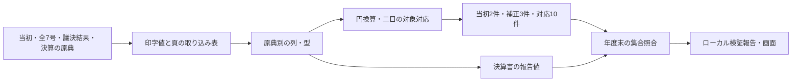

# 補正予算の原典からmartを作る

## Objectives

- **Goal**: 狛江市2023年度一般会計・歳出の二目について、当初額・補正増減額・決算との対応を原典参照付きで生成する。指定時点までの補正小計と決算実績を分け、年度末の報告予算現額との差を内部で検証する。
- **Not goal**: 繰越・予備費充用・流用、全国への展開、事業や節への配賦、公開・配布インフラ。

[PRD](prd.md) の実装を記述する。検証結果は [検証記録](../../monorepo-migration.md) にまとめる。

## Background

狛江市には既収録の決算CSVと、正式な当初・第1〜7号の補正予算書、議決結果、決算書がある。初回は7-1-2商工業振興費と13-1-1予備費を目単位で収録し、事業×歳出の節の対応は未確認とする。

## System Overview

## Detailed Design

### 原典・表・号数を区別して採用する

`sources.toml` の `budget_history."132195:2023"` が当初と全7号、適用日、議案番号、原典・議決結果のURLと期待SHA-256を宣言する。`load_budget_history()` で専用の抽出器へ渡し、既存CSVの宣言とは分離する。

`extract_budget_history.py` は各号が一度ずつ宣言されていることと原典hashを検査する。異版・再公表は期待hashと異なれば停止する。訂正の採用は宣言と証跡を明示的に更新して一版へ置き換え、旧額を別の補正として追加しない。原典hash・表hash・証跡を固定入力一覧へ採用し、遠隔保管・読戻しの照合を通してから固定する。

PDF入力は `jurisdiction=<code>/year=<year>/document_kind=<kind>/edition=<hash>/direction=expenditure/resource=<table>/` に分ける。歳出明細は `expenditure-detail`、議決表は `approval-<号>`、決算書の確認値は `reported-budget`。同じ議決PDFに複数号が載っていても表IDで区別する。dataset IDは団体・年度・方向・文書種別・原典hash・表IDの組合せである。

別の適用日の指定がない各号は、議決結果の議案番号・号数・原案可決・日付を確認した議決日を適用規約として採る。第5号の提出日12月14日を適用日12月22日と混同しない。当初は年度開始の4月1日を採る。取得日は証跡に残し、公開日から適用日を推測しない。

### 印字値と原典位置を保持する

当初は宣言した211・320頁の二目、補正は歳出事項別明細の目の金額欄を抽出する。款・項の見出し、目のコード・折り返し名称、金額の列を確認し、節・説明欄の反復印字を足さない。目ごとの金額文字列、物理ページ、bbox、印字行を残す。ローカル閲覧では回転PDFの文字座標とPNGが同じ表示方向になるよう頁の幅・高さを合わせ、寸法比が合わない場合は停止する。当初の前年度額や比較増減を当初額へ混ぜない。

決算書は画像のため、87・114頁の予算現額・実績を目視確認した転記値を宣言に持ち、採用版と確認方法を証跡に残す。未確認のbboxを作らず、ページまでの参照とする。後段のdbt検査で既存決算CSVの対応する集合の現額・実績と一致することを要求する。

`raw_132195` は既存決算CSVだけ、`raw_132195_history` は新しい表だけを読む。`stg_132195__budget_history` は取り込みの全行を1対1で保持し、型を整える。円換算や二目の対象選択は `int_fiscal_budget_history` で行う。`int_fiscal_datasets` の宣言とのJOINはdataset ID単位とし、補正が対象にない号も資料一覧に残す。

### 当初・補正・実績を別の金額として生成する

原典の千円を整数の円へ1000倍する。補正のbefore・delta・afterを保持し、before＋delta＝afterを抽出時とdbtで検査する。さらに全目のdelta合計を各号の第1条に印字された歳出増減総額と照合し、対象に補正がない号も抽出漏れと区別する。△は負号として扱い、martへはdeltaだけを採る。after-onlyからの増減推定は実装しない。

当初行を起点とする二目は `line_granularity=origin_line`、`expenditure_setsu_id=NULL`。既存の `int_expenditure_setsu_lines`・`int_expenditure_setsu_groups` に当初額だけを接続し、補正を当初へ混ぜない。予算対象の科目経路と金額の `details_json` に原典行参照を残す。既存決算のIDと実績は変更しない。

- 当初: 商工業振興費34,553,000円、予備費30,000,000円。
- 補正: 第1号の予備費＋1,980,000円、第3号の商工業振興費＋148,300,000円、第6号の同目−115,000,000円。
- 対応: 同じ年度・一般会計・款項目の決算CSVの9明細と1明細への10リンク。目の集合対応を確認し、事業×節の対応は主張しない。

当初額と補正は `fiscal_initial_expenditure_budget_lines`・`fiscal_expenditure_budget_changes`、対応は `fiscal_expenditure_settlement_links`、資料の号数・適用日・採用版は `fiscal_datasets` に持つ。COFOG未分類を保持し、目総額を事業や節へ配賦しない。

### 時点と未確認を区別して検証する

`budget-reconciliation.ts` が対象集合のIDを重複排除し、指定日以前の符号付きdeltaだけを当初へ加える。年度開始前は予算額NULL。同じIDの競合額は停止する。M:N対応でも両側をそれぞれ一度だけ集計する。初回の実資料は1:Nであり、M:Nはfixtureで検査する。

当初の額、全7号の採用・適用日・議決確認、各変更の日付を確認できた二目だけ `supplementaryCoverageStatus=complete`。欠号や日付不明なら補正小計・予算額をNULLとし、ゼロを示さない。節は常に今回の範囲では未確認である。

決算書とCSVの集合総額が一致し、年度末時点・目粒度・円単位で比較できた場合に差額を求める。結果は `pipeline/.build/report/pipeline.json` の団体別 `budgetReconciliation` とローカル画面に残す。年度途中に年度末の報告値との比較はしない。

商工業振興費は当初＋補正67,853,000円と報告現額68,814,000円の差＋961,000円、予備費は31,980,000円と23,761,662円の差−8,218,338円。収録範囲はcompleteでも照合はdifferenceである。差額や原因推定をmartへ追加しない。予算全体の `coverage_json.budgetHistory` はunconfirmedを維持する。

## 検査と残る制約

`budget_history_integrity.sql` は非空の実資料で、件数・8資料・符号・単位・原典位置・対象・当初と変更の参照・未確認節・10リンクの集合総額・決算書の転記値・議決表を検査する。既存の88検査も実行し、5団体の固定入力で回帰を確認する。fixtureは適用日の前後、欠号・日付不明・当初不明・実績欠落、M:Nの重複と競合IDを検査する。

初回以外の年度・会計・対象、新設ゼロ、改称・分割・統合の実資料、事業×歳出の節への対応、繰越・充用・流用は未収録である。原典の再利用条件は未確定なのでPDFを公開配信しない。独立した配布版や公開インフラの設計は後段へ戻す。

## Appendix

### 確認した原典

再検証日: 2026-10-03。PDFの頁は1始まりの物理ページ、CSVのsource_rowはヘッダを1として数える。当初・補正は文字層と要所の画像、狛江市決算書は対象ページの画像、決算CSVは列値と整数合計を確認した。採用した原典・表のhashと証跡は `pipeline/ingestion/fiscal/sources.lock.json` と `provenance/` に記録し、原典・取り込み表は非公開R2に保管する。

狛江市2023年度一般会計の正式予算書は [年度の予算ページ](https://www.city.komae.tokyo.jp/index.cfm/46,126778,361,2169,html)、議決結果は [議案等審査結果一覧](https://www.city.komae.tokyo.jp/index.cfm/49,145713,404,2590,html) から取得した。当初はPDF7頁、第1〜7号は各PDF2頁の第1条で一般会計全体の額を確認した。議決結果の第4・5号はそれぞれPDF1・2頁、それ以外はPDF1頁である。

| 原典 | 増減額（千円） | 当初・補正後総額（千円） | 議決日と根拠 |
|---|---:|---:|---|
| [当初](https://www.city.komae.tokyo.jp/index.cfm/46,126778,c,html/126778/20230327-165935.pdf) | — | 31,620,000 | 2023-03-27、PDF表紙の議案3・原案可決 |
| [第1号](https://www.city.komae.tokyo.jp/index.cfm/46,126778,c,html/126778/20230601-112553.pdf) | 289,962 | 31,909,962 | [2023-05-16、議案23](https://www.city.komae.tokyo.jp/index.cfm/49,145713,c,html/145713/R5rinji_result.pdf) |
| [第2号](https://www.city.komae.tokyo.jp/index.cfm/46,126778,c,html/126778/20230608-095441.pdf) | 307,980 | 32,217,942 | [2023-06-08、議案25](https://www.city.komae.tokyo.jp/index.cfm/49,145713,c,html/145713/02-2_ListOfResult1.pdf) |
| [第3号](https://www.city.komae.tokyo.jp/index.cfm/46,126778,c,html/126778/20230831-133307.pdf) | 2,283,267 | 34,501,209 | [2023-08-31、議案28](https://www.city.komae.tokyo.jp/index.cfm/49,145713,c,html/145713/02-2_result1.pdf) |
| [第4号](https://www.city.komae.tokyo.jp/index.cfm/46,126778,c,html/126778/20231124-133108.pdf) | 1,123,332 | 35,624,541 | [2023-11-24、議案40](https://www.city.komae.tokyo.jp/index.cfm/49,145713,c,html/145713/20260817-165819.pdf) |
| [第5号](https://www.city.komae.tokyo.jp/index.cfm/46,126778,c,html/126778/20231222-094555.pdf) | 105,411 | 35,729,952 | [2023-12-22、議案56](https://www.city.komae.tokyo.jp/index.cfm/49,145713,c,html/145713/20260817-165819.pdf) |
| [第6号](https://www.city.komae.tokyo.jp/index.cfm/46,126778,c,html/126778/20240201-104448.pdf) | -43,845 | 35,686,107 | [2024-02-01、議案1](https://www.city.komae.tokyo.jp/index.cfm/49,145713,c,html/145713/20260824-135102.pdf) |
| [第7号](https://www.city.komae.tokyo.jp/index.cfm/46,126778,c,html/126778/20240222-154057.pdf) | 263,193 | 35,949,300 | [2024-02-22、議案2](https://www.city.komae.tokyo.jp/index.cfm/49,145713,c,html/145713/20260817-154035.pdf) |

初回の二目と内部照合の根拠は次の箇所にある。

- **当初・補正の目明細**: 上記当初PDF211頁（印刷205頁）の7-1-2商工業振興費34,553千円、320頁（印刷314頁）の13-1-1予備費30,000千円。第1号10頁は予備費30,000→+1,980→31,980千円。第3号20頁は商工業振興費34,553→+148,300→182,853千円、第6号9頁は182,853→-115,000→67,853千円。目・節・説明欄に同じ額が反復する。
- **決算の報告値と照合差**: [狛江市2023年度決算書](https://www.city.komae.tokyo.jp/index.cfm/46,133351,c,html/133351/20241011-132915.pdf) 87〜88頁（印刷81〜82頁）の商工業振興費は現額68,814,000円、実績66,261,365円。114〜115頁（印刷108〜109頁）の予備費は現額23,761,662円、実績0円。
- **既収録決算明細との対応**: [狛江市2023年度決算歳出CSV](https://www.opendata.metro.tokyo.lg.jp/komae/R05/132195_kessan2023saisyutu.csv) は2,224行・CP932、PR39の採用hashと一致した。会計コード1のsource_row83が予備費、1222〜1230が商工業振興費の9明細で、上記決算書の現額・実績と合計が一致する。予算額列は当初ではなく補正後額。対象年月202406を補正の適用日に使わない。
