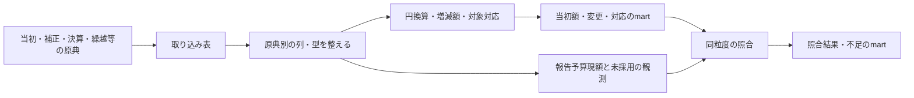

# 補正・繰越の原典からmartを作る

## Objectives

- **Goal**: 狛江市2023年度一般会計・歳出の原典を取り込み、当初額・変更・決算との対応・照合結果のmartを作る。
- **Not goal**: 利用者向け機能、配布・保存先、公開運用の設計。全国への一括展開や、資料不足を推定で埋めること。

[PRD](prd.md) に対し、原典の採用からmart生成までの処理を定める。これは実装前の設計である。

## Background

既存の当初予算・決算のモデルを再利用し、空になっている予算変更と対応のモデルへ実資料を接続する。最初に狛江市を選ぶのは、2023年度決算CSVが既収録で、正式な当初・第1〜7号の補正予算書と、目単位の報告予算現額を確認できたためである。

初回は13-1-1予備費と7-1-2商工業振興費の二目に限る。当初2行、補正3行、既存の決算10明細との集合対応を作る。日付や事業×歳出の節の対応が不足するため、履歴全体はunconfirmedとする。[原典参照](#確認した原典) に調査済みの値と未確認事項を記す。

## System Overview

取り込みとstagingは原典の論理行との1対1を保つ。円換算、採用行の選択、増減額の導出、資料間の対応はintermediateで行う。martsで最終的な列と粒度を確定する。

## Detailed Design

### 1. 取得する資料と採用版を宣言する

`sources.toml` の既存の決算宣言 `132195:2023` は維持する。当初と各号は別宣言にし、団体・年度・歳入歳出・会計・文書種別・号数・表・原典の単位を持たせる。PDFは表紙・本文から年度と会計を確認する。必要資料一覧には全7号と、繰越・充用・流用の確認状況を含める。

同じ号・表の採用原典は一版だけにする。同じhashの再取得は同じ入力として扱う。訂正は訂正根拠、旧版との関係、採用理由を記録して置換し、旧額を追加の補正として足さない。根拠のない異版は採用未確定とする。採用入力のhashと証跡を `sources.lock.json` に固定する。未取得資料は必要資料一覧に残し、取得済みdatasetを捏造しない。

議決日・適用日・公開日・取得日を別に持つ。別の適用日指定がなければ、原案可決を確認した議決日を本設計の適用規約として採り、根拠を記録する。第5号の12月14日提出を12月22日可決と混同しない。専決処分は専決の効力の日を原典で確認する。実施日不明の充用・流用を年度末の日付へ置換しない。

### 2. 原典の列を保持して取り込む

CSVは既存の文字列取り込みと復元検査を維持する。PDFは文書別のlayoutで、目・節・末端内訳・合計・説明行を区別して抽出する。元の金額文字列・単位・表・物理ページ・bbox・原典hashを保持する。画像の決算PDFを暫定的に転記する場合も、原典行と確認手順を証跡に残す。

PDFの `source_row` は抽出表の固定した行番号であり、PDFページ番号ではない。stagingは原典行と1対1で列名・型を整え、目総額と節内訳をここで合算しない。当初書の「前年度予算額」「比較増△減」は前年との比較なので、当初額には「本年度予算額」だけを採る。

既存 `raw_132195` の全文書globへ別列構造のPDFを混ぜない。決算CSV用sourceを決算入力に限定し、当初・補正等は新規 `raw_132195_history` と `stg_132195__budget_history.sql` に分ける。採用datasetはorigin hashと表IDを含めて一意にし、同一号・別表・別版の行を混ぜない。同じPDFの別表を区別するため、必要な新入力に `resource=<表ID>/` を追加する。

`int_fiscal_datasets.sql` の宣言とのJOINは、現状の団体・年度・歳入歳出・文書種別だけでは複数号が衝突するため、採用dataset IDで行う。変更0行の号も採用資料の一覧に残す。構造・粒度は資料別に保持し、決算CSVの事業・節の経路を目粒度へ上書きしない。

### 3. 金額を円と符号付き増減額へ揃える

千円は1000倍して整数の円に換算する。補正のbefore・delta・afterをすべて保持し、変更に採る額は一つだけにする。

| 原典の列 | 採る増減額 | 確認条件 |
|---|---|---|
| before・delta・after | delta | before + delta = after |
| before・after | after - before | 対象・粒度・単位が同じ |
| deltaのみ | delta | 符号・単位・対象を確認 |
| afterのみ | 確認済み直前額との差 | 直前までの変更がすべて確定 |
| beforeのみ | 採用しない | 増減を未確認にする |

減額の `△` は負の値とする。beforeと直前の計算値が違っても、差額を新しい変更にしない。充流用・繰越・比較範囲の違いを調べ、説明できないafter-onlyの導出は保留する。原典にdeltaが明示される場合はその変更を保持し、照合差を別に残す。

**実測の変換例**：第3号PDF20頁の商工業振興費はbefore=34,553、delta=148,300、after=182,853千円。この一行から `amount_delta=148300000 / effective_at=2023-08-31 / change_kind=supplementary` を作り、採用datasetと予算対象、原典行を参照する。第6号は同じ対象へ-115,000,000円となる。補正後総額182,853,000円と67,853,000円を累積加算しない。

適用日と同日内の順序を保持し、指定日の終わりまでの変更を集計する。号数だけで適用順を決めない。日付不明の額は観測として残し、時点別の変更小計へ混ぜない。年度開始前には当初額を計上しない。

### 4. 予算対象と決算明細の集合を対応づける

予算対象は団体・年度・歳入歳出・会計・科目／事業経路・追加区分で区別する。確認済みの歳出対象は事業×歳出の節とする。初回の二目は当初の原典行を起点に `line_granularity=origin_line / expenditure_setsu_id=NULL` として保持する。NULL節の複数行をまとめず、目総額を事業や節へ配賦しない。

事業×節に対応できる場合は、当初額と変更の末端行を同じ対象へ集約する。変更は採用dataset・種別・適用日・順序・原資／相手・繰越元／先が一致する行だけをまとめる。細節等の経路・円額・原典行は各金額記録の `details_json` に保持し、小計を重ねない。節の適用年度、COFOGと連結判断の一致を確認できない範囲は原典行の粒度を残す。この集約処理は [別担当の設計](../fiscal-records/design-doc.md#歳出予算を事業と経済的な性質の組合せで提供する) に接続する。

初回は予備費の決算CSV行83、商工業振興費の行1222〜1230を参照する。目単位の集合対応を確認できても、事業×節の対応まで確認済みとはしない。網羅性・追加区分を確認できない場合はリンク自体もunconfirmedとする。

改称は同じ対象と確認できればIDを維持し、新設の当初額は新設の証拠と直前の網羅的な一覧でゼロを確認できた場合だけ `verified-zero` とする。資料不足は `unknown`。分割・統合は対応グループに両側の集合を残し、原典が合計しか示さない場合は配賦しない。後で節対象へ移す場合、元の目対象と内訳を同じ加算集合に重ねない。

M:Nでも双方のID集合を重複排除して集計する。架空の例で予算A=60,000、B=40,000円、決算x=30,000、y=70,000円が4リンクで対応すると、双方100,000円であり200,000円ではない。Bの訂正額35,000円を採れば予算は95,000円。旧Bを足さない。確認済みの各メンバーは一つの確認済みグループにだけ所属させる。

### 5. 繰越・充用・流用を採用できる観測と分ける

繰越は議決限度額と実繰越額、元／先年度・会計、財源内訳を別に保持する。実額・受入先の予算対象・適用日が確認できた場合だけ繰越先年度の変更へ加える。元年度の翌年度繰越や不用額は元年度の予算現額から引かない。継続費の総額・年割額・実繰越額も別である。計算書が事業総額しか持たなければ、節へ配賦しない。

予備費の当初額は基準額、補正は補正変更、実充用は原資の予備費への負額と充用先への正額に分ける。流用も原資負額・相手正額の両側を持たせ、同じ実施単位・日付・会計で合計0を検査する。同一目の合計が0でも、異なる事業×節への動きは両側を残す。年度累計しか分からない資料から一取引や実施日を推定しない。

初回の充用・流用と受入繰越は、日付や対象対応が不足するため観測に留める。限度額・未採用額・不足理由を消さず、変更へ採用できる条件が揃ってから接続する。

### 6. 当初額・変更・対応・照合結果をmartにする

初回に作るmartは次のとおり。決算実績の既存モデルはそのまま参照する。

- **予算対象**：二目の対象・当初額の確認状態・粒度。
- **当初額**：予備費30,000,000円、商工業振興費34,553,000円の2行。
- **変更**：第1号の予備費+1,980,000円、第3号の商工業振興費+148,300,000円、第6号の-115,000,000円の3行。号数・適用日・原典行・対象を持つ。
- **決算との対応**：予備費1明細、商工業振興費9明細への計10リンク。集合の確認状態と根拠を持つ。
- **照合結果・収録範囲（新規案）**：対象集合・比較日・粒度・当初額・採用変更小計・報告現額・差額・不足理由・確認状態を持つ。必要資料の有無と採用版も参照する。
- **繰越等の観測（新規案）**：限度・実額・年度／会計・日付／対象の確認状態を持つ。未採用の充用・流用の累計も別種別の観測として残す。

商工業振興費の当初＋採用補正は67,853,000円。報告現額68,814,000円との差961,000円は日付未確認の充用で説明できる。予備費は31,980,000円と報告現額23,761,662円との差-8,218,338円を充用の観測として残す。差を説明できても、架空の変更として小計へ加えない。

商工業振興費の採用済み小計は、2023-08-30で34,553,000円、8月31日で182,853,000円、2024-02-01で67,853,000円。充流用の日時と節対応が不足するため、完全な指定時点額は未確定である。決算実績66,261,365円は9決算行を一度ずつ合算し、予算の復元式へ入れない。

照合は同じ対象集合・粒度・円単位で行う。CSVの `予算計(円)` と決算書の「予算現額・計」を報告値に使い、`予算額(円)` を当初とみなさない。原典の丸めは規則を確認し、理由不明の差を許容差で吸収しない。

`complete` は、基準日までの必要資料・採用版・当初額・変更の対象／符号／単位／適用日・事業×節と決算の集合対応・同粒度の報告値との一致・二重計上防止を確認した範囲だけに付ける。欠号、日付不明、節不明、粒度不足、理由不明の差は `unconfirmed`。原典の報告値は計算値で上書きしない。初回は二目も一般会計全体もcompleteにしない。

## Tasks

1. 二目の当初・全7号と決算、繰越等の必要資料一覧と採用版を宣言する。
2. PDF用の取り込み・source・stagingを追加し、原典行との1対1と印字値を検査する。
3. 円換算・予算対象・3変更・10リンクと未採用の観測をintermediateで作る。
4. martへ接続し、時点別の小計・報告値との差額・unconfirmedの理由を検査する。

## 検査

以下は実装時の検査であり、今回の文書修正で実行済みという意味ではない。

- **取り込み**：原典行とstagingの1対1、PDFの反復印字額、before＋delta＝after、節・目の合計、△負号、1000倍、ページ跨ぎを検査する。
- **採用と時点**：同hash再取得、同一号の訂正置換、複数号、提出日と適用日の区別、各適用日の前日／当日の小計、日付不明の観測除外を検査する。
- **対象と粒度**：新設ゼロと当初不明、改称・分割・統合・M:N、異会計／年度の混入、空会計コード、節NULLの非集約、適用期間、detailsの末端合計、小計重複を検査する。
- **繰越等と照合**：限度と実額、元／先年度、予備費当初と実充用、原資／相手の合計0、同一目内の節間移動、報告現額との厳密一致、欠号や粒度不足でのunconfirmedを検査する。
- **再現と回帰**：同じ採用入力・判断から同じmart行を作り、既収録の決算実績を変えない。検査対象0件で成功させず、実資料と架空fixtureの結果を分ける。

## Appendix

### 変更するファイルとモデル

パスはrepo rootからの相対パス。新規案は未実装である。

- **取得・採用**：`pipeline/ingestion/fiscal/sources.toml`・`sources.py`・`fetch.py`、`pipeline/ingestion/inputs.py`・`paths.py`。新規 `extract_budget_history.py`、`budget-history/adoptions.json`・`item-correspondences.csv`・`coverage.json`。採用証跡と `sources.lock.json` を更新する。
- **staging**：`pipeline/dbt/models/staging/fiscal/_sources.yml`・`_models.yml`、新規 `stg_132195__budget_history.sql`。既存 `stg_132195__expenditure.sql` は決算CSVの行IDを維持する。
- **intermediate**：`pipeline/dbt/models/intermediate/fiscal/api/int_fiscal_datasets.sql` の採用dataset JOIN。新規 `int_fiscal_budget_items`・`int_fiscal_initial_budget`・`int_fiscal_budget_changes`・`int_fiscal_settlement_correspondences`・`int_fiscal_budget_reconciliation`・`int_fiscal_budget_change_observations`。`pipeline/dbt/dbt_project.yml` にlayout・単位を宣言する。
- **marts**：`pipeline/dbt/models/marts/api/api_fiscal_expenditure_budget_items.sql`・`api_fiscal_initial_expenditure_budget_lines.sql`・`api_fiscal_expenditure_budget_changes.sql`・`api_fiscal_expenditure_settlement_links.sql`・`api_fiscal_datasets.sql` と `pipeline/dbt/macros/api.sql` へ接続する。照合・範囲・観測は新規 `pipeline/dbt/models/marts/fiscal/fiscal_budget_reconciliation.sql`・`fiscal_budget_history_coverage.sql`・`fiscal_budget_change_observations.sql`（案）にする。既存名の `api_` はモデルの識別に用いており、本書はmartの生成までを扱う。
- **検査**：`pipeline/dbt/tests/staging_is_one_to_one.sql`・`amount_units_match_source.sql`・`source_year_matches_partition.sql`・`declarations_cover_raw.sql` の対象を文書／表別に揃える。`api_relations.sql` に非空の変更・対応を含め、採用版・原典行参照・金額導出・時点・照合・観測の検査を追加する。

### 残る確認

二目の事業×歳出の節の対応、狛江市の繰越計算書本体、充用・流用の実施日と実施単位、訂正・新設・分割・統合の実例が未確認である。原典の公開日・再利用条件も確認を残す。日付・粒度不足は初回martへ不足理由として残し、金額や日付を補完しない。

### 確認した原典

調査日: 2026-10-02。PDFの頁は1始まりの物理ページ、CSVのsource_rowはヘッダを1として数える。当初・補正・富士見市の計算書は文字層と要所の画像、狛江市決算書は対象ページの画像、決算CSVは列値と整数合計を確認した。原典・抽出試作・取得hashの一覧はGit管理外の `.cache/fiscal-history/` に置き、調査用の独立文書は管理しない。正式採用するhashと証跡は実装時にlockへ記録する。

狛江市2023年度一般会計の正式予算書は [年度の予算ページ](https://www.city.komae.tokyo.jp/index.cfm/46,126778,361,2169,html)、議決結果は [議案等審査結果一覧](https://www.city.komae.tokyo.jp/index.cfm/49,145713,404,2590,html) から取得した。当初はPDF7頁、第1〜7号は各PDF2頁の第1条で一般会計全体の額を確認した。議決結果の第4・5号はそれぞれPDF1・2頁、それ以外はPDF1頁である。

| 原典 | 増減額（千円） | 当初・補正後総額（千円） | 議決日と根拠 |
|---|---:|---:|---|
| [当初](https://www.city.komae.tokyo.jp/index.cfm/46,126778,c,html/126778/20230327-165935.pdf) | — | 31,620,000 | 2023-03-27、PDF表紙の議案3・原案可決 |
| [第1号](https://www.city.komae.tokyo.jp/index.cfm/46,126778,c,html/126778/20230601-112553.pdf) | 289,962 | 31,909,962 | [2023-05-16、議案23](https://www.city.komae.tokyo.jp/index.cfm/49,145713,c,html/145713/R5rinji_result.pdf) |
| [第2号](https://www.city.komae.tokyo.jp/index.cfm/46,126778,c,html/126778/20230608-095441.pdf) | 307,980 | 32,217,942 | [2023-06-08、議案25](https://www.city.komae.tokyo.jp/index.cfm/49,145713,c,html/145713/02-2_ListOfResult1.pdf) |
| [第3号](https://www.city.komae.tokyo.jp/index.cfm/46,126778,c,html/126778/20230831-133307.pdf) | 2,283,267 | 34,501,209 | [2023-08-31、議案28](https://www.city.komae.tokyo.jp/index.cfm/49,145713,c,html/145713/02-2_result1.pdf) |
| [第4号](https://www.city.komae.tokyo.jp/index.cfm/46,126778,c,html/126778/20231124-133108.pdf) | 1,123,332 | 35,624,541 | [2023-11-24、議案40](https://www.city.komae.tokyo.jp/index.cfm/49,145713,c,html/145713/20260817-165819.pdf) |
| [第5号](https://www.city.komae.tokyo.jp/index.cfm/46,126778,c,html/126778/20231222-094555.pdf) | 105,411 | 35,729,952 | [2023-12-22、議案56](https://www.city.komae.tokyo.jp/index.cfm/49,145713,c,html/145713/20260817-165819.pdf) |
| [第6号](https://www.city.komae.tokyo.jp/index.cfm/46,126778,c,html/126778/20240201-104448.pdf) | -43,845 | 35,686,107 | [2024-02-01、議案1](https://www.city.komae.tokyo.jp/index.cfm/49,145713,c,html/145713/20260824-135102.pdf) |
| [第7号](https://www.city.komae.tokyo.jp/index.cfm/46,126778,c,html/126778/20240222-154057.pdf) | 263,193 | 35,949,300 | [2024-02-22、議案2](https://www.city.komae.tokyo.jp/index.cfm/49,145713,c,html/145713/20260817-154035.pdf) |

初回の二目と内部照合の根拠は次の箇所にある。

- **当初・補正の目明細**: 上記当初PDF211頁（印刷205頁）の7-1-2商工業振興費34,553千円、320頁（印刷314頁）の13-1-1予備費30,000千円。第1号10頁は予備費30,000→+1,980→31,980千円。第3号20頁は商工業振興費34,553→+148,300→182,853千円、第6号9頁は182,853→-115,000→67,853千円。目・節・説明欄に同じ額が反復する。
- **決算の報告値・充用・流用**: [狛江市2023年度決算書](https://www.city.komae.tokyo.jp/index.cfm/46,133351,c,html/133351/20241011-132915.pdf) 87〜88頁（印刷81〜82頁）の商工業振興費は、充用961,000円、現額68,814,000円、実績66,261,365円。114〜115頁（印刷108〜109頁）の予備費は充用-8,218,338円、現額23,761,662円、実績0円で、充用先15行を掲載する。87頁の商工総務費には10節-9,735円・11節+9,735円の流用があるが、一取引か年度累計か、実施日は未確認。
- **既収録決算明細との対応**: [狛江市2023年度決算歳出CSV](https://www.opendata.metro.tokyo.lg.jp/komae/R05/132195_kessan2023saisyutu.csv) は2,224行・CP932、PR39の採用hashと一致した。会計コード1のsource_row83が予備費、1222〜1230が商工業振興費の9明細で、上記決算書の現額・実績と合計が一致する。予算額列は当初ではなく補正後額。対象年月202406を変更の適用日に使わない。
- **繰越の区別**: 第7号6頁の第三表は款・項・事業名の粒度で、中学校施設改修222,454千円などの限度を掲載する。決算書90頁（印刷84頁）の道路新設改良費は受入繰越16,483,745円と翌年度繰越10,000,000円、104頁（印刷98頁）の中学校費は受入589,534,000円と翌年度222,454,000円を別欄に持つ。116頁（印刷110頁）の一般会計全体は受入1,053,740,895円、翌年度419,746,877円。[決算審査意見書](https://www.city.komae.tokyo.jp/index.cfm/46%2C870%2Cc%2Chtml/870/20250501-094510.pdf) 53・78頁の予備費・翌年度繰越は補助照合に使えるが、会計総額を事業へ配賦する根拠にはならない。
- **繰越計算書の補助例**: 富士見市2024年度一般会計の [継続費繰越計算書](https://www.city.fujimi.saitama.jp/shisei/04zaisei/01yosan/yosansho/reiwa6nenndohoseiyos.files/R6_houkoku2.pdf) 2〜3頁では、公園事業の継続費総額11,105,000円、当年度額5,407,000円、前年度逓次455,400円、翌年度逓次1,537,200円を区別できる。[繰越明許費繰越計算書](https://www.city.fujimi.saitama.jp/shisei/04zaisei/01yosan/yosansho/reiwa6nenndohoseiyos.files/R6_houkoku3.pdf) 2〜3頁では、スポーツ施設の限度18,509,000円と実繰越18,508,300円、選挙の限度12,530,000円と実繰越7,957,748円を区別できる。款・項・事業名の粒度で目コードは無く、PDF1頁の2025-06-03提出日は受入の適用日を証明しない。

狛江市の2022→2023・2023→2024の繰越明許費・事故繰越・継続費計算書本体は、公式予算・決算ページと議案資料を探したが未確認。未公開とは断定しない。事故繰越の抽出器を実測済みとせず、充流用の実施日・取引単位や訂正の実例も未確認として残す。
