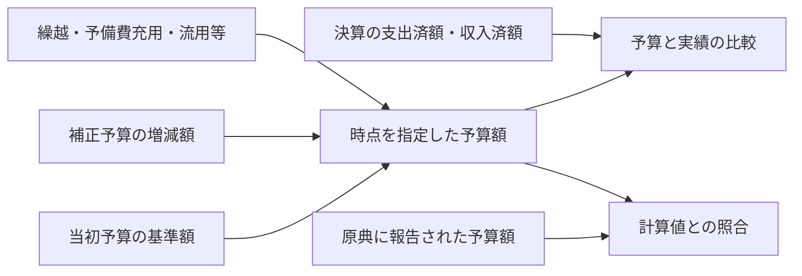
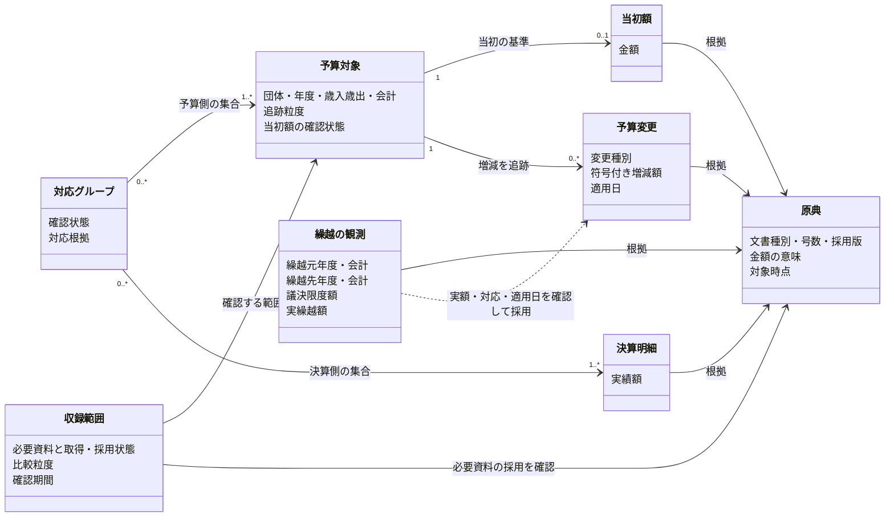

# 予算の変更履歴と決算の実績を分けて提供する

関連 PRD: [budget-fdp-pilot](../budget-fdp-pilot/prd.md)、[budget-account-structure](../budget-account-structure/prd.md)

## Problem

PR39では決算の実績を一つの `amount` として提供し、当初予算・変更・資料間の対応を別に持つ契約を実装した。しかし、補正・繰越・予備費充用・流用の実資料と確認済み対応は未収録で、当初からどの変更を経て予算額になったかは辿れない。

決算原典の報告予算額は内部照合に保持する。原典の報告値を予算履歴の計算値に代用すると変更の欠落や日時の誤りを隠すため、採用した変更と未確認の範囲を分けて示し、同じ対象・粒度・単位で照合する必要がある。

## 導出

Story の「他の街や他の年と同じ物差しで比べる」と「数字が怪しいと思ったときに原典と合っているか確かめる」ために、予算と実績の意味・時点を区別し、予算の変更と計算根拠を辿れるようにする。

## Overview

決算の提供用明細は、歳出なら支出済額、歳入なら収入済額の `amount` 一つを持つ。当初予算は基準額、補正予算は号数・対象時点と増減額を持つ変更として管理する。決算原典にある予算額は照合用に残し、予算の変更履歴から求めた値と区別する。

本PRDの基準は [PR39の固定commit](https://github.com/wwwyo/fudoki/tree/60d73cd3a2b1eee5671a5955e822fae67de83f13)。公開契約は実装済みで、実資料の変更・対応の収録を今回具体化する。全体releaseやactive切替は追加せず、未確認の履歴があっても決算実績の提供を続ける。

### Goals

- 利用者が決算の実績を一金額として取得・集計できる。
- 利用者が当初予算と各号の補正を区別し、指定時点の予算額と実績を比較できる。
- 予算額の計算に用いた原典・変更・明細の対応と、復元できない範囲を確認できる。
- 決算原典の報告値を保持し、計算値との差異を確認できる。

### Non-Goals

- 原典・取り込み表・内部の照合用データから報告値の列を削除すること。
- 全国・全年度の資料を一度に収録すること。
- 公営企業会計の収録や COFOG の分類体系の変更。
- 原典にない明細への配賦や、資料未取得の変更をゼロと推定すること。
- 決算実績を予算の変更履歴から推定すること。実績は決算原典から取得する。

## Glossary

- **予算の変更履歴**：当初予算を基準に、各補正とその他の変更の金額・時点・根拠を区別した記録。
- **補正の増減額**：その号の補正で増減した額。補正前額や補正後総額とは区別し、減額は負の値として扱う。
- **原典の報告値**：決算書等に自治体が記載した予算額。風土記が変更履歴から求めた計算値とは別に保持する。
- **明細の対応**：別の文書に載る科目・事業を比較するための関係。名称の一致だけでは確定しない。

## Domain Model

予算対象は団体・年度・歳入歳出・会計内で追跡する科目・事業であり、共通科目マスタではない。当初額は記録あり、根拠付きゼロ、未確認を区別する。未確認をゼロにせず、変更は補正後総額ではなく符号付き増減として扱う。

対応グループは予算側と決算側の集合を比較する。M:Nのリンク数に応じて金額を複製せず、双方を一度ずつ集計する。確認済みの対象・明細はそれぞれ一つの確認済みグループにだけ所属する。未確認の対応は別に残す。

収録範囲の算術上の一致と、指定日時点の履歴の完全性は別である。繰越の議決限度を実繰越として採用せず、元年度の執行権の終了と翌年度の予算への加算を区別する。

## 必要な原典と収録範囲

当初予算書・各号の補正予算書・決算書に加え、繰越計算書を取得対象に含める。繰越明許費や継続費など、取得した資料がどの繰越を扱うかと収録範囲を明示する。繰越計算書の年度と、金額を受け入れる予算の年度を区別し、前年度から当年度への繰越額として対応づける。

予備費充用・流用などについても、金額と対象科目を確認できる公表資料を収集する。歳入と歳出では必要な変更が異なるため、歳出向けの変更を歳入へ一律に適用しない。自治体が公開していない資料や、集計値しか得られない範囲は取得状況と粒度を記録する。

各資料について団体・年度・会計・歳入歳出・文書種別・版・対象時点を識別する。補正には号数と、原典の金額が増減額・補正前額・補正後総額のどれかを明示する。同じ資料の再公表を追加の補正として足さない。

繰越の議決上の限度額と実際の繰越額、予備費の当初計上額と実際の充用先・金額を区別する。繰越計算書で確認できた総額を、根拠なく事業単位へ分配しない。

## Acceptance Criteria

- [x] 決算の提供用明細から、歳出の支出済額または歳入の収入済額を一つの `amount` として取得でき、原典の該当箇所に辿れる。
- [ ] 当初予算、各号の補正、決算の実績を別々に取得でき、予算の額と実績の額を合算しない。
- [ ] 増額・減額を含む複数の補正から指定時点の予算額を求め、各号の補正後総額を重ねて足さない。
- [ ] 科目の追加・改称・分割・統合を含む資料間の対応を確認でき、対応が確定していない明細も識別できる。
- [ ] 繰越計算書から取得した額を、繰越元と繰越先の年度・会計とともに確認できる。限度額と実際の繰越額を混同しない。
- [ ] 繰越・予備費充用・流用がある検証例で、その変更を含めた予算額と、原典の報告値を同じ粒度・単位で照合できる。計算や対応の誤りによる差異は解消し、残る差異は原典から理由を確認できる。
- [ ] 必要な資料が欠ける場合や粒度が足りない場合は、復元できる範囲と未確認の範囲が分かる。未確認を金額ゼロや完全な復元として表示しない。
- [ ] 計算値が原典の報告値と異なる場合も、双方の金額・出典・比較粒度が残り、原典の値を計算値で上書きしない。
- [ ] 配布ファイルと API で、同じ対象・時点・金額の意味を指定した結果が一致する。

## Success Metrics

- コアアクション：団体・年度・会計を選び、事業単位で予算と実績を比較する。
- 期待頻度：月次。原典や差異の確認は年数回。
- 数える対象：自分から開いた利用者のうち、予算と実績の比較を行った人数。通知・メール経由の来訪は除く。
- 主指標：初回の比較を行った利用者のうち、翌月にも比較を行った割合。現時点で外部利用者はいないため、目標値と観測方法は実資料の検証後、公開前に定める。

## 最初に収録する範囲

既収録団体の狛江市（132195）2023年度一般会計・歳出を選ぶ。当初予算書、第1〜7号の補正予算書、議決結果、決算書・既収録CSVを取得し、目単位の値を確認した。最初は13-1-1予備費と7-1-2商工業振興費について、当初額、3件の補正、計10決算明細との対応を収録する。他の目、歳入変更、特別会計は初回範囲に含めない。原典の詳細は [設計書の原典参照](design-doc.md#確認した原典) にある。

商工業振興費は34,553,000 + 148,300,000 - 115,000,000 = 67,853,000円で、決算書の充用961,000円を含めると報告現額68,814,000円と一致する。予備費は30,000,000 + 1,980,000 - 8,218,338 = 23,761,662円。ただし充用・流用の日付と取引単位は未確認なので、年度末の内訳一致を履歴完成と扱わない。

狛江市の繰越計算書本体は未確認で、決算書では受入・翌年度繰越の額を区別できる。富士見市の2024年度繰越明許費・継続費の計算書は形式の補助調査に限る。狛江市への配賦や、新規団体の本番採用は行わない。

この範囲の初回完了は、採用した補正と確認済み対応を提供し、内部報告値を照合し、不足を `unconfirmed` として返すこと。繰越・充流用の全条件を満たすまで待って実資料の収録を止める要件にはしない。上記Acceptance Criteriaの全達成、一般会計全体のcomplete、すべての日時の復元とは区別する。

### 実資料収録の追加受入条件

- [ ] 提出日・議決日・適用日・公開日・取得日を区別する。第5号の12月14日提出と12月22日可決を混同しない。日付不明の年度累計を架空の年度末イベントにしない。
- [ ] 各号の増減を一度だけ採用し、同じ号の再公表・訂正は採用版を置換する。旧版を追加号として加算しない。
- [ ] 最初の二目について同じ粒度・円単位で報告予算額と照合し、実績と予算を別々に比較する。差額0でも日付不足は未確認として残す。
- [ ] 欠号、繰越種別や充用日の未確認、粒度不足、当初不明、理由不明の差額で、完全な予算額を返さない。採用変更小計と不足理由は確認できる。
- [ ] 繰越限度と実額、受入と翌年度繰越、予備費当初と実充用、流用の原資と相手を区別する。総額を事業へ配賦しない。
- [ ] 新設・改称・分割・統合、訂正、M:N、符号・日付・円換算・空会計コードの検査を行う。実資料による検査と架空fixtureによる検査の範囲を区別する。
- [ ] 同じ自治体versionと基準日についてAPI・CSV・R2・D1の金額・出典・対応・未確認状態が一致する。部分失敗時も既存の明細を維持し、未変更自治体を再利用する。

## 内部報告値と完全性の扱い

原典の報告予算額は取り込み表と内部照合結果に残し、原典のURL・hash・ページ・行から参照する。公開決算の `amount`、予算changes、公開phaseへ変換しない。利用者向けには出典と収録範囲・不足理由を提供する。

`complete` は、必要資料の有無・採用版、当初額、変更の対象・時点・対応、同粒度の照合、配布物とAPIの一致が確認できた範囲・時点に限る。未確認をゼロと扱わず、内部報告値を計算値で上書きしない。日付や粒度が不足する範囲は `unconfirmed`、抽出・計算の誤りは検査失敗として解消する。

## 設計の状態

選定範囲・一次資料の値・初回受入条件を具体化した。実資料を採用する処理、保存形式、既存モデルと検査の接続は [取り込みの設計](design-doc.md) に定める。残る調査は同書のCaveatsに記す。PRDの状態は設計レビューの完了を表し、実装・原典の本番採用・公開の完了を表さない。

## 関連文書

- [PR39の全体設計](https://github.com/wwwyo/fudoki/blob/60d73cd3a2b1eee5671a5955e822fae67de83f13/docs/design-doc-monorepo.md)：dataset・決算実績と予算履歴・保存先の役割分担。
- [PR39のパイプラインの実行手順](https://github.com/wwwyo/fudoki/blob/60d73cd3a2b1eee5671a5955e822fae67de83f13/pipeline/README.md)：現行の取得対象と構築手順。
- [狛江市令和5年度一般会計決算書](https://www.city.komae.tokyo.jp/index.cfm/46,133351,c,html/133351/20241011-132915.pdf)：今回確認した予算額の内訳。
- [富士見市の予算・繰越計算書](https://www.city.fujimi.saitama.jp/shisei/04zaisei/01yosan/yosansho/reiwa6nenndohoseiyos.html)：追加の入力を調査する資料例。
- [大子町の年度途中の財政状況](https://www.town.daigo.ibaraki.jp/data/doc/1761635636_doc_15_0.pdf)：従来PRDの調査候補。今回の実測・初回採用範囲には含めない。
