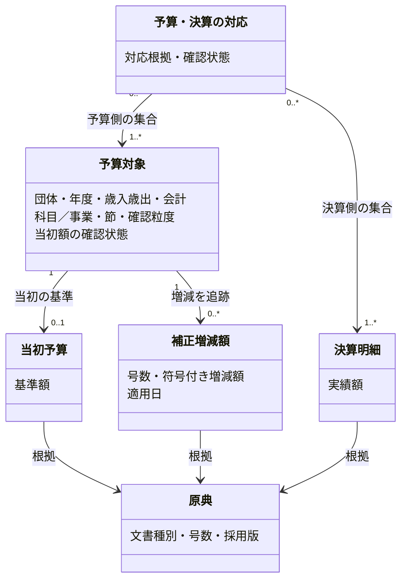

# 補正予算をパイプラインに収録する

関連 PRD: [budget-account-structure](../budget-account-structure/prd.md)

## Problem

知りたい金額は、何にいくら使ったかを示す決算実績と、決算がまだ確定していない年度の時点別予算額である。既存のパイプラインは当初予算と決算を取り込んでいるが、実資料から作る補正増減額が空のため、当初額にその時点までの補正を反映できない。

当初額と各号の補正増減額を別々に収録する。決算書の報告予算現額との照合はパイプラインの精度検証に用い、差額をmartへ含めない。

## 導出

Storyの「数字が怪しいと思ったときに、原典と合っているか確かめる」を、原典からmartまでの対応とパイプライン内の検証で支える。

## Overview

原典の取得・取り込みから、staging・intermediateを経てmartを作る範囲を扱う。最初は狛江市（132195）2023年度一般会計・歳出の予備費と商工業振興費を収録する。

当初予算書、第1〜7号の補正予算書、議決結果、決算書・既収録CSVを調査し、二目の当初額と3件の補正、計10決算明細の集合を確認した。事業×歳出の節への対応は未確認である。確認した額をmartへ収録し、不足は未確認として残す。

### Goals

- 原典に基づく当初額・符号付き補正増減額・決算との対応をmartに持つ。
- 決算実績は既存martで扱い、決算がまだの年度は当初額＋指定時点までの補正増減額で予算額を求める。
- 最終的な小計と報告予算現額の差をパイプラインの検証結果に記録する。
- 金額・適用日・対応・必要資料の未確認を区別する。

### Non-Goals

- 繰越、予備費充用、流用の取り込みとmart化。今回の小計は当初額＋補正額だけを表す。
- 利用者向け機能、配布・保存先、公開運用の設計。
- 全国・全年度の収録、未確認の額や日付の推定、総額の事業・節への配賦。
- 歳出の節マスタ・事業×節の集約処理そのものの実装。別担当の設計を取り込み側から参照する。

## Glossary

共通用語と層の意味は [AGENTS.mdのGlossary](../../../AGENTS.md#glossary) に従う。

- **予算対象**：当初額と補正を追跡する、団体・年度・歳入歳出・会計内の科目・事業。
- **補正増減額**：補正予算の各号が一対象の予算を増減する額。減額は負とし、補正前額や補正後総額とは区別する。
- **予算・決算の対応**：当初・補正の予算対象と、それに対応する決算明細の集合。例えば商工業振興費の予算対象1件と決算CSVの9明細を結び付ける。
- **報告予算現額**：決算書等に自治体が記載した予算額。当初額＋補正額の計算値とは別に、内部検証で参照する。

## Domain Model

確認済みの歳出予算対象は事業×歳出の節とする。初回の実測は目単位なので原典行の粒度を保持し、節の対応は未確認とする。確認できない総額を細かい対象へ配賦しない。当初額は記録あり・根拠付きゼロ・未確認を区別する。

当初予算と補正の下位内訳はそれぞれの金額記録に属する。末端の額を合算し、目・節の小計を重ねない。決算実績は別の金額であり、予算の復元式へ入れない。予算・決算の対応がM:Nでも、双方の集合をそれぞれ一度だけ集計する。

## Acceptance Criteria

- [ ] パイプラインを実行すると、二目の当初額・3件の補正・10決算明細との集合対応が原典参照付きのmartになる。
- [ ] 当初額＋指定時点までの補正増減額から予算額を求められ、決算実績と混ぜない。
- [ ] 年度末時点の小計と報告予算現額の比較値・差額・比較状態をパイプラインの検証報告に残す。差額の原因や説明用の根拠は持たず、差額をmartへ含めない。
- [ ] 再公表・訂正・小計・M:N対応による二重計上を防ぎ、補正の欠号・日付・節の未確認をゼロや確認済みとして扱わない。

補正の収録範囲の確認と、予算現額との一致は別に判定する。補正を全号収録しても、対象外の増減を含む予算現額との差が残る場合がある。差額を補正として追加せず、予算全体を復元できたとは扱わない。

## 設計の状態

これは実装前の要件である。取り込み方法、モデルの接続、検査、確認した原典は [設計書](design-doc.md) にまとめる。原典の調査は行ったが、実資料を入力一覧へ採用する処理とmartの生成は未実施である。
