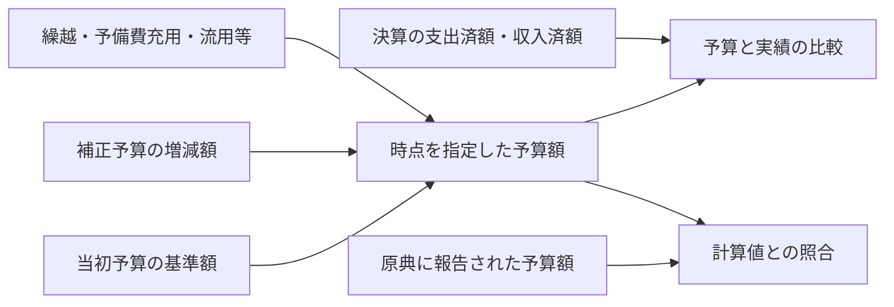

# 予算の変更履歴と決算の実績を分けて提供する

関連 PRD: [budget-fdp-pilot](../budget-fdp-pilot/prd.md)、[budget-account-structure](../budget-account-structure/prd.md)

## Problem

現在の決算由来の明細には、執行済額に加えて補正後予算額や予算現額を持つものがある。利用者は金額段階を選べば区別できるが、当初からどの変更を経てその予算額になったのかは辿れない。補正予算の原典と、資料をまたぐ明細の対応は未収録である。

決算の提供用明細を実績の一金額に整理すると、支出・収入の集計対象を明確にできる。ただし、決算に載る予算額だけを先に削除すると、予算と実績を比較するための情報が失われる。当初予算・補正予算に加え、繰越・予備費充用・流用などの変更を別に管理し、原典の報告値と照合できることが移行の前提となる。

## 導出

Story の「他の街や他の年と同じ物差しで比べる」と「数字が怪しいと思ったときに原典と合っているか確かめる」ために、予算と実績の意味・時点を区別し、予算の変更と計算根拠を辿れるようにする。

## Overview

決算の提供用明細は、歳出なら支出済額、歳入なら収入済額の `amount` 一つを持つ形を目指す。当初予算は基準額、補正予算は号数・対象時点と増減額を持つ変更として管理する。決算原典にある予算額は照合用に残し、予算の変更履歴から求めた値と区別する。

決算実績の一金額と予算・変更履歴の分離は提供契約へ適用済み。事業×歳出の節への予算明細の集約と、履歴資料の収録・明細対応は未完了である。原典の照合用の金額段階は保持し、資料の収録粒度と対応を実資料で確認して移行する。

### Goals

- 利用者が決算の実績を一金額として取得・集計できる。
- 利用者が当初予算と各号の補正を区別し、指定時点の予算額と実績を比較できる。
- 予算額の計算に用いた原典・変更・明細の対応と、復元できない範囲を確認できる。
- 決算原典の報告値を保持し、計算値との差異を確認できる。

### Non-Goals

- 原典・取り込み表・内部の照合用データから報告値の列を削除すること。
- 全国・全年度の資料を一度に収録すること。
- 公営企業会計の収録や COFOG の分類体系の変更。
- 原典にない明細への配賦や、資料未取得の変更をゼロと推定すること。
- 決算実績を予算の変更履歴から推定すること。実績は決算原典から取得する。

## Glossary

- **予算の変更履歴**：当初予算を基準に、各補正とその他の変更の金額・時点・根拠を区別した記録。
- **補正の増減額**：その号の補正で増減した額。補正前額や補正後総額とは区別し、減額は負の値として扱う。
- **原典の報告値**：決算書等に自治体が記載した予算額。風土記が変更履歴から求めた計算値とは別に保持する。
- **明細の対応**：別の文書に載る科目・事業を比較するための関係。名称の一致だけでは確定しない。

## Domain Model

- **歳出の節**は、給料・旅費・委託料等の経済的な性質による分類である。適用期間のある共通の定義として扱い、歳入の財源区分や COFOG の目的分類と混ぜない。
- **歳出予算対象**は、団体・年度・会計・科目／事業経路・追加区分と歳出の節で区別する。別事業の同じ節、同じ事業の異なる節は別対象である。原典で分解されていない事業を作らない。
- **歳出の当初予算明細と変更**は、その対象の一つの金額と原典に基づく下位内訳を持つ。細節・細々節等は内訳として扱い、原典行への対応を保持する。確認した末端内訳を合計し、小計を重ねて計上しない。
- **未確認の明細**は、節への対応や集約時の分類・連結判断が確認できるまで、原典の粒度で保持する。節不明の明細をまとめたり、金額ゼロと推定したりしない。
- **決算明細**は原典に報告された実績を持ち、予算対象との対応で比較する。予算と決算の粒度を無条件に同一視しない。

事業×歳出の節への集約は採用した設計であり、現行実装には未適用である。保存形式・命名・移行条件は [財政データの設計](../../design-doc-fiscal-records.md) に定める。

## 必要な原典と収録範囲

当初予算書・各号の補正予算書・決算書に加え、繰越計算書を取得対象に含める。繰越明許費や継続費など、取得した資料がどの繰越を扱うかと収録範囲を明示する。繰越計算書の年度と、金額を受け入れる予算の年度を区別し、前年度から当年度への繰越額として対応づける。

予備費充用・流用などについても、金額と対象科目を確認できる公表資料を収集する。歳入と歳出では必要な変更が異なるため、歳出向けの変更を歳入へ一律に適用しない。自治体が公開していない資料や、集計値しか得られない範囲は取得状況と粒度を記録する。

各資料について団体・年度・会計・歳入歳出・文書種別・版・対象時点を識別する。補正には号数と、原典の金額が増減額・補正前額・補正後総額のどれかを明示する。同じ資料の再公表を追加の補正として足さない。

繰越の議決上の限度額と実際の繰越額、予備費の当初計上額と実際の充用先・金額を区別する。繰越計算書で確認できた総額を、根拠なく事業単位へ分配しない。

## Acceptance Criteria

- [ ] 歳出予算を事業×歳出の節で取得でき、細節・細々節等の内訳の金額と原典行への対応を確認できる。
- [ ] 同じ節でも事業・会計・追加区分が異なる明細を混ぜず、法改正前後の節の定義と、節未確認の明細を区別できる。
- [x] 決算の提供用明細から、歳出の支出済額または歳入の収入済額を一つの `amount` として取得でき、原典の該当箇所に辿れる。
- [ ] 当初予算、各号の補正、決算の実績を別々に取得でき、予算の額と実績の額を合算しない。
- [ ] 増額・減額を含む複数の補正から指定時点の予算額を求め、各号の補正後総額を重ねて足さない。
- [ ] 科目の追加・改称・分割・統合を含む資料間の対応を確認でき、対応が確定していない明細も識別できる。
- [ ] 繰越計算書から取得した額を、繰越元と繰越先の年度・会計とともに確認できる。限度額と実際の繰越額を混同しない。
- [ ] 繰越・予備費充用・流用がある検証例で、その変更を含めた予算額と、原典の報告値を同じ粒度・単位で照合できる。計算や対応の誤りによる差異は解消し、残る差異は原典から理由を確認できる。
- [ ] 必要な資料が欠ける場合や粒度が足りない場合は、復元できる範囲と未確認の範囲が分かる。未確認を金額ゼロや完全な復元として表示しない。
- [ ] 計算値が原典の報告値と異なる場合も、双方の金額・出典・比較粒度が残り、原典の値を計算値で上書きしない。
- [ ] 配布ファイルと API で、同じ対象・時点・金額の意味を指定した結果が一致する。

## Success Metrics

- コアアクション：団体・年度・会計を選び、事業単位で予算と実績を比較する。
- 期待頻度：月次。原典や差異の確認は年数回。
- 数える対象：自分から開いた利用者のうち、予算と実績の比較を行った人数。通知・メール経由の来訪は除く。
- 主指標：初回の比較を行った利用者のうち、翌月にも比較を行った割合。現時点で外部利用者はいないため、目標値と観測方法は実資料の検証後、公開前に定める。

## 移行条件

提供契約は決算実績の `amount` 一つと、当初予算・変更履歴の別管理へ移行済み。以下の除去条件は原典との照合用に保持する内部の報告値に対する条件とする。履歴資料が未収録の範囲は API の予算復元を未確認にし、実績の提供を妨げない。

既存の決算由来の金額段階を除去する前に、移行対象の団体・年度・会計・明細の範囲を固定する。その範囲で必要な入力の収録、文書間の対応、原典の報告値の保持、計算値との照合、配布物と API の一致を確認する。

資料が欠けた範囲でも実績は提供できるが、予算の復元が完成したとは扱わない。既存の決算由来の予算額に代わる参照先が用意できていない範囲は、金額段階の除去対象に含めない。互換性の維持は要件にしないが、原典との対応と比較可能な情報は保持する。

照合で理由を確認できない差異が残る範囲は未確認として扱い、金額段階の除去対象から外す。資料の取得が揃っていても、二重計上や科目対応の誤りを残したまま移行を完了しない。

## 実装前に確認する事項

- 検証する団体・年度・会計と、補正・繰越・予備費充用・流用の実資料の取得可能性。
- 資料間で対応できる粒度と、科目の分割・統合時に比較できる範囲。
- 指定時点の扱いと、再公表・訂正があった場合に採用する原典の版。
- 予算変更を提供する契約と、原典の報告値・未確認の範囲を利用者が参照する方法。

これらを実資料で確認し、提供契約と移行対象を具体化するまでは `draft` とする。列構成・保存形式・取得処理の実装方法は設計文書で定める。

## 関連文書

- [全体設計](../../design-doc-monorepo.md)：dataset・決算実績と予算履歴・保存先の役割分担。
- [パイプラインの実行手順](../../../pipeline/README.md)：現行の取得対象と構築手順。
- [狛江市令和6年度一般会計決算書](https://www.city.komae.tokyo.jp/index.cfm/50%2C138924%2Cc%2Chtml/138924/20250707-101211.pdf)：予算額の内訳を照合する原典例。
- [富士見市の予算・繰越計算書](https://www.city.fujimi.saitama.jp/shisei/04zaisei/01yosan/yosansho/reiwa6nenndohoseiyos.html)、[大子町の年度途中の財政状況](https://www.town.daigo.ibaraki.jp/data/doc/1761635636_doc_15_0.pdf)：追加の入力を調査する資料例。
