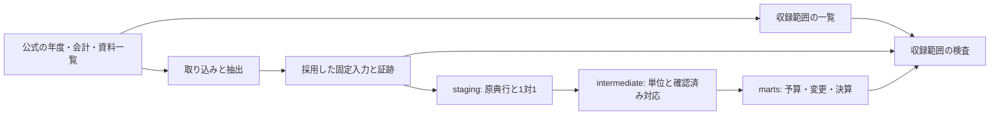

# 全公開年度の原典と提供データを照合する

## Objectives

- **Goal**: [PRD](prd.md) の全年度・全会計・当初／補正／決算を、原典一覧、固定入力、dbt の提供モデル、検証報告で追跡する。年度を追加する取得宣言と抽出器を整え、対応確認済みの決算にも事業×歳出の節の提供モデルを追加する。
- **Not goal**: 原典にない配賦、未収録の変更のゼロ補完、公営企業会計、公開サービスの再開。

## Background

取得宣言は採用済みの入力を表すため、宣言にない公開資料の未収録を検出できない。団体単位の粒度調査も、全年度・全会計・全補正号の完了判定には不足する。従来の決算明細は原典行の支出済額を保持していた。本変更では、原典行の提供を維持し、確認済みの事業と節で集約した決算の提供表を追加する。

## System Overview

この図は収録範囲の確認手順である。実際のモデルの系統は dbt の manifest から取得する。

## Detailed Design

### 目と、その下の事業を区別する

AGENTS.md の「事業単位（目）」と、原典の目の下に載る事項・細目・個別事業は粒度が違う。原典で確認した会計・款・項・目・事項／細目／事業・節の経路を残し、「目×節」と「目の下の個別事業×節」を収録範囲で区別する。片方の取得だけで、より深い組合せまで対応したとは表示しない。

### 公開資料を採用済み入力と区別して管理する

#### 採用原典を対象ごとに選ぶ

原典対象は団体・年度・会計・当初／補正号／決算・歳出／歳入で識別する。掲載URLは候補の属性であり、同じ対象の別URLをそれぞれ取り込む単位にはしない。各補正号は独立した対象とする。

同じ対象の正式な改訂・訂正の前後関係を確認し、最新版の候補から機械判読性が高いものを選ぶ。優先順は構造化データ（現在の候補ではCSV）、文字層を読めるPDF、画像PDF。同じ版・形式なら公式の財政ページを取得先とし、別の掲載ページは参考リンクに保持する。旧版CSVが新しい訂正版PDFより優先されることはない。概要・議決結果は明細の候補を置き換えない。歳出の方向と目又は個別事業の観測がない資料は明細の優先候補へ昇格させず、未確認として残す。目と個別事業の粒度は同一視しない。選択後も原典の粒度・単位・金額段階・承認と全量収録を別に検査する。

表紙・目次だけの資料は参考資料とし、目次だけに現れる科目名は明細の観測に使わない。異なる款を載せる分冊は相互に補完する資料であり、片方を選んで全体を収録したとは扱わない。候補一覧に全体CSVと分冊PDFが並ぶ場合も同じ内容とは自動認定せず、採用工程で原典の範囲を確認する。

版の宣言は既存の `pipeline/ingestion/fiscal/sources.json` の各原典にある任意の `publisher_revision`、公式財政ページかどうかは `listing_evidence.primary_fiscal_page` に記録する。選択と採用入力の読取りは `bun run sources:canonical --json`。別の選択一覧やroleの上書きは作らず、原典の役割は既存の `role` を使う。同じ版の宣言には公式根拠を付ける。改訂日・版の前後関係が未確認なら優先候補と `revision_order_unconfirmed` を残し、採用原典は未確定とする。掲載ページの更新日、確認日、URLやファイル名の日付を改訂日に転用しない。1候補だけの場合も公開最新版を確認済みとは扱わない。

掲載ページで識別した年度・会計・補正号と、本文の歳出方向・粒度の検証は別に扱う。対象の識別ができる資料を、本文未検証という理由で対象不明とは表現しない。対象を識別できない資料、対象を識別できるが本文確認待ちの資料、概要などの参考資料を区別する。

選択のために全候補を取得してSHA-256で重複排除する工程は設けない。取得済みの版と固定入力の照合には既存の保存済み版識別を使う。コマンドは原典・倉庫・提供CSVを読まず、ネットワーク取得と原典ハッシュの計算を行わない。`--missing-only` は同じ対象に採用入力が見つからない候補を示す。別URL・別版の採用入力がある対象、年度・会計・補正号が不明な候補を別に保持し、件数を実作業件数や全公開資料の残数としない。

既存の `coverage:fiscal` は採用済み版と提供データの全量検査を担う。原典の選択レポートはこの検査を完了扱いに変更せず、取り込み器への採用URLの反映と固定入力の変更は原典別の採用工程で行う。

`pipeline/ingestion/fiscal/sources.json` に対象団体、探索した公式ページ、確認日、公開資料の識別情報と確認結果を記録する。原典URL、年度、会計、文書種別、補正号・訂正版、確認した粒度を保持する。資料を発見した段階、内容確認、固定入力への採用、martsの全量検査を区別する。採用・構築の状態は `sources.lock.json` と構築結果との照合で確認する。

取り込み宣言も各原典の `ingestions[]` に持つ。取得計画と報告画面はこの台帳を読み、元のURLや掲載先を別の取得設定へ複製しない。有効な処理は明示登録し、選択候補の発見・順位だけでは取得を開始しない。CKAN設定、別の掲載先、複数原典を使う履歴処理も同じ台帳の参照で表す。収録範囲の監査は台帳と固定入力・現在の構築から再生成する報告であり、別の手編集する管理台帳を作らない。

旧取得宣言を参照する固定証跡は保持する。個別取得器の設定と採用定義の移行・再構築が完了するまでは、共通取得器の切替だけを全体の移行完了とはしない。

### 原典台帳を小さくする案

更新日: 2026-10-06。状態: Draft。担当: 実装agent。原典管理のSSOTは `sources.json` とすることをユーザーが指定した。対象キーと詳細項目は検討中であり、候補・選択を中心とする構造への変更はまだ行っていない。

以下は `sources.json` を小さくするための構造案である。台帳の中心を、原典対象ごとの候補と選択した原典にする。対象は団体・年度・会計・お金の向き・資料の区分・補正号で識別する。同じPDFが複数会計を載せる場合は、各対象から同じ原典IDを参照する。原典のURLを会計ごとに複製しない。

| 台帳に持つもの（案） | 内容 |
|---|---|
| 原典対象 | 識別に必要な団体・年度・会計・向き・資料区分・補正号 |
| 候補 | 原典ID、URL、形式・判読性、公式の版。未確認値を補完しない |
| 選択した原典 | 候補IDと収録範囲。分冊なら複数ID。選択未確定ならNULL |
| 選択の根拠 | 確認した版・範囲・確認時点・判断の短い記録と、公式ページ・原典の位置への参照 |

同じ範囲を載せる別形式・別URLを代替候補として比較する。異なる款などを載せる分冊は、各収録範囲と必要な原典IDをまとめて選択する。対象全体との対応が未確認なら選択未確定を保ち、選択しただけで取り込み済みや全量収録とは扱わない。

候補・選択・手で定めた判断は `sources.json` で一元管理する。原典管理の正本を別JSON/TOMLや団体ノートへ分けない。台帳に保存した選択を正本とし、選択コマンドはポリシーとの照合や変更案を報告する。取得器は候補の順位だけで選択を上書きしない。`fixed_inputs`・`marts`・`lock_reconciliation` の重複する状態は固定入力と現在の構築から判定する。

`content_inspection` の本文抜粋など、固定した原典・位置・実行コードから再生成できる詳細は既存の検証報告で扱う。人が確認した版・範囲・判断・確認時点は台帳に残す。過去のHTTP応答は再生成できないため、現在の再取得結果で置き換えない。選択に必要な事実のみを短い宣言に残し、過去の詳細はGit履歴から辿れるようにする。現在の数値indexによる検査記録への参照は、同じ版・範囲を指す安定した参照へ移してから削除する。

候補の対象を識別できていることと、本文や全明細を検査できたことは区別する。目次や概要を明細として扱わず、事業×節の対応不明を保持する。対象へまだ対応づけられない原典も失わず、未確認として残す。現在の候補選択と収録範囲監査が詳細記録を参照しているため、これらの判定を維持できる短い台帳の宣言と再生成する検査へ移してから詳細を除く。

候補と選択は、どの原典を使うかを定める。取り込み宣言は、その原典をどう読むかを定める。PDFでは頁範囲・列座標・左右の頁にある欄・金額単位などを指定する。例えば千代田区2022年度一般会計は、歳出をPDFの150〜253頁から読み、左頁の目・節と右頁の説明を区別し、金額単位を千円とする。こうした原典固有の指定は、必要な原典だけに台帳内で持たせる。

抽出アルゴリズムと検査処理はコードに置く。台帳とコードに同じ値を二重に持たせない。共通の組版指定を共有するか、原典ごとの指定を持つかは現在の取得器の差を調べて決める。構造の正本は既存の `sources.schema.json` とし、TSの型が必要ならそこから生成する。TSにも同じスキーマを手書きしない。

`sources.lock.json` は採用した原典・表・宣言を固定するスナップショットであり、現在の原典選択と二重に手編集する管理台帳にはしない。検証報告は原典・コード・固定入力から生成する結果である。個別取得器が現在も読む旧設定は移行対象で、移行後に残す固定時の旧設定は再現用として扱う。

個別宣言の集約は、すでに登録された8原典に対応する狛江市2023〜2026年度当初の19会計年度から進める。通常取得器と抽出器は台帳の `initial_detail` 宣言を読む。旧 `sources-initial-detail.toml` は明示指定した再現用であり、現在の宣言は台帳だけを編集する。共通の182宣言と、この19宣言を合わせた201処理が取得計画に現れる。親原典の団体・年度・会計・向きとの一致を検査し、会計別の頁範囲は読み取り指定から導出する。

狛江市2019〜2022年度の一般会計当初の章別8宣言も、登録済みの8原典へ集約した。通常の定義読み込みと再抽出器の宣言読み込みは `recovered_initial_detail` を使い、旧TOMLは明示指定の再現用に残す。台帳へ集約した処理だけを数える取得計画は209処理になる。公式URLから、宣言したWaybackの捕捉日時と元の通信方式を使って取得先を組み立て、観測済みのURL・版との一致を検査する。承認未確認、空の金額段階、事業と節の対応不明を保持し、この移行を新規収録や全年度完了とは扱わない。

章別8宣言を含む通常の259取得定義は、旧宣言との全値・型の一致を確認した。658件の固定入力の原典・表・範囲は変更せず、41入力の支持コードの参照を更新した。移行候補の構築は602項目成功し、旧通常構築との202CSV・1,043,439行の比較では金額・原典対応・行順を保持した。198CSVはバイト一致し、残る4CSVの変更は支持コードの参照だけである。

既存の再抽出入口は引数を処理せず、`--help` でも抽出へ進み、入力記録で `origin_sha256` の不足により停止する。この入口の修復と、台帳未対応の昭島市2019年度9原典と多摩市2019〜2020年度15原典に対応する計70表の集約は未完了である。

現状を維持すると調査記録と取り込み宣言を一箇所で辿れるが、調査記録の追記が固定入力の再現に使う定義の変更に波及する。すべてをコードへ埋め込む案では、取得処理と公開資料の選択を一緒に変更することになる。

対象キーの `phase` を資料区分（当初・補正・決算）と金額の段階のどちらに使うかは未確定である。現行Glossaryでは金額の段階を指す。決算資料にも複数段階の金額が載るため、資料区分と金額の段階は別に保持する。補正資料も号を識別し、符号付き増減額を補正後総額と区別する。

移行案は、現在の候補集合・選択結果・未確認事項・固定入力658件の原典と表・提供金額を保持できることで検査する。根拠の詳細を外したことを、検査済みや全公開範囲の完了へ読み替えない。

探索が不十分、アクセスが失敗、資料名だけを確認した状態は未確認とする。公表がまだない年度の決算も、推定値やゼロに置き換えない。別の年度の組版が同じだと仮定せず、PDFの会計・頁境界と内部合計を年度ごとに検査する。

ページの見出しが「予算・決算」でも、添付名と原典の金額列が当初予算を指すCSVを決算に分類しない。三鷹市・多摩市の採用済みCSVについては、公式の年度付き添付名と予算額／決算額の列を照合し、同じ明細行に目・事項／細目・節・金額が載ることを全行確認した記録を一覧へ加えた。この原典の対応確認は、提供表への到達や全公開資料の探索完了とは別である。

古いカタログの年度付きリンクが現在は別年度のバイト列を返す場合、カタログの年度を現在のファイルへ転記しない。掲載された旧年度と現在の採用版の年度の不一致を残し、旧年度の公式アーカイブ・別URLと照合する。同じハッシュが採用済みでも、その一致だけで旧年度の提供完了を認定しない。

### 年度と会計を取り込みへ追加する

CSVは公式公開原典の文字コード・列構成・年度・金額列を確かめて取得宣言へ追加する。PDFは実物で頁・会計・組版を確認し、抽出表と原典の小計・合計を照合してから採用する。取得宣言・金額段階と単位の宣言・原典の科目経路・節マスタの適用期間を合わせて検査する。

複数会計のPDFを一般会計だけの既存頁範囲で処理した結果を、全会計収録とは表示しない。抽出に失敗した会計は採用済み入力へ混ぜず、原典一覧へ失敗箇所と根拠を残す。

### 事業別と節別の独立した内訳を保持する

千代田区2026年度の一般会計では、冊子144頁の目「議会費」に節別金額、145頁の説明欄に事業別金額が載る。例えば事業「区議会だより発行」は16,932千円、目全体の節「委託料」は58,177千円である。両内訳の合計は505,900千円だが、当該事業の委託料がいくらかはこの表から特定できない。[公式予算書](https://www.city.chiyoda.lg.jp/documents/583/r8kaikeiyosan.pdf#page=146)を2026-10-04に確認した。

公開表で対応を確認できないことと、自治体の内部で対応が存在しないことを区別する。別の公開資料に対応があるかを探索し、対応を確認できない場合は「目×事業」と「目×節」を別の粒度で保持する。どちらの内訳を使った集計かを明示し、両表を足して二重計上しない。名称や金額の一致だけでは事業と節の対応を認定しない。両方の内訳の取り込み・提供が未実装なら、その欠落も収録範囲の未完了事項にする。

### 決算の確認済み事業と節を集約する

既存の決算原典行と予算・決算の対応リンクを保持したうえで、確認済みの決算行を事業×歳出の節で集約する提供モデルを追加する。集約キーは同じdataset内の会計・節より上の順序付き経路・追加区分・法定節である。COFOGと連結判断が異なる行、節が不明な行は原典行の粒度を保つ。

金額は支出済額のみを円で合計する。内訳は原典行ID・行番号・下位経路・金額を保持し、datasetごとの合計不変と原典行の一度だけの収録を検査する。事業別と節別の独立した合計は集約の入力にしない。原典行の提供モデルへの既存リンクは、集約行IDへ暗黙に置き換えない。

### 補正の全号と金額を照合する

年度・会計ごとの当初予算と公開された各補正号を探索し、採用版・適用日・原典の基準額／増減額／補正後額を保持する。`before + delta = after` が成り立つ原典行のみ符号付き変更として収録し、変更のない行を推定で生成しない。補正後総額を変更額へ混ぜない。

既存の二目向け履歴モデルは、当初行との内部結合で予算対象を得る。全目への拡張では、当初行が未収録の目の補正も落とさず、公開された補正行をその粒度で保持する。当初額や事業と節の対応が未確認なら、その状態を明示する。目ごとの増減額を、その下の事業や節へ配賦しない。

全目の別表と既存の二目の履歴が同じ会計・年度・補正号・原典版を扱う場合、それらを加算しない。原典の別表としてそれぞれの行を保持することと、予算対象に適用する一つの変更を採用することを区別する。承認を原典や公式の議決記録で確認できない案は、承認済みの補正へ昇格させない。

年度末の予算現額と当初＋補正の差は内部検証に残す。繰越・流用・充用など未収録の理由を保持し、差額を補正として追加しない。

## 停止時点（2026-10-06）

採用済み658固定入力から602項目成功・202CSVの同一構築IDでの一致まで確認した。公開全年度の完成は未達で、作業は停止している。[振り返りと再開時にやること](retrospective-2026-10-06.md)に現在の範囲と残課題を記録した。以下の件数は各追加段階の履歴として読む。

## 実装状況の履歴（2026-10-05）

### 採用済み入力の構築と照合

直前の全量構築では固定入力326件、入力一覧SHA `3608ace75a7e3616f42aa443ffe8bb11a32f1c0af0da7d863feaccd19999a5ee` を使用した。構築ID `b-57c23b1b7c3b4153d80cb7c48ced2b99` で、既存の検査を含む300項目が成功し、110個のCSVを生成した。同じ入力とコードで再構築し、同じ構築IDと全CSVのハッシュ一致を確認した。その時点の通常の収録範囲監査は `verified_current_build`、採用済みdatasetの提供データの欠落は0、固定入力一覧との未対応も0だった。5団体の検証報告は各90項目が成功した。系統はdbt manifestの409ノード・612辺から取得した。

追加の補正6版を採用した332固定入力の構築ID `b-92fa85a250c820ed1dc34bc8008a41d2` では、305項目の成功と全110CSVの再構築時の一致を確認した。旧326件の順序・値・採用証跡も保持した。

さらに位置付き原典観測から取得した補正10版・85行を採用し、この時点の固定入力は342件、入力一覧SHAは `eb7d761d88b37dbc7211baf44deb08aa7d33f2265c0996036cc22d4b4699d368` である。旧332件の順序・値・採用証跡を保持した。通常監査の全原典列照合と当初予備費・三鷹市決算CSVの現行入力に対する証跡を含めた構築に、三鷹市の当初予算の議決証跡と承認版の未確認事項を加え、この342入力で確認した構築IDは `b-14fad97b28e77648483b08223d531b11` である。310項目が成功し、同じ構築IDでの再実行でも全110CSVのハッシュが一致した。全110CSVは議決証跡追加前の342入力の構築 `b-9dca9959f755b5c5f0f7107614e3938f` とも一致する。直前332入力の構築との変更は狛江市の変更・予算対象の2CSVのみで、他の108CSVのハッシュは一致する。通常監査は `verified_current_build`、採用datasetの提供欠落0、全342固定入力の未対応0である。この構築後に再生成した各団体の検証報告も90項目成功・警告0で、系統はdbt manifestの430ノード・642辺である。

これは現在採用した入力の構築と照合の結果である。全公開範囲の監査は未完了のためexit 2であり、PRDの受入条件は完了にしない。原典一覧は1,015候補を保持し、631の財政資料候補のうち20資料が全対象版の完了条件を満たした。資料・粒度の未完了判定611件、未確認の探索18件、年度・会計の不足14件、探索境界の未完了163件を残す。同じ原典の別リンクや粒度の確認不足も含むため、この件数を未取得原典の数とは扱わない。

### 三鷹市の決算CSV

公式の[2014〜2019年度](https://www.city.mitaka.lg.jp/c_service/093/093123.html)・[2020〜2024年度](https://www.city.mitaka.lg.jp/c_service/098/098680.html)・[2025年度](https://www.city.mitaka.lg.jp/c_service/074/074161.html)の決算CSV入口にある全12歳出添付を再取得し、年度付きリンク名・実URL・原典のハッシュとサイズを確認した。公式説明は予算執行実績報告書の内訳・円単位である。全60,464行・全8原典列が固定Parquetと一致し、現在の提供CSVでも原典行・会計・支出額・明示された事業と節を保存する。三つの入口の観測HTMLも計60,162bytesを非公開R2の `inputs/origin/sha256/<SHA>` へ保存し、取得し直したバイト列を照合した。各HTMLのSHAは収録範囲の証跡に保持する。

完了した探索境界はこの三つの公式CSV入口の有限範囲である。ページ外の年度・PDF等の別形式や、自治体全体の探索完了には広げない。公表された支出済額と議会の認定結果は別であり、認定日時・結果は未確認である。当初予算CSVについても、公式ページの「予算」という記載だけでは承認済みの版を確定しない。

当初予算CSVの承認根拠については、公式の[本会議結果一覧](https://www.gikai.city.mitaka.tokyo.jp/activity/result.html)から2016〜2026年度の各第1回定例会の実HTMLを取得し、CSV全行の会計異なり値と59会計年度の予算議案番号・年度付き会計件名・本会議議決日・原案可決を対応させた。委員会の審査結果と最終議決結果を区別する。[現行予算書](https://www.city.mitaka.lg.jp/c_service/085/085303.html)と[過去の予算書](https://www.city.mitaka.lg.jp/c_service/090/090334.html)の2020〜2026年度14PDF・全4,248頁の位置付き文字を取得し、35会計年度の第一条の印字総額・千円単位と採用CSV全38,837行の会計別合計が一致した。合計の一致だけでは全明細と議決対象の原典版の対応を証明しないため、11の当初CSVの収録範囲は未完了のままで、その具体的な未確認事項を原典一覧へ記録した。2016〜2019年度の予算書はこの二つの入口にはなく、他の入口も含めた不存在は未確認である。

今回観測した5入口HTML・11本会議結果HTML・14予算書PDFの計30原典、43,333,328bytesを非公開R2の `inputs/origin/sha256/<SHA>` へ保存し、全30件を取得し直してハッシュとサイズを照合した。

2024年度の議会結果ページのリンクは、リンク名が令和6年度のまま現在の令和8年度予算書を返す。同じURLを原典版の根拠にせず、実PDFの表題・年度・ハッシュを確認して、2024年度の原典としては却下した。過去の予算書入口の実2024年度PDFとは区別する。

### 通常PDFと独立した節内訳

千代田区2025年度の未対応4会計の調査では、全500頁の公式原典（SHA `d8783bb65906f6780918a03286b6f0375c06562a8528f10784e682123a2f8235`）を回収した。親が13実頁の描画と位置付き文字認識を取得し、冊子146・147頁（物理148・149頁）を直接確認した。議会費564,878千円の左欄には目×節、右欄には12事業の別内訳が載る。認識文字と目視転記を区別し、この頁だけの確認で全冊の取得や事業×節の対応を認定しない。その後、固定した原典・観測・証拠から再構築する8表を、固定入力・各層・提供表へ接続した。承認状況と事業×節の対応、未解決のセルは未確認のまま保持する。採用と再構築の範囲は下記の記録による。

千代田区2022〜2024・2026年度の16会計年度と昭島市2020〜2026年度の確認済み31会計年度について、通常PDFの94方向表・34,887行を保持した。千代田区の左頁の目×節は別の16表・2,741行として提供し、右頁の個別事業の金額との対応は未確認のまま保持する。両者を加算しない。採用済みの独立表は通常監査で全量照合済みだが、未対応の年度・会計や他の公開資料を収録したことにはならない。

昭島市の未収録8会計年度（2023年度の土地・北部、2025年度の国保・後期高齢・土地・北部、2026年度の土地・北部）は、公式当初書から24私有候補表を回収した。445説明行は437の事業・節名称・説明と8の実予備費行で、別に786の非加算統制値と左欄の183法定節観測を保持する。親の読み直しでも全437証拠ファイルと24表のハッシュ・型・行数・原典識別が一致した。第一条・目・事業・節名称・比較欄の独立した印字値を照合し、全額の取得欠落と差は0だった。説明行と左欄法定節の対応を原典は示していないため、445行の印字節コードと法定節IDはすべてNULLである。左欄も5件の名称対応が未確認で、名称だけで説明行へ法定節を付けない。固定した位置付き観測と目視転記を含む216入力・55,118,184bytesから、ネットワークと旧候補表を使わず24表を再構築する実装案を受け入れた。親は計1,271ファイルのハッシュを読み直し、全24表・1,414行の原典列が旧候補と一致することを確認した。同じラスターを指す証拠参照の表記だけが異なる。この24表の原典・証拠・取り込み表は、240個別オブジェクト・56,270,900bytesを非公開R2から実取得して照合した。親も追加案63ファイルの現行・追加ハッシュ、全240取得物、24表・1,414行の全原典列と各層・型付きCSV、445行の原典観測JSON、既存の全明細の保持を直接確認した。その後、専用取り込み・staging・intermediate・提供CSVへ接続する63ファイルを本体へ反映し、393入力の順序・値・採用証跡を保持して417入力へ追記した。入力一覧SHAは `3efd1ac71bcf686fc582a62b95a780c3043f256314e3fb4a5085c44d22aa543a`。本体の全63ファイルと417入力も親が読み直した。16の非加算datasetは金額段階を空・提供金額の種別をNULLとし、説明行へ加算しない。417入力の全量構築では、既存の金額保存検査の比較原典一覧にこの8版が未登録だったため、追加8版の原典行を比較対象へ接続した。修正後は360項目が成功し、全125CSVの実ハッシュを確認した。通常監査は全24表の全原典列・位置・単位・NULL、各層、445行の全原典JSON、独立した第一条・会計・目・事業・節の印字合計、左欄の節、各型付きCSVを直接照合し、採用dataset・固定入力の対応欠落は0だった。昭島市の旧当初予算・予算対象の2CSVも全旧行を保持し、追加は445行ずつである。他117CSVは393入力の構築から変更がない。既存20原典の完了証跡も、現行全量監査と原典全体・公開粒度の例外検査を再確認して417入力へ接続した。記録を含む構築IDは `b-251393165f4e090f5de27c222adebc4c` で、同一構築IDの再実行は全125CSVのハッシュ一致を確認した。記録後の最終通常監査も `verified_current_build`、全24表と多摩市の51表の全列照合が成功し、採用dataset・全417固定入力の対応欠落0、既存の検証済み20原典を保持した。各団体の検証報告も90項目成功・警告0で、dbt manifest由来の系統は491ノード・703辺である。公式添付から確認した2020〜2026年度の39会計年度と旧採用31会計年度を区別し、2019年度以前の不存在を主張しない。

昭島市2024年度の決算は、公式全冊651頁から一般・国保・介護・後期高齢・土地・北部の6会計を私有候補へ回収した。親は821ファイルのハッシュ、18の会計別・原典役割別表と3集約表の全型付き列、移設再構築の6不変入力、全651頁と3,102の独立した印字統制値を実際に読み直した。支出済額は計77,273,862,108円で、1,026の目×印字節の明細、555の別立て事業統制値、754の非加算統制値を区別する。実印字の56ゼロと6予備費NULLを保持する。原典列の法定節IDはすべてNULLで、別の対応検査では1,006行が印字番号・全名称・適用年度で一致し、14行の「補塡／補填」の文字差と6予備費は未対応のまま残す。説明事業の番号から法定節との対応を作らない。6会計の番号付き決算認定は2025-10-02の公式議会結果で確認した。2025年度の予定表は認定結果へ読み替えない。この2024年度回収は、親が25個の原典・取り込み表・復元証拠を非公開R2から実取得してハッシュ・バイト数を確認した後、専用の取り込み・各層・9CSVへ接続した。旧422入力の順序・値・証跡を保持して19入力を追記し、現在441入力の一覧SHAは `c3024d9b3170751bade2ae4f8afc5b915707fa54e7941a489f9e498ee26a5f74` である。全量構築38は389項目成功・警告0・エラー0で、135CSVを生成した。親は通常監査の追加実装で19表の全原典列・型・NULL、各層と実CSV、款44・項89・目186・会計及び概要12・款別概要50・事業の目別合計167・予算現額の印字算式1,351を直接照合した。旧20原典の完了証跡だけを現行一覧へ再接続し、新しい原典の全公開範囲完了は認定していない。現行版の全量構築40と同一IDの再構築41（`b-8862c698cbb4a5572eac3aff3095f432`）は389項目成功・警告0・エラー0で完了した。135CSVの実ハッシュは全件一致し、追加前の126CSVも変更していない。最終通常監査は現行構築を確認し、採用済み19表の出力漏れ18件は0件になった。検証報告は5団体とも90/90成功・警告0である。一方、原典の未検証611件、境界163件、母集団14件、探索18件が残り、全公開範囲の収録は未完了である。この後、2020〜2023年度の公式4全冊・1,907頁、21会計年度を `akishima-settlement2020-2023/` の71固定入力として本体へ採用した。旧441入力の順序・値・証跡を保持し、現在512入力、一覧SHAは `2635450c51bcd05a8ccb7c8b0fcab7905dfc1faa3adb1ed36e84949e53a3dda1` である。83個の原典・取り込み表・不変復元証拠を非公開R2から親も実取得し、全SHA・バイト数を照合した。4,060の目×印字節明細の支出済額は303,881,405,065円で、2,236事業備考、2,618非加算統制値、全頁観測は別粒度として保持する。233の実印字ゼロと21の予備費の空白節を保持し、事業×節の対応は未確認のままである。原典の法定節IDはNULLとし、別の判断列では3,208行が印字番号・名称・適用年度に一致、名称差831行と空白21行は未確認とする。2020年度の認定も未確認である。全量構築42（`b-33da22e1198964939c0247d94cf0ab45`）は415項目成功・警告0・エラー0で、145CSVの実ハッシュが全件一致し、旧135CSVに変更はない。親の独立した照合でも67歳出datasetの全原典列・型・NULL、各層、型付き実CSV、21会計と4年度の独立した印字合計が一致した。71datasetの金額段階は金額を持つ歳出明細21表だけをexecuted、非加算50表を空・提供金額種別NULLとする。通常監査へこの照合を接続し、旧20原典の完了証跡は現行512入力で再検査して接続した。新規4原典の全公開範囲完了は認定しない。接続記録後の全量構築43と同一IDの再構築44（`b-240642283a436ab5de18f832312b3e02`）も415項目成功・警告0・エラー0、全145CSVのハッシュ一致を確認した。最終通常監査は `verified_current_build`、追加67歳出datasetの全列照合が成功し、採用datasetの提供欠落と全512固定入力の未対応は0だった。検証報告も5団体すべて90/90成功・警告0で、dbt manifest由来の系統は558ノード・770辺である。512入力の現行監査でも原典未検証611件、境界163件、母集団14件、探索18件が残り、全公開範囲の完了はfalseである。

### 狛江市の当初予算と補正

2023〜2026年度の当初予算は、公式8PDFから19会計年度・全7,409行を固定入力へ採用し、原典別の整形・中間処理・提供CSVへ接続した。7,393行は印字法定節コード・正式名称・適用年度が一致し、16の予備費行は印字コードNULLを保持する。実原典の第一条19件、目656件、事業2,317件、左節3,359件、第一表款項397件、予備費16件を独立に照合し、全原典列・頁・位置・値・単位と提供金額の対応を確認した。通常監査も19datasetの全行と現在の証跡ハッシュを照合した。

承認を原典表紙で確認した42補正版・690行は変更IDと金額を保持する。686行は印字法定節コード・正式名称・適用年度が一致し、予備費4行には印字コードがない。637変更対象のうち496対象・538変更行には、同じ年度・会計・印字階層／事業・所属・節・原典粒度の完全一致による当初額がある。残る141対象・152変更行は未確認である。当初の7,409対象と未確認の141変更対象を合わせ、予算対象CSVは7,550行となる。名称や金額の近似で対応を補わない。

旧二目の当初額は原典行ID・対象ID・金額を非加算の `initial_moku_reference.csv` 2行へ保持し、全当初額へ足さない。496対象のnamespace対応は非加算の `initial_target_equivalence.csv` で根拠を保持する。旧補正の102目観測も別の非加算参照CSVに保持し、690変更と足さない。原典の旧観測と正準予算対象の状態を区別し、元の補正表の初期額未確認という観測を書き換えない。

2026年度駐車場の会計別承認済み当初書、2022年度以前の全当初予算、未採用の補正版や画像・輪郭文字の原典は未解決である。追加の番号付き議会承認補正6版・129行を固定入力・専用staging・intermediate・共通の変更／対象CSVへ接続した。128行は法定節に一致し、介護2号の予備費1行は印字コードNULLを保持する。18行は当初の完全一致識別情報に対応し、別の非加算対応モデルへ根拠を記録した。残る111変更行の当初額は未確認で、110の新しい対象IDを持つ。有限の統合構築では変更CSV819行・対象CSV7,660行となり、旧690変更・旧7,550対象・全当初7,409行・旧496対応証跡を変更していない。親の実ファイル読み直しでも22ファイルのハッシュと全129行の52原典列・承認証跡・日付・CSV金額が一致した。現在版の全量構築はこの有限照合とは別に上記構築IDで確認した。

当初19会計版の粒度証跡は、公式8冊の全1,849頁の位置付き観測と7,409行の提供額を照合した。予備費16行は実原典の節欄の空白領域を確認し、会計別の粒度と行単位の例外を記録する。節が空白の行を除去したり、存在しない節を付けたりしない。3つの駐車場会計版には空白例外がない。例外による完了判定にも通常の現行構築・全頁・全行の検査を要求する。

文字取得を保留していた古い17補正版は、全240頁と追加51頁の描画・位置付き認識を保持し、10版・85行を回収して専用の固定入力へ採用した。この時点で保留した5版は、その後の回収・本体反映を下に記録する。2版は番号付き別紙の全頁に歳出明細が載らない歳入・財源変更原典で、歳出ゼロや全公開資料の不存在に置き換えない。2021年度国保2号の印字提出日2021-02-24と番号付き議案・議決日2022-02-24の不一致も、そのまま別々に保持する。2023年度より前の当初予算は、今回の有限探索で取得できた概要や議案集には事業×節の全冊がなく、未確認の年度・会計を残す。2023年度を全公開年度の最古とは扱わない。

この10版の取り込みは、7つの宣言・取得・抽出ファイルと226の原典・認識・描画オブジェクトから再抽出する。925セルの目視確認証跡を保持し、49セルと18目名称の転記を認識結果と区別した。全226オブジェクト・82,816,864bytesと10取り込み表は、非公開R2へ不変のキーで保存し、個別に取得し直してハッシュとサイズを確認した。固定入力を332件から342件へ追記し、旧332件の順序・値・採用証跡を保持した。通常監査は全85行の52原典列・原典／議案／議決の証跡・印字符号・単位・提供CSVを直接照合する。85行は適用年度・印字コード・正式節名称が一致するが、当初の完全一致対象はなく、全行の当初額と通常議決の発効日は未確認である。2行が同じ完全一致対象を持つため、追加対象は84件となる。共通の変更CSVは904行、予算対象CSVは7,744行となり、旧819変更・旧7,660対象・全当初7,409行・旧496対象対応・追加6版の18対象対応を保持する。

狛江市で保留していた2020年度一般9号、2021年度一般8・11号、2022年度一般1・2号は、別紙全121頁から5版・241行・52原典列を私有候補へ回収した。親は372ファイルのハッシュと全12,532項目を実Parquet・型付きCSVで読み直し、第一条・109目・141事業・203左節の独立した印字値との一致を確認した。239行には印字節コードがあり、2つの予備費行はコードNULLと3,000／1,500千円を保持する。2021年度一般11号の低解像度での「原典矛盾」判定は、同じ原典の1200dpi画像の実印字114,338／4,500／10,410を親も直接読んだ結果、撤回した。旧OCR値・画像・位置・ハッシュを残し、差額から値を補っていない。回収時点では固定入力へ未採用だったため、302不変証拠から再構築する取り込み実装案の準備へ進んだ。

この5版の取り込み実装案は、採用済み回収の全302オブジェクトを保持し、範囲・転記・セル位置の宣言22件を追加した324入力・152,497,239bytesから再構築する。旧私有領域とネットワークへの読み出しを禁止した移設先で、通常CLIの既定値から全241行・52原典列、5つのParquetとCSVのハッシュを2回再現した。親も全324入力、12,532型付き値、3,592の原典位置、全121頁の範囲と独立した印字合計を読み直した。固有16ファイルと共有4ファイルへの最小変更案を受け入れたが、この実装案の受入時点では本体の登録・固定入力・martsへは未採用だった。専用の5版の粒度を保持し、既存10版・85行の取り込み範囲を広げない。非公開R2への個別保存・取得照合と、本体接続前の私有領域での各層構築を進める。

本体接続案では324不変証拠に5取り込み表を加えた329オブジェクト・152,772,855bytesを非公開R2へ保存し、通常復元の取得物を全件照合した。親も29変更案の現行・追加ハッシュ、329の保存後取得物と329の通常復元物、全241行・52原典列、各層・型付きCSV・原典観測JSON・節対応・対象同一性を読み直した。ワーカーが利用枠の上限で停止したため、その実行権限を終了し、親がレビュー済み29ファイルと329キャッシュ物を本体へ反映した。旧417入力の順序・値と採用証跡は全件保持し、入力一覧へ5版だけを追記した。現在は422入力、入力一覧SHA `724106467fa6ab0c3e105a42f05bfd0c34669f96abac8329bf3b0c6db30e0c00` である。241行には42減額、239の法定節対応、2つの予備費NULLがあり、240対象の当初額は未確認。完全な原典対象JSONが一致した8出現行で既存7対象を再利用し、233対象を追加した。狛江市の変更は904→1,145行、予算対象は7,744→7,977件となった。原典52列の `held5_raw_detail.csv` は千円単位の非加算参照であり、円換算した変更額へ重ねて加算しない。最初の422入力の全量構築は366項目成功・警告0・失敗0で、通常監査も現行構築の全5表・全原典列・位置・単位・NULL・独立した印字合計・提供CSVの照合が成功し、採用datasetの提供欠落と固定入力の未対応は0だった。既存20原典の公開粒度・全冊証拠も422入力で実際に再検査して接続し、その記録を含む構築ID `b-fea6cb4ce34ae48c9eebd69838b81755` の再実行では全126CSVの実ハッシュが一致した。旧125CSVのうち123は417入力の構築と同一で、変更した狛江市の変更・予算対象の2CSVも全旧行・型・値を保持し、追加は241変更・233対象だけだった。新規CSVは原典52列の非加算参照1つである。この後に列の見出しを観測行番号へ訂正した最終構築IDは `b-43ae3309b52f85a603561efce2b90574` で、366項目成功・警告0・失敗0、再実行でも全126CSVのハッシュが一致した。最終構築後の通常監査は `verified_current_build` で、補正5表・昭島市当初24表・多摩市決算51表の原典列照合が全件成功し、採用datasetの提供欠落と固定入力の未対応は0である。再生成した検証報告も5団体すべて90項目成功・警告0で、系統はdbt manifestの501ノード・719辺だった。原典52列の列説明は、別の作業領域で通常FDP生成を実行し、狛江市の19リソース・原典参照58列・5原典の対応を読み直した。全公開範囲の完成には広げない。

### 多摩市の決算と事業別財源

2021〜2025年度の決算PDFは4,443法定節行を持ち、806の印字目合計と20会計年度の印字合計に一致する。2025年度の公式議会添付から892行を追加した。節の子明細がない15の予備費目は、印字支出済額0の独立した観測として保持し、節の行を生成しない。公開された支出済額と議会の認定状況を区別し、認定は未確認である。

2022年度の事業別財源PDFは404事業・2,020財源行で、同じキーのCSV1,993行と404の印字事業合計に一致する。CSVの不足27行は実PDFのコード・名称・金額・位置から確認した。採用したPDF全文と不足行を重ねて加算しない。印字千円の合計と別の決算書の円単位の合計には464円の丸め差があり、印字値を修正しない。2022〜2024年度の決算CSV16件は候補として保持し、未採用である。事業×財源は歳出の法定節とは別の軸である。

4,443法定節行、2,020事業別財源行、非加算の806目合計・20会計合計・404事業合計・116,304位置付き単語を、53の固定入力と専用staging・intermediate・marts及び共通dataset登録へ接続した。通常監査で全53採用表のハッシュ・全原典列・全行を実CSV又は内部martsへ直接照合した。事業×財源と目×節から、より細かい事業×節を推定しない。

2020年度は公式9添付・全230頁を画像として読み、目次と四会計の表題から印字年度を確認した。表題の令和2年度と提出の令和3年9月1日を区別する。四会計の889印字節行・161目と114款項の非加算統制値・独立した4会計総額を私有候補へ回収した。全48節欄の印字行数と節名を確認し、金額欠落・行の等式・目及び款項と会計総額の差は0となった。3つの予備費目は実支出0で節明細がなく、節の子行を生成しない。親の実読み直しも7つのParquet・9原典のハッシュとサイズ・型・889行の全額101,464,923,429円・全230頁の対応を確認した。

この回収に対する取り込み実装案は、814の不変オブジェクト・210,003,290bytes、10の宣言・実装ファイルから8種類の型付き表・51の原典別表を再構築する。旧私有領域とネットワークへの読み出しを禁止した別領域でも、型・全原典列・位置・個別表のハッシュが一致した。親も全883ファイルのハッシュとサイズ、51表の型・原典識別・行数を読み直した。230頁の原典観測と重なりのある単語観測は別の非加算証拠で、財政明細に加算しない。原典上の目×印字節の889支出済額は、マスタとの対応とは独立して保存する。原典の年度・節番号を書き換えたり名称だけで対応したりせず、全行の法定節IDをNULL・対応未確認とする。認定状況と下位事業×法定節の対応も未確認である。取り込み実装案を受け入れ、非公開R2の個別保存・取得照合後に、正式な登録・各層・提供CSVへ接続した。法定節の対応、認定状況、下位事業との対応は、この有限範囲の採用によって確認済みにはならない。

接続準備では、814証拠・原典と49種類の表を非公開R2へ保存し、863個別オブジェクト・214,374,728bytesを実取得して照合した。51表の宣言のうち2件は同一内容のオブジェクトを参照するが、原典別の登録を統合せず、全51宣言について個別の取得照合も行った。私有領域の実構築では、既存342入力と採用証跡を保持した393入力の追加案、51の共通dataset登録、8種類の各層とCSVを確認した。35の単語・頁証拠datasetには金額段階・単位・方向を付けずSQL NULLを保持する。親も106変更対象の現行・追加ファイルのハッシュと、863取得オブジェクト、全8種類の原典列・原典観測JSON・各層・型付きCSVを直接照合した。この106ファイルを本体へ反映し、旧342入力の順序・値・採用証跡を保持して固定入力を393件へ追記した。入力一覧SHAは `55a849f8a79e9a5f7a36573c378b64358a5867448611ac3636e1ba6309440869` である。親が本体の全106ファイルを読み直し、通常監査へ51表の全原典列・識別・位置・単位・NULL、原典観測、型付きCSV、独立金額対照を検査する処理を加えた。393入力の全量構築は345項目成功・警告0・エラー0で、通常監査は全51表の提供を確認し、採用datasetと固定入力の対応欠落は0である。この時点の構築IDは `b-443b2a42cb7dd763663365d6a105066a`。既存20原典の完了証跡も、旧342入力・採用証跡の同一性、現行の全量監査、原典全体と公開粒度の例外検査を再確認して393入力へ接続し、他995原典の記録を保持した。その393入力で確認した構築IDは `b-850218dc25fecb4a0c1a60473ba2e60a`。345項目が成功し、同一構築IDの再実行で全119CSVのハッシュが一致した。追加した多摩市の9CSV以外の旧110CSVは変更がない。通常監査は `verified_current_build`、全51表の全列・金額対照が成功し、採用dataset・固定入力の対応欠落0、既存の検証済み20原典を保持する。原典201件を採用しているが、未完了の原典は611件、探索の未完了18件、公開範囲の未確認163件、対象集合の未確認14件が残る。各団体の検証報告も90項目成功・警告0で、dbt manifest由来の系統は473ノード・685辺である。公開全年度・全会計・全段階の完了は未達である。

### 残る全公開範囲

多摩市2017〜2019年度の有限探索では、2018・2019年度国保の決算一覧表、16の履歴CSV、14PDF・全239実頁を回収した。私有候補20表と763ファイルを親が読み直し、CSV全541レコードの原典列・バイト範囲、27,402位置付き単語、136の国保原典行・1,360セルの原典位置を照合した。2019年度の33目・18項・8款と印字会計総額は支出済額15,472,775,811円、予算現額15,704,921千円、当初15,583,149千円でそれぞれ一致する。節欄はなく、下位事業×節・認定状況は未確認である。2018年度に実際に印字された27セルの `#REF!` は数値NULLを保持し、支出済額全体を復元したとは扱わない。この調査時点では20表を私有候補として移設先のオフライン再構築でも照合した。その後、原典別に分割した49固定入力を次の手順で本体へ採用した。

多摩市の追加分は、30原典から49表を作る専用取り込み・各層・共通dataset登録へ接続した。親は原典だけを置いた二つの移設先で全49表を再構築し、型・全原典列・NULL・重複数・個別ハッシュを照合した。30原典と49取り込み表の79保存物、16,954,965bytesも、非公開R2から取得し直して一致した。旧512固定入力の順序・値・採用証跡を保持し、この接続時点では561入力で、一覧SHAは `ab5cfd931afb2439881208786ec3dbd113ae0efdb1501b861524cff01a797ba7` だった。

単語・頁・履歴CSVなどの47datasetは金額段階を空、提供金額種別をNULLとする。国保の2datasetは印字支出済額をexecutedとするが、款・項・目が混在する全体を非加算とし、認定と事業×法定節の対応は未確認のまま保持する。

原典一覧には27件を追加し、既存の3CSVに採用入力と内容確認を追記した。会計範囲を確認できていない財政状況分析の2PDFは参考資料として保持し、普通会計の決算書として完了に数えない。他の既存1,012原典と既存20原典の完了証跡を保持した。

接続後の全量構築46と同一IDの再構築47（`b-3359e44f1118695b5b25bf5e72079769`）は498項目成功・警告0・エラー0で、全166CSVの実ハッシュが一致した。追加21CSV以外の旧145CSVは変更がない。通常監査は `verified_current_build`、多摩市の追加49表の全原典列・型・NULL・各層・型付きCSVを照合し、採用datasetの提供欠落と全561固定入力の未対応は0だった。検証報告も5団体すべて90/90成功・警告0で、系統はdbt manifest由来の661ノード・873辺である。

同市の旧年度CSV4件は実取得で404となり、個別のカタログ掲載名は当初予算を指す。見出し「予算・決算」だけを根拠とする既存の決算分類を当初の掲載へ訂正した。特別会計2件も、除外された下水道を収録会計名とする誤りを直した。ただし、原典が取得できないため実金額の段階・単位・会計内訳は未確認のままである。

別の事業報告103添付も今回の実取得では404、電子図書館の閲覧先は403であり、公開資料の不存在とは扱わない。

下水道には別の公式計画書で2017年4月1日からの地方公営企業法の全部適用を確認した。この制度上の根拠は、取得できない古い決算書の内容を確認した証拠にはならない。

一般会計・特別会計の全冊と原典の法定節粒度はなお不足する。

千代田区2025年度の追加8表は、原典・固定した観測・証拠の1,288入力だけを置いた二つの移設先で再構築し、全列・型・NULL・重複数・個別ハッシュを照合した。取り込み表8件を含む1,296保存物は、非公開R2から親が個別に取得してハッシュとバイト数を確認した。旧561固定入力を保持して8入力を追記し、一覧SHAは `f2a7d9bb3275b69f18cfcbd0052a2f21a26d1f0328b62a34bcde1827a781f25c` となった。原典全頁の観測、金額セル、法定節と説明事業の別内訳、会計・目の統制値、未解決セルを役割別に保持し、金額段階はNULL・承認状況と事業×節の対応は未確認とする。既存の当初予算・補正の金額モデルへ推定で追加しない。

接続後の最終構築50と同一IDの再構築51（`b-eefb0ed13fcb02d1eb85fceb610a96da`）は522項目成功・警告0・エラー0で、全176CSVの実ハッシュが一致した。追加10CSV以外の旧166CSVは変更がない。通常監査は `verified_current_build`、採用datasetの提供欠落と全569固定入力の未対応は0だった。既存20原典の完了証跡も、原典・証跡・現行出力と公開粒度の例外を再検査して更新した。検証報告は5団体すべて90/90成功・警告0で、系統はdbt manifest由来の693ノード・909辺である。途中の再構築49はディスク不足で失敗し、失敗した実行用DBと、同一ハッシュの保持済みコピーがある過去の生成CSVだけを整理して復旧した。原典・取り込み表・採用証跡は保持した。

狛江市2019〜2022年度の一般会計当初は、歳入・歳出の章別8PDFから47,190観測を追加した。元のPDFだけを移設先に置いた再抽出で8取り込み表の個別ハッシュが一致し、原典8件・取り込み表8件の計16保存物（10,869,985バイト）は親が非公開R2から取得してハッシュとバイト数を確認した。旧569入力を保持して577入力となり、一覧SHAは `e09b5636df0efc64e6a46ef7f7757bc3d0ed74c5958d8136fd4d7a707bff9c33` である。年度は登録日付きのアーカイブ掲載見出しで確認し、2021年度のファイル名 `R2` を年度の根拠には使わない。取り込みの47列を各層と型付きCSVで照合した。座標は印刷位置の実測ではない部分があるため、x座標の近似・y座標の未取得・bbox高さの合成を保持する。金額段階はNULLで、承認と事業×節の対応は未確認とし、原典の内訳・小計をそのまま加算可能な事業×節には変えない。

通常接続の検査ではCSV書き出しモデルの不足と、共通history登録・専用登録の重複を検出して修正した。収録範囲の監査も、取得したアーカイブURLとは別に保存した自治体の原URLを、同じハッシュで固定した版に限って照合するよう修正した。最終構築57と同一IDの再構築58（`b-118e88aebbd6a54bbf4248da4b28eee3`）は527項目成功・警告0・エラー0で、全177CSVの実ハッシュが一致した。旧176CSVは変更がなく、新8表の47,190行も通常の登録・各層・CSVまで照合した。通常監査は `verified_current_build`、提供欠落と全577固定入力の未対応は0である。既存20原典の完了証跡を再確認し、今回の8原典を原典全体の完了には昇格させていない。検証報告は5団体すべて90/90成功・警告0で、系統はdbt manifest由来の707ノード・922辺である。

現在の577入力の通常監査では、固定入力への採用原典は256件である。原典一覧は1,050件で、そのうち予算書・決算書704件から、根拠付きの対象外会計8件と確認済み歳入専用資料57件を除いた監査対象は639件である。既存の完了検証済み20原典の証跡を保持しているが、未完了の原典619件、探索の未完了18件、公開範囲の未確認163件、対象集合の未確認14件が残る。追加した歳出4原典も未完了判定に含めたため、前回から未完了件数は4件増えた。これらは原典レコードや探索境界の件数であり、残る実装タスク数とは別である。千代田区の未対応版、昭島市の古い年度・補正・決算、他団体の未収録補正・決算、公開原典の探索境界、原典にない粒度の例外の全量証拠が残る。採用済み入力の構築・再構築成功を、そのまま全公開資料の収録完了には広げない。下の全対象のタスクとPRDの受入条件は未完了である。

## Tasks

- [ ] 公式ページと各資料の全年度・全会計・全補正号の原典一覧を作り、探索境界を検査する。
- [ ] CSV団体の年度追加と採用入力の固定を行う。
- [ ] PDF団体の年度・会計別抽出を実資料で検査して採用する。
- [ ] 決算の確認済み事業×節の提供モデルと金額・原典対応検査を追加する。
- [ ] 補正と決算の不足原典を取得し、対応確認と各層の変換を完成させる。
- [ ] 原典一覧と固定入力・martsを照合し、全量build・同一入力の再構築を完了する。

## Test Plan

取得宣言の読み込み、原典の年度・会計・単位、stagingの1対1、節マスタの適用期間、内訳合計と原典行の欠落・重複、datasetの合計不変を検査する。既存の固定入力buildを使い、原典一覧にある全採用資料を対象にする。小さなfixtureの成功は全公開年度の完了根拠にしない。
