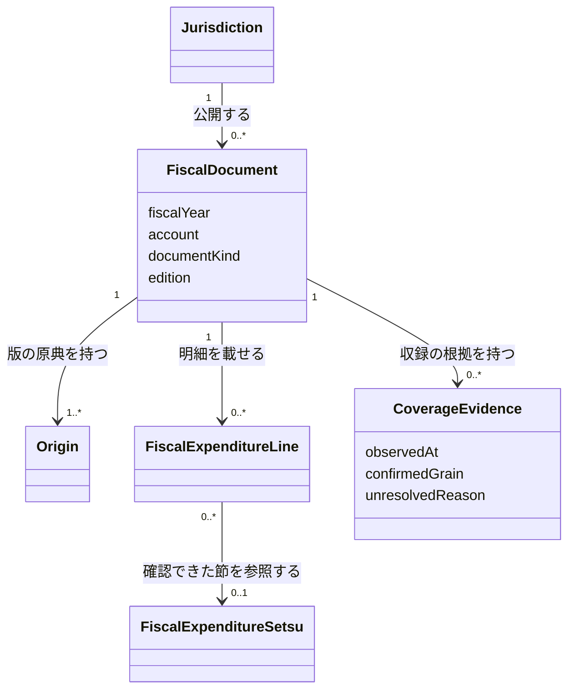

# 管理中の団体の全公開年度を事業と歳出の節で比較する

## Problem

着手時点の収録は団体によって年度・会計・資料の種類が異なり、補正予算は狛江市2023年度一般会計の二目に限られていた。パイプラインが構築できても、公開されている資料の全量を取り込めたとは言えない。利用者が年や団体を比較するとき、未収録の金額と支出ゼロを区別できる必要がある。

## 導出

AGENTS.md の Story にある「団体をまたいで、または年をまたいで比べる」と「原典と合っているか・注意点が無いかを確かめる」を、現在管理している団体の全公開年度へ広げる。

## Overview

対象は千代田区（131016）、三鷹市（132047）、昭島市（132071）、狛江市（132195）、多摩市（132241）の歳出である。当初予算・補正予算・決算を対象に、自治体の公式サイトと公式オープンデータカタログで公開が確認できる全年度・全会計・全事業を収録する。一般会計と特別会計を含め、公営企業会計は現行の対象外を維持する。

原典で事業と歳出の節の対応を確認できる明細は、その組合せで金額を提供する。確認できない明細も原典の粒度で提供し、対応不明であることと根拠を明示する。事業別合計と節別合計が独立して載る資料から、組合せの金額を推定しない。これは対応済みの事業×節には数えない。

### Goals

- 公開資料の探索範囲と収録済みの範囲を示し、全年度・全会計・全事業の比較で欠けている資料を判断できる。
- 当初・補正・決算を区別して、原典で確認できる事業×歳出の節の金額を得られる。
- 原典の行・頁・値・単位と提供金額の対応を辿れ、固定入力から同じデータを再構築できる。
- 原典対象ごとに最新版を確認し、その中で機械判読性の高い原典を一つ採用する。別URLを独立した取り込み件数にせず、採用未確認の対象と版・会計・補正号の確認待ちを示す。

### Non-Goals

- 管理対象外の団体、公営企業会計、歳入の追加収録。
- 原典にない事業×節の配賦、未収録の補正や未公表の決算のゼロ補完。
- 公開サービス・検索・配布インフラの再開。

## Glossary

**収録範囲の一覧**は、公式の公開資料、内容を確認した資料、採用した固定入力、検査済みの提供データの関係を記録する。この機能の完了判定に使い、資料名やURLが見つかっただけでは金額の収録完了としない。

## Domain Model

公開年度は原典から確認し、連続する年度を仮定しない。会計・補正号・訂正版の違う文書を同一視しない。資料の種類と金額の段階を区別し、決算資料にある予算現額を支出済額として扱わない。補正は符号付き増減額で保持し、補正後総額を号ごとに加算しない。対応不明は未確認でありゼロではない。

## 停止時点の実装状況（2026-10-06）

採用済み658固定入力の通常構築・再構築は602項目成功、202CSVの一致を確認した。採用datasetの提供欠落は0だが、公開全年度・全会計・全段階の受入条件は未達である。年度全体の完了を確認できた自治体×年度は0。取り込み・調査はユーザーの指示で停止している。自治体別の範囲、進め方の問題、再開時の優先順は[振り返り](retrospective-2026-10-06.md)を参照する。

以下は577入力時点の確認記録であり、停止時点の件数ではない。

## 以前の実装状況（2026-10-05）

採用済み577固定入力からの全量構築と再構築では、177CSVのハッシュが一致した。通常監査の採用datasetの提供欠落と固定入力の未対応は0である。多摩市の追加49表、千代田区2025年度の追加8表、狛江市2019〜2022年度の一般会計当初の章別8表について、原典列・各層・型付きCSVまで照合した。狛江市の8表はPDFだけからの移設再抽出も一致した。ただし千代田区・狛江市の追加表は観測と金額内訳の保持であり、承認状況や事業×節の対応は未確認のままである。実装と原典別の確認結果は[設計書](design-doc.md#残る全公開範囲)に記録している。

公開全年度・全会計・全段階の受入条件は未達である。通常監査では原典の未完了619件、探索18件、公開範囲の未確認163件、対象集合の未確認14件が残る。追加した歳出4原典も未完了判定に含めており、件数の増加は確認対象を増やした結果である。これらを実装タスク数とは扱わず、対応不明の事業×節や未確認年度を完了へ繰り上げない。

## Acceptance Criteria

- [ ] 比較する人が対象5団体の公開年度・会計・当初／補正号／決算の収録範囲と未確認事項を確認し、どこまで比較できるか判断できる。
- [ ] 比較する人が原典で対応を確認できる全事業×歳出の節の当初額・補正増減額・決算支出済額を取得し、別資料や小計の二重計上なく比較できる。
- [ ] 原典を確認する人が対応不明の明細について原典の金額と粒度を取得し、事業×節まで確認できない理由と追加確認に必要な資料を辿れる。
- [ ] データを維持する人が採用した固定入力から提供データを再構築し、原典対応・金額・分類・全収録範囲の検査結果を確認できる。

## Non-Functional Requirements

- 原典のURL・年度・資料の版・頁または行・値・単位と採用入力のハッシュを保持する。
- 公開を確認した資料の未処理・抽出失敗・対応不明を完了に数えず、理由を記録する。

## Success Metrics

- コアアクション: 対象団体の年または団体をまたいで事業の支出を比較する。
- 期待頻度 (cycle): 月次。
- 数える対象: 原典の対応と収録範囲を確認したうえで比較した利用者。
- 主指標: 翌月にも同じ比較を行う利用者の割合。利用計測は公開サービスを再開するときに行う。

## 関連 PRD

- [財政明細](../fiscal-records/prd.md): 予算・決算・節の保存境界。
- [補正予算](../fiscal-budget-history/prd.md): 狛江市2023年度二目の先行取り込み。本PRDはその収録範囲を拡張する。
- [固定入力パイプライン](../monorepo/prd.md): 再構築と各層の検査。
- [設計書](design-doc.md): 収録範囲と追加取り込みの実装・検査。
