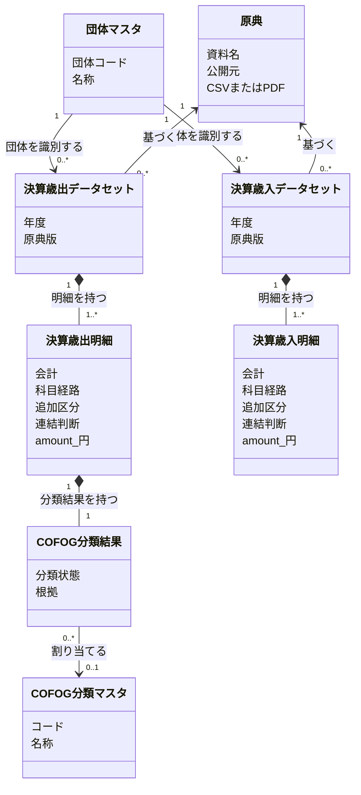
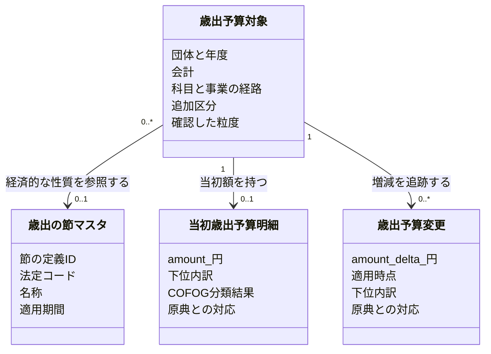

# 歳出と歳入を別の明細として理解する

この図は、歳出・歳入の分離と [予算変更履歴の PRD](../fiscal-budget-history/prd.md) を適用した提供モデルを示す。決算の明細は実績の `amount` 一つを持ち、予算とその変更履歴は別に管理する。dbt の提供モデルへ適用済み。補正・繰越等の実資料収録と対応の確定は未完了で、予算の復元を未確認として扱う。

具体的な値と参照の関係は [狛江市2023年度決算のオブジェクト図](fiscal-object-example.md)、予算履歴を含む保存境界は [財政データの設計と ER 図](design-doc.md) を参照。

## 共通の定義と財政の記録を区別する

団体マスタは団体コードと自治体の名称、COFOG分類マスタは分類コード・名称・階層、歳出の節マスタは法定区分と適用期間の定義を持つ。これらは共通の参照先であり、個別の金額は持たない。図のマスタのクラスは一覧全体ではなく、一件の団体や分類の定義を表す。

予算対象は団体・年度内の追跡対象、予算・決算明細は資料に基づく金額の記録であり、マスタとは区別する。マスタの表名には `_master` を付け、提供モデルで共通定義の役割を明示する。

## 自治体の資料から、歳出と歳入を別々に読む

- 自治体は年度ごとに決算歳出／歳入データセットを持つ。財政データが未収録の自治体は、どちらも0件になる。この図は決算の提供用明細を示し、予算の管理は別にする。
- 一つのデータセットは一団体・一年度・一文書種別・一原典版を対象にする。原典の実体と、その原典から収録する範囲を区別する。同じ PDF に歳出と歳入が載る場合は両データセットが同じ原典を参照し、別の資料で公開された場合は別の原典を参照する。
- 当初予算の基準額、補正予算の増減額、繰越・予備費充用・流用などの変更は、決算実績と別に管理する。別資料の明細を同一視せず、資料間の対応を確かめて比較する。
- 決算歳出明細の `amount` は支出済額、決算歳入明細の `amount` は収入済額で、いずれも円換算した一金額を属性として持つ。独立した金額クラス・金額表や、実績を選ぶ `phase` は設けない。原典の金額・単位と報告された予算額は、取り込み・照合用に保持する。
- COFOG の分類結果は歳出明細だけが持つ。状態は `assigned / unclassifiable / out-of-scope` とし、`assigned` のときだけ分類コードを一つ参照する。歳入モデルには COFOG の属性も `not-applicable` の行も作らない。
- 分類規則は Git の `pipeline/dbt/seeds/fiscal/cofog_rules.csv` に定義し、変換処理で適用する。提供用の DB/API・配布物には規則マスタも規則 ID も設けない。使った規則の追跡は、コード版と入力を固定したパイプラインの検証記録で扱う。

黒い菱形は、明細が所属するデータセットの一部であることや、分類結果が明細の一部であることを表す。普通の矢印は参照を表す。例えば同じ COFOG 分類を、複数の歳出明細の分類結果が参照できる。

## 歳出予算の対象を事業と歳出の節で区別する

以下は追加で採用し実装した設計である（実装はローカルの固定入力で検証済み）。歳出の節を経済的な性質の共通マスタとして独立させ、歳出予算対象が参照する。予算の明細は一金額と下位内訳を持ち、節マスタには金額を置かない。

確認済みの予算対象は事業×歳出の節で区別する。細節・細々節等は明細の JSON 内訳に保存する。節不明や集約時の分類・連結判断が未確認の場合は、原典で確認できる粒度を保持する。歳入の節をこの共通マスタへ入れず、COFOG と歳出の節を独立した分類軸として扱う。GFSM は提供しない。概念の定義は [PRD の Domain Model](../fiscal-budget-history/prd.md#domain-model)、表と列の名前は [財政データの設計](design-doc.md) に従う。

## 明細に含まれる値の意味を分ける

科目経路と追加区分は、別々に検索・照合できる明細の値である。歳出／歳入の両方で同じ値の構造を使えても、科目の意味や同一性を両者で共有しない。

- **会計**: 団体内の会計コードと名称。例は `14 / 介護保険特別会計`。他団体の同じコードを同じ会計とみなさない。
- **科目経路**: 団体の科目体系に沿った順序付きのコード・名称。例は会計14 → 款3 → 項1 → 目3 → 大事業2 → 節12（委託料）。COFOG の階層とは別である。
- **追加区分**: 経路だけでは明細を区別できない原典の区分。例は `org = 400300 / 福祉保健部・高齢障がい課`、`fiscal_class = 0 / 現年度`。団体の宣言した区分だけを使い、汎用属性置き場にはしない。
- **連結判断**: 会計をまたいで合算するときに、明細を保持するか、会計間移転として消去するかの判断。歳出・歳入それぞれの明細が、相手会計・判断規則または個別宣言・根拠とともに持つ。COFOG 分類とは独立し、歳入にも存在する。会計間移転の宣言を判断の正本とし、対応する各明細への結果はそこから生成する。片側の消去判断を根拠なく他方へ転用せず、対象・年度・金額段階・相手会計・対応する金額を検査する。原典の明細と金額は削除せず、連結した集計で適用する。
- **名称と出所**: 科目や追加区分の名称を、原典由来か風土記の判断か区別する情報。検索用に名称を集めた表は、この情報から生成する検索用の派生表であり、独立した財政上の実体ではない。

階層経路の保存形式は、明細の経路にある各段を展開したものとして読む。追加区分の保存形式は、その経路に加える区分として読む。図では明細の属性にまとめ、検索用の保存形式とは分けて考える。

## 予算と決算の比較は、資料の違いを消さずに行う

予算書と決算書の明細の対応は、自動の同一視ではなく別途確かめる関係である。当初予算を基準に各号の補正の増減額と、繰越・予備費充用・流用などの変更から、指定時点の予算額を求める。補正後総額を号ごとに重ねて足さず、決算実績も予算の履歴から推定しない。

原典に載る予算現額は照合用の報告値として保存し、計算値で上書きしない。未取得の変更をゼロとみなさず、明細対応や理由不明の差異が残る範囲は未確認とする。移行対象は PRD の入力・照合条件を満たす範囲に限定する。提供用の決算は実績一金額へ移行済み。内部の照合用の報告値を保持し、予算復元の実資料収録を続ける。

## 財政上の概念を提供用データに反映する

原典は入力、データセットと明細はその資料から収録した財政データ、COFOG 分類結果は風土記の判断である。年度・科目の意味を、公開 ID やファイル配置から定義しない。

提供モデルでも決算歳出明細と決算歳入明細を分け、各行に `amount` を直接持たせる。科目経路・追加区分・名称はそれぞれの明細に紐づけ、予算の基準額・変更履歴と照合用の報告値は決算明細から分ける。実資料による予算履歴の照合は継続する。配布・検索の保存方式は、ingestion〜marts の完成後に検討する。
