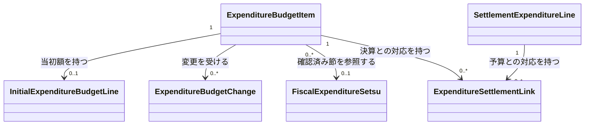

# 予算の変更と決算の実績を区別して比較する

## Problem

決算資料の予算現額と支出済額を同じ実績として扱うと、予算の変化と実際の支出を比較できない。事業や節の対応が不明な資料もあり、資料の違いを無視した対応付けは金額を二重計上する。

## 導出

Storyの「事業の単位で見る」「年や団体をまたいで比べる」「原典と合っているか確かめる」のため、資料と金額の意味を区別する。

## Overview

歳出・歳入、当初予算・符号付き変更・決算実績を区別して提供する。歳出予算は確認済みの事業×歳出の節を対象とし、下位内訳と原典対応を保持する。決算実績は原典で確かめられる粒度を保持し、確認済みの事業×節を取得できるようにする拡張は[全年度収録のPRD](../fiscal-coverage/prd.md)で管理する。

### Goals

- 指定時点の予算と決算の実績を金額の意味を混同せず比較できる。
- 対応不明・未収録・確認済みゼロを区別し、原典の金額と対応の判断を確かめられる。

### Non-Goals

- 根拠のない配賦、予算からの実績推定、欠けた変更のゼロ補完、公営企業会計。

## Domain Model

決算明細の金額は支出済額一つである。歳入は別の明細・予算対象で扱い、COFOGと歳出の節マスタを適用しない。対応リンクは金額の明細ではなく、多対多の対応で金額を重ねて加算しない。

## Acceptance Criteria

- [ ] 比較する人が当初予算・各変更・決算実績を区別して取得し、原典と対応根拠を辿れる。
- [ ] 比較する人が確認済みの事業×歳出の節の予算と下位内訳を取得し、対応不明の金額も原典の粒度で確認できる。
- [ ] データを維持する人が全収録対象について金額の意味・原典対応・分類と集約の不変条件を検査できる。

## Success Metrics

- コアアクション: 予算の変化と実績を事業ごとに比較する。
- 期待頻度 (cycle): 月次。
- 数える対象: 金額の意味と原典対応を確認して比較した利用者。
- 主指標: 翌月にも比較を行う利用者の割合。利用計測は公開再開時に行う。

## 実装状態

保存境界・節マスタ・当初予算集約と狛江市2023年度二目の補正取り込みは実装済みである。全収録対象の実資料検査と全公開年度の収録は完了していないため、PRD全体をdoneとしない。

## 関連 PRD

- [設計書](design-doc.md)
- [補正予算](../fiscal-budget-history/prd.md)
- [全公開年度の収録](../fiscal-coverage/prd.md)
