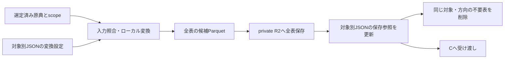

# 選定済み原典から作る取り込み表を管理する

担当者: wwwyo / Codex
更新日: `2026-10-08`
状態: In Review（新しい保存経路を実装、対応する824表を移行、F入口を変更。旧モデル削除後の全量構築・旧検査/Gの移行は未完了、保留339件の採否は未決定）

## Summary

原典はsource_selectionの非公開R2領域に保存し、取り込みParquetは原典対象と方向ごとの固定keyに保存する。Gitでは同じ対象の変換設定と保存済み表を一つのJSONで管理する。構造はJSON Schema、ファイルの配置・表の所有者・原典との対応は実行時の検査で強制する。

変換は受け取ったCSV/PDFと対象情報を使う。全表をローカルで準備し、全アップロード成功後にJSONを更新する。その後、対象と方向が同じ領域の不要な表を削除する。現在版だけを保存し、別年度・別補正号は別対象として保持する。

## Goals / Non-Goals

- 原典、使用する会計・頁範囲、変換コード、保存された表を対応付ける。
- 複数ファイル・複数会計・複数表を一つの対象に登録できるようにする。
- 未完成の保存、重複する表ID、対象外の原典・保存先を検査で拒否する。
- dbtのモデル変更、C/Dの原典照合、全年度の収録完了は今回の移行に含めない。

## Background

対象と原典の選定は [source_selection/schema.ts](../../../pipeline/source_selection/schema.ts) が管理する。対象は団体・年度・資料区分・補正号、会計と方向と物理頁は原典ファイルのscopeである。Bは選定を再判断せず、選定済みかつ保存済みの原典を使う。

旧経路は一つの `sources.lock.json` と内容ハッシュのR2 keyを使っていた。新しいBは対象別のJSONと固定keyへ移した。Fは自治体の対象別JSONと、その保存参照が指すParquetを読む。旧検査・通常監査の読み取りには旧入力一覧が残る。移行状況とこの互換境界は [移行記録](migration.md) に記載する。

## Design



### 対象のJSONと書式のコードを近くに置く

```text
pipeline/ingestion/
  lib/                           # CSV、座標、Vision OCR、Parquet
  selection.ts                   # 上流の選定とローカル原典の照合
  fiscal/
    manifest.schema.json         # 管理JSONの正本
    manifest.py                  # schemaと対象間の制約、fingerprint
    run.py                       # 変換、保存、復元、掃除の入口
    storage.py                   # private R2への入出力
    migrate.py                   # 旧表の移行
    layouts/
      csv/                       # convert.py + options.schema.json
      statement/                 # 既存の見開き読み取り器への入口
      fiscal_general/            # 既存の共通抽出処理
      retained/                  # 既存Parquetを内容変更せず移行する宣言
    management/                  # 既存の原典登録・収録監査
    legacy/relocations.json      # 旧コード参照の移動先
    jurisdictions/
      132071/
        README.md
        layouts/<書式>/          # 団体固有のコード・訂正・宣言
        2025/initial/expenditure.json
        2024/settlement/expenditure.json
        2024/settlement/revenue.json
```

対象別JSONは原典対象と方向の組ごとに作る。設定用 `config.toml` は必須にしない。JSONの `conversions` に使用する変換コード、入力SHA、書式設定、期待する表をまとめ、`tables` に保存参照を持つ。列名・型はParquetから取得し、管理JSONへ複製しない。

`tables[].metadata` は任意の原典由来の補足情報である。`units` と `notes` は原文の `text` と適用範囲の `scope` を持つ。範囲は表全体（`kind: table`）または列（`kind: columns` と `columns`）で指定する。`column_contexts` は対象の `columns`、原典の上位見出しを順に並べた `header_path`、その値の粒度を識別する `grain_columns` を持つ。ルート見出しの列は `header_path: []` とする。原典の一つの欄を複数の通常の列へ展開した場合は、補助列の `header_path` に原典の見出しまで含める。原典内の列の役割が確認済みなら、任意の `semantic_role` に保持する。現在は事業・経費のまとまりを示す `project` と、歳出の節を示す `setsu` に対応する。原典内で確認した役割であり、団体をまたぐ事業の共通分類ではない。共通分類への対応とは区別する。列名の一覧・型定義を複製する項目ではなく、既存のParquet列への参照だけを持つ。

例えば説明欄の末端をrawの1行にすると、目や説明内の親項目の名称・金額が末端行に反復される。`column_contexts` で目・親項目・末端項目の金額の粒度を分ける。法定節一覧の検算用の区分・総額は、この末端明細へ追加しない。原典の単位を列名へ付け足したり、集計しやすくする目的で反復した目の金額をNULLへ置き換えたりしない。原典にない関係、単位の換算倍率、共通分類への対応、集計方法はこのmetadataへ入れず、後段で扱う。

次は追加部分の例であり、登録済み表の全体ではない。列名は、その表の実際のParquet列を参照する。

```json
{
  "table_id": "expenditure",
  "metadata": {
    "units": [
      {
        "text": "千円",
        "scope": {
          "kind": "columns",
          "columns": ["本年度予算額", "前年度予算額", "比較", "説明2_金額"]
        }
      }
    ],
    "notes": [],
    "column_contexts": [
      {
        "columns": ["本年度予算額", "前年度予算額", "比較"],
        "header_path": [],
        "grain_columns": ["款", "項", "目"]
      },
      {
        "columns": ["説明2_名称", "説明2_金額"],
        "header_path": ["説明"],
        "grain_columns": ["款", "項", "目", "説明1_名称", "説明2_名称"],
        "semantic_role": "setsu"
      }
    ]
  }
}
```

補足情報が未確認なら省略し、原典にない単位や所属を推定で補わない。`grain_columns` は値が属する原典上の対象を識別する列であり、raw表全体の行の一意性を要求しない。会計などが行を区別する表では、その原典の区分列も含める。現在の参照検査はトップレベルの列に対応し、構造化配列の子フィールドを指すパスは定義していない。保存対象の表と同じ管理JSONに保持し、別の補足JSONは生成しない。既存JSONにはmetadataの追加を必須にしない。

管理形式は `schema_version: 1`。`expected_tables` は表IDだけを持ち、後工程の `declaration`・`definition_files`・`legacy_path` はschemaで拒否する。`inputs` は原典SHAだけを保持する。形式・会計・ページ範囲はselectionから解決し、抽出をさらに絞る設定は変換器のoptionsに置く。取り込みfingerprintは原典・変換設定・取り込みコードから作り、dbtの宣言やモデルを含めない。

F側の入力対応は別に管理する。

```text
pipeline/dbt/inputs/
  bindings.schema.json
  <団体>/<年度>/<資料区分>/<方向>.json
```

このJSONは対象・方向と表IDをキーに、dbtへ渡す `raw_path` だけを保持する（schema_version 1）。表に付随する確認済みの補足情報は取り込みJSONの `tables[].metadata` から受け取り、入力catalogにも保持する。dbt専用の別ファイルの提出は要求しない。metadataから実際のdbtモデルを構築する接続は未完了である。表の保存先・SHA・サイズ・行数は取り込みJSONが所有し、F側には複製しない。使用していない旧 `declaration`・`definition_files` の複製は残さない。Fのコード依存は構築IDのコードfingerprintで識別する。

書式は年度・会計ごとに増やさない。設定値の違いで対応できる場合は同じコードを使う。別団体で同じ規則を使えることを確認した書式は `fiscal/layouts/` へ置く。団体固有の処理はその団体の `layouts/` に置き、歳入・歳出で規則が異なる場合は別の書式や設定を選ぶ。

### 構造と対象間の制約を保存前に検査する

管理JSONの正本は [manifest.schema.json](../../../pipeline/ingestion/fiscal/manifest.schema.json)、追加の制約は [manifest.py](../../../pipeline/ingestion/fiscal/manifest.py) である。変換器ごとに同じフォルダの `options.schema.json` で設定を検査する。JSONにschemaのパスを重複指定しない。skillに型の別定義を作らない。

JSON Schemaは未知の管理項目、型、識別子の文字を検査する。実行時にはJSONの正規配置、変換IDと表IDの重複、表の所有者、使用するコードの範囲、原典SHAの選定への所属と方向に対応するscope、R2 key、期待する全表の存在を検査する。表の保存情報は空、または期待した全表が揃った状態に限る。別のstatus項目は持たない。0行の表は現在対応しない。

一つの変換に複数の原典を渡してよく、複数の変換が同じ原典を使ってもよい。表IDは対象と方向の中で一意にし、同じ表を二つの変換へ所属させない。会計の区別が必要な表IDは安定した会計識別子と役割を含め、列挙順や原典SHAから毎回振り直さない。

手編集そのものをファイルシステムで禁止する仕組みではない。CLIとCIの `ingestion:check` が違反した登録を拒否する。これらの構造検査は、名称・金額・階層が原典通りであることの認定とは別である。

### 変換器は渡された原典からローカルの表を作る

変換器の入口は `convert(inputs, destination, options)` で、表IDとParquetのパスの対応を返す。補足情報を出す表では、パスの代わりに `{"path": path, "metadata": metadata}` を返せる。管理側はschemaと実際のParquet列への参照を検査し、表の保存情報へmetadataを含める。パスだけを返す既存の変換器も使える。再変換でmetadataを省略した場合、入力fingerprintとParquet SHAがともに同じなら既存metadataを保持し、変わっていれば古い情報を引き継がず、新しいmetadataの提出を要求して保存前に止める。入力には選定から解決した原典参照とscope、受け取った対象・方向、SHA照合済みのローカルパスが入る。変換器は原典の選定、Gitへの登録、R2への保存を行わない。

CSVは [csv/convert.py](../../../pipeline/ingestion/fiscal/layouts/csv/convert.py) を使う。金額のカンマや空文字を含め原文を保持する。text PDFとscan PDFは書式別のコードで表を組み立て、[conversion.py](../../../pipeline/ingestion/lib/conversion.py) と [parquet.py](../../../pipeline/ingestion/lib/parquet.py) を使う。scan PDFの文字・位置の取得は共通の [Vision OCRモジュール](../../../pipeline/ingestion/lib/vision_ocr.md) に任せる。

ヘッダー付きCSVは変換後に原典を再読し、列名・順序・VARCHAR型、全セル値、行順・重複・空文字、追加の物理行範囲列をParquetと照合する。不一致では変換を失敗にし、検査で拒否した新規Parquetを除去して保存前に停止する。原典SHAは管理入口で変換前後に照合する。検査結果は候補dirの `<表ID>.checks.json` に再生成し、管理JSONのschemaは変更しない。この保持検査でCSVの取り込みを完了とし、合計一致や独立した再抽出を必須条件にしない。年度・会計・単位・段階の解釈は後段で確認する。PDFの内容検査の共通フローは別途定める。

既存表の移行用 `retained` は再抽出器ではない。元のParquetのSHA・サイズを照合して同じバイト列を保存する。原典から作り直す場合は実際の書式の入口へ設定を変更する。配置を移した旧抽出器のCLIも残すが、新しい保存はschemaを通る入口から行う。

### 原典と現在の取り込み表をprivate R2で分ける

```text
fudoki-inputs/
  fiscal/source-selection/<団体>/<年度>/
    initial.csv
    settlement-1.pdf
    settlement-2.pdf
    supplementary-<号>.pdf
  fiscal/ingestion/<団体>/<年度>/<initial|settlement|supplementary-号>/
    expenditure/<表ID>.parquet
    revenue/<表ID>.parquet
```

原典のkeyはsource_selectionの保存記録を使い、Bで作り直さない。表は同じ役割の固定keyへ上書きする。方向が違えば同じ表IDでも衝突しない。表の保存参照にはSHA・サイズ・行数を記録する。列名・型はParquetから取得する。使用した原典のSHAは `conversions.inputs` で管理し、表ごとに複製しない。OCR・bbox・描画キャッシュは `.cache/` または `.agent/` に置き、Gitへ追加しない。

現在の保存実装は表の単一ファイルアップロードを使う。300MBを超えるParquetは保存前に停止する。multipartと新しい補助入力のR2保存は未実装であり、旧経路の画像・文字観測は後段の依存を確認するまで削除しない。

### fingerprintで入力条件の変更を検知する

fingerprintは、対象・方向、使用した原典SHAとscope、変換設定、参照するコード・設定ファイルのハッシュから計算する。同じ原典でもコードや設定が変われば表を古いものと判定する。関連するローカルimportとコードに明記した設定ファイルを辿る。手動の依存指定は現在提供しない。

実行環境は管理JSONとfingerprintに含めない。OS・Python・DuckDBの版だけが変わっても再変換の判定は変わらない。

fingerprintは変更検知の仕組みである。固定keyへの上書きと保存参照の置換により、同じ入力の再実行で表が重複しない。OCRの出力が常に同じバイト列になることは保証しない。

### 全表を保存してから管理情報を更新する

同じ対象・方向の変換、保存、読み取りは逐次実行する。局所再処理でも変更しない表の参照を残し、その入力条件が現在のままであることを確認する。

1. 全表をローカルで用意し、行数・列型・空表・期待する表集合を検査する。
2. 入力条件が変わっていないことを確認し、全表を固定keyへアップロードする。
3. 全保存成功後にGitの管理JSONを置換する。
4. 現在の管理JSONが変わっていないことを確認し、同じ対象と方向の領域を全ページ一覧取得する。参照されていない直下のParquetだけを削除する。
5. 後段は全表の存在・fingerprintと取得した表のSHAを検査して読む。

途中のアップロード失敗では管理JSONを更新せず、削除もしない。ただしR2の一部のkeyは上書き済みになり得る。後段は止め、同じ条件で全表を再保存する。更新の完了と掃除の完了は分け、掃除だけ失敗した場合は `ingestion:cleanup` を再実行する。世代切替や分散ロックを省くため、同時更新と読み取り中の更新には対応しない。

## Alternatives Considered

| 案 | 利点 | 採否 |
| --- | --- | --- |
| 旧ハッシュkeyと一つの入力一覧を維持 | 既存consumerを変更せず使える | Bの現在版管理には採用しない。旧検査・通常監査Gの読み取り用に一時保持する |
| 世代ごとのkeyとcurrent切替 | 複数表の切替を原子的にできる | privateかつ逐次実行の範囲では管理が増えるため採用しない |
| 設定と保存情報を別JSONにする | 更新主体を分離できる | 対象ごとに確認する情報を一つにまとめる |
| 団体・年度ごとにコードを複製する | 例外を閉じやすい | 同じ書式の修正が分散するため、差を設定で表せる限り再利用する |

## Cross-Cutting Concerns

R2は非公開とし、認証を設定ファイルやGitへ平文で書かない。CLIは渡されたkeyを検査し、掃除の範囲を対象と方向で制限する。保存完了後の全ファイル読み戻しは必須にせず、アップロード前と利用時にSHA・サイズを確認する。

LLMのcontextへ表やOCRの全量を出さず、詳細はファイルへ、CLIの結果は件数とパスだけにする。CSV・PDF・scan PDFは入力形式の選択肢であり、順番に通す処理ではない。

## Validation / Rollout

`ingestion:check` をCIで実行し、全管理JSONの構造・選定との対応・保存済み表の入力条件を確認する。変換テストでは複数原典、原文保持、対象・key・所有者の違反、局所再実行の欠落、アップロード失敗を検査する。

旧表は原典SHAと対象・方向が現在の選定に一致するものを移す。表IDが曖昧なものや選定が一致しないものは移行済みとしない。旧R2領域の一括削除は後段の依存を外した後に行う。実測した移行件数、検証範囲、認証による未完了は [移行記録](migration.md) に置く。

## dbt入口へ保存済み入力を渡す

Fの入口は `pipeline/build_inputs.py` と `build.ts`。自治体の対象別JSONと保存済みParquetを受け取り、別の `sources.json`・`history.json`、`--declarations`、宣言ディレクトリの環境変数は要求しない。Fで原典の抽出やCの検査を再実行しない。

管理JSON全体・F側の配置対応・selectionから解決した原典情報を構築入力fingerprintに含め、 `.cache/inputs/<fingerprint>/` にcatalogとParquetを固定する。catalogは管理JSON・表・原典との対応を保持する再生成可能な入力一覧であり、独立したprovenanceの保存物ではない。コピー後と再利用時にSHA・サイズを照合し、準備中の管理情報変更を拒否する。

`dbt_inputs.py` は配置対応JSONのschema・対象・方向・表ID集合・原典版に対応するパスを検査する。管理情報の `initial` はdbt内部の `budget` に対応する。

旧宣言JSONの直接読み取りと、その依存先の381モデル・5検査は削除し、旧JSONの存在を要求する停止処理も外した。残る152モデルは既存のdbt設定・Parquet・共通マスタを使う。単位・金額段階・階層は必要なモデルの設定で解釈し、原典で確認する情報を出力JSONへ持たせる場合もdbt用の別形式は要求しない。旧処理で生成した全CSVの再生成や公開全年度の網羅を、残ったモデルの構築成功だけで認定しない。旧検査・通常監査Gの移行は別途必要である。
