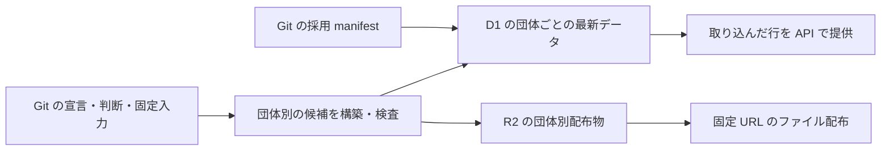
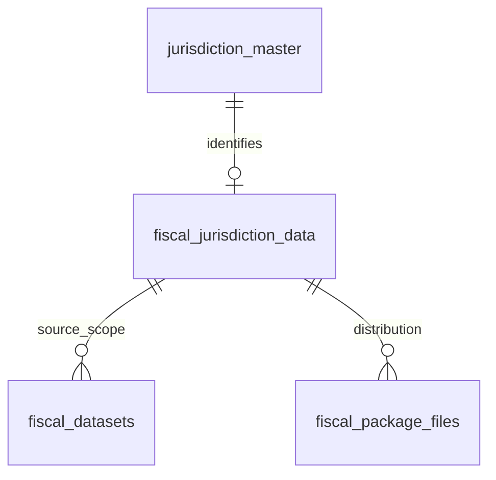

# 自治体ごとにデータを取り込み、そのまま提供する

歳出・歳入、予算・決算の保存モデルは [財政データの設計と ER 図](../fiscal-records/design-doc.md) に従う。決算明細は実績の `amount` 一つを持ち、当初予算・変更履歴・決算との対応を別表に置く。分類規則と規則 ID は提供用 DB/API・配布物に含めない。

## Objectives

- **Goal**: D1 の明細・金額・階層・名称は団体ごとの最新版だけを保持し、未変更の自治体を再取り込みせずに公開する。R2 の配布物も再利用し、取り込んだ行を順次 API から提供する。
- **Not goal**: 年度ごとの細分化、団体別 DB への分割、全団体の公開時点の固定、取り込み途中の非公開化、R2 配布物の自動削除。財政レコードの保存境界は [財政データの設計](../fiscal-records/design-doc.md) に集約する。

最新版だけを保持する D1 schema・取り込み・API を契約版3へ変更した。遠隔適用と実測の状況は [移行記録](../../monorepo-migration.md) で区別する。

## Background

従来の D1 は自治体ごとの過去の提供版を保持し、内容が一部変わるたびに未変更の明細も複製していた。過去の配布物は R2 から取得できるため、D1 から過去版を検索する要件を外し、最新版だけの検索表にする。年度や補正の号数は dataset と変更記録に保持する。最新版だけとは、最新年度だけという意味ではない。

取り込み途中の明細が API に見えることを許容する。全団体の更新時点や、複数回の問い合わせが読むデータの完成状態を揃える要件は設けない。公開一覧と公開切替を導入せず、団体ごとの内容版へ直接取り込む。

## System Overview

版の意味を二つに分ける。

| 識別子 | 内容が変わる条件 | 保存対象 |
| --- | --- | --- |
| `packageId` | その団体の配布ファイルが変わる | R2 の CSV・FDP |
| `versionId` | その団体の提供用データ・説明・配布参照・契約が変わる | D1 の最新内容の識別 |

構築実行の ID はローカルの候補・検証記録だけで使う。構築したコード commit や実行時刻だけでは、これらの内容版を増やさない。取り込みを再実行しても、未変更の団体の明細を複製しない。

## Detailed Design

### 団体別の版と財政明細の表を分ける

団体別の版の ER 図は以下とする。財政明細の ER 図と列・外部キーは [財政データの設計](../fiscal-records/design-doc.md) を正本とする。

- `fiscal_datasets`: 財政資料の収録単位。団体・年度・歳入歳出・文書種別・採用原典版と出典・利用条件・範囲を持つ。提供用の金額段階は持たない。
- `fiscal_settlement_expenditure_lines` / `fiscal_settlement_revenue_lines`: 決算の歳出／歳入明細。各行に実績の `amount` を直接持つ。科目経路・追加区分・検索用名称もそれぞれの専用子表に分ける。
- `fiscal_expenditure_budget_items` / `fiscal_revenue_budget_items`: 団体・年度内の予算対象。対応を確かめた当初額・変更と決算を結ぶ対象であり、共通マスタではない。
- `fiscal_initial_expenditure_budget_lines` / `fiscal_initial_revenue_budget_lines`: 当初予算の基準額。
- `fiscal_expenditure_budget_changes` / `fiscal_revenue_budget_changes`: 各補正・その他変更の増減額と時点・出典。
- `fiscal_expenditure_settlement_links` / `fiscal_revenue_settlement_links`: 予算対象と決算明細の対応。金額を複製せず、分割・統合や未確認を扱う。
- `fiscal_jurisdiction_data` / `fiscal_package_files`: 一団体の最新内容の説明と、現在の R2 配布参照。

共通団体マスタ `jurisdiction_master`、分類マスタ `cofog_master`、DB の識別子 `database_identity` は版から独立させる。財政の表と dbt モデルには `fiscal_` を付け、例えば `api_fiscal_settlement_expenditure_lines` と生成先の表名へ揃える。マスタの表名を明示する改名は設計採用済み・未実装であり、現行 SQL の団体表は `jurisdictions`、分類表は `cofog_codes` である。

調達等を追加するときはその領域のモデル・配布参照・版を別に定義し、財政明細へ `domain` 列を追加して混在させない。領域間では団体コードを共有する。

### 団体の内容が変わったときだけデータ版を作る

`fiscal_jurisdiction_data` は一団体につき一行で、主キーは `jurisdiction_code`。現在の内容ハッシュ `version_id`、契約版、`package_id`、名称・OCD ID・注意点、現在の内容を取り込み始めた時刻 `registered_at`、採用した Git manifest の commit 固定 URL と SHA-256 を持つ。団体コードは団体マスタを参照する。内容が変わったらこの一行を更新し、過去の説明は Git manifest の履歴から辿る。
版の内容には、団体の説明、dataset の出典・利用条件・収録範囲、財政データの提供用表、配布ファイル一覧を含める。`versionId` は団体コード・契約版と、これらを正規化した内容の SHA-256 から生成する。行順・JSON のキー順・NULL と空文字の扱い・文字列としてのコード・整数単位を契約で固定する。版 ID 自身、登録時刻、manifest の参照、構築実行の ID、コード commit、実行時刻はハッシュの対象にしない。

API 用の内容だけが変われば `versionId` は変わり、配布ファイルが同じなら `packageId` は再利用する。逆に、配布 descriptor や利用条件の変更も利用者に見える内容なので版に含める。COFOG の共通マスタは既存コードの意味・名称を公開後に書き換えず、新しい分類体系が必要な場合は契約を移行する。

同じ内容を別のコード・入力から再構築した記録は、構築ごとの検証記録に残す。同じ内容の再試行では現在の登録情報を保持し、当初の採用 manifest と固定入力・Git 履歴から生成経路を辿れるようにする。

財政データが未収録の団体も、名称・注意点を持つデータ版として登録できる。その場合は dataset と配布ファイルがなく、`package_id` は NULL とする。未収録と金額ゼロを区別する。

### 明細の主キーを提供版から独立させる

明細の主キーは `fiscal_line_id`、資料は `dataset_id`、予算対象は `budget_item_id`、変更は `change_id` とする。これらの ID は団体・原典などの識別を含み、D1 全体で一意にする。各行に `version_id` を持たせない。明細は dataset を参照し、dataset と予算対象は団体コードで現在の収録情報を参照する。決算の子表と対応表は、親の ID と子の区分による必要な複合キーだけを使う。団体・年度・歳入歳出・文書種別の混入は外部キー、scope の trigger、build の検査で拒否する。

`fiscal_package_files` の主キーは `path`。団体コード、現在採用している R2 キー・SHA-256・サイズ・content type を持つ。Git manifest から生成する参照であり、直接編集しない。`object_key` がその団体と `package_id` の `fiscal/<団体コード>/<packageId>/` に属することを取り込み時に検査する。D1 の参照を更新しても過去の R2 オブジェクトは削除しない。

団体と COFOG の共通マスタは内容ハッシュから独立させる。全体 release、公開状態、公開切替の補助表は作らない。

### 取り込んだ行をそのまま API から提供する

publish は先に R2 の配布ファイルを転送・照合する。内容ハッシュが現在と異なる場合、選んだ団体の古い dataset・予算対象・配布参照を削除し、現在の収録情報を更新する。この初期化は一つの D1 batch で実行し、dataset や予算対象からの cascade で明細・変更・子表・対応を除去する。他団体と共通マスタは削除しない。その後、新しい行を依存順に追加し、取り込み途中の空・部分的なデータも API から取得できる。

API は現在の一行だけを読み、登録時刻の比較で過去版を選ばない。応答の `versionId` と要求の `versions` は、現在の内容を確認するための値であり、過去の検索版を選ぶ指定ではない。現在と一致しない指定は `VERSION_EXPIRED` として再取得を求める。
応答は対象の `jurisdictionCode / versionId / datasetId` を返す。ページトークンには検索条件・対象版・安定した並び順の続き位置・契約版・有効期限を持たせ、HMAC で認証する。全団体を固定する公開 ID は持たない。対象版を指定しても取り込み中の行は増えるため、ページ取得や別の呼び出しの間で件数・集計が変わることを許容する。内容ハッシュが更新された場合やトークンが期限切れの場合はエラーを返す。複数の SQL に跨る応答は、終了前に現在の内容ハッシュを再確認する。取り込み途中の追加行の間では同じハッシュを使うため、完成状態を固定する保証はない。

### 失敗した取り込みを同じ版へ再実行する

全団体・一団体全体を一括でロールバックしない。失敗した場合も反映済みの行は残し、現在と同じ内容ハッシュで再実行する。同じ内容の再試行では初期化・登録時刻の更新をせず、既存行を再利用する。同じキー・同じ値は再利用し、同じ内容 ID に異なる値を上書きすることは拒否する。団体・資料・歳入歳出の外部キーや金額の検査は維持する。取り込み途中を公開する方針は、異なる版や資料の値を混ぜる許可ではない。

一つの団体への書き込みは publish の実行者が直列に行う。DB に lease・fence・guard の補助表を設けず、別団体の取り込みは独立させる。取り込み後の全行・API 応答・配布 URL の照合は結果をローカルへ記録する検査であり、API の可視性を切り替える条件にはしない。

R2 の固定キーは維持する。未変更のファイルは再利用し、新しい内容は別の `packageId` に置く。各ファイルが配置された時点から取得でき、配布ファイル一式が同時に現れる保証は設けない。原典・取り込み表は非公開入力 bucket に保存する。

### 過去の配布物は R2 と Git の履歴で辿る

D1 は団体ごとの最新版だけを保持し、更新時に古い明細と配布参照を除去する。R2 の原典・取り込み・配布物は保持し、自動削除しない。過去の配布 URL と説明は Git manifest の履歴から辿る。古い候補を明示して publish すれば、その内容が D1 の現在データを置き換える。全体の切り戻しや公開状態の履歴表は設けない。

## Release

外部利用者がいないため、旧 API の互換性維持を要件にしない。新しい D1 schema と API 契約を一緒に移行する。ローカル実装から全体 release・非公開候補・guard を除去した。遠隔適用と実測は移行記録で別に確認する。

1. 団体別の内容版と R2 配布参照を確定する。
2. D1 の表・dbt 出力・API を団体別の最新版に揃える。旧 schema は自動削除せず、新しい DB に固定入力から再構築する。
3. 全体公開一覧・公開切替・排他制御・非公開候補の経路を除去する。
4. ローカル Cloudflare で部分取り込みの取得、再実行、通常検索と古い内容指定の拒否を確認する。遠隔反映の実施状況は移行記録へ残す。

## Tasks

- [x] 型・manifest・D1 schema・API 契約から全体公開 ID と公開制御を除去する。
- [x] dbt の API 出力を団体別に分け、内容ハッシュと再構築時の一致を検査する。
- [x] 一団体の更新で他団体の版と明細件数が変わらないことを確認する。
- [x] 取り込み中の新しい版が API に見えることを確認する。
- [x] 部分失敗から同じ版へ再実行して、重複や別版への混入が起こらないことを確認する。
- [x] ページ取得中の追加行と集計の変化を許容し、内容ハッシュ・検索条件の一致と更新後の拒否を確認する。
- [ ] 現行全量で DB・索引容量と横断検索の性能を再測定する。

## Alternatives Considered

| 観点 | 全体の公開一覧を固定する | 団体ごとに直接取り込む（採用） |
| --- | --- | --- |
| API の反映 | 全体の参照切替後 | 行を取り込むたびに反映 |
| 取り込み途中 | 非公開 | 取得可能 |
| 複数回の問い合わせ | 版の組合せと完成状態を固定 | 件数・集計が変わり得る |
| 管理対象 | 公開一覧・所属・制御・guard | 団体ごとの現在内容と提供データ |

取り込み途中と団体ごとの反映時点の差を許容するため、直接取り込む案を採用する。団体別の内容版は未変更データの再利用と不変の配布 URL のために残す。
