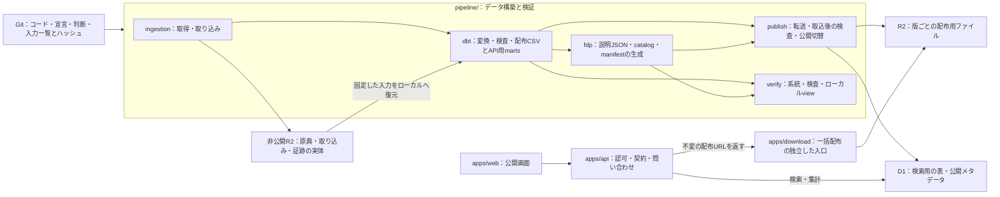

# データ構築をまとめ、配布物を R2、API の参照データを D1 に置く

設計案。2026-09-30 時点の実装を確認して作成した。ディレクトリ移動・Cloudflare への反映は未着手。

## Objectives

- **Goal**: 取得・変換・書き出し・公開・ローカル検証を `pipeline/` にまとめる。原典の CSV・PDF、取り込み済みの表・証跡、大きな配布物、API の参照データを Git 管理の対象にせず、R2 と D1 に保管・公開する。API がファイルの分割方式を知らずに検索・集計できるようにする。
- **Not goal**: dbt/DuckDB を D1 に置き換えること、原典由来の金額や分類判断の内容を変えること、既存 Git 履歴の書き換え。

## Background

現在も Bun workspaces に `apps/*` と `report` が登録されている。monorepo を新しく導入するより、データ構築の責務を配置と依存関係に表すことが必要である。

構築のコードは `ingestion/`、`dbt/`、`fdp/`、`report/` に分かれ、ローカル検証画面は公開 web の `apps/web/` にある。`report/` には検証用の系統・プレビュー・型と、公開 web/API が使う集計・名称が同居する。公開の分析画面も `pipeline.json` から団体・年度を読む。

API の `build.ts` は、配布物から多数の JSON chunk・検索索引・集計アセットを生成する。実行時は `ASSETS.fetch()` で読み、Worker が行を走査し、chunk・offset・問い合わせ別のパスを管理する。API の build は `sources.toml`、報告用の注意点、`field_types.json`、dbt の階層・追加キー宣言も直接読む。

配布物の CSV・descriptor は現在 Git 管理され、ローカルの配布物ディレクトリは約 21 MiB ある。API の `dist/assets` は既に Git 管理外だが、データ更新が API の build と deploy に結び付いている。Cloudflare にファイルを移すだけでは、実行時の chunk 管理や事前生成する問い合わせの組合せは減らない。

ユーザーの方針は、原典の CSV・PDF、取り込み済みの表・証跡、配布物と API の参照データを Cloudflare に置き、Git 管理しないこと。R2 と D1 の役割を分ける設計まで含める。既存の [dbt の層の決定](../../adr/0009-dbt-model-layers.md) と [ローカル検証画面の要件](../pipeline-verification-view/prd.md) は維持する。

現在は外部の利用者がいないため、既存の API 名・列名・URL・コマンドとの互換性を要件にしない。web・API/MCP・pipeline・配布物を新しい契約にまとめて更新する。数値の正確さ、原典との対応、予算と決算の区別、FDP の仕様への適合は検証する。

## System Overview



実行の境界は **build と publish** とする。build は固定したローカル入力から dbt と説明ファイルの生成を実行するスクリプトで、結果を `pipeline/build/` に置く。publish はその結果を R2/D1 に反映し、取込後の検査を経て公開版を切り替える。build だけでは公開中のデータは変わらない。

表の変換・検査と、配布 CSV・D1 用の表の生成は dbt の marts までに完了する。現行の marts は既に CSV を書き出しており、その CSV をそのまま配布する。FDP の descriptor・公開メタデータの JSON・配布ファイル一覧とハッシュを記録する manifest の生成は `fdp/`、報告とローカル画面は `verify/` に置く。build は dbt と `fdp/` の処理を呼び出す。報告生成と view の起動は別のコマンドで行う。

```text
.
├── apps/
│   ├── api/                         # 公開 API・MCP、D1 の参照
│   ├── download/                    # API と別に動く配布ファイルの入口
│   ├── web/                         # 公開画面
│   └── docs/
├── pipeline/
│   ├── README.md
│   ├── package.json / pyproject.toml
│   ├── build.ts                     # dbt と説明ファイル生成を実行する入口
│   ├── ingestion/                   # 予算・決算の取得と取り込み
│   │   └── fiscal/                  # 予算・決算の歳入歳出
│   │       ├── sources.toml         # 取得元の宣言
│   │       └── sources.lock.json    # 採用した原典・表・証跡の R2 キーと個別ハッシュ
│   ├── dbt/                         # models / macros / seeds / tests
│   │   └── models/marts/
│   │       ├── fiscal/              # 予算・決算の配布 CSV のモデル
│   │       └── api/                 # D1 用の表・公開メタデータのモデル
│   ├── fdp/                         # descriptor・catalog JSON・release manifest
│   ├── publish/                     # R2 転送・D1 取込・公開切替
│   ├── verify/
│   │   ├── report/                  # manifest・検査結果から報告を作る
│   │   └── view/                    # ローカル専用の検証画面とデータ口
│   ├── .cache/                      # 復元済みの入力・OCR結果・PDF閲覧レイヤ
│   └── build/                       # warehouse・dbt出力・配布候補・報告
├── packages/
│   ├── fiscal/                      # 予算・決算の純粋な集計・型・名称
│   ├── data-contracts/              # pipeline と API が共有する保存形式の契約
│   └── jurisdictions/               # 団体マスタ JSON と TypeScript の読込・検査関数
├── docs/
├── slides/                         # 発表資料
├── package.json / bun.lock          # Bun workspace
├── pyproject.toml / uv.lock         # uv workspace
└── mise.toml                       # ツールの版
```

これは責務の配置であり、全ディレクトリを独立したパッケージにする意味ではない。build は実行スクリプト、`pipeline/build/` は生成結果のディレクトリである。catalog は出典や注意点等の公開用データの名称であり、独立した工程やパッケージにはしない。

## Detailed Design

### 一つの構築結果から配布用と API 用の形を作る

dbt の marts に配布用と API 用のモデルを置き、同じ中間処理・判断から双方を生成する。現行の dbt marts は `materialized = 'external'` で配布 CSV を直接生成し、`fdp/build.py` は `datapackage.json` を追加している。この役割を保ち、配布 CSV は dbt が書き出したものをそのまま使う。

- **配布用**: marts が書き出した団体別の CSV と、それに対応する FDP descriptor・catalog・release manifest。R2 に置き、外部の利用者が一括ダウンロードできる。
- **API 用**: `models/marts/api/` が生成する、D1 の検索用の行・金額・分類・階層・公開メタデータ。publish が取り込み、Worker が問い合わせる。

金額・列・識別子・分類は dbt で確定する。dbt の検査で配布用と API 用の行・金額・識別子・分類を照合する。API 用の表は同じ中間モデルから生成し、API の build が配布 CSV を再解釈する処理を除去する。

build は dbt による表の生成・検査に加え、`fdp/` による descriptor・catalog JSON・release manifest の生成と形式検査を実行する。これは CSV に列の意味・単位・出典を付け、配布ファイルの一覧とハッシュを記録する処理である。dbt と publish の間に独立した `export/` や「公開準備」という工程を置かない。表の変換・整合性検査を dbt で完了させることと、JSON の形式検査や Cloudflare への取込後の照合を行うことは別の責務である。

catalog は、出典、利用条件、注意点、会計間の合算範囲、団体×歳入歳出の階層順序・追加キー、語彙を持つ。現在の `sources.toml` と団体ごとの記述を正本とし、公開する項目を列挙する。宣言は build の入力として dbt が読める形に揃え、公開メタデータを API 用の marts で生成する。注意点の全量に対する必須カテゴリ検査、API の enum と配布語彙の一致検査、次元の一致検査を保つ。

公開メタデータの marts を D1 に取り込み、`fdp/` は同じ内容を R2 用の catalog JSON に書き出す。独自項目を FDP の標準 descriptor に追加しない。PDF・頁画像・OCR 文字・行対応・内部 SQL を公開用データに含めない。

API 用の保存形式の schema・テーブル定義・契約版は `packages/data-contracts/` に置く。dbt のモデル出力、publish の取込と API の読取をこの契約と照合する。公開 RPC/REST/MCP の契約は `apps/api/` に置き、保存形式の型と公開 API の型を区別する。

### 予算と決算を同じ領域で扱い、文書の種類と金額の段階を区別する

対象は予算だけでなく決算も含む。現行の `ingestion/budget/sources.toml` にも `phase_id = "settlement"` の決算が収録されている。新しい内部の領域名は `fiscal`（財政）とし、取り込みは `pipeline/ingestion/fiscal/`、配布用モデルは `pipeline/dbt/models/marts/fiscal/`、共有コードは `packages/fiscal/` に置く。`budget` は予算に限る名称として読むと決算の所在が分からなくなるため、領域全体の新しい配置名には使わない。

文書の種類と金額の段階は別の軸にする。

- **文書の種類（`documentKind`）**: 予算書・決算書等の種類。例えば `budget`・`settlement`。原典と、その原典に基づく dataset の属性として持つ。
- **金額の段階（`phase`）**: 当初予算額・予算現額・執行済額等、金額が何を表すか。例えば `approved`・`adjusted`・`executed`。同じ明細が複数の段階の金額を持てる。

現行の狛江市の決算書には、同じ行に補正後予算額・予算現額・執行済額がある。したがって `documentKind = settlement` の原典から `phase = adjusted` や `executed` の金額を取り込み、決算書にある金額をすべて執行済額とは扱わない。現行 sources の `phase_id = settlement` は文書種別なので、新しい宣言・lock・公開メタデータでは `documentKind` に整理する。

dataset は団体・年度・歳入歳出・文書種別・採用した原典の版を識別できるようにする。別の予算書と決算書の行は、階層名が似ていても自動で同じ明細と扱わない。明細は所属する dataset を含めて識別し、団体・年度・共通科目等の比較軸は中間処理で揃える。

明細の識別子は配布物・DB・API を通して `fiscal_line_id` に統一する。`fiscal_line_id` は dataset の識別情報を含み、一つの release 内で dataset をまたいでも一意とする。API は `listFiscalDatasets`・`getFiscalDataset`・`getFiscalLines`・`searchFiscalLines`・`aggregateFiscalDatasets` 等、MCP は対応する `list_fiscal_datasets` 等の名称に揃える。既存名の alias や互換用の列は設けない。FDP の resource schema・主キー・外部キー・財政上の役割の記述も新しい列名に合わせる。

### API がファイルの組合せを管理せずに問い合わせる

配布物は R2、API の検索用データは D1 に置く。R2 は Worker binding からオブジェクトを取得でき、D1 は prepared statement に値を bind して問い合わせられる。[R2 Workers API](https://developers.cloudflare.com/r2/api/workers/workers-api-usage/)、[D1 prepared statements](https://developers.cloudflare.com/d1/worker-api/prepared-statements/)。

現在の `agg/<団体>/<年度>/<歳入歳出>/<段階>/<会計>/...json` というパスを問い合わせ条件として使う構造を廃止する。Worker の procedure は入力検査・認可・出典の選択・応答検査を持ち、問い合わせの実行を `apps/api/src/data/` に集める。

最初の表の境界は以下とする。すべての派生データを `release_id` で区切る。

- `releases` と `active_release`: 構築版・契約版・manifest のハッシュ・公開状態と、現在公開する版。
- `jurisdictions` と `fiscal_datasets`: 団体・年度・歳入歳出・文書種別・原典の版・利用条件・注意点・収録範囲・実在する金額段階。JSON が必要な説明項目は、検索対象の列と区別して保存する。
- `fiscal_lines`: 原典由来の明細。所属 dataset・明細識別子・会計など、通常の検索に使う列を持つ。別の文書の行を同一 ID にまとめない。
- `amounts`: 明細×金額段階の金額。一つの明細に複数の段階があることを保ち、主キーは `release_id / fiscal_line_id / phase` とする。
- `cofog`: 明細の分類・分類できなかった状態・判断の根拠・連結の扱い。原典由来の金額とは別に保つ。
- `line_hierarchy` と `line_dimensions`: 団体ごとの階層順と追加の同一性の軸。共通の階層一覧から順序を推測しない。
- `names` と `files`: 現在検索対象にしている名称と、R2 の配布ファイルのキー・サイズ・SHA-256・content type。

基本の索引は版・団体・年度・歳入歳出・会計と、明細識別子・予算段階に合わせる。行数と問い合わせを計測して確定し、すべての組合せに索引を作らない。任意の入力文字列を SQL の列名へ使わず、フィルタ・groupBy は契約の語彙から許可した SQL へ変換する。

明細の取得・条件検索・ページ分割は SQL で行う。ページトークンには `release_id`・問い合わせの指紋・安定した並び順の続き位置を持たせ、全体を HMAC で認証して改変を検出する。鍵は Worker の secret として管理する。署名を検証したうえで、正規形に揃えた問い合わせ条件の指紋を照合し、次ページも同じ版を読む。トークンを認可の代わりにせず、各リクエストで認可を行う。公開版が切り替わっても、その版を D1 に保持している間は続きを返す。削除済みの版は期限切れとして返し、異なる問い合わせや未公開の候補を指定するトークンは拒否する。応答に `releaseId` を含め、内部の chunk 番号への依存をなくす。

**検索・集計は金額の意味と収録範囲を明示する。** phase の必須条件、会計間の繰出入、分類不能・対象外・目標の深さに達していない分類、団体横断時の未収録・段階不一致を扱う。団体間の金額は合算せずに比較する。同じ団体・年度・direction で複数の原典版や文書種別がある場合、対象の dataset を明示するか、宣言した選択規則で一つに固定する。選択した dataset と対象外の理由を応答に含め、同じ支出を複数の文書から足し合わせない。

集計は索引付き SQL を基本案とするが、現行の分類率・残余・連結の検算を移す。実測で重い問い合わせに限り、同じ表から生成した集計表を D1 に持つ。問い合わせごとの JSON ファイルを R2 に戻すことで対応しない。集計規則は現在の純粋関数と同じ例で比較し、取得時と書き出し時に異なる規則を持たせない。

名称検索は、大小文字を区別する文字通りの部分一致とする。初期案は `instr(value, ?) > 0` とし、入力の `%`・`_` を wildcard と扱わない。名称と検索語に Unicode 正規化や全角半角の統一は行わず、結合文字・合成済み文字、全角・半角、異体字は異なる文字列として扱う。D1 の LIKE/GLOB パターンには 50 bytes の上限があるため、日本語の検索語をその制限で切らない方法を選ぶ。[D1 の制限](https://developers.cloudflare.com/d1/platform/limits/)。大小文字、wildcard に使われる文字、50 bytes を超える日本語、Unicode の表現差を検査する。検索文字列の正規化や FTS を導入する場合は、その一致条件を公開契約に明記する。

### dbt と D1 の役割を分けて容量・性能を確かめる

D1 は API が参照する派生データであり、dbt の実行先にはしない。原典の取得・取り込みは ingestion、団体固有の整形・分類・表の検査は dbt/DuckDB で行う。ローカル view も DuckDB・取り込み・証跡・配布候補を読む。

D1 の採用は容量・性能を確認して実装へ進める。現行の配布物約 21 MiB だけでは、索引・階層・複数の公開版を含む DB 容量は分からない。D1 の DB 上限は Paid が 10 GB、Free が 500 MB、単一 DB は問い合わせを直列処理する。[D1 の制限](https://developers.cloudflare.com/d1/platform/limits/)。

移行の初期に、現行の全収録データをローカル SQLite/D1 に取り込み、DB と索引のサイズ、対象件数、最大結果サイズ、明細・名称検索・階層集計・年度横断・団体横断の所要時間と読取行数を測る。Cloudflare 上の候補 DB でも同じ問い合わせを測り、ローカル SQLite の速度を本番の保証にしない。

将来の容量見積りには、少なくとも公開中と次の候補・切り戻し用の版が重なる分を含める。上限を超える見込み、検索の全走査、横断集計が問題になる場合は、集計表やデータ保持量を調整して再測定する。団体別 DB の分割は Worker の横断問い合わせを再び複雑にするため、測定なしに採用しない。

### データの公開をアプリの deploy から切り離す

build はローカルで検査済みの公開候補を作り、publish が R2 と D1 に反映する。publish は候補を作り直さず、dbt が生成した API 用の表を D1 に取り込む。転送時の型の対応・SQL の生成・`release_id` の付与は取込処理の責務とし、金額・分類・行の意味を変更しない。データの更新に API コードの再ビルドを必要とさせない。API の deploy はコード・bindings・対応する契約版を更新する作業とする。

R2 のオブジェクトは `releases/<release_id>/fiscal/<code>/...` に置き、公開済みの版を上書きしない。release manifest はファイルのハッシュ・件数・合計・契約版・コード版・入力と判断の fingerprint を持つ。ローカル絶対パスと生成時刻を内容ハッシュの材料にしない。`release_id` はコードの commit だけから決めず、入力データと判断の版も識別できるものにする。

公開は次の順序とする。

1. ローカルの変換・書き出しを終え、提供用データ・CSV・API 用の表の一致、出典と注意点、集計を検査する。
2. R2 の新しい版の prefix へファイルを転送し、manifest と各ファイルの SHA-256 を確認する。
3. D1 にその版を `staging` として取り込む。API は active な版以外を既定で参照しない。
4. 候補の版を明示した検証経路で API 応答と R2 ダウンロードを確かめ、R2 と D1 の件数・金額・識別子・内容を照合する。検査済みの配布ファイル一覧を含む公開用 manifest を R2 に最後に書き、版を指定した一括取得を可能にする。D1 に完成した manifest のキーと内容ハッシュを記録し、参照表との一致を確認する。
5. 公開する Worker が契約版に対応していることを確認し、D1 の公開状態と `active_release` を一つの短い atomic な処理で更新する。

候補の検証は公開 API に未公開版を読む権限を足さず、publish 実行者だけが使う非公開の検証 Worker から行う。候補 D1/R2 へのアクセスをこの経路に限定し、通常の API key やページトークンで検証経路を利用できないようにする。検証 Worker は公開 API と同じ問い合わせ処理を使う。

publish と切り戻しは同じ排他実行の入口に集める。公開参照の更新は、開始時に読んだ版と現在の `active_release` が一致する場合だけ行い、不一致なら再検査を要求する。中断した処理を再開するときも候補のハッシュ・状態・公開参照を確認し、切り戻し後に古い試行がそのまま公開参照を進めないようにする。後片付けは実行中の候補・active な版・切り戻し用の版を削除対象から除外する。

R2 と D1 全体を一つのトランザクションにできるとは扱わない。両方を完成させてから API の公開参照 `active_release` を切り替える。R2 のオブジェクト操作は強い整合性を持ち、D1 の `batch()` は途中の statement が失敗すると全体を戻す。[R2 の整合性](https://developers.cloudflare.com/r2/reference/consistency/)、[D1 batch](https://developers.cloudflare.com/d1/worker-api/d1-database/#batch)。

全量の取込を単一 batch に詰め込まず、上限内の再実行可能な単位で行う。候補が完成していない間は現行版を返す。失敗時は active の版を変更せず、完成済みの版へ参照を戻せば切り戻せる。

この切り戻しはデータ版に対するもので、D1 の schema を元に戻す手段とは区別する。初回は新しい契約で DB と Worker をまとめて構築する。publish は候補・D1・Worker の契約版を照合し、対応しない版へ切り替えない。将来 schema を変更する場合は、その変更と再構築・復元の手順を同じ変更で検査する。

API はリクエストの最初に版を一度だけ解決し、そのリクエスト内の D1 問い合わせと配布 URL をすべてその版に固定する。ページトークンがあればその公開済みの版、通常の問い合わせでは active な版を使う。isolate の生存中ずっと公開参照を保持する単一 cache は使わない。初期は D1 primary を参照し、read replica を使う場合は Sessions API で公開参照と後続の読み取りの整合性を保つ。[D1 read replication](https://developers.cloudflare.com/d1/best-practices/read-replication/)。

ファイル配信の入口は `apps/download/` に統一する。API は D1 の `files` を読み、解決した版の不変のダウンロード URL とファイル属性を返す。API Worker に配布用の R2 binding や body の転送処理は持たせない。URL と認可は新しい契約で定義し、旧 URL への転送や alias は設けない。

一括配布は API とは別に動く `apps/download/` の小さな Worker から提供する。例えば `data.fudoki.dev` を入口にし、版を指定した不変 URL と release manifest を公開する。R2 bucket 自体は非公開にし、この Worker は R2 の公開用 manifest に列挙されたファイルだけを読む。公開用 manifest がまだ無い候補、任意キー、書込操作は提供しない。D1 や API の認可サービスへは依存させない。R2 の body は stream として配信し、全ファイルを Worker のメモリへ読み込まない。原典 PDF 等は配布 bucket に入れない。

不変のダウンロード URL は active な版が変わっても保持中の旧版を取得できる。D1 の公開切替が失敗しても、完成して検査済みの一括配布版は取得でき、API は従来の版を返す。API/D1 の不調と配布の入口を分けるが、Cloudflare 全体や R2 の障害から独立する保証ではない。download Worker は完成した公開用 manifest だけを対象に版一覧を提供し、D1 を使わず一覧から manifest と各ファイルへ辿れるようにする。ダウンロードの ETag・content type・出典を保持し、キャッシュは版別キーにする。旧版の削除は切り戻し期間と処理中のリクエストが終わる猶予を定めてから行う。

### Git に残すものと Cloudflare に置くものを分ける

Git に残すのはコード、取得元・利用条件の宣言、dbt モデル・検査・判断、団体マスタ、設計文書、入力一覧と個別ハッシュである。原典の CSV・PDF と取り込み済みの表・証跡は非公開の R2 入力 bucket、配布物は別の R2 配布 bucket、API の参照表は D1 に置く。ローカル候補・入力キャッシュ・warehouse・報告・PDF 閲覧レイヤは Git に入れない。

公開版の情報と配布ファイル一覧の正本は R2 release manifest とする。D1 の `releases` の版属性と `files` はそこから生成する API 用の参照情報で、公開候補の検査で一致を確認する。これは公開に伴う管理情報なので publish が取り込む。財政データの本体と公開メタデータの表は dbt の marts が生成する。取込・公開状態と `active_release` は D1 が管理する運用状態であり、manifest から生成する情報とは区別する。Git にさらに `releases/` を置くことはしない。入力一覧は取り込みの固定条件なので Git に残すが、公開版の一覧・配布物の詳細・検証結果は R2 に保存する。Git checkout だけでは公開履歴を一覧できなくなるため、独立した download の版一覧と R2 のバックアップで補う。

配布 CSV の Git diff によるレビューの代わりに、変更前後の団体・年度・歳入歳出・予算段階別の行数・金額・識別子の増減、分類の変更件数と金額、注意点と出典の変更を CI に提示する。ハッシュ一致だけで内容の正しさを検査したことにはしない。

現行の「生成し直して `git diff -- data/budget/` が空か」という CI は、固定した入力 snapshot からの二回の deterministic な生成結果の比較と、release の fingerprint・公開済みデータとの検算へ置き換える。PR の CI は本番へ publish しない。R2 からの入力復元、ネットワークなしの build 検査、Cloudflare 上の候補への反映・公開前検査を分ける。

### 取得元の宣言・固定した入力・公開版を区別する

`sources.toml` は「何をどこから、どの条件で取り込むか」という取得元の宣言で、Git に残す。これだけでは自治体が差し替えた資料の旧版を取得できず、過去の構築に使った実際の内容を固定できない。

ingestion は取得した原典の CSV・PDF のバイト列をそのまま非公開 R2 に保管する。原典、取り込み済みの表、証跡は別の object とし、それぞれの SHA-256 を使う不変のキーで保存する。同じ内容は再利用し、取得日時・取得 URL・原典の SHA-256・抽出器の版・検査結果などの証跡は対応する記録として残す。既存オブジェクトを別の内容で上書きしない。原典の保存を公開再配布とは扱わず、配布 bucket にコピーしない。

例えば、原典は自治体が公開した予算 CSV または PDF、取り込み済みの表は CSV の行を読み込んだり PDF の表を抽出したりして保存する `data.parquet`、証跡は取得 URL・日時・原典のハッシュ・文字コード・行数・検査結果等を保存する `provenance.json` である。表は dbt の処理入力であり、分類や共通単位への変換を終えた提供用データとは区別する。

取得元の変更検知は、再取得した原典の SHA-256 を前回保存した同じ取得元の原典の SHA-256 と比較して行う。違う場合は新しい原典として保存し、前の版を残す。ハッシュを記録するだけでは自治体サイトの変更を自動検知できない。また、原典のバイト列の変更と、取り込んだ金額・行の変更は区別して報告する。

予算・決算の input manifest は `pipeline/ingestion/fiscal/sources.lock.json` として Git に置き、一回の構築で使う原典・表・証跡の object key・SHA-256・団体・年度・歳入歳出・文書種別・原典の版等の対応と schema 版を列挙する。金額段階の対応は取り込み済みの列と dbt の宣言から確定する。`sources.toml` と名前を揃え、取得元の宣言に対して実際に採用した入力を固定する関係を表す。このファイル自体が入力の固定一覧であり、別の R2 入力一覧への参照だけを置く構造にはしない。原典や表の中身、証跡の全文、毎回の取得履歴は含めず、採用した入力の固定情報を記録する。安定した順序で出力し、どの入力のハッシュが変わったかを Git diff で確認できるようにする。転送とハッシュ検査が完了した object だけを採用する。

入力一覧は ingestion が生成・更新する取得元の固定情報なので、予算・決算では取得元の宣言と同じ `pipeline/ingestion/fiscal/` に置く。他の取り込み領域も、その領域の宣言と固定一覧を同じ場所で管理し、pipeline の入口が構築対象の一覧を選ぶ。root の `data/` にまとめる案はコードとデータの記録を分けられるが、今回 Git に残すのはファイル本体ではなく取り込みの設定である。管理する処理との近さを優先し、dbt や publish はこの一覧を共通の入口から読む。

入力一覧の Git 版と内容ハッシュで snapshot を特定し、過去の一覧は Git 履歴から取得する。公開 release は commit 済みの一覧を参照する。入力一覧の件数が増えてレビューや更新が難しくなった場合は団体別等に分割するが、全件の固定情報は Git に残す。ファイル本体を Git に置く案に比べて容量を抑えられる一方、入力の追加・更新に応じて一覧とその Git 履歴は増える。

`pipeline:inputs` は Git の入力一覧に従って R2 の object を `pipeline/.cache/inputs/<snapshot_id>/` に復元し、全対象のハッシュを検査してから build に渡す。キャッシュがあれば一致した object を再取得しない。必要な object が欠ける・ハッシュが合わない場合は停止し、自治体の最新資料や R2 の最新一覧で補わない。dbt とローカル view はこのローカル入力を読み、クエリごとの R2 アクセスは行わない。

ローカルキャッシュは R2 から復元した原典・取り込み済みの表のコピーであり、消しても固定した入力一覧から復元できる。原典の保存先とは区別し、毎回のダウンロードを省くために使う。PDF の OCR 結果・頁画像・閲覧レイヤなどの派生データも、毎回の抽出や描画を省くためにローカルで再利用できる。これらの生成キャッシュは原典のハッシュ・生成処理の版・設定で区切り、処理を変更したときに古い結果を使わない。抽出行との対応を持つ閲覧レイヤには、参照する取り込み済み表のハッシュも含める。R2 に固定保存した取り込み済みの表を変える場合は、別途生成・検査して Git の入力一覧を更新する。

再利用のためのコピーと生成キャッシュは `pipeline/.cache/`、一回の build が作る warehouse・dbt の出力・配布候補・報告は `pipeline/build/` に分け、両方とも Git 管理外にする。キャッシュの整理で公開前の候補や検査結果を削除しない。build の出力も再生成できるが、実行中の build や publish が参照するものは保持する。

CI はこの入力復元を先に実行し、その後の dbt と説明ファイル生成の検査をネットワークなしで実行する。非公開 R2 の読取権限が必要なので、権限のある CI では固定した全量入力で検査し、権限のない fork PR では Git に置いた小さな公開可能な fixture による検査と区別する。fixture の成功を全量検証済みと表示しない。原典の再取得は CI の build に含めない。

R2 release manifest は「どの入力 snapshot・コード・判断を使って、どの配布物を公開したか」を結ぶ。入力一覧を含む Git commit と一覧の内容ハッシュを持ち、取得元の設定や個別入力の一覧、ingestion の証跡をコピーしない。入力 snapshot は未公開の構築や失敗した構築でも存在し、公開 release とは一対一ではない。manifest を組み立てるコードは `fdp/`、R2 に反映して公開状態を確定するコードは `publish/` が持つ。

R2 に置く `releases/2026-09-30-01/manifest.json` の内容の一部を以下に示す。これは形式を説明する例で、公開済みの版や実際のハッシュではない。

```json
{
  "releaseId": "2026-09-30-01",
  "codeCommit": "<Git commit SHA>",
  "inputManifestPath": "pipeline/ingestion/fiscal/sources.lock.json",
  "inputManifestSha256": "<入力一覧の SHA-256>",
  "files": [
    {
      "key": "releases/2026-09-30-01/fiscal/132241/datapackage.json",
      "sha256": "<配布ファイルの SHA-256>"
    }
  ]
}
```

`codeCommit` の版から入力一覧と判断の宣言を取得し、R2 の release manifest から配布ファイルの一覧・個別ハッシュ・件数を取得する。D1 は manifest 自体のキーと内容ハッシュも記録し、取込時の版との一致を検査できる。公開用 manifest と非公開の検査結果は区別し、内部の原典や証跡を公開用 manifest に含めない。

公開済み release が参照する入力 snapshot・原典・表・証跡は保管対象とし、配布物の整理に連動して削除しない。入力 bucket を公開配布の Worker に bind せず、bucket 全体に自動削除の lifecycle を設定しない。自治体サイトが消えても R2 の固定入力から再構築できること、R2 以外へのバックアップとその復元手順を用意する。

raw や配布物を tracking から外しても過去の Git 履歴のサイズは減らない。通常の移行では今後の増加を止める。既存履歴の削減は clone・branch・PR への影響を整理した別作業とし、この設計の実装で自動的に履歴を書き換えない。

### 検証の報告と画面を同じ場所に置く

`report/lineage.ts`・検査の説明・報告の型と生成処理を `pipeline/verify/report/` に置き、画面とローカル middleware を `pipeline/verify/view/` に置く。報告は `ReportData` 型を生成側と画面側で共有し、系統は dbt manifest から作る。

現行の `report/budget/cofog.ts` の純粋関数と共通名称・型は `packages/fiscal/` に抽出する。団体固有の注意点の宣言は取り込みの団体別情報の近く、ローカル検証だけの説明は verify に置く。両者が同じ注意点を参照するときも宣言をコピーしない。

公開分析画面の `loadPipeline` をなくし、団体・名称は `listJurisdictions`、年度と予算・決算の収録状況は `listFiscalDatasets` から読む。公開 web の build は報告を生成せず、検証の plugin とページを含まない。

web と view の UI は共有しない。部品・テーマ・色・金額や割合の表示形式は各アプリで管理し、view の分離時に必要な既存 UI は view 側へコピーする。利用者向けの公開画面と運営者向けの検証画面を、それぞれの用途に合わせて変更できるようにする。データの型・集計規則・分類名称は引き続き共有し、見せ方の違いで数字や分類の意味を変えない。

view は `/pipeline/` と `/pipeline/<code>/` を入口にし、公開 web と別のループバックポートで動かす。公開 web の dev は 5173 を使う。PDF 閲覧レイヤは `pipeline/.cache/`、報告は `pipeline/build/` に置き、公開配信物へコピーしない。検証ページは sitemap を生成せず、公開 web が自分の公開 URL だけを生成する。

### ツール設定と実行順序を一箇所で管理する

Bun workspaces は `apps/*`、`packages/*`、`slides`、`pipeline`、`pipeline/verify/report`、`pipeline/verify/view` を登録する。発表資料は root 直下の `slides/` に置く。root の catalog と一つの `bun.lock` を使う。uv は root を仮想 workspace、pipeline を Python のメンバーとし、root の `uv.lock` を共有する。[Bun workspaces](https://bun.sh/docs/pm/workspaces)、[uv workspaces](https://docs.astral.sh/uv/concepts/projects/workspaces/)。

Python の配置は ingestion と FDP の `pipeline/` 配下への移動を反映した packaging にする。root のコマンドは新しい pipeline の入口を呼び、内部 import 名を利用者に要求しない。旧配置からの委譲は設けない。`pyproject.toml` は Python の版・依存・ビルド方法を定める設定で、`uv.lock` とともに Git に残す。

mise のツールの版、Python 3.13、exact ピン留めと更新時の 7 日 cooldown、mise + age の秘密管理を維持する。R2/D1 の操作には用途を限定した credentials と bindings を使い、秘密を manifest・設定ファイルへ書かない。依存の更新は配置の変更と分ける。

実行順序は pipeline の入口に一度だけ定義し、root と CI は委譲する。

- `pipeline`: 取得・抽出・非公開 R2 への保管と入力固定 → build → ローカル検証用の報告。公開配布の自動切替はしない。
- `pipeline:inputs`: Git の入力一覧が指定する R2 の固定入力をローカルへ復元し、ハッシュを検査。
- `pipeline:build`: `pipeline/build.ts` を実行し、検査済みのローカル入力 → dbt の変換・配布 CSV/API 用 marts の生成と検査 → descriptor・catalog JSON・manifest の生成と形式検査を行う。ネットワーク不要。入力が未復元なら復元コマンドを案内して停止。
- `pipeline:publish`: build 済みの候補を指定して R2/D1 へ反映し、取込後の照合と API の検査を経て切り替える。dbt や build を暗黙に再実行しない。
- `report` / `dev`: 報告の再生成 / ローカル検証画面の起動。
- `pdf:layer`: 固定した原典 PDF をローカルキャッシュまたは R2 から復元し、閲覧レイヤを生成。自治体の最新 PDF で置き換えず、build・publish の前提にはしない。
- `dev:web` / `dev:api` / `dev:download`: 公開アプリの開発。API は release fixture をローカル D1 に、download は配布 fixture をローカル R2 に読み込んで動かす。
- `build:api` / `deploy:api`: API のコードを構築・配信。配布物の全量生成を実行しない。

生成結果の配置は以下とする。`pipeline/build.ts` はコードであり、`pipeline/build/` の中には置かない。

```text
pipeline/build/
├── warehouse.duckdb                # dbt が使うローカル DB
├── dbt/                            # compiled SQL・manifest・検査結果
├── releases/<release_id>/          # 一回の build の公開候補
│   ├── fiscal/<code>/              # marts の CSV と datapackage.json
│   ├── api/                        # marts の D1 取込用の表
│   ├── catalog.json                # 公開する出典・注意点等
│   └── manifest.json               # 配布ファイル一覧・ハッシュ・構築版
└── report/                         # report コマンドが作るローカル検証報告
```

publish は `releases/<release_id>/` の候補を指定して実行する。公開するファイルだけを manifest に列挙して R2 に送り、`api/` の表は D1 へ取り込む。候補ディレクトリ全体を公開 bucket にコピーしない。API 用の取込ファイル・warehouse・dbt の内部情報・ローカル報告は配布対象に含めない。build の途中結果から候補を公開しないよう、全検査の完了を候補の内容ハッシュとともに記録し、publish はその記録とファイルの一致を確認する。

pipeline の内部で repo root・入力キャッシュ・dbt project・生成先を一度解決し、TS/Python の共通の読み口を通す。dbt の input/output と compiled SQL の作業ディレクトリも揃える。移動だけで原典の再取得・PDF の全量再抽出が起きないよう、記録済みの証跡のパスと実行時のファイル解決を区別する。

## Alternatives Considered

| 案 | Git の生成データ増加 | API の chunk/パス管理 | 運用の負担 |
|---|---|---|---|
| 現行構造を移動だけする | 残る | 残る | 小さい |
| 配布物・現行 JSON を R2 に移す | 止められる | 残る | 中程度。移行途中には使える |
| **配布物 R2・検索用の表 D1** | 止められる | SQL とデータ参照へ置き換えられる | 中程度。容量・問い合わせ・公開切替の設計が必要 |
| 配布物をなくし D1 のみ使う | 止められる | SQL にできる | API が一括配布も担い、FDP の独立した配布を失う |

R2＋D1 はダウンロードと問い合わせを別の保存形式で支えられる。一方で二つの保存先の内容・版を揃える責任が増えるため、build での一致検査と publish での取込後の検査・公開切替を分ける。

## Tasks

1. **数値の検証基準と採用条件を確定する。** 原典・取り込み済みの表・分類判断に対する件数・金額・識別子の対応・系統を記録する。D1 候補 schema で容量・索引・主要問い合わせを測り、必要な集計表と運用上の容量余裕を決める。
2. **共有契約とコードを分ける。** 予算・決算の集計・名称を fiscal、保存用 schema/テーブル定義を data-contracts、団体マスタを jurisdictions に抽出する。取り込み・配布モデルの内部領域名も fiscal に揃える。web と view の UI は各アプリで管理する。
3. **pipeline の配置とローカルの build を揃える。** ingestion/dbt/fdp/publish/verify、build スクリプトと生成先、Python packaging、パス・workspace・CI を更新する。配布用・API 用の生成と表の検査を dbt の marts に集め、分析画面の報告依存を外す。
4. **API/MCP と web を新しい契約へまとめる。** fiscal の名称・明細 ID・ページング・URL を揃え、fixture を使って D1 の明細・名称検索・集計を実装する。配布物と応答の数値・分類・収録範囲を検査し、旧 chunk backend・旧契約・alias を除去する。
5. **R2/D1 の publish を実装する。** release manifest、再開可能な取込、公開前検査、atomic な公開参照切替、契約版確認、切り戻しを候補環境で確認する。
6. **入力と配布物を Git 管理から外す。** 保管済みの原典と現行 raw・証跡を非公開 R2 に移し、input snapshot を固定する。過去の原典が未保管なら欠落を明記し、再取得した別版を過去の原典と扱わない。新規の取得では原典を保存してから取り込みを行う。新しい checkout で R2 から入力を復元して同じ配布物を再生成できること、R2 の配布ファイルと D1 の内容、CI の変更レビューを検証してから tracking を外す。既存履歴は維持する。
7. **旧経路を除去し文書を更新する。** ASSETS の API データ binding、chunk 管理、API の全量データ build、内部宣言への直接参照をなくす。AGENTS・README・design-principles・関連 skills の保存方針と参照を合わせる。

配置変更と保存先/問い合わせ方式の変更を検証できる単位に分ける。全体設計は一つにまとめ、実装は複数の変更で進める。合意して実装する境界・保存方針は ADR に残す。

## Backward Compatibility

既存 API/MCP・配布列・URL・コマンドとの後方互換性は要求しない。旧契約の adapter や alias を設けず、関連する生成処理・公開アプリ・docs を新しい fiscal の契約へまとめて更新する。

原典由来の金額、分類判断、利用条件と出典は検証対象とする。CSV・descriptor・API の wire format を旧版と一致させることは完了条件にしない。descriptor は新しい列・型・主キーと原典や証跡の所在を正しく説明し、FDP の仕様を満たす。

全量再構築は非公開 R2 の入力を取得する権限が必要で、権限のない利用者には公開可能な fixture で pipeline を試す手順を用意する。配布物は版を指定した download から取得する。アクセス条件を README と公開 docs に明記し、バックアップと版の保持・復元手順を用意する。

## 検証と完了条件

- 固定した input snapshot を R2 から復元し、原典の再取得なしで build・ローカル検証が成立する。キャッシュ済みならネットワークなしで build でき、同じ入力・コード・判断から同じ候補を生成できる。新しい列名・契約で原典の金額・識別子の対応・分類判断を照合し、descriptor は配布内容と FDP の仕様に一致する。
- build の表の生成・整合性検査が dbt で完了し、説明ファイルはその結果から生成される。build の成功だけでは R2/D1 の公開状態が変わらず、publish は指定した候補を再生成せず反映する。
- R2 入力の欠落・ハッシュ不一致・未完了 snapshot では build を止める。新規取得の原典 CSV・PDF がそのまま保存され、取り込みと原典の対応を辿れる。移行時に原典が欠けている過去の版は、その制約を明記する。入力 bucket と証跡が公開 download/API から取得できず、公開済み release の再構築に必要な入力を保持する。
- D1 の行・金額・分類と R2 の配布物が同じ release に由来する。件数・合計だけでなく識別子と行内容も照合する。
- 決算書にある予算現額・執行済額を別々の金額段階として扱い、文書種別と混同しない。複数の文書や原典版がある団体・年度の問い合わせで対象 dataset を固定し、二重計上せず選択根拠を示す。
- 明細・検索・集計・未収録・段階不一致・残余・連結・ページング・拒否条件を新しい契約で検査する。公開切替後も保持中の版で次ページを取得でき、期限切れ・問い合わせ不一致・未公開版を拒否する。
- D1 の容量・索引・読取行数・主要問い合わせ時間を候補環境で測り、公開版と次の候補・切り戻し用を保持する余裕を確認する。
- R2 転送中、D1 取込中、検査失敗、公開切替失敗、切替と並行する読取で、不完全な版を返さず、API の一つのリクエスト内に R2/D1 の版の混在がない。
- 候補・D1・Worker の契約版を照合し、対応していない版へ公開参照を切り替えない。初回構築は新しい契約で揃え、将来の schema 変更は再構築・復元と合わせて検査する。
- API の deploy がデータの全量生成を必要とせず、データ更新も API コードの deploy を必要としない。
- API と D1 を使えない状態でも、公開済みの版の manifest と配布ファイルを download Worker から取得できる。公開用 manifest が無い候補は取得できない。
- 公開 web の build・dist に検証用報告・原典 PDF・頁画像・OCR 文字・行対応・ローカル middleware が含まれない。
- 公開アプリに pipeline 内部への import・ファイル読取がなく、`packages/` から `apps/`・`pipeline/` への依存もない。
- 変更後の dbt manifest から系統を生成し、追加・変更したモデルを含めて検査の帰属を確認する。CSV と PDF の団体の view で行対応・PDF・注意点を確認できる。
- Git 管理する原典・raw・証跡の実体・配布 CSV・API 参照データがなく、CI が内容の変更をレビュー可能な形で提示する。小さな fixture・宣言・入力一覧と個別ハッシュを Git に残し、入力一覧の diff から変更対象を特定できる。公開版は R2 manifest と一致する D1 の参照表から取得でき、manifest が参照する Git 版の入力一覧から復元・切り戻しできる。
