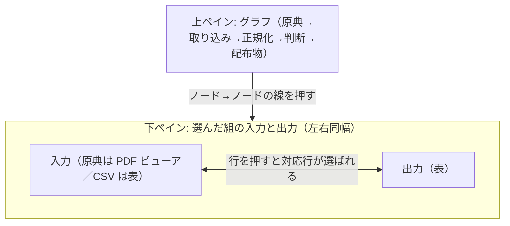

# パイプライン画面をローカルの検証ツールにする

## Problem

`/pipeline/<団体コード>/`（パイプライン画面）は、運営者がパイプラインを回した後に、1つの団体の配布物が正しいかを確かめる画面である。だが今の画面では、何をどの順に見れば確かめたことになるのかが分からない。原因は次の6つで、いずれも 2026-09-24 に千代田区（131016）と狛江市（132195）の画面で確認した。

1. **他の団体の検査が混ざる。** 千代田区の画面の検査タブに、収録済み5団体すべての検査 76 件が、団体別に分けられず1つの表に並ぶ。`not_null_stg_132047__…` のような他団体の検査が大半を占め、千代田区について見るべきものが埋もれる。成功が大半なので、見るべき警告1件のために縦に長い表をたどることになる。
2. **PDF の原典を失敗として表示する。** 原典が PDF の団体（千代田区・昭島市）では、「原文の復元」のカードに「0/2」が赤色で表示され、証跡タブの復元検査も赤色の「不一致」になる。PDF から表を起こした原典には復元検査がもともと成り立たないので、これは失敗ではない。代わりに行っている突き合わせ（説明欄の合計が目の額と一致する、など）は画面のどこにも出ていない。
3. **PDF の原典を選ぶと中身が壊れる。** 流れ図で原典のノードを選ぶと、入力（データ元）の表に `%PDF-1.7`・`2 0 obj` といった PDF のバイト列が1行ずつ表の行として並ぶ。原典を CSV とみなして表に組んでいるためである。
4. **誤読の罠が画面に出ない。** 団体ごとの誤読の罠（千代田区なら「歳出の款が法定の体系とまったく違う」「人件費が職員費に集められている」など）は報告データに記録されているのに、画面には1件も表示されない。
5. **どの入力がどの出力になったかを辿れない。** 流れ図はノードを1つ選ぶ形で、選ぶと入力と出力の先頭20行が左右に並ぶ。入力が複数あるノードでは、どの入力と出力の組を見ているのかが分からない。並んだ行どうしの対応も示されないので、ある行が変換後のどの行になったかは人が目で探すしかない。
6. **PDF の原典のどこから取った数字かが分からない。** 原典が PDF の団体では、配布物の1行が PDF の何ページのどの記載から来たのかを、画面からも証跡からも辿れない。確かめるには、数百ページある PDF を開いて人が探すことになる。

今この画面を直すのは、PDF の原典が主な経路になったからである。東京62団体のうち59団体は事業単位の資料を PDF でしか出していない。団体を足すほど、2と3の壊れ方をする団体が増え、1の表は団体の数に比例して長くなる。

## 導出

この画面は `## Story` のどの Core action からも直接には導けない。運営者のための道具だからである。Core action「数字が怪しいと思ったときに、原典と合っているか・誤読の罠が無いかを確かめる」は、利用者が repo（原典・証跡・配布物）を git で見て行う。

それでもこの画面を直すのは、配布物を「正しいという前提で使ってもらう」ためである。その前提を支えるのは、運営者がパイプラインを回すたびに行う確認で、この画面はその確認を速く確実にする。利用者からの計測はできないので、Success Metrics は運営者の確認の手間で置き換える。

## Overview

`/pipeline/` を、運営者が1つの団体の配布物を確かめるローカルの検証ツールとして作り直す。画面は上下に固定で分かれた2つのペインで、上にパイプライン全体のグラフ、下に選んだ処理の入力と出力を並べる。境目はドラッグで比率を変えられる。`.agent/prototypes/pipeline-view/` で作った試作画面（prototype）の「分割」案を採る。

グラフは「どの入力がどの出力につながっているか」を、実際のノード（原典の資料・取り込み後の表・判断リソース・配布物）と `ノード→ノード` の線で描く。選択の単位は線であり、選ぶと両端のノードと線が1つの組として強調される。線やノードにカーソルを載せたときも、孤立したノードではなく組全体を強調して予告する。

入出力では、行どうしの対応を両側に同じ番号のバッジを付けて示す。片側の行を押すともう片側の対応行が選ばれ、1対多の対応もそのまま見える。原典が PDF のときは入力側が PDF ビューアになり、実ページの画像に選択可能な文字を重ねて出す。出力の行を押すと記載箇所のある頁へ移動して強調し、PDF 上の語を押しても対応する行が選ばれる。

出所（資料名・取得元 URL・ページ範囲など）、取り込みの検証、検査は、それぞれが属する側のパネル内の詳細欄にまとめ、開閉できるようにする。検査はテスト名ではなく、何を確かめる検査かを説明する文言で出し、警告・失敗には詳細を添える。誤読の罠は画面の上部に件数を出し、開くと一覧が見える。

この画面は配布の承認ゲートではなく、配布判断の証拠を見せる道具である。書き出しを止めるかどうかの判定は従来どおり検査側が持つ（失敗は止め、警告は止めない）。画面の仕事は、警告・失敗・証跡・行の対応を運営者が見落とさず見られるようにすることまでである。

### Goals

- パイプライン全体の流れを1画面で俯瞰でき、「何が何につながっているか」を確かめられる
- 選んだ組の入力と出力を行の単位で見比べられ、ある行がどの行になったかを辿れる
- 原典が PDF の団体でも、行から原典の記載箇所まで降りられる
- 警告・失敗・誤読の罠という「見るべきもの」が、成功した検査の中に埋もれない
- 他の団体の検査や警告が、この団体のものと誤認されない

### Non-Goals

- **公開環境（fudoki.dev）での提供。** この画面はローカル（`bun run dev`）でだけ動かす。原典の PDF を表示するため、公開すると PDF の写しを公衆へ送信することになり、再配布の許可を確認した団体は62団体中2団体しかない。外部の利用者が確かめるときは、repo を見てもらう
- `/analysis/`（支出分析）の変更。公開を続ける画面で、課題が別
- 全団体を横断して壊れた検査を一覧する画面。この用途は `bun run report` の出力と CI が担う
- 画面を PDF として書き出す機能
- グラフのレイアウトの保存・ノード位置の手動編集。prototype の固定配置とズーム・パンで足りる
- 原典ファイルや取り込み結果の編集・書き戻し。この画面は読むだけで、直すのは原典側かパイプライン側の仕事
- 警告・失敗の原因そのものの解消。例えば原典 CSV のセルに混じる空白は自治体の出力なので、画面は知らせるだけで直さない
- 複数団体を同時に並べる比較ビュー。比較は `/analysis/` 側の仕事

## Glossary

本文で使う語。定義の正本は repo root `AGENTS.md` の `## Glossary`。

- **原典（origin）**: 自治体が公開した予算・決算の資料そのもの（CSV または PDF）
- **取り込み（ingestion / raw）**: 原典をそのまま表に読み込んだもの。PDF の場合は組版からの抽出
- **正規化（staging）**: 列名や金額の単位を共通の形に整えたもの
- **判断（core）**: 自治体ごとの科目を共通の体系に写し、COFOG を割り当てる層
- **配布物（package）**: 団体ごとに fudoki が配る Fiscal Data Package
- **証跡（provenance）**: 原典をいつ・どこから・どの版の手順で取り込み、どう確かめたかの記録
- **誤読の罠（caveat）**: 見た目どおりに読むと誤った結論になる箇所。団体ごとに記録する

## 前提となる報告データ

画面の Acceptance Criteria のうち、行対応・検査の帰属・取り込みの検証・単位は、報告データ（`pipeline.json` など）が以下を持っていなければ成立しない。画面側だけで後から付け足せるものではないので、前提として明示する。

- **行の対応キー。** 行の対応に使う `source_row` は「特定の原典ファイルの特定の版の中でのレコード位置」を指すものとして定義する。原典の識別子・ハッシュ・年度・方向（歳入・歳出）・予算段階とセットで一意にならなければならない。原典 CSV に列として存在しない場合は、取り込み側が決めた規則（例: ヘッダを1行目と数えた物理行番号）を原典側の表示にも同じく適用し、画面が独自に推測しない。対応が確かめられない行は、誤った番号を付けるのではなく未対応と表示する。先頭のプレビュー行だけでなく、任意の行を取り出せる必要がある
- **検査の帰属。** 検査の結果は「何を検査するか」の説明とあわせて、警告・失敗がどの団体のどの原典（可能なら行）で起きたかを持つ。複数団体を束ねる検査では団体ごとの内訳を持ち、帰属を特定できない結果は「横断・対象特定不能」と明示する。`Got 3 results` のような件数だけの詳細では、画面側でどの団体のものかを判別できない
- **取り込みの検証の中身。** PDF の内部突合について、検証の種類（何と何を比べたか）、対象数と一致した数、確認できた範囲を持つ。「PDF 内の重複印字どうしの突合」と「原典そのものとの照合」を区別し、抽出の全体的な正確性を証明する結果とは扱わない
- **金額の単位。** 原典の金額と正規化後の金額のそれぞれについて、単位（円・千円など）を持つ。単位は団体・年度・方向・予算段階で変わりうるので、どの粒度で宣言された値かが分かる形にする
- **PDF の対応情報。** 行と PDF 箇所の対応（頁・位置）が取れた行だけを対応ありとして持ち、OCR が要る原典や位置が取れない行は「対応なし」を区別できるようにする
- **公開配信物との分離。** PDF 本体・ページ画像・OCR で得た文字・行と頁の対応情報は、公開用の配信物（`apps/web/public/` に書き出されるもの）には含めない。ローカルの画面だけが参照する領域に置く

## Acceptance Criteria

### グラフ

- [ ] 画面を開くと、原典→取り込み→正規化→判断→配布物（と共有の判断リソース）の全ノードと接続が1つのグラフで俯瞰できる
- [ ] グラフの線を押すと、その `ノード→ノード` の組が選ばれ、両端のノードと線が1つに強調される。線のすぐ近くを押しても組を選べる
- [ ] 線またはノードにカーソルを載せると、孤立したノードではなく、対象の線と両端のノードが強調される。上流と下流の両方につながるノードでは、カーソルがノードの左半分と右半分のどちらにあるかで対象の組が切り替わる
- [ ] グラフはズーム・パン・全体表示・等倍への復帰ができ、ドラッグやピンチの直後に誤って組が選ばれない
- [ ] 選んだ団体に関係ないノード・検査・証跡は画面に出ない

### 入力と出力

- [ ] 組を選ぶと入力と出力が左右同幅で並び、各パネルの見出しは「原典（PDF）」のように種別で分かる。長い資料名は詳細に畳まれている
- [ ] 片側の行を押すともう片側の対応行が選ばれ、両側に同じ番号のバッジが付く。1対多の対応も区別できる。カーソルを載せた時点で対応が分かる
- [ ] 原典が CSV のとき、原典側の表にも行番号が付き、取り込み後の行と相互に辿れる
- [ ] 原典が PDF のとき、実ページの画像に選択可能な文字が重なって出る。出力の行を押すとその行の記載がある頁へ自動で移動して強調され、PDF 上の語を押しても対応する行が選ばれる。ページはビューア内の操作で送れる
- [ ] 行と対応する PDF 箇所が取れていない行や、OCR しか成立しない原典では、その状態が分かるように出し、押せるもののように見せない

### 詳細と検査

- [ ] 出所・取り込みの検証・検査は、属する側のパネル内の詳細欄にまとまり、開閉できる。詳細を開くと原典の資料名・形式・取得元 URL・公開ページ・ページ範囲・取得日時が見える
- [ ] 原典が PDF のとき、復元検査を失敗として扱わず、代わりに行っている様式内の突合の結果が「取り込みの検証」として出る。突合の各行は、同じ PDF 内のどの印字どうしを何件比べて何件一致したかを示し、外部の正解との照合でも抽出全体の正しさの証明でもないことが文言から読み取れる
- [ ] 検査はテスト名ではなく、何を検査し・どの範囲を対象とするかが分かる文言で出る。警告・失敗には、何件で何が起きたかの詳細が添えられる。成功した検査は畳まれるか件数だけになる
- [ ] 複数団体を束ねて評価する検査で警告・失敗が出ているとき、その対象がどの団体の原典かを画面から判別できる。帰属を特定できない結果は「横断・対象特定不能」と明示される
- [ ] 金額の列について、単位（円・千円など）が詳細から確認できる。年度や予算段階で単位が変わる団体でも、今見ている行の単位が分かる
- [ ] 誤読の罠が画面の上部に件数付きで出て、開くと団体ごとの一覧が見える
- [ ] 選んだ団体に関係する警告・失敗・証跡・誤読の罠は、画面のどこかからすべて辿れる（見落としがない）

### 提供形態

- [ ] `/pipeline/` はローカルでのみ動作する。公開の配信物（fudoki.dev にデプロイされるもの）から、原典 PDF 本体・ページ画像・OCR で得た文字・行と頁の対応情報を取得できない

## Success Metrics

画面はローカルで動作するため利用状況を自動計測できない。導出に書いたとおり、運営者の確認の手間と確認の正しさで置き換える。

- コアアクション: パイプラインを回した後に `/pipeline/` を開き、組を選んで入力と出力・検査・誤読の罠を見て、配布判断に必要な確認を終える
- 期待頻度: パイプラインを回すたび。団体・年度の追加やロジック変更のたびで、現在の運用では週次〜月次
- 数える対象: 運営者（現状1人）の自己記録。確認1回あたりの所要時間と、画面外で原典ファイルを別途開いた回数を記録する
- 主指標: 次の2つを見る
  - **手間**: 1団体1回の確認で画面外で原典を開く回数が 0。現状は PDF の団体で数百ページを目で探す必要がある
  - **正しさ**: 既知の問題を含む団体・年度（警告の出ている原典、対応が1対多になる行、単位の混在する年度など）を確かめたとき、関係する警告・行対応・突合の範囲を見落とさず見つけられること。見落としがあれば手間が 0 でも失敗とする
